<h1 align="center">Atomic</h1>

<p align="center"></p>

<p align="center">
  <b>The verifiable coding agent runtime. Build your engineering process as explicit, checkable execution graphs.</b>
</p>

<p align="center">
  <b>Run verifiable engineering loops with control, alignment, and confidence.</b>
</p>

<p align="center">
  <a href="#get-started"><b>Get started →</b></a>
  &nbsp;·&nbsp;
  <a href="#how-atomic-works">How it works</a>
  &nbsp;·&nbsp;
  <a href="#what-you-get">What you get</a>
  &nbsp;·&nbsp;
  <a href="#faq">FAQ</a>
  &nbsp;·&nbsp;
  <a href="https://docs.bastani.ai/">Docs</a>
</p>

<p align="center">
  <a href="https://docs.bastani.ai/"></a>
  <a href="https://discord.gg/9CvdXUGXR4"></a>
  <a href="https://deepwiki.com/bastani-inc/atomic"></a>
  <a href="./package.json"></a>
  <a href="./LICENSE"></a>
</p>

<p align="center">
  If Atomic is useful to you, star the repository ⭐
</p>

**Users are reporting:**

- ⚡ A 1–1.5 hour reduction in manual verification per task compared to traditional coding agents, not including time saved from fewer follow-up fixes and reverts
- 🔀 ~95% merge rate on Atomic-generated PRs, with reduced follow-ups and a 0% revert rate
- 🛡️ Production incidents caught that CI did not cover

## Get started

<p><code>npm install -g @bastani/atomic</code> → <code>atomic</code> → <code>/login</code></p>

<!-- feature-wall:start -->

**Core capabilities** — every row is a real Atomic session, recorded from the
installed product. Open the Atomic docs for reference or follow the crash course step by step.

<table>
<tr>
<td width="42%" valign="top">
<h4>Launch a workflow in plain English</h4>
<p>Ask in normal chat and Atomic routes the request through its workflow tool into a real registered run - no command syntax required.</p>
<p><a href="https://docs.bastani.ai/workflows"><sub>Atomic docs · Workflows</sub></a></p>
<p><a href="https://github.com/bastani-inc/atomic-crash-course#part-6--workflows"><sub>Crash course · W.1 Launch a workflow in plain English</sub></a></p>
</td>
<td width="58%" valign="top">
<a href="https://github.com/bastani-inc/atomic-crash-course#part-6--workflows">
<picture>
<source srcset="assets/feature-wall/28-launch-workflow-plain-english.gif" type="image/gif">
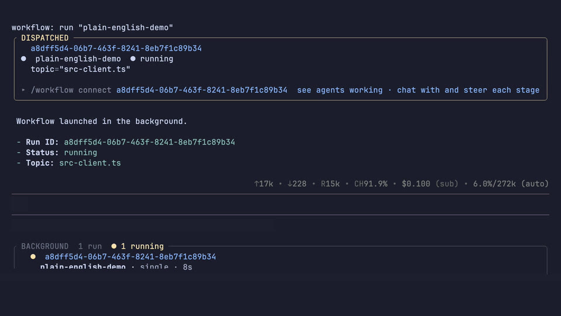
</picture>
</a>
</td>
</tr>
<tr>
<td width="42%" valign="top">
<h4>Natural-language workflow authoring</h4>
<p>Describe inputs, parallel stages, synthesis, and outputs in prose; Atomic writes and reloads the runnable TypeScript graph.</p>
<p><a href="https://docs.bastani.ai/workflows"><sub>Atomic docs · Workflows</sub></a></p>
<p><a href="https://github.com/bastani-inc/atomic-crash-course#a8-natural-language-workflow-authoring"><sub>Crash course · A.8 Natural-language workflow authoring</sub></a></p>
</td>
<td width="58%" valign="top">
<a href="https://github.com/bastani-inc/atomic-crash-course#a8-natural-language-workflow-authoring">
<picture>
<source srcset="assets/feature-wall/38-natural-language-workflow-authoring.gif" type="image/gif">
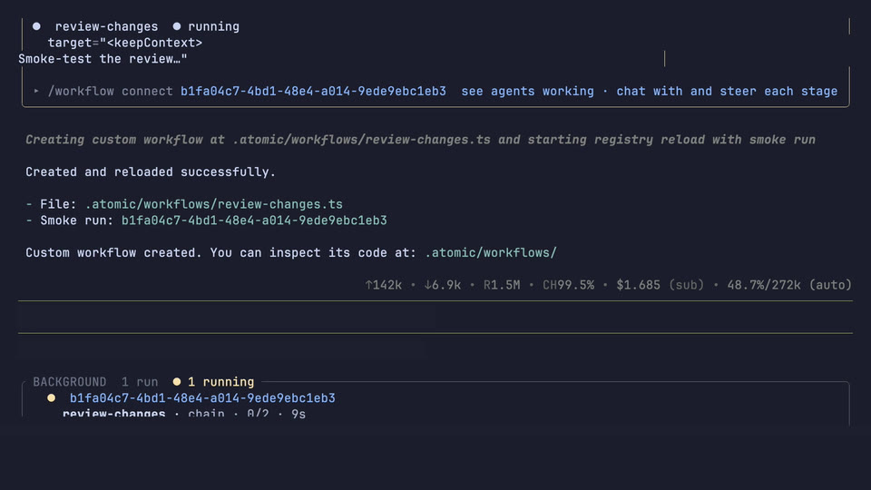
</picture>
</a>
</td>
</tr>
<tr>
<td width="42%" valign="top">
<h4>Autonomous implementation loops</h4>
<p><code>ralph</code> refines, researches, implements, reviews, and repairs against a bounded loop contract.</p>
<p><a href="https://docs.bastani.ai/workflows"><sub>Atomic docs · Workflows</sub></a></p>
<p><a href="https://github.com/bastani-inc/atomic-crash-course#a10-autonomous-implementation-loops"><sub>Crash course · A.10 Autonomous implementation loops</sub></a></p>
</td>
<td width="58%" valign="top">
<a href="https://github.com/bastani-inc/atomic-crash-course#a10-autonomous-implementation-loops">
<picture>
<source srcset="assets/feature-wall/40-autonomous-implementation-loops.gif" type="image/gif">
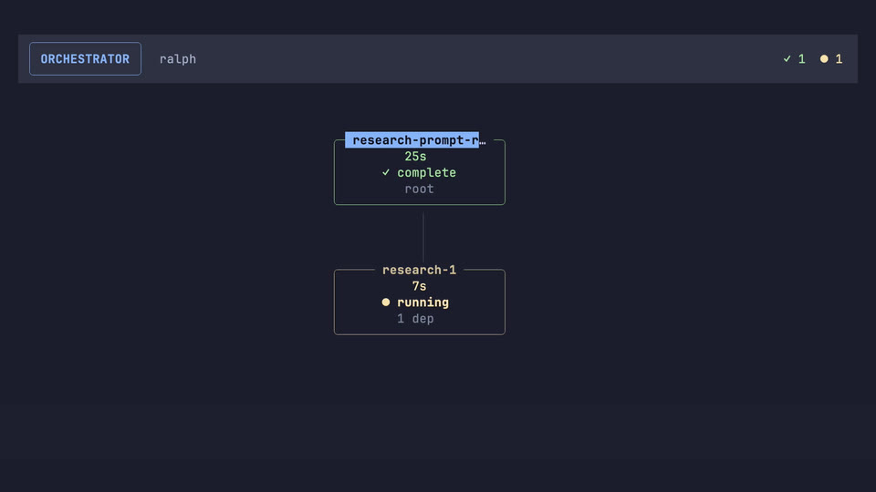
</picture>
</a>
</td>
</tr>
<tr>
<td width="42%" valign="top">
<h4>Security review with a repair loop</h4>
<p>Findings route into a bounded repair loop that keeps running until the gate actually passes.</p>
<p><a href="https://docs.bastani.ai/workflows"><sub>Atomic docs · Workflows</sub></a></p>
<p><a href="https://github.com/bastani-inc/atomic-crash-course#66-security-review-with-a-repair-loop"><sub>Crash course · 6.6 Security review with a repair loop</sub></a></p>
</td>
<td width="58%" valign="top">
<a href="https://github.com/bastani-inc/atomic-crash-course#66-security-review-with-a-repair-loop">
<picture>
<source srcset="assets/feature-wall/27-security-review-repair-loop.gif" type="image/gif">
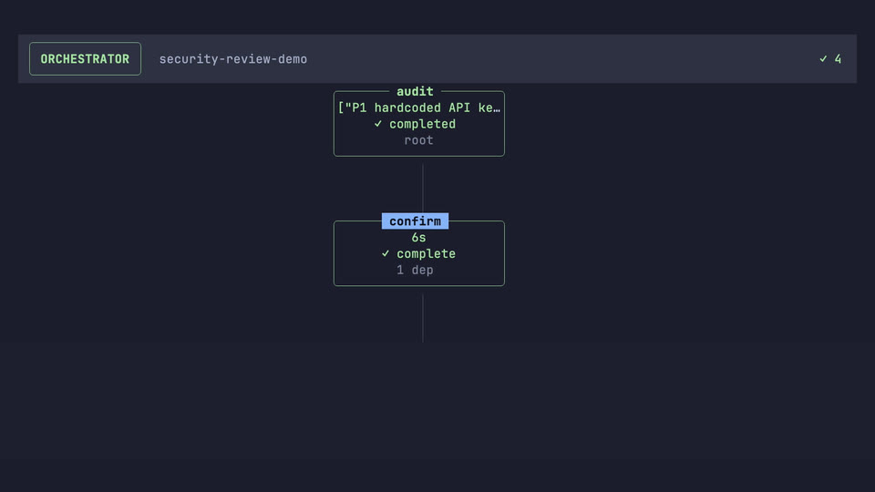
</picture>
</a>
</td>
</tr>
<tr>
<td width="42%" valign="top">
<h4>Worktree-isolated parallel work</h4>
<p>Parallel agents each get their own git worktree, so concurrent edits cannot collide.</p>
<p><a href="https://docs.bastani.ai/subagents"><sub>Atomic docs · Subagents</sub></a></p>
<p><a href="https://github.com/bastani-inc/atomic-crash-course#52-worktree-isolated-parallel-work"><sub>Crash course · 5.2 Worktree-isolated parallel work</sub></a></p>
</td>
<td width="58%" valign="top">
<a href="https://github.com/bastani-inc/atomic-crash-course#52-worktree-isolated-parallel-work">
<picture>
<source srcset="assets/feature-wall/17-worktree-parallel-work.gif" type="image/gif">
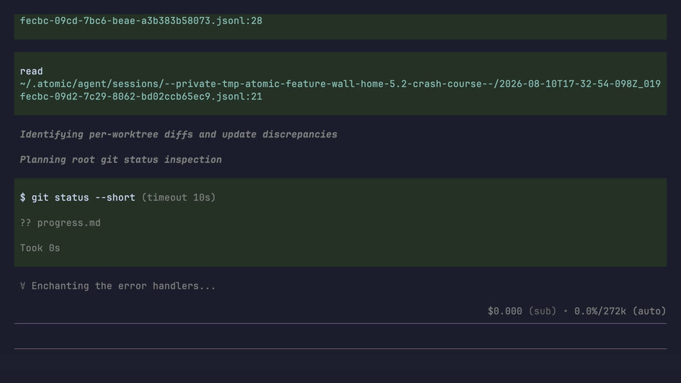
</picture>
</a>
</td>
</tr>
<tr>
<td width="42%" valign="top">
<h4>Steer and control a live run</h4>
<p>Attach to a running stage, watch it stream, and steer, pause, or abort it mid-flight.</p>
<p><a href="https://docs.bastani.ai/workflows"><sub>Atomic docs · Workflows</sub></a></p>
<p><a href="https://github.com/bastani-inc/atomic-crash-course#62-steer-and-control-a-live-run"><sub>Crash course · 6.2 Steer and control a live run</sub></a></p>
</td>
<td width="58%" valign="top">
<a href="https://github.com/bastani-inc/atomic-crash-course#62-steer-and-control-a-live-run">
<picture>
<source srcset="assets/feature-wall/23-steer-a-live-run.gif" type="image/gif">
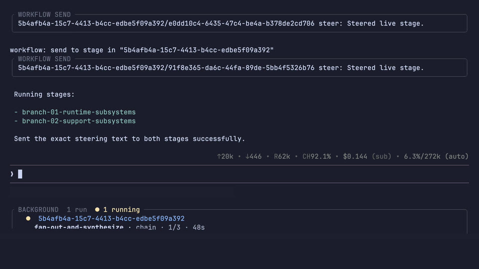
</picture>
</a>
</td>
</tr>
<tr>
<td width="42%" valign="top">
<h4>Durability and resume</h4>
<p>Runs checkpoint as they go, so killing the process leaves them retained and resumable instead of lost.</p>
<p><a href="https://docs.bastani.ai/workflows"><sub>Atomic docs · Workflows</sub></a></p>
<p><a href="https://github.com/bastani-inc/atomic-crash-course#65-durability-and-resume"><sub>Crash course · 6.5 Durability and resume</sub></a></p>
</td>
<td width="58%" valign="top">
<a href="https://github.com/bastani-inc/atomic-crash-course#65-durability-and-resume">
<picture>
<source srcset="assets/feature-wall/26-durability-and-resume.gif" type="image/gif">
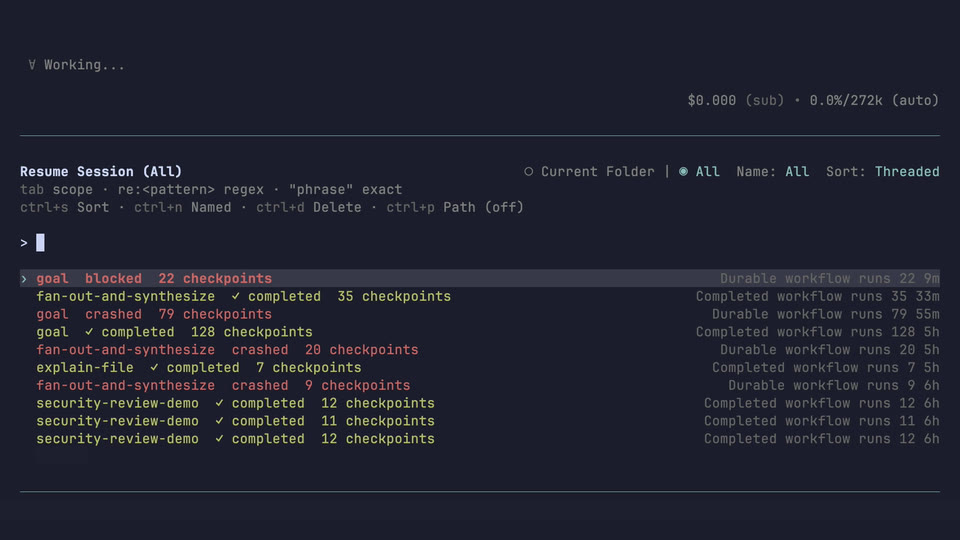
</picture>
</a>
</td>
</tr>
<tr>
<td width="42%" valign="top">
<h4>Human-in-the-loop gates</h4>
<p>Put an approval gate anywhere in the graph and the run waits for a person before it proceeds.</p>
<p><a href="https://docs.bastani.ai/workflows"><sub>Atomic docs · Workflows</sub></a></p>
<p><a href="https://github.com/bastani-inc/atomic-crash-course#64-human-in-the-loop-gates"><sub>Crash course · 6.4 Human-in-the-loop gates</sub></a></p>
</td>
<td width="58%" valign="top">
<a href="https://github.com/bastani-inc/atomic-crash-course#64-human-in-the-loop-gates">
<picture>
<source srcset="assets/feature-wall/25-human-in-the-loop-gates.gif" type="image/gif">
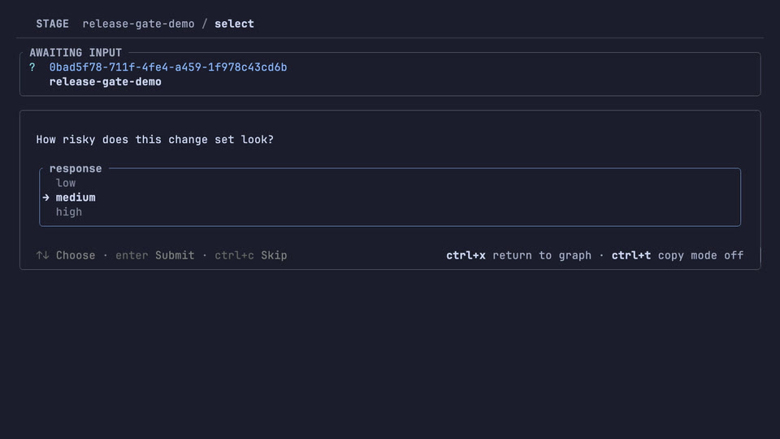
</picture>
</a>
</td>
</tr>
<tr>
<td width="42%" valign="top">
<h4>Escalating to a human supervisor</h4>
<p>A delegate that hits a real product decision stops, asks the human supervising the run, and waits for the answer.</p>
<p><a href="https://docs.bastani.ai/intercom"><sub>Atomic docs · Intercom</sub></a></p>
<p><a href="https://github.com/bastani-inc/atomic-crash-course#54-escalating-to-a-human-supervisor"><sub>Crash course · 5.4 Escalating to a human supervisor</sub></a></p>
</td>
<td width="58%" valign="top">
<a href="https://github.com/bastani-inc/atomic-crash-course#54-escalating-to-a-human-supervisor">
<picture>
<source srcset="assets/feature-wall/19-escalate-to-supervisor.gif" type="image/gif">
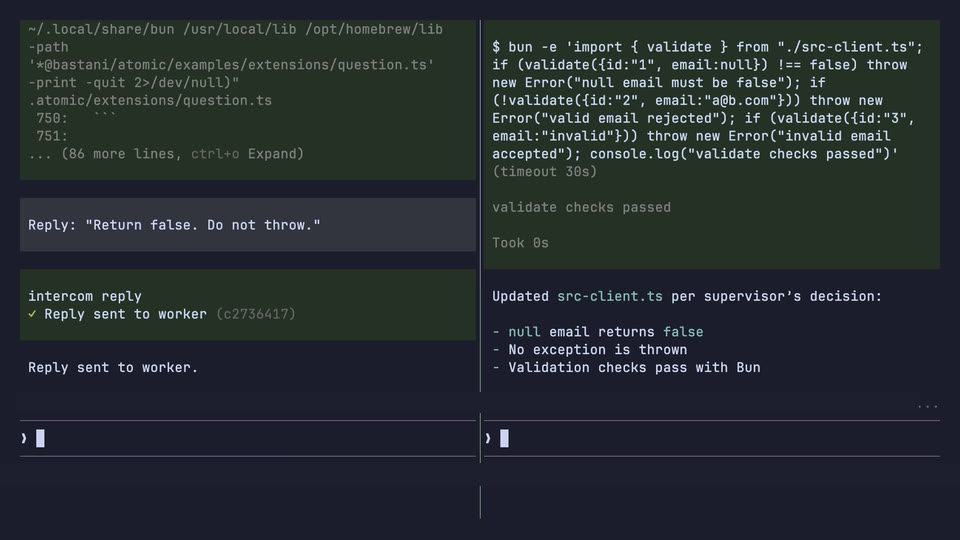
</picture>
</a>
</td>
</tr>
<tr>
<td width="42%" valign="top">
<h4>Nesting builtin workflows</h4>
<p>Compose imported workflow definitions with <code>ctx.workflow(...)</code>; child stages flatten into one inspectable parent graph.</p>
<p><a href="https://docs.bastani.ai/workflows"><sub>Atomic docs · Workflows</sub></a></p>
<p><a href="https://github.com/bastani-inc/atomic-crash-course#a9-nesting-builtin-workflows"><sub>Crash course · A.9 Nesting builtin workflows</sub></a></p>
</td>
<td width="58%" valign="top">
<a href="https://github.com/bastani-inc/atomic-crash-course#a9-nesting-builtin-workflows">
<picture>
<source srcset="assets/feature-wall/39-nesting-builtin-workflows.gif" type="image/gif">
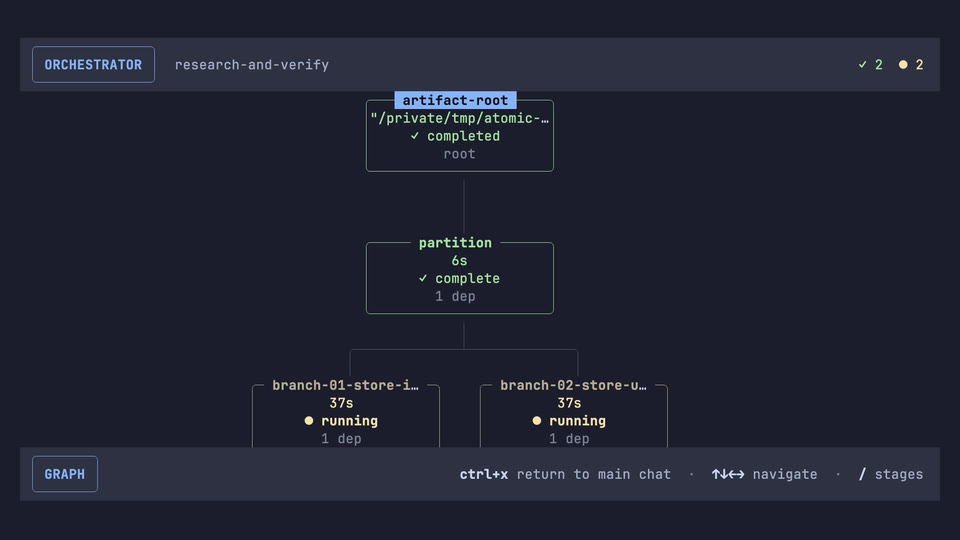
</picture>
</a>
</td>
</tr>
<tr>
<td width="42%" valign="top">
<h4>Parallel review composition</h4>
<p>One command fans a real diff out to fresh-context specialists, with independent roles and live parallel tool progress.</p>
<p><a href="https://docs.bastani.ai/subagents"><sub>Atomic docs · Subagents</sub></a></p>
<p><a href="https://github.com/bastani-inc/atomic-crash-course#a5-parallel-review-composition"><sub>Crash course · A.5 Parallel review composition</sub></a></p>
</td>
<td width="58%" valign="top">
<a href="https://github.com/bastani-inc/atomic-crash-course#a5-parallel-review-composition">
<picture>
<source srcset="assets/feature-wall/35-parallel-review-composition.gif" type="image/gif">
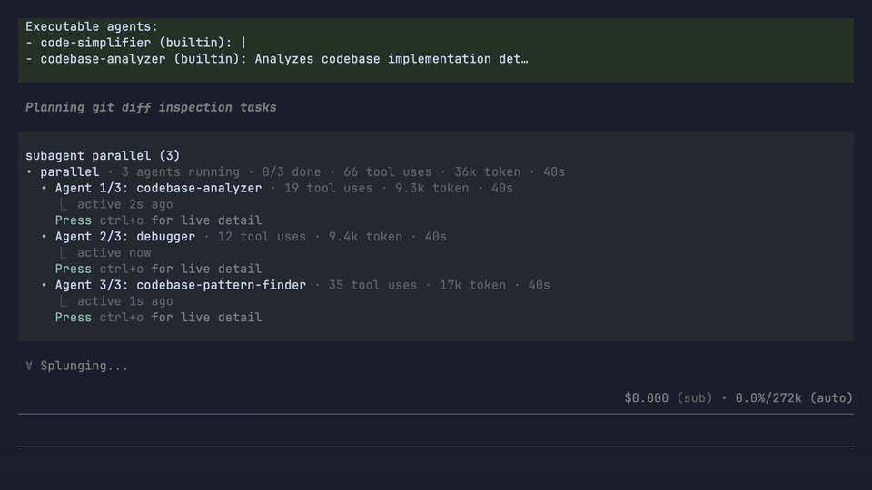
</picture>
</a>
</td>
</tr>
<tr>
<td width="42%" valign="top">
<h4>Planner-worker intercom coordination</h4>
<p>Separate sessions message each other over intercom to split a job and agree on the answer.</p>
<p><a href="https://docs.bastani.ai/intercom"><sub>Atomic docs · Intercom</sub></a></p>
<p><a href="https://github.com/bastani-inc/atomic-crash-course#53-plannerworker-intercom-coordination"><sub>Crash course · 5.3 Planner-worker intercom coordination</sub></a></p>
</td>
<td width="58%" valign="top">
<a href="https://github.com/bastani-inc/atomic-crash-course#53-plannerworker-intercom-coordination">
<picture>
<source srcset="assets/feature-wall/18-planner-worker-intercom.gif" type="image/gif">
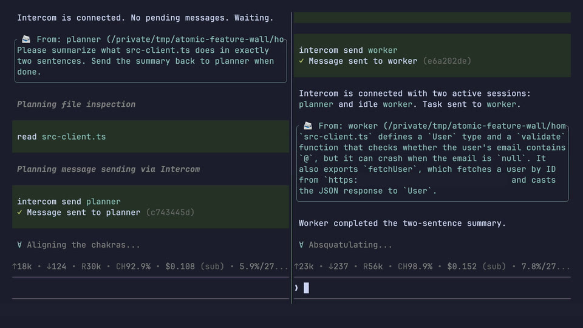
</picture>
</a>
</td>
</tr>
<tr>
<td width="42%" valign="top">
<h4>Intercom context handoff</h4>
<p>Hand a task to another session with the context attached, instead of pasting it by hand.</p>
<p><a href="https://docs.bastani.ai/intercom"><sub>Atomic docs · Intercom</sub></a></p>
<p><a href="https://github.com/bastani-inc/atomic-crash-course#55-intercom-context-handoff"><sub>Crash course · 5.5 Intercom context handoff</sub></a></p>
</td>
<td width="58%" valign="top">
<a href="https://github.com/bastani-inc/atomic-crash-course#55-intercom-context-handoff">
<picture>
<source srcset="assets/feature-wall/20-intercom-context-handoff.gif" type="image/gif">
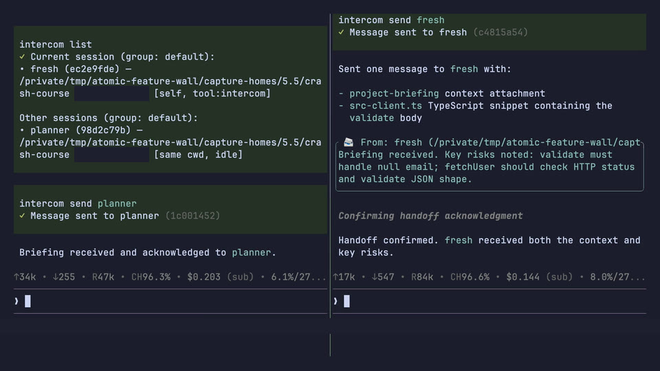
</picture>
</a>
</td>
</tr>
<tr>
<td width="42%" valign="top">
<h4>Delegating to bundled specialists</h4>
<p>Fan work out to scoped subagents that do the reading, so the main context stays small.</p>
<p><a href="https://docs.bastani.ai/subagents"><sub>Atomic docs · Subagents</sub></a></p>
<p><a href="https://github.com/bastani-inc/atomic-crash-course#51-delegating-to-bundled-specialists"><sub>Crash course · 5.1 Delegating to bundled specialists</sub></a></p>
</td>
<td width="58%" valign="top">
<a href="https://github.com/bastani-inc/atomic-crash-course#51-delegating-to-bundled-specialists">
<picture>
<source srcset="assets/feature-wall/16-bundled-specialists.gif" type="image/gif">
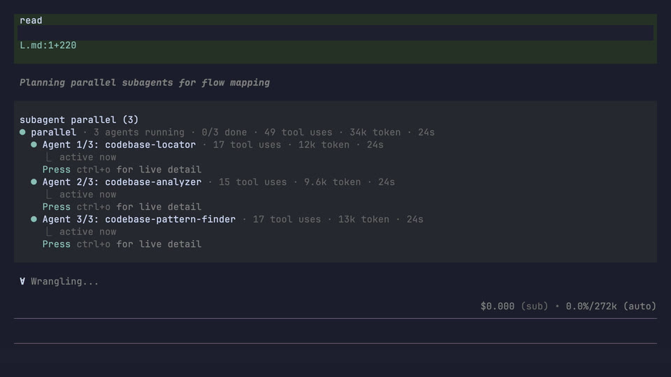
</picture>
</a>
</td>
</tr>
<tr>
<td width="42%" valign="top">
<h4>Background subagent runs</h4>
<p>Launch a detached specialist, keep chatting, and inspect its run status while work continues outside the parent turn.</p>
<p><a href="https://docs.bastani.ai/subagents"><sub>Atomic docs · Subagents</sub></a></p>
<p><a href="https://github.com/bastani-inc/atomic-crash-course#a6-background-subagent-runs"><sub>Crash course · A.6 Background subagent runs</sub></a></p>
</td>
<td width="58%" valign="top">
<a href="https://github.com/bastani-inc/atomic-crash-course#a6-background-subagent-runs">
<picture>
<source srcset="assets/feature-wall/36-background-subagent-runs.gif" type="image/gif">
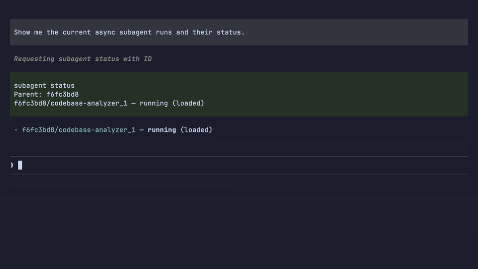
</picture>
</a>
</td>
</tr>
<tr>
<td width="42%" valign="top">
<h4>Writing your own workflow</h4>
<p>Stages, schemas, and gates are versioned TypeScript you review, not per-run improvisation.</p>
<p><a href="https://docs.bastani.ai/workflows"><sub>Atomic docs · Workflows</sub></a></p>
<p><a href="https://github.com/bastani-inc/atomic-crash-course#63-writing-your-own-workflow"><sub>Crash course · 6.3 Writing your own workflow</sub></a></p>
</td>
<td width="58%" valign="top">
<a href="https://github.com/bastani-inc/atomic-crash-course#63-writing-your-own-workflow">
<picture>
<source srcset="assets/feature-wall/24-write-your-own-workflow.gif" type="image/gif">
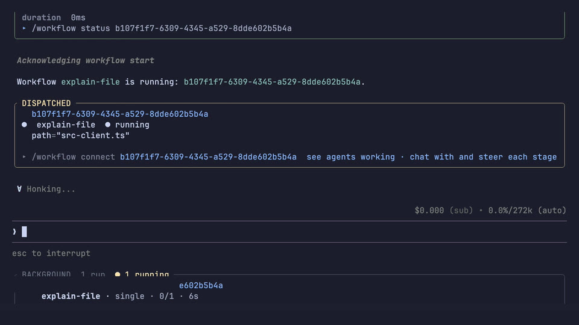
</picture>
</a>
</td>
</tr>
<tr>
<td width="42%" valign="top">
<h4>Touring the builtins</h4>
<p>Bundled workflows for research, planning, implementation, and review, ready before you write one.</p>
<p><a href="https://docs.bastani.ai/workflows"><sub>Atomic docs · Workflows</sub></a></p>
<p><a href="https://github.com/bastani-inc/atomic-crash-course#61-touring-the-builtins"><sub>Crash course · 6.1 Touring the builtins</sub></a></p>
</td>
<td width="58%" valign="top">
<a href="https://github.com/bastani-inc/atomic-crash-course#61-touring-the-builtins">
<picture>
<source srcset="assets/feature-wall/22-touring-the-builtins.gif" type="image/gif">
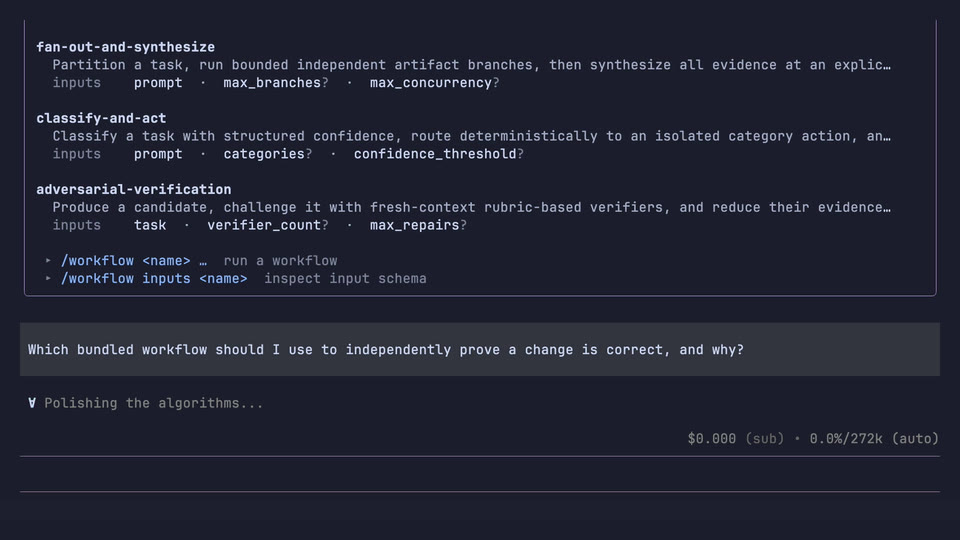
</picture>
</a>
</td>
</tr>
<tr>
<td width="42%" valign="top">
<h4>Run a workflow with typed inputs</h4>
<p>Use <code>/workflow &lt;name&gt; key=value</code> to validate static inputs against TypeBox before a run starts.</p>
<p><a href="https://docs.bastani.ai/workflows"><sub>Atomic docs · Workflows</sub></a></p>
<p><a href="https://github.com/bastani-inc/atomic-crash-course#61-touring-the-builtins"><sub>Crash course · W.2 Run a workflow with typed inputs</sub></a></p>
</td>
<td width="58%" valign="top">
<a href="https://github.com/bastani-inc/atomic-crash-course#61-touring-the-builtins">
<picture>
<source srcset="assets/feature-wall/29-workflow-typed-inputs.gif" type="image/gif">
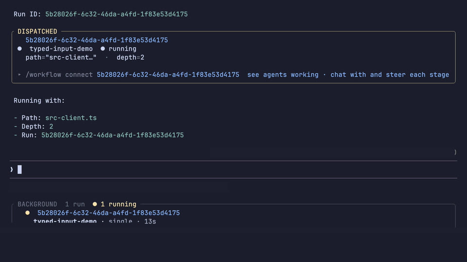
</picture>
</a>
</td>
</tr>
<tr>
<td width="42%" valign="top">
<h4>Inspect and control workflows</h4>
<p>List definitions, inspect input contracts, check live status, and connect to a run graph from the same <code>/workflow</code> surface.</p>
<p><a href="https://docs.bastani.ai/workflows"><sub>Atomic docs · Workflows</sub></a></p>
<p><a href="https://github.com/bastani-inc/atomic-crash-course#61-touring-the-builtins"><sub>Crash course · W.3 Inspect and control workflows</sub></a></p>
</td>
<td width="58%" valign="top">
<a href="https://github.com/bastani-inc/atomic-crash-course#61-touring-the-builtins">
<picture>
<source srcset="assets/feature-wall/30-inspect-control-workflows.gif" type="image/gif">
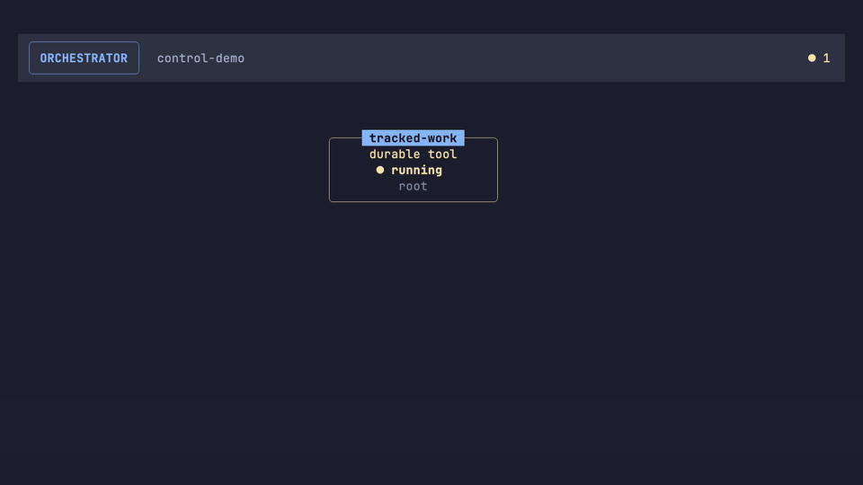
</picture>
</a>
</td>
</tr>
<tr>
<td width="42%" valign="top">
<h4>Verbatim compaction</h4>
<p>Compaction deletes low-value transcript lines without rewriting what survives; <code>&lt;keepContext&gt;</code> pins exact text.</p>
<p><a href="https://docs.bastani.ai/compaction"><sub>Atomic docs · Compaction</sub></a></p>
<p><a href="https://github.com/bastani-inc/atomic-crash-course#22-verbatim-compaction"><sub>Crash course · 2.2 Verbatim compaction</sub></a></p>
</td>
<td width="58%" valign="top">
<a href="https://github.com/bastani-inc/atomic-crash-course#22-verbatim-compaction">
<picture>
<source srcset="assets/feature-wall/06-verbatim-compaction.gif" type="image/gif">
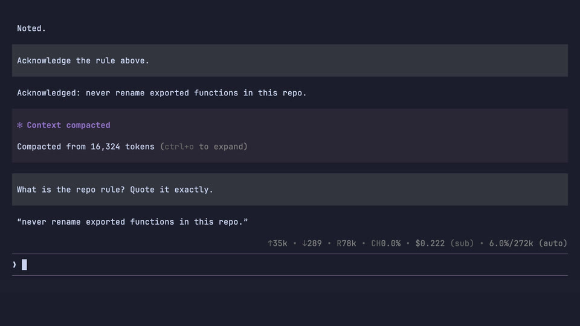
</picture>
</a>
</td>
</tr>
<tr>
<td width="42%" valign="top">
<h4>Hashline edits</h4>
<p>Edits are anchored to a 4-hex snapshot tag, so a file that changed behind the model's back fails loudly instead of being overwritten.</p>
<p><a href="https://docs.bastani.ai/tools"><sub>Atomic docs · Built-in tools</sub></a></p>
<p><a href="https://github.com/bastani-inc/atomic-crash-course#12-hashline-edits"><sub>Crash course · 1.2 Hashline edits</sub></a></p>
</td>
<td width="58%" valign="top">
<a href="https://github.com/bastani-inc/atomic-crash-course#12-hashline-edits">
<picture>
<source srcset="assets/feature-wall/02-hashline-edits.gif" type="image/gif">
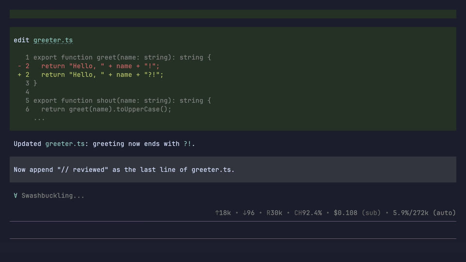
</picture>
</a>
</td>
</tr>
<tr>
<td width="42%" valign="top">
<h4>The agent interviews you</h4>
<p><code>ask_user_question</code> replaces the editor with a structured question UI mid-task, and your answers land in the transcript as data.</p>
<p><a href="https://docs.bastani.ai/tools"><sub>Atomic docs · Built-in tools</sub></a></p>
<p><a href="https://github.com/bastani-inc/atomic-crash-course#13-the-agent-interviews-you"><sub>Crash course · 1.3 The agent interviews you</sub></a></p>
</td>
<td width="58%" valign="top">
<a href="https://github.com/bastani-inc/atomic-crash-course#13-the-agent-interviews-you">
<picture>
<source srcset="assets/feature-wall/03-agent-interviews-you.gif" type="image/gif">
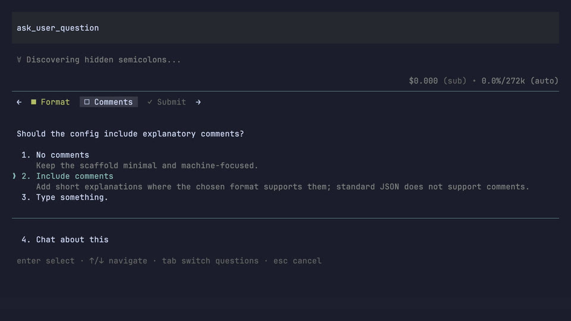
</picture>
</a>
</td>
</tr>
<tr>
<td width="42%" valign="top">
<h4>Permission gate extension</h4>
<p>A <code>tool_call</code> hook catches a risky shell call before execution and asks the operator to allow or block it.</p>
<p><a href="https://docs.bastani.ai/extensions"><sub>Atomic docs · Extensions</sub></a></p>
<p><a href="https://github.com/bastani-inc/atomic-crash-course#a2-permission-gate-extension"><sub>Crash course · A.2 Permission gate extension</sub></a></p>
</td>
<td width="58%" valign="top">
<a href="https://github.com/bastani-inc/atomic-crash-course#a2-permission-gate-extension">
<picture>
<source srcset="assets/feature-wall/32-permission-gate-extension.gif" type="image/gif">
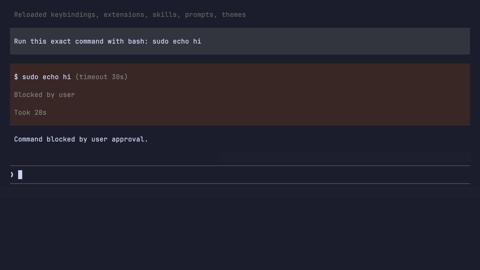
</picture>
</a>
</td>
</tr>
<tr>
<td width="42%" valign="top">
<h4>Block a dangerous command</h4>
<p>A tool-call hook inspects the arguments and rejects the call before it ever reaches your shell.</p>
<p><a href="https://docs.bastani.ai/extensions"><sub>Atomic docs · Extensions</sub></a></p>
<p><a href="https://github.com/bastani-inc/atomic-crash-course#32-block-a-dangerous-command"><sub>Crash course · 3.2 Block a dangerous command</sub></a></p>
</td>
<td width="58%" valign="top">
<a href="https://github.com/bastani-inc/atomic-crash-course#32-block-a-dangerous-command">
<picture>
<source srcset="assets/feature-wall/09-block-a-dangerous-command.gif" type="image/gif">
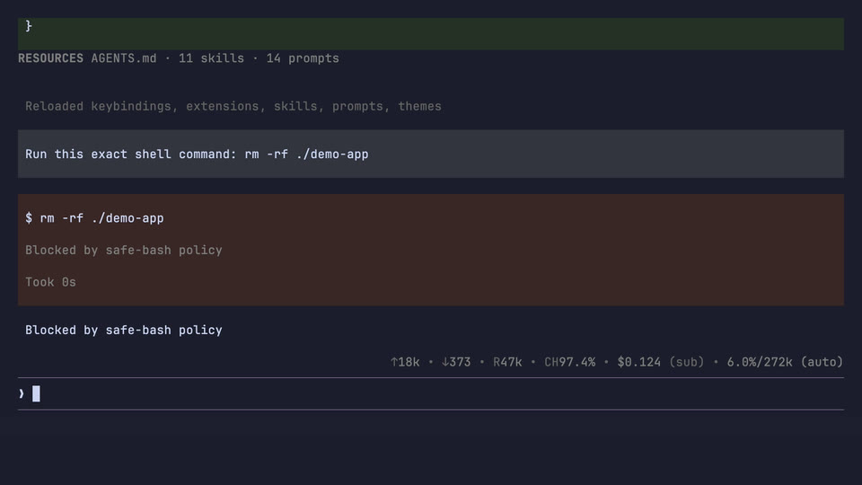
</picture>
</a>
</td>
</tr>
<tr>
<td width="42%" valign="top">
<h4>Full-screen TUI tool</h4>
<p>An extension can take over the whole screen with its own interactive component, then hand control back.</p>
<p><a href="https://docs.bastani.ai/tui"><sub>Atomic docs · TUI components</sub></a></p>
<p><a href="https://github.com/bastani-inc/atomic-crash-course#33-full-screen-tui-tool"><sub>Crash course · 3.3 Full-screen TUI tool</sub></a></p>
</td>
<td width="58%" valign="top">
<a href="https://github.com/bastani-inc/atomic-crash-course#33-full-screen-tui-tool">
<picture>
<source srcset="assets/feature-wall/10-full-screen-tui-tool.gif" type="image/gif">
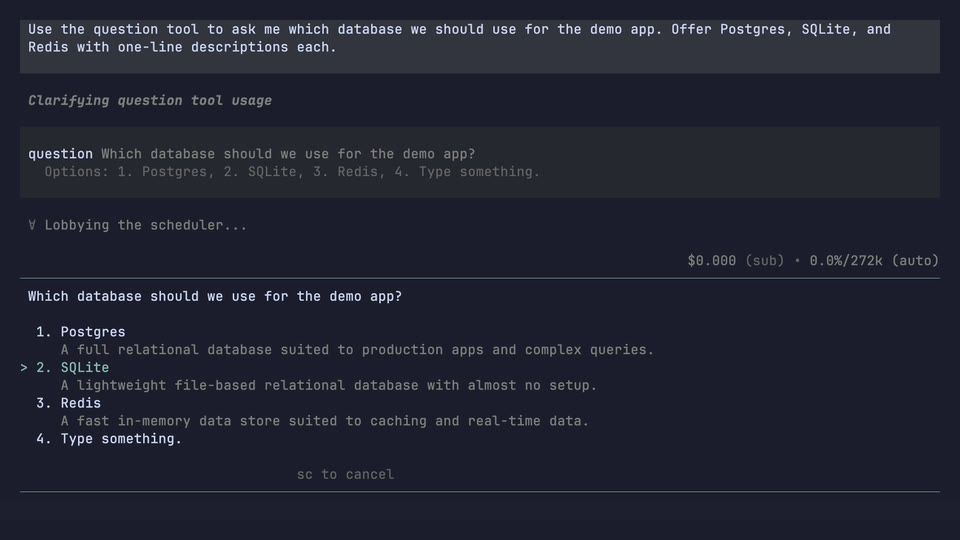
</picture>
</a>
</td>
</tr>
<tr>
<td width="42%" valign="top">
<h4>Embed the agent with the SDK</h4>
<p>Drive the same agent loop from your own TypeScript program, with your own tools and your own UI.</p>
<p><a href="https://docs.bastani.ai/sdk"><sub>Atomic docs · SDK</sub></a></p>
<p><a href="https://github.com/bastani-inc/atomic-crash-course#43-embed-the-agent-with-the-sdk"><sub>Crash course · 4.3 Embed the agent with the SDK</sub></a></p>
</td>
<td width="58%" valign="top">
<a href="https://github.com/bastani-inc/atomic-crash-course#43-embed-the-agent-with-the-sdk">
<picture>
<source srcset="assets/feature-wall/15-embed-with-the-sdk.gif" type="image/gif">
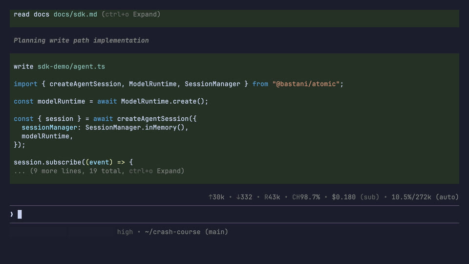
</picture>
</a>
</td>
</tr>
<tr>
<td width="42%" valign="top">
<h4>Build an extension</h4>
<p>Drop a TypeScript file into <code>.atomic/extensions/</code> and the agent gains a new tool in the running session.</p>
<p><a href="https://docs.bastani.ai/extensions"><sub>Atomic docs · Extensions</sub></a></p>
<p><a href="https://github.com/bastani-inc/atomic-crash-course#31-build-an-extension"><sub>Crash course · 3.1 Build an extension</sub></a></p>
</td>
<td width="58%" valign="top">
<a href="https://github.com/bastani-inc/atomic-crash-course#31-build-an-extension">
<picture>
<source srcset="assets/feature-wall/08-build-an-extension.gif" type="image/gif">
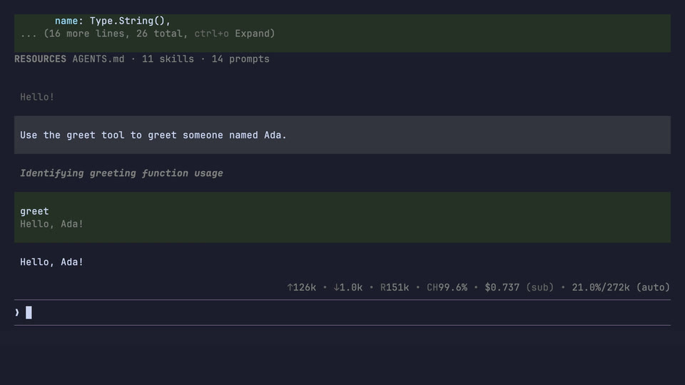
</picture>
</a>
</td>
</tr>
<tr>
<td width="42%" valign="top">
<h4>Write a skill</h4>
<p>A <code>SKILL.md</code> file teaches the agent a procedure it loads on demand - the same format Claude Code and Codex use.</p>
<p><a href="https://docs.bastani.ai/skills"><sub>Atomic docs · Skills</sub></a></p>
<p><a href="https://github.com/bastani-inc/atomic-crash-course#34-write-a-skill"><sub>Crash course · 3.4 Write a skill</sub></a></p>
</td>
<td width="58%" valign="top">
<a href="https://github.com/bastani-inc/atomic-crash-course#34-write-a-skill">
<picture>
<source srcset="assets/feature-wall/11-write-a-skill.gif" type="image/gif">
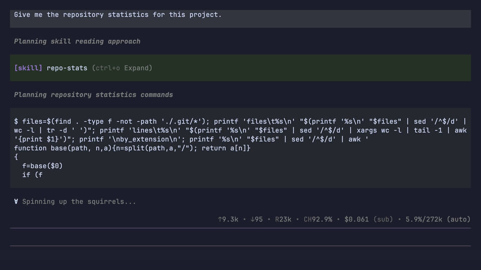
</picture>
</a>
</td>
</tr>
<tr>
<td width="42%" valign="top">
<h4>Local models via models.json</h4>
<p>Point Atomic at Ollama or any OpenAI-compatible endpoint by declaring it in <code>models.json</code>.</p>
<p><a href="https://docs.bastani.ai/models"><sub>Atomic docs · Custom models</sub></a></p>
<p><a href="https://github.com/bastani-inc/atomic-crash-course#42-local-models-via-modelsjson"><sub>Crash course · 4.2 Local models via models.json</sub></a></p>
</td>
<td width="58%" valign="top">
<a href="https://github.com/bastani-inc/atomic-crash-course#42-local-models-via-modelsjson">
<picture>
<source srcset="assets/feature-wall/14-local-models.gif" type="image/gif">
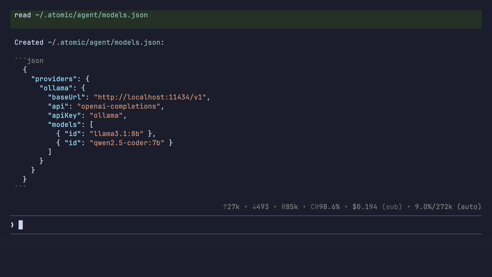
</picture>
</a>
</td>
</tr>
<tr>
<td width="42%" valign="top">
<h4>Headless print and JSON mode</h4>
<p><code>-p</code> prints one answer and exits; <code>--mode json</code> streams structured events, so Atomic drops into scripts and CI.</p>
<p><a href="https://docs.bastani.ai/json"><sub>Atomic docs · JSON event stream</sub></a></p>
<p><a href="https://github.com/bastani-inc/atomic-crash-course#41-headless-print-and-json-mode"><sub>Crash course · 4.1 Headless print and JSON mode</sub></a></p>
</td>
<td width="58%" valign="top">
<a href="https://github.com/bastani-inc/atomic-crash-course#41-headless-print-and-json-mode">
<picture>
<source srcset="assets/feature-wall/13-headless-print-and-json.gif" type="image/gif">
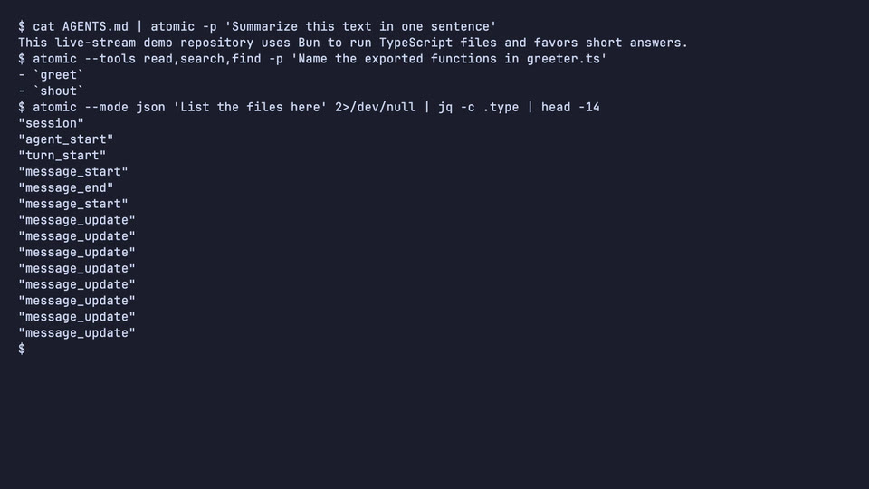
</picture>
</a>
</td>
</tr>
<tr>
<td width="42%" valign="top">
<h4>Branching with tree, fork, clone</h4>
<p>Fork a session at any point and try a second approach without losing the first; <code>/tree</code> shows the whole shape.</p>
<p><a href="https://docs.bastani.ai/sessions"><sub>Atomic docs · Sessions</sub></a></p>
<p><a href="https://github.com/bastani-inc/atomic-crash-course#21-branching-with-tree-fork-clone"><sub>Crash course · 2.1 Branching with tree, fork, clone</sub></a></p>
</td>
<td width="58%" valign="top">
<a href="https://github.com/bastani-inc/atomic-crash-course#21-branching-with-tree-fork-clone">
<picture>
<source srcset="assets/feature-wall/05-branching-tree-fork-clone.gif" type="image/gif">
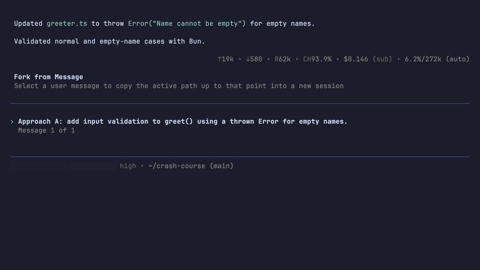
</picture>
</a>
</td>
</tr>
<tr>
<td width="42%" valign="top">
<h4>Sessions are just JSONL</h4>
<p>Every session is an append-only JSONL file on disk, so you can grep it, diff it, and script against it.</p>
<p><a href="https://docs.bastani.ai/session-format"><sub>Atomic docs · Session format</sub></a></p>
<p><a href="https://github.com/bastani-inc/atomic-crash-course#23-sessions-are-just-jsonl"><sub>Crash course · 2.3 Sessions are just JSONL</sub></a></p>
</td>
<td width="58%" valign="top">
<a href="https://github.com/bastani-inc/atomic-crash-course#23-sessions-are-just-jsonl">
<picture>
<source srcset="assets/feature-wall/07-sessions-are-jsonl.gif" type="image/gif">
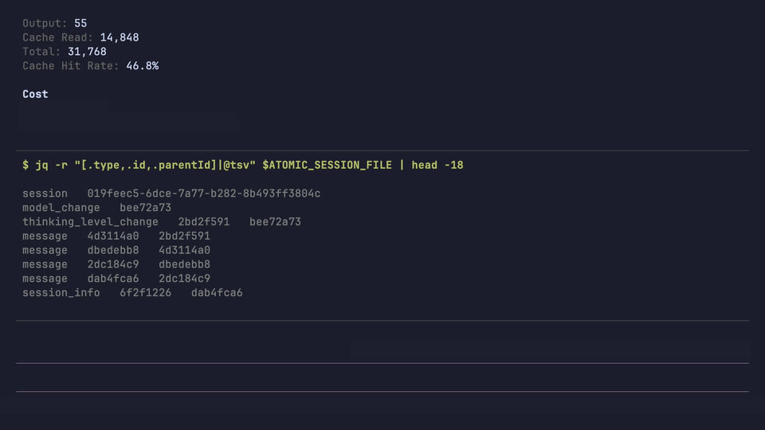
</picture>
</a>
</td>
</tr>
<tr>
<td width="42%" valign="top">
<h4>Your first session</h4>
<p>One editor for prompts, <code>@</code> file references, and <code>!</code> shell commands, with steering you can type while the agent works.</p>
<p><a href="https://docs.bastani.ai/usage"><sub>Atomic docs · Using Atomic</sub></a></p>
<p><a href="https://github.com/bastani-inc/atomic-crash-course#11-your-first-session"><sub>Crash course · 1.1 Your first session</sub></a></p>
</td>
<td width="58%" valign="top">
<a href="https://github.com/bastani-inc/atomic-crash-course#11-your-first-session">
<picture>
<source srcset="assets/feature-wall/01-first-session.gif" type="image/gif">
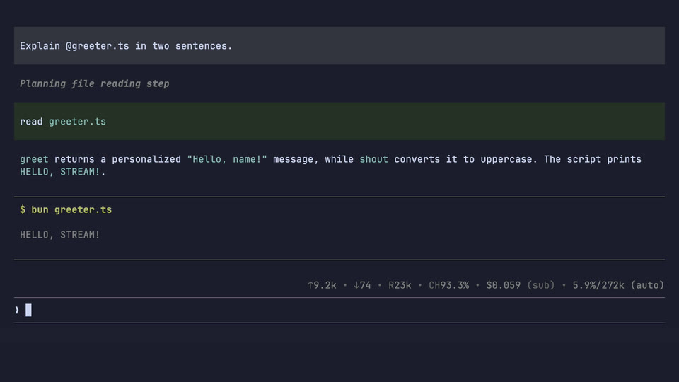
</picture>
</a>
</td>
</tr>
<tr>
<td width="42%" valign="top">
<h4>File-based todos</h4>
<p>Plans are durable files under <code>.atomic/todos/</code>: plain text you can grep, review, and commit alongside the code.</p>
<p><a href="https://docs.bastani.ai/tools"><sub>Atomic docs · Built-in tools</sub></a></p>
<p><a href="https://github.com/bastani-inc/atomic-crash-course#14-file-based-todos"><sub>Crash course · 1.4 File-based todos</sub></a></p>
</td>
<td width="58%" valign="top">
<a href="https://github.com/bastani-inc/atomic-crash-course#14-file-based-todos">
<picture>
<source srcset="assets/feature-wall/04-file-based-todos.gif" type="image/gif">
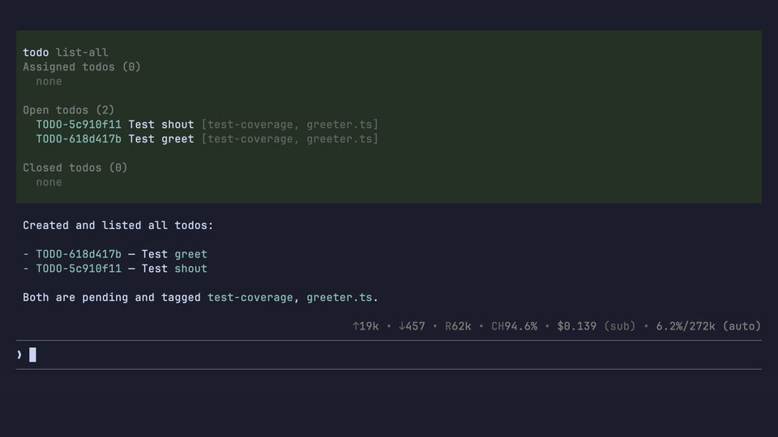
</picture>
</a>
</td>
</tr>
<tr>
<td width="42%" valign="top">
<h4>A handoff command of your own</h4>
<p>Package a repeatable handoff as a project-local slash command your whole team can run.</p>
<p><a href="https://docs.bastani.ai/prompt-templates"><sub>Atomic docs · Prompt templates</sub></a></p>
<p><a href="https://github.com/bastani-inc/atomic-crash-course#56-a-handoff-command-of-your-own"><sub>Crash course · 5.6 A handoff command of your own</sub></a></p>
</td>
<td width="58%" valign="top">
<a href="https://github.com/bastani-inc/atomic-crash-course#56-a-handoff-command-of-your-own">
<picture>
<source srcset="assets/feature-wall/21-your-own-handoff-command.gif" type="image/gif">
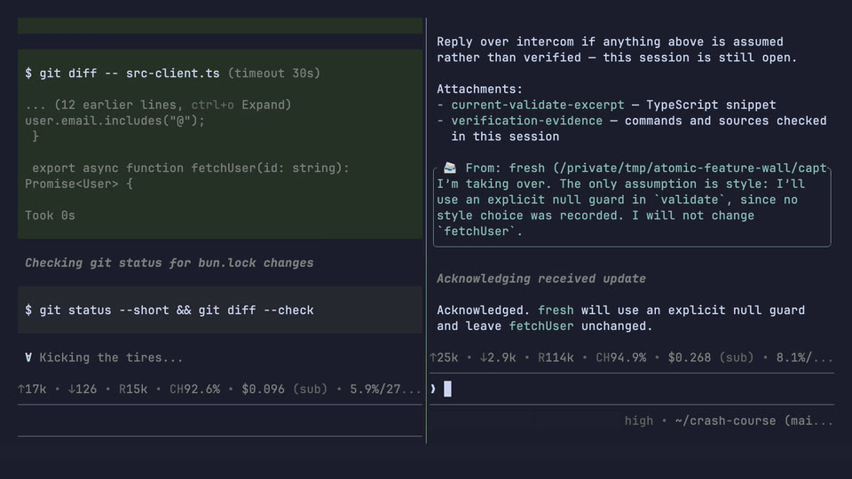
</picture>
</a>
</td>
</tr>
<tr>
<td width="42%" valign="top">
<h4>Intercom group isolation</h4>
<p>Sessions in different groups cannot message each other; only an explicit read-only group peek crosses the boundary.</p>
<p><a href="https://docs.bastani.ai/intercom"><sub>Atomic docs · Intercom</sub></a></p>
<p><a href="https://github.com/bastani-inc/atomic-crash-course#a7-intercom-group-isolation"><sub>Crash course · A.7 Intercom group isolation</sub></a></p>
</td>
<td width="58%" valign="top">
<a href="https://github.com/bastani-inc/atomic-crash-course#a7-intercom-group-isolation">
<picture>
<source srcset="assets/feature-wall/37-intercom-group-isolation.gif" type="image/gif">
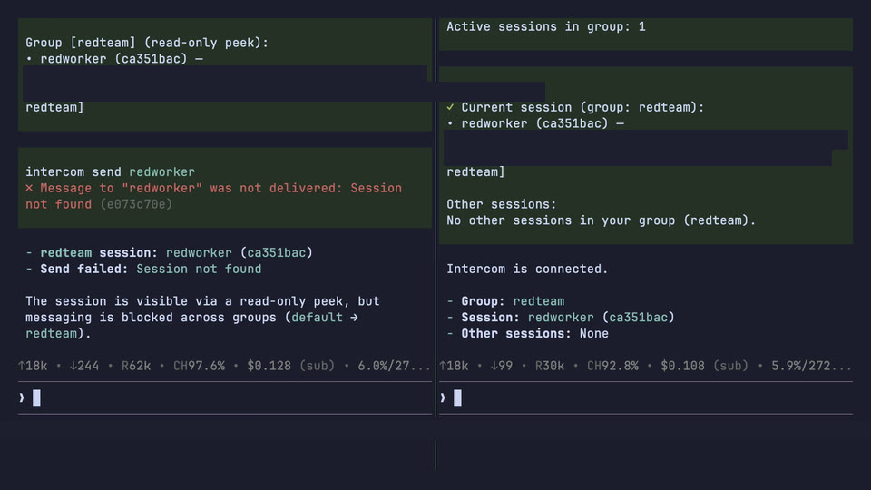
</picture>
</a>
</td>
</tr>
<tr>
<td width="42%" valign="top">
<h4>Prompt templates with arguments</h4>
<p>Project Markdown becomes a slash command with autocomplete hints and positional argument expansion.</p>
<p><a href="https://docs.bastani.ai/prompt-templates"><sub>Atomic docs · Prompt templates</sub></a></p>
<p><a href="https://github.com/bastani-inc/atomic-crash-course#a4-prompt-templates-with-arguments"><sub>Crash course · A.4 Prompt templates with arguments</sub></a></p>
</td>
<td width="58%" valign="top">
<a href="https://github.com/bastani-inc/atomic-crash-course#a4-prompt-templates-with-arguments">
<picture>
<source srcset="assets/feature-wall/34-prompt-templates-arguments.gif" type="image/gif">
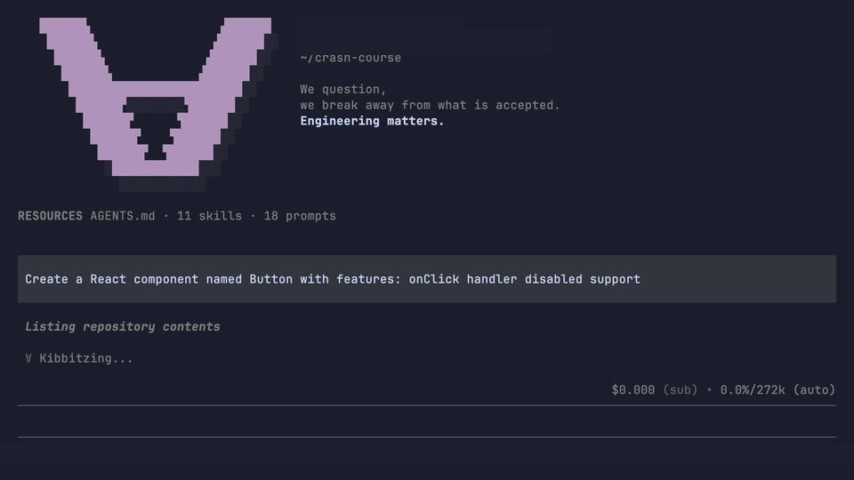
</picture>
</a>
</td>
</tr>
<tr>
<td width="42%" valign="top">
<h4>Runtime system-prompt mutation</h4>
<p>A live command toggles extension state, and <code>before_agent_start</code> rewrites the system prompt on the next turn.</p>
<p><a href="https://docs.bastani.ai/extensions"><sub>Atomic docs · Extensions</sub></a></p>
<p><a href="https://github.com/bastani-inc/atomic-crash-course#a3-runtime-system-prompt-mutation"><sub>Crash course · A.3 Runtime system-prompt mutation</sub></a></p>
</td>
<td width="58%" valign="top">
<a href="https://github.com/bastani-inc/atomic-crash-course#a3-runtime-system-prompt-mutation">
<picture>
<source srcset="assets/feature-wall/33-runtime-system-prompt.gif" type="image/gif">
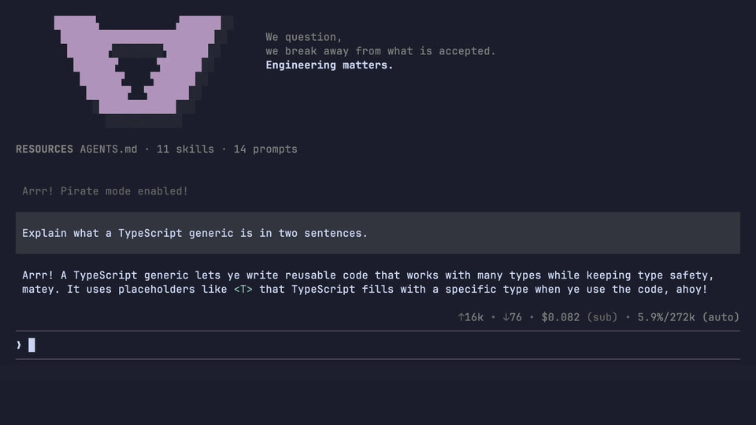
</picture>
</a>
</td>
</tr>
<tr>
<td width="42%" valign="top">
<h4>Keybindings and hot reload</h4>
<p>Every TUI action is remappable in global JSON; <code>/reload</code> applies the map without restarting the session.</p>
<p><a href="https://docs.bastani.ai/keybindings"><sub>Atomic docs · Keybindings</sub></a></p>
<p><a href="https://github.com/bastani-inc/atomic-crash-course#a1-keybindings-and-hot-reload"><sub>Crash course · A.1 Keybindings and hot reload</sub></a></p>
</td>
<td width="58%" valign="top">
<a href="https://github.com/bastani-inc/atomic-crash-course#a1-keybindings-and-hot-reload">
<picture>
<source srcset="assets/feature-wall/31-keybindings-hot-reload.gif" type="image/gif">
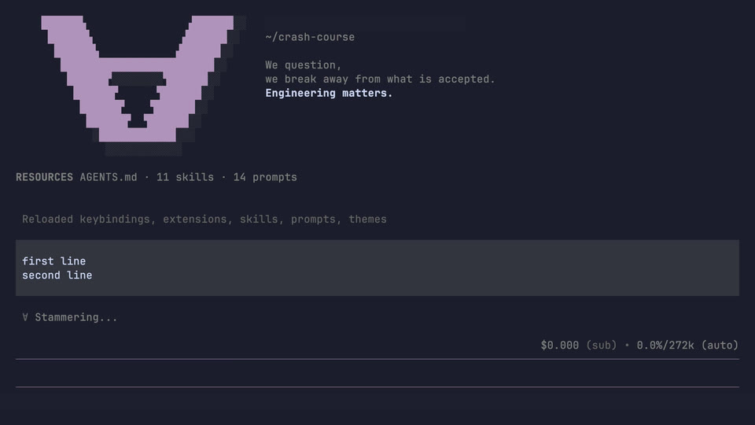
</picture>
</a>
</td>
</tr>
<tr>
<td width="42%" valign="top">
<h4>Custom theme</h4>
<p>Theme the entire TUI from a project-local file and switch to it live with <code>/theme</code>.</p>
<p><a href="https://docs.bastani.ai/themes"><sub>Atomic docs · Themes</sub></a></p>
<p><a href="https://github.com/bastani-inc/atomic-crash-course#35-custom-theme"><sub>Crash course · 3.5 Custom theme</sub></a></p>
</td>
<td width="58%" valign="top">
<a href="https://github.com/bastani-inc/atomic-crash-course#35-custom-theme">
<picture>
<source srcset="assets/feature-wall/12-custom-theme.gif" type="image/gif">
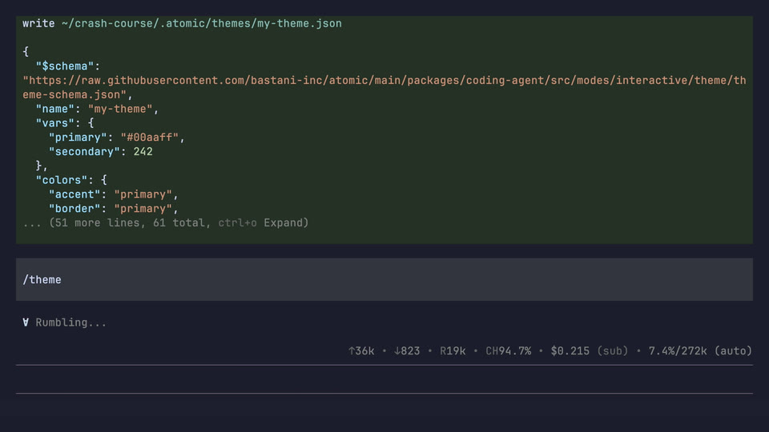
</picture>
</a>
</td>
</tr>
</table>

<!-- feature-wall:end -->

Build your process as workflows with scoped context, model choice, tools, handoffs, artifacts, retries, executable checks, review gates, and human approvals.

Atomic’s primitives are built for the software engineering lifecycle. Verification is built into the execution model.

Atomic is open so you can inspect and adapt it. You own the workflow, the evidence, and the rules for completion.

Own your intelligence. Build in the open. Question the defaults. Keep control of the process. ☠︎

### Works with your engineering stack

<p align="center">
  <a href="https://github.com/"></a>
  <a href="https://gitlab.com/"></a>
  <a href="https://git-scm.com/"></a>
  <a href="https://www.atlassian.com/software/jira"></a>
  <a href="https://linear.app/"></a>
  <a href="https://www.notion.so/"></a>
  <a href="https://slack.com/"></a>
  <br>
  <a href="https://www.docker.com/"></a>
  <a href="https://kubernetes.io/"></a>
  <a href="https://aws.amazon.com/"><img src="https://img.shields.io/badge/AWS-181825?style=flat-square&amp;logo=data%3Aimage%2Fsvg%2Bxml%3Bbase64%2CPHN2ZyBmaWxsPSJ3aGl0ZSIgcm9sZT0iaW1nIiB2aWV3Qm94PSIwIDAgMjQgMjQiIHhtbG5zPSJodHRwOi8vd3d3LnczLm9yZy8yMDAwL3N2ZyI%2BPHBhdGggZD0iTTYuNzYzIDEwLjAzNmMwIC4yOTYuMDMyLjUzNS4wODguNzEuMDY0LjE3Ni4xNDQuMzY4LjI1Ni41NzYuMDQuMDYzLjA1Ni4xMjcuMDU2LjE4MyAwIC4wOC0uMDQ4LjE2LS4xNTIuMjRsLS41MDMuMzM1YS4zODMuMzgzIDAgMCAxLS4yMDguMDcyYy0uMDggMC0uMTYtLjA0LS4yMzktLjExMmEyLjQ3IDIuNDcgMCAwIDEtLjI4Ny0uMzc1IDYuMTggNi4xOCAwIDAgMS0uMjQ4LS40NzFjLS42MjIuNzM0LTEuNDA1IDEuMTAxLTIuMzQ3IDEuMTAxLS42NyAwLTEuMjA1LS4xOTEtMS41OTYtLjU3NC0uMzkxLS4zODQtLjU5LS44OTQtLjU5LTEuNTMzIDAtLjY3OC4yMzktMS4yMy43MjYtMS42NDQuNDg3LS40MTUgMS4xMzMtLjYyMyAxLjk1NS0uNjIzLjI3MiAwIC41NTEuMDI0Ljg0Ni4wNjQuMjk2LjA0LjYuMTA0LjkxOC4xNzZ2LS41ODNjMC0uNjA3LS4xMjctMS4wMy0uMzc1LTEuMjc3LS4yNTUtLjI0OC0uNjg2LS4zNjctMS4zLS4zNjctLjI4IDAtLjU2OC4wMzEtLjg2My4xMDMtLjI5NS4wNzItLjU4My4xNi0uODYyLjI3MmEyLjI4NyAyLjI4NyAwIDAgMS0uMjguMTA0LjQ4OC40ODggMCAwIDEtLjEyNy4wMjNjLS4xMTIgMC0uMTY4LS4wOC0uMTY4LS4yNDd2LS4zOTFjMC0uMTI4LjAxNi0uMjI0LjA1Ni0uMjhhLjU5Ny41OTcgMCAwIDEgLjIyNC0uMTY3Yy4yNzktLjE0NC42MTQtLjI2NCAxLjAwNS0uMzZhNC44NCA0Ljg0IDAgMCAxIDEuMjQ2LS4xNTFjLjk1IDAgMS42NDQuMjE2IDIuMDkxLjY0Ny40MzkuNDMuNjYyIDEuMDg1LjY2MiAxLjk2M3YyLjU4NnptLTMuMjQgMS4yMTRjLjI2MyAwIC41MzQtLjA0OC44MjItLjE0NC4yODctLjA5Ni41NDMtLjI3MS43NTgtLjUxLjEyOC0uMTUyLjIyNC0uMzIuMjcyLS41MTIuMDQ3LS4xOTEuMDgtLjQyMy4wOC0uNjk0di0uMzM1YTYuNjYgNi42NiAwIDAgMC0uNzM1LS4xMzYgNi4wMiA2LjAyIDAgMCAwLS43NS0uMDQ4Yy0uNTM1IDAtLjkyNi4xMDQtMS4xOS4zMi0uMjYzLjIxNS0uMzkuNTE4LS4zOS45MTcgMCAuMzc1LjA5NS42NTUuMjk1Ljg0Ni4xOTEuMi40Ny4yOTYuODM4LjI5NnptNi40MS44NjJjLS4xNDQgMC0uMjQtLjAyNC0uMzA0LS4wOC0uMDY0LS4wNDgtLjEyLS4xNi0uMTY4LS4zMTFMNy41ODYgNS41NWExLjM5OCAxLjM5OCAwIDAgMS0uMDcyLS4zMmMwLS4xMjguMDY0LS4yLjE5MS0uMmguNzgzYy4xNTEgMCAuMjU1LjAyNS4zMS4wOC4wNjUuMDQ4LjExMy4xNi4xNi4zMTJsMS4zNDIgNS4yODQgMS4yNDUtNS4yODRjLjA0LS4xNi4wODgtLjI2NC4xNTEtLjMxMmEuNTQ5LjU0OSAwIDAgMSAuMzItLjA4aC42MzhjLjE1MiAwIC4yNTYuMDI1LjMyLjA4LjA2My4wNDguMTIuMTYuMTUxLjMxMmwxLjI2MSA1LjM0OCAxLjM4MS01LjM0OGMuMDQ4LS4xNi4xMDQtLjI2NC4xNi0uMzEyYS41Mi41MiAwIDAgMSAuMzExLS4wOGguNzQzYy4xMjcgMCAuMi4wNjUuMi4yIDAgLjA0LS4wMDkuMDgtLjAxNy4xMjhhMS4xMzcgMS4xMzcgMCAwIDEtLjA1Ni4ybC0xLjkyMyA2LjE3Yy0uMDQ4LjE2LS4xMDQuMjYzLS4xNjguMzExYS41MS41MSAwIDAgMS0uMzAzLjA4aC0uNjg3Yy0uMTUxIDAtLjI1NS0uMDI0LS4zMi0uMDgtLjA2My0uMDU2LS4xMTktLjE2LS4xNS0uMzJsLTEuMjM4LTUuMTQ4LTEuMjMgNS4xNGMtLjA0LjE2LS4wODcuMjY0LS4xNS4zMi0uMDY1LjA1Ni0uMTc3LjA4LS4zMi4wOHptMTAuMjU2LjIxNWMtLjQxNSAwLS44My0uMDQ4LTEuMjI5LS4xNDMtLjM5OS0uMDk2LS43MS0uMi0uOTE4LS4zMi0uMTI4LS4wNzEtLjIxNS0uMTUxLS4yNDctLjIyM2EuNTYzLjU2MyAwIDAgMS0uMDQ4LS4yMjR2LS40MDdjMC0uMTY3LjA2NC0uMjQ3LjE4My0uMjQ3LjA0OCAwIC4wOTYuMDA4LjE0NC4wMjQuMDQ4LjAxNi4xMi4wNDguMi4wOC4yNzEuMTIuNTY2LjIxNS44NzguMjc5LjMxOS4wNjQuNjMuMDk2Ljk1LjA5Ni41MDIgMCAuODk0LS4wODggMS4xNjUtLjI2NGEuODYuODYgMCAwIDAgLjQxNS0uNzU4Ljc3Ny43NzcgMCAwIDAtLjIxNS0uNTU5Yy0uMTQ0LS4xNTEtLjQxNi0uMjg3LS44MDctLjQxNWwtMS4xNTctLjM2Yy0uNTgzLS4xODMtMS4wMTQtLjQ1NC0xLjI3Ny0uODEzYTEuOTAyIDEuOTAyIDAgMCAxLS40LTEuMTU4YzAtLjMzNS4wNzMtLjYzLjIxNi0uODg2LjE0NC0uMjU1LjMzNS0uNDc5LjU3NS0uNjU0LjI0LS4xODQuNTEtLjMyLjgzLS40MTUuMzItLjA5Ni42NTUtLjEzNiAxLjAwNi0uMTM2LjE3NSAwIC4zNTkuMDA4LjUzNS4wMzIuMTgzLjAyNC4zNS4wNTYuNTE4LjA4OC4xNi4wNC4zMTIuMDguNDU1LjEyNy4xNDQuMDQ4LjI1Ni4wOTYuMzM2LjE0NGEuNjkuNjkgMCAwIDEgLjI0LjIuNDMuNDMgMCAwIDEgLjA3MS4yNjN2LjM3NWMwIC4xNjgtLjA2NC4yNTYtLjE4NC4yNTZhLjgzLjgzIDAgMCAxLS4zMDMtLjA5NiAzLjY1MiAzLjY1MiAwIDAgMC0xLjUzMi0uMzExYy0uNDU1IDAtLjgxNS4wNzEtMS4wNjIuMjIzLS4yNDguMTUyLS4zNzUuMzgzLS4zNzUuNzEgMCAuMjI0LjA4LjQxNi4yNC41NjcuMTU5LjE1Mi40NTQuMzA0Ljg3Ny40NGwxLjEzNC4zNThjLjU3NC4xODQuOTkuNDQgMS4yMzcuNzY3LjI0Ny4zMjcuMzY3LjcwMi4zNjcgMS4xMTcgMCAuMzQzLS4wNzIuNjU1LS4yMDcuOTI2LS4xNDQuMjcyLS4zMzYuNTExLS41ODMuNzAzLS4yNDguMi0uNTQzLjM0My0uODg2LjQ0Ny0uMzYuMTExLS43MzQuMTY3LTEuMTQyLjE2N3pNMjEuNjk4IDE2LjIwN2MtMi42MjYgMS45NC02LjQ0MiAyLjk2OS05LjcyMiAyLjk2OS00LjU5OCAwLTguNzQtMS43LTExLjg3LTQuNTI2LS4yNDctLjIyMy0uMDI0LS41MjcuMjcyLS4zNTEgMy4zODQgMS45NjMgNy41NTkgMy4xNTMgMTEuODc3IDMuMTUzIDIuOTE0IDAgNi4xMTQtLjYwNyA5LjA2LTEuODUyLjQzOS0uMi44MTQuMjg3LjM4My42MDd6TTIyLjc5MiAxNC45NjFjLS4zMzYtLjQzLTIuMjItLjIwNy0zLjA3NC0uMTAzLS4yNTUuMDMyLS4yOTUtLjE5Mi0uMDYzLS4zNiAxLjUtMS4wNTMgMy45NjctLjc1IDQuMjU0LS4zOTkuMjg3LjM2LS4wOCAyLjgyNi0xLjQ4NSA0LjAwNy0uMjE1LjE4NC0uNDIzLjA4OC0uMzI3LS4xNTEuMzItLjc5IDEuMDMtMi41Ny42OTUtMi45OTR6Ii8%2BPC9zdmc%2B" alt="Connect Atomic with AWS"></a>
  <a href="https://cloud.google.com/"></a>
  <a href="https://azure.microsoft.com/"></a>
  <br>
  <a href="https://sentry.io/"></a>
  <a href="https://www.datadoghq.com/"></a>
  <a href="https://www.postgresql.org/"></a>
  <a href="https://playwright.dev/"><img src="https://img.shields.io/badge/Playwright-181825?style=flat-square&amp;logo=data%3Aimage%2Fsvg%2Bxml%3Bbase64%2CPHN2ZyB3aWR0aD0iNDAwIiBoZWlnaHQ9IjQwMCIgdmlld0JveD0iMCAwIDQwMCA0MDAiIGZpbGw9Im5vbmUiIHhtbG5zPSJodHRwOi8vd3d3LnczLm9yZy8yMDAwL3N2ZyI%2BPHBhdGggZD0iTTEzNi40NDQgMjIxLjU1NkMxMjMuNTU4IDIyNS4yMTMgMTE1LjEwNCAyMzEuNjI1IDEwOS41MzUgMjM4LjAzMkMxMTQuODY5IDIzMy4zNjQgMTIyLjAxNCAyMjkuMDggMTMxLjY1MiAyMjYuMzQ4QzE0MS41MSAyMjMuNTU0IDE0OS45MiAyMjMuNTc0IDE1Ni44NjkgMjI0LjkxNVYyMTkuNDgxQzE1MC45NDEgMjE4LjkzOSAxNDQuMTQ1IDIxOS4zNzEgMTM2LjQ0NCAyMjEuNTU2Wk0xMDguOTQ2IDE3NS44NzZMNjEuMDg5NSAxODguNDg0QzYxLjA4OTUgMTg4LjQ4NCA2MS45NjE3IDE4OS43MTYgNjMuNTc2NyAxOTEuMzZMMTA0LjE1MyAxODAuNjY4QzEwNC4xNTMgMTgwLjY2OCAxMDMuNTc4IDE4OC4wNzcgOTguNTg0NyAxOTQuNzA1QzEwOC4wMyAxODcuNTU5IDEwOC45NDYgMTc1Ljg3NiAxMDguOTQ2IDE3NS44NzZaTTE0OS4wMDUgMjg4LjM0N0M4MS42NTgyIDMwNi40ODYgNDYuMDI3MiAyMjguNDM4IDM1LjIzOTYgMTg3LjkyOEMzMC4yNTU2IDE2OS4yMjkgMjguMDc5OSAxNTUuMDY3IDI3LjUgMTQ1LjkyOEMyNy40Mzc3IDE0NC45NzkgMjcuNDY2NSAxNDQuMTc5IDI3LjUzMzYgMTQzLjQ0NkMyNC4wNCAxNDMuNjU3IDIyLjM2NzQgMTQ1LjQ3MyAyMi43MDc3IDE1MC43MjFDMjMuMjg3NiAxNTkuODU1IDI1LjQ2MzMgMTc0LjAxNiAzMC40NDczIDE5Mi43MjFDNDEuMjMwMSAyMzMuMjI1IDc2Ljg2NTkgMzExLjI3MyAxNDQuMjEzIDI5My4xMzRDMTU4Ljg3MiAyODkuMTg1IDE2OS44ODUgMjgxLjk5MiAxNzguMTUyIDI3Mi44MUMxNzAuNTMyIDI3OS42OTIgMTYwLjk5NSAyODUuMTEyIDE0OS4wMDUgMjg4LjM0N1pNMTYxLjY2MSAxMjguMTFWMTMyLjkwM0gxODguMDc3QzE4Ny41MzUgMTMxLjIwNiAxODYuOTg5IDEyOS42NzcgMTg2LjQ0NyAxMjguMTFIMTYxLjY2MVoiIGZpbGw9IiMyRDQ1NTIiLz48cGF0aCBkPSJNMTkzLjk4MSAxNjcuNTg0QzIwNS44NjEgMTcwLjk1OCAyMTIuMTQ0IDE3OS4yODcgMjE1LjQ2NSAxODYuNjU4TDIyOC43MTEgMTkwLjQyQzIyOC43MTEgMTkwLjQyIDIyNi45MDQgMTY0LjYyMyAyMDMuNTcgMTU3Ljk5NUMxODEuNzQxIDE1MS43OTMgMTY4LjMwOCAxNzAuMTI0IDE2Ni42NzQgMTcyLjQ5NkMxNzMuMDI0IDE2Ny45NzIgMTgyLjI5NyAxNjQuMjY4IDE5My45ODEgMTY3LjU4NFpNMjk5LjQyMiAxODYuNzc3QzI3Ny41NzMgMTgwLjU0NyAyNjQuMTQ1IDE5OC45MTYgMjYyLjUzNSAyMDEuMjU1QzI2OC44OSAxOTYuNzM2IDI3OC4xNTggMTkzLjAzMSAyODkuODM3IDE5Ni4zNjJDMzAxLjY5OCAxOTkuNzQxIDMwNy45NzYgMjA4LjA2IDMxMS4zMDcgMjE1LjQzNkwzMjQuNTcyIDIxOS4yMTJDMzI0LjU3MiAyMTkuMjEyIDMyMi43MzYgMTkzLjQxIDI5OS40MjIgMTg2Ljc3N1pNMjg2LjI2MiAyNTQuNzk1TDE3Ni4wNzIgMjIzLjk5QzE3Ni4wNzIgMjIzLjk5IDE3Ny4yNjUgMjMwLjAzOCAxODEuODQyIDIzNy44NjlMMjc0LjYxNyAyNjMuODA1QzI4Mi4yNTUgMjU5LjM4NiAyODYuMjYyIDI1NC43OTUgMjg2LjI2MiAyNTQuNzk1Wk0yMDkuODY3IDMyMS4xMDJDMTIyLjYxOCAyOTcuNzEgMTMzLjE2NiAxODYuNTQzIDE0Ny4yODQgMTMzLjg2NUMxNTMuMDk3IDExMi4xNTYgMTU5LjA3MyA5Ni4wMjAzIDE2NC4wMjkgODUuMjA0QzE2MS4wNzIgODQuNTk1MyAxNTguNjIzIDg2LjE1MjkgMTU2LjIwMyA5MS4wNzQ2QzE1MC45NDEgMTAxLjc0NyAxNDQuMjEyIDExOS4xMjQgMTM3LjcgMTQzLjQ1QzEyMy41ODYgMTk2LjEyNyAxMTMuMDM4IDMwNy4yOSAyMDAuMjgzIDMzMC42ODJDMjQxLjQwNiAzNDEuNjk5IDI3My40NDIgMzI0Ljk1NSAyOTcuMzIzIDI5OC42NTlDMjc0LjY1NSAzMTkuMTkgMjQ1LjcxNCAzMzAuNzAxIDIwOS44NjcgMzIxLjEwMloiIGZpbGw9IiMyRDQ1NTIiLz48cGF0aCBkPSJNMTYxLjY2MSAyNjIuMjk2VjIzOS44NjNMOTkuMzMyNCAyNTcuNTM3Qzk5LjMzMjQgMjU3LjUzNyAxMDMuOTM4IDIzMC43NzcgMTM2LjQ0NCAyMjEuNTU2QzE0Ni4zMDIgMjE4Ljc2MiAxNTQuNzEzIDIxOC43ODEgMTYxLjY2MSAyMjAuMTIzVjEyOC4xMUgxOTIuODY5QzE4OS40NzEgMTE3LjYxIDE4Ni4xODQgMTA5LjUyNiAxODMuNDIzIDEwMy45MDlDMTc4Ljg1NiA5NC42MTIgMTc0LjE3NCAxMDAuNzc1IDE2My41NDUgMTA5LjY2NUMxNTYuMDU5IDExNS45MTkgMTM3LjEzOSAxMjkuMjYxIDEwOC42NjggMTM2LjkzM0M4MC4xOTY2IDE0NC42MSA1Ny4xNzkgMTQyLjU3NCA0Ny41NzUyIDE0MC45MTFDMzMuOTYwMSAxMzguNTYyIDI2LjgzODcgMTM1LjU3MiAyNy41MDQ5IDE0NS45MjhDMjguMDg0NyAxNTUuMDYyIDMwLjI2MDUgMTY5LjIyNCAzNS4yNDQ1IDE4Ny45MjhDNDYuMDI3MiAyMjguNDMzIDgxLjY2MyAzMDYuNDgxIDE0OS4wMSAyODguMzQyQzE2Ni42MDIgMjgzLjYwMiAxNzkuMDE5IDI3NC4yMzMgMTg3LjYyNiAyNjIuMjkxSDE2MS42NjFWMjYyLjI5NlpNNjEuMDg0OCAxODguNDg0TDEwOC45NDYgMTc1Ljg3NkMxMDguOTQ2IDE3NS44NzYgMTA3LjU1MSAxOTQuMjg4IDg5LjYwODcgMTk5LjAxOEM3MS42NjE0IDIwMy43NDMgNjEuMDg0OCAxODguNDg0IDYxLjA4NDggMTg4LjQ4NFoiIGZpbGw9IiNFMjU3NEMiLz48cGF0aCBkPSJNMzQxLjc4NiAxMjkuMTc0QzMyOS4zNDUgMTMxLjM1NSAyOTkuNDk4IDEzNC4wNzIgMjYyLjYxMiAxMjQuMTg1QzIyNS43MTYgMTE0LjMwNCAyMDEuMjM2IDk3LjAyMjQgMTkxLjUzNyA4OC44OTk0QzE3Ny43ODggNzcuMzgzNCAxNzEuNzQgNjkuMzgwMiAxNjUuNzg4IDgxLjQ4NTdDMTYwLjUyNiA5Mi4xNjMgMTUzLjc5NyAxMDkuNTQgMTQ3LjI4NCAxMzMuODY2QzEzMy4xNzEgMTg2LjU0MyAxMjIuNjIzIDI5Ny43MDYgMjA5Ljg2NyAzMjEuMDk4QzI5Ny4wOTMgMzQ0LjQ3IDM0My41MyAyNDIuOTIgMzU3LjY0NCAxOTAuMjM4QzM2NC4xNTcgMTY1LjkxNyAzNjcuMDEzIDE0Ny41IDM2Ny43OTkgMTM1LjYyNUMzNjguNjk1IDEyMi4xNzMgMzU5LjQ1NSAxMjYuMDc4IDM0MS43ODYgMTI5LjE3NFpNMTY2LjQ5NyAxNzIuNzU2QzE2Ni40OTcgMTcyLjc1NiAxODAuMjQ2IDE1MS4zNzIgMjAzLjU2NSAxNThDMjI2Ljg5OSAxNjQuNjI4IDIyOC43MDYgMTkwLjQyNSAyMjguNzA2IDE5MC40MjVMMTY2LjQ5NyAxNzIuNzU2Wk0yMjMuNDIgMjY4LjcxM0MxODIuNDAzIDI1Ni42OTggMTc2LjA3NyAyMjMuOTkgMTc2LjA3NyAyMjMuOTlMMjg2LjI2MiAyNTQuNzk2QzI4Ni4yNjIgMjU0Ljc5MSAyNjQuMDIxIDI4MC41NzggMjIzLjQyIDI2OC43MTNaTTI2Mi4zNzcgMjAxLjQ5NUMyNjIuMzc3IDIwMS40OTUgMjc2LjEwNyAxODAuMTI2IDI5OS40MjIgMTg2Ljc3M0MzMjIuNzM2IDE5My40MTEgMzI0LjU3MiAyMTkuMjA4IDMyNC41NzIgMjE5LjIwOEwyNjIuMzc3IDIwMS40OTVaIiBmaWxsPSIjMkVBRDMzIi8%2BPHBhdGggZD0iTTEzOS44OCAyNDYuMDRMOTkuMzMyNCAyNTcuNTMyQzk5LjMzMjQgMjU3LjUzMiAxMDMuNzM3IDIzMi40NCAxMzMuNjA3IDIyMi40OTZMMTEwLjY0NyAxMzYuMzNMMTA4LjY2MyAxMzYuOTMzQzgwLjE5MTggMTQ0LjYxMSA1Ny4xNzQyIDE0Mi41NzQgNDcuNTcwNCAxNDAuOTExQzMzLjk1NTQgMTM4LjU2MyAyNi44MzQgMTM1LjU3MiAyNy41MDAxIDE0NS45MjlDMjguMDggMTU1LjA2MyAzMC4yNTU3IDE2OS4yMjQgMzUuMjM5NyAxODcuOTI5QzQ2LjAyMjUgMjI4LjQzMyA4MS42NTgzIDMwNi40ODEgMTQ5LjAwNSAyODguMzQyTDE1MC45ODkgMjg3LjcxOUwxMzkuODggMjQ2LjA0Wk02MS4wODQ4IDE4OC40ODVMMTA4Ljk0NiAxNzUuODc2QzEwOC45NDYgMTc1Ljg3NiAxMDcuNTUxIDE5NC4yODggODkuNjA4NyAxOTkuMDE4QzcxLjY2MTUgMjAzLjc0MyA2MS4wODQ4IDE4OC40ODUgNjEuMDg0OCAxODguNDg1WiIgZmlsbD0iI0Q2NTM0OCIvPjxwYXRoIGQ9Ik0yMjUuMjcgMjY5LjE2M0wyMjMuNDE1IDI2OC43MTJDMTgyLjM5OCAyNTYuNjk4IDE3Ni4wNzIgMjIzLjk5IDE3Ni4wNzIgMjIzLjk5TDIzMi44OSAyMzkuODcyTDI2Mi45NzEgMTI0LjI4MUwyNjIuNjA3IDEyNC4xODVDMjI1LjcxMSAxMTQuMzA0IDIwMS4yMzIgOTcuMDIyNCAxOTEuNTMyIDg4Ljg5OTRDMTc3Ljc4MyA3Ny4zODM0IDE3MS43MzUgNjkuMzgwMiAxNjUuNzgzIDgxLjQ4NTdDMTYwLjUyNiA5Mi4xNjMgMTUzLjc5NyAxMDkuNTQgMTQ3LjI4NCAxMzMuODY2QzEzMy4xNzEgMTg2LjU0MyAxMjIuNjIzIDI5Ny43MDYgMjA5Ljg2NyAzMjEuMDk3TDIxMS42NTUgMzIxLjVMMjI1LjI3IDI2OS4xNjNaTTE2Ni40OTcgMTcyLjc1NkMxNjYuNDk3IDE3Mi43NTYgMTgwLjI0NiAxNTEuMzcyIDIwMy41NjUgMTU4QzIyNi44OTkgMTY0LjYyOCAyMjguNzA2IDE5MC40MjUgMjI4LjcwNiAxOTAuNDI1TDE2Ni40OTcgMTcyLjc1NloiIGZpbGw9IiMxRDhEMjIiLz48cGF0aCBkPSJNMTQxLjk0NiAyNDUuNDUxTDEzMS4wNzIgMjQ4LjUzN0MxMzMuNjQxIDI2My4wMTkgMTM4LjE2OSAyNzYuOTE3IDE0NS4yNzYgMjg5LjE5NUMxNDYuNTEzIDI4OC45MjIgMTQ3Ljc0IDI4OC42ODcgMTQ5IDI4OC4zNDJDMTUyLjMwMiAyODcuNDUxIDE1NS4zNjQgMjg2LjM0OCAxNTguMzEyIDI4NS4xNDVDMTUwLjM3MSAyNzMuMzYxIDE0NS4xMTggMjU5Ljc4OSAxNDEuOTQ2IDI0NS40NTFaTTEzNy43IDE0My40NTFDMTMyLjExMiAxNjQuMzA3IDEyNy4xMTMgMTk0LjMyNiAxMjguNDg5IDIyNC40MzZDMTMwLjk1MiAyMjMuMzY3IDEzMy41NTQgMjIyLjM3MSAxMzYuNDQ0IDIyMS41NTFMMTM4LjQ1NyAyMjEuMTAxQzEzNi4wMDMgMTg4LjkzOSAxNDEuMzA4IDE1Ni4xNjUgMTQ3LjI4NCAxMzMuODY2QzE0OC43OTkgMTI4LjIyNSAxNTAuMzE4IDEyMi45NzggMTUxLjgzMiAxMTguMDg1QzE0OS4zOTMgMTE5LjYzNyAxNDYuNzY3IDEyMS4yMjggMTQzLjc3NiAxMjIuODY3QzE0MS43NTkgMTI5LjA5MyAxMzkuNzIyIDEzNS44OTggMTM3LjcgMTQzLjQ1MVoiIGZpbGw9IiNDMDRCNDEiLz48L3N2Zz4%3D" alt="Use Playwright with Atomic"></a>
  <a href="https://www.google.com/chrome/"></a>
  <br>
  <a href="https://docs.bastani.ai/extensions"></a>
  <a href="https://docs.bastani.ai/extensions"></a>
</p>

Atomic connects through installed CLIs, MCP servers, APIs, scripts, and custom extensions; you supply the credentials and permissions.

---

## Install and configure

### Prerequisites

- **Node.js 22.19 or newer** — check with `node --version`.
- **A package manager** — use npm, pnpm, Yarn, or Bun. Use Bun 1.3.14+ for Bun installs or workflow-authoring examples.
- **Model-provider access** — use a supported subscription login or API key.

### Install

With npm:

```bash
npm install -g @bastani/atomic
```

With pnpm:

```bash
pnpm add -g @bastani/atomic
```

With Bun:

```bash
bun add -g @bastani/atomic
```

Atomic does not require package install scripts. Add `--ignore-scripts` to the install command if you want to disable dependency lifecycle scripts during installation.

### Authenticate and run

Start Atomic:
```bash
atomic
```
Login. Atomic supports subscription login for Codex, Claude, GitHub Copilot, xAI, as well as API-key providers such as OpenRouter:

```bash
/login   # then select your provider
```

Claude login from a third-party harness uses Anthropic extra usage billed per token rather than Claude plan limits. See [Providers & Models](./packages/coding-agent/README.md#providers--models) for integration details.

Missing a provider? [Open an issue](https://github.com/bastani-inc/atomic/issues/new) or contribute an integration.

For API-key setup, export the key before starting Atomic:

```bash
export OPENROUTER_API_KEY=sk-or-...
atomic
```

Atomic stores provider credentials in `~/.atomic/agent/auth.json` and creates the file with owner-only permissions where the platform supports them. For non-interactive use, `atomic -p "<prompt>"` prints the response and exits.

After authenticating, run `/atomic` for workflow guides, examples, and next steps. A fresh install also shows a one-time workflow-engine introduction.

> ⚠️ Atomic has no built-in sandbox or command-level shell permission gate. Tools and extensions run with your user permissions. Run autonomous work inside a devcontainer, VM, or remote development machine—not on a host with sensitive data or credentials.

<details>
<summary><b>Devcontainer, terminal, and SDK references</b></summary>

Atomic runs in a standard devcontainer or VM with Node.js 22.19+ installed. Install it inside the container with a package manager and pass provider credentials through environment variables.

See [Terminal setup](./packages/coding-agent/docs/terminal-setup.md), [Security](./packages/coding-agent/docs/security.md), and [Programmatic Usage](./packages/coding-agent/README.md#programmatic-usage) for the SDK and RPC entry points.

</details>

### Bring your skill stack

Already have agent skills? Bring them into Atomic by pointing Atomic at their existing directories or placing them in its project or user skill locations. Atomic implements the Agent Skills standard, and configured Claude Code or Codex skill directories can be used without rewriting them. See [Skills](./packages/coding-agent/docs/skills.md#using-skills-from-other-harnesses).

When a skill captures a repeatable process, ask Atomic to author it as a durable workflow. Atomic inspects the skill and writes reviewable TypeScript using the [workflow guide](./packages/coding-agent/docs/workflows.md) and its examples.

```text
Inspect the existing skill `<skill-name-or-path>`—including its SKILL.md, scripts, references, and assets—and consult Atomic’s workflow docs and runnable TypeScript examples; then author a reusable TypeScript `workflow({...})` that preserves the skill’s intent while turning its repeatable process into durable multi-stage execution with precise typed inputs and declared outputs, artifact-backed handoffs for substantial context, explicit validation gates, and bounded retries or stop conditions where appropriate; add and run representative tests or smoke cases for the applicable success, validation-failure, and retry/stop paths, reload and verify workflow discovery, and ask me only questions whose answers materially change the design—otherwise state sensible assumptions and proceed.
```

### Migrating from another coding agent

Atomic publishes an agent-readable **[`llms.txt`](https://docs.bastani.ai/llms.txt)**. Ask your current coding agent to:

```text
Install and set up Atomic by following https://docs.bastani.ai/llms.txt.
```

---

## How Atomic works

Atomic is the runtime. Workflows encode durable processes through stages, tools, prompts, checks, artifacts, gates, and approvals. Skills supply reusable expert instructions. Specialized subagents handle focused work while a parent agent or workflow controls the larger task.

Atomic is a fork of Pi, so it works with the providers, tools, MCP servers, skills, and extensions already in your Pi stack.

Workflow stage dependencies must form a directed acyclic graph. Because imperative `workflow({ run })` definitions materialize topology from runtime branches, loops, and nested calls, module discovery cannot prove arbitrary acyclicity. Cyclic workflow graphs are unsupported: authored loop and repair iterations must create distinct tracked work per iteration and must never create self-edges or back-edges to ancestors. Retries within one `ctx.tool(...)` call remain attempts on that tool node rather than separate graph work.

```text
issue or goal → research → plan → agent stages → artifacts → checks → review gate → final output
```

A stage can prompt an agent, run tools, call MCP servers, save artifacts, pass selected output forward, branch, retry, run in parallel, or pause for approval. Model output can vary. The workflow definition makes stage order, inputs, handoffs, configured checks, gates, and artifacts explicit.

Use direct chat for small, interactive work. Use a skill or bounded subagent when the parent should stay in control. Use a workflow when a delegated job needs durable stages, retries, evidence, resumability, or approval gates. Phrases such as “repeat until,” “review and fix until passing,” or “run checks until green” signal that the stop condition should be encoded and bounded.

Atomic can support:

- **Engineering runs** — research, plan, implement, test, review, and release.
- **Debugging and migrations** — reproduce, diagnose, patch, migrate in waves, and verify.
- **Research and triage** — gather context, fan out analysis, classify issues, and synthesize findings.
- **QA, docs, and compliance** — run repeatable checks with evidence and approval points.
- **Custom agent products** — build on Atomic's runtime, SDK, tools, and workflows.

### Examples

Focused codebase research:

```text
/skill:research-codebase how the rate limiter works in src/middleware/
```

Repository-wide research with durable artifacts:

```text
/workflow fan-out-and-synthesize prompt="Partition the repository by subsystem, map every legacy auth middleware callsite, and synthesize cited migration findings"
```

A task-specific implementation and review loop:

```text
Create and run a workflow that implements specs/2026-03-rate-limit.md, runs focused tests, sends the patch to fresh verifiers, and repairs findings until burst traffic returns 429 with Retry-After or the iteration bound is reached.
```

A reviewer-gated run with Goal:

```text
/workflow goal objective="Update the CLI docs for --json, add one example, and validate the docs build"
```

A research-first implementation with Ralph:

```text
/workflow ralph prompt="Implement specs/2026-03-rate-limit.md and validate burst traffic" create_pr=true
```

Use Goal when a durable ledger, receipts, bounded sub-agent orchestration, and reviewer-gated completion fit the task. Use Ralph when the job benefits from prompt refinement, codebase research, delegated implementation, and iterative multi-model review. Both skip PR creation unless `create_pr=true` explicitly authorizes the post-approval final stage.

---

## What you get

Atomic ships three top-level building blocks: workflows, skills, and specialized subagents.

### 1. Workflows

Workflows define inputs, stages, branches, parallelism, retries, checks, artifacts, checkpoints, and human review gates. Atomic can author TypeScript `workflow({...})` definitions, import reusable project or package workflows, and nest workflows with `ctx.workflow(...)` within a configured `maxDepth`.

| Workflow | What it does | Example input |
| --- | --- | --- |
| `fan-out-and-synthesize` | Partitions independent slices, writes branch artifacts, and synthesizes their evidence. | `/workflow fan-out-and-synthesize prompt="Map payment retries by subsystem and synthesize cited findings"` |
| `adversarial-verification` | Challenges a candidate with fresh verifiers and bounded repair. | `/workflow adversarial-verification task="Verify the rate-limit migration patch"` |
| `loop-until-done` | Iterates with a durable ledger until explicit completion evidence or bound exhaustion. | `/workflow loop-until-done prompt="Repair failures until the test suite passes"` |
| `goal` | Runs bounded autonomous implementation with a durable ledger, receipts, parallel review, and reducer-gated completion. | `/workflow goal objective="Update CLI docs and validate the docs build"` |
| `ralph` | Runs research-first delegated implementation with bounded multi-model review and repair. | `/workflow ralph prompt="Implement specs/rate-limit.md" create_pr=true` |
| `open-claude-design` | Gathers requirements and references, discovers the design system, refines output, and exports a handoff. | `/workflow open-claude-design prompt="Team activity feed prototype using ./mocks/feed.png as a reference"` |
| _author your own_ | Issue-to-PR, migration, triage, release, compliance, or another process your team needs. Start with the [workflow guide](./packages/coding-agent/docs/workflows.md). | _“Create a workflow that plans, implements, runs tests and lint, reviews the diff, then stops for approval.”_ |

Run `/workflow list` to see installed workflows and `/workflow inputs <name>` for input schemas. Use `/workflow status <id>`, `/workflow connect <id>`, `/workflow quit <id>`, and `/workflow resume <id>` to manage runs. Quitting pauses work so it can resume later. Runnable references live in [`packages/coding-agent/examples/`](./packages/coding-agent/examples).

### 2. Skills

Skills are reusable expert instructions and process modules. Atomic can select one from its description, or you can call it with `/skill:<name>`.

| Skill               | Purpose                                                                                      |
| ------------------- | -------------------------------------------------------------------------------------------- |
| `research-codebase` | Analyze a focused area and write a dated research document.                                  |
| `create-spec`       | Produce a technical execution spec grounded in research and engineer feedback.               |
| `subagent`          | Delegate work through single agents, chains, parallel groups, async runs, or forked context. |
| `intercom`          | Coordinate parent, child, and peer sessions on the same machine.                             |
| `prompt-engineer`   | Refine prompts, research questions, and workflow inputs.                                     |
| `skill-creator`     | Create, improve, and evaluate reusable skills.                                               |
| `tdd`               | Apply a red-green-refactor loop and testing guidance.                                        |
| `tmux`              | Drive and verify terminal applications.                                                      |
| `playwright-cli`    | Automate browser interactions and end-to-end UI checks.                                      |
| `liteparse`         | Extract text, tables, and values from documents and images.                                  |
| `impeccable`        | Design, audit, and refine frontend interfaces.                                               |

### 3. Specialized subagents

Subagents are purpose-built agents with scoped context, tools, and termination conditions. Atomic bundles nine definitions from [`packages/subagents/agents/`](./packages/subagents/agents/).

| Subagent                     | Purpose                                                    |
| ---------------------------- | ---------------------------------------------------------- |
| `worker`                     | Implement a bounded task and return a concise result.      |
| `codebase-locator`           | Locate files and components relevant to a task.            |
| `codebase-analyzer`          | Analyze implementation details.                            |
| `codebase-pattern-finder`    | Find similar implementations and usage examples.           |
| `codebase-online-researcher` | Fetch current documentation and authoritative web sources. |
| `codebase-research-locator`  | Find relevant prior research in the repository.            |
| `codebase-research-analyzer` | Extract decisions and rationale from local research.       |
| `code-simplifier`            | Refine recent code without changing behavior.              |
| `debugger`                   | Reproduce, diagnose, and verify fixes for failures.        |

Large, mixed, or growing contexts can make attention harder. Specialized agents reduce that risk through isolation, focus, tool scoping, and deliberate handoffs. Independent tasks can also run in parallel.


---

## What Atomic is / what Atomic is not

### Atomic is

- A coding agent runtime and terminal application.
- A context-engineering system for scoped sessions, tools, handoffs, and verifier passes.
- A TypeScript workflow SDK for explicit execution graphs, checks, artifacts, and gates.
- A model-agnostic harness for providers, MCP, subagents, skills, and extensions.
- Infrastructure that developers can inspect, version, change, and own.

### Atomic is not

- A promise that more agents improve engineering.
- A black-box swarm.
- A claim that model output is deterministic or correct by default.
- A checklist that a model may choose to follow.
- A wrapper around Claude Code, Codex, OpenCode, or Copilot CLI.
- A replacement for engineering judgment.

---

## Documentation

Full documentation lives at **[docs.bastani.ai](https://docs.bastani.ai/)**. It covers the CLI and SDK, security, containerized execution, workflow authoring and monitoring, session management, configuration, troubleshooting, and provider setup.

The docs live in this repository under [`packages/coding-agent/docs`](./packages/coding-agent/docs). Open a pull request to suggest a change.

## FAQ

### Is Atomic another coding agent?

Atomic includes a coding-agent CLI. Its main product idea is the runtime around the agent session: scoped context, stages, tools, checks, artifacts, checkpoints, subagents, review gates, and human approvals.

### Why not use Claude Code, Codex, or OpenCode?

Use any interactive coding tool that fits the job. Use Atomic when work needs an explicit process you can inspect, version, resume, and verify. Atomic connects to model providers directly rather than running those tools underneath it.

### How is Atomic different from products that fan out many agents?

Atomic can fan work out too. The difference is not whether agents run in parallel; it is whether developers control the context, handoffs, execution graph, evidence, checks, and approval rules around that work. Parallel execution increases throughput. Assurance comes from the process you define and enforce.

### Is Atomic deterministic?

The selected model can produce different output across runs. Workflow structure, stage dependencies, inputs, handoffs, configured checks, gates, and artifact paths are explicit. Deterministic reducers can apply declared approval rules to reviewer output.

### Why not Markdown checklists or `CLAUDE.md`?

Markdown helps set context, but a model still has to follow it. An Atomic workflow runs declared stages and tools, validates configured outputs, records configured artifacts, and applies defined gates.

### Why not LangGraph or a generic agent framework?

Atomic is repo-native and focused on software engineering work: issues, research, specs, branches, diffs, tests, lint, artifacts, reviewers, approvals, and handoffs. It provides a coding-agent runtime rather than a set of generic application primitives.

### Where do artifacts live?

Research commonly lives in `research/`, specs in `specs/`, and workflow run data in the workflow run directory. A workflow can persist plans, logs, transcripts, reviewer notes, check output, and summaries for later inspection.

---

## Workflow playbook

Read the [Workflow Playbook](./docs/workflow-playbook.md) for practical guidance on writing objectives, constraining scope, steering long-running work, validating results, and producing engineering handoffs.

## Support & ideas

Join the [Atomic Discord community](https://discord.gg/9CvdXUGXR4) for questions, help, feedback, feature ideas, and examples of what you have built.

## Contributing

See [CONTRIBUTING.md](CONTRIBUTING.md) for contribution guidelines and [DEV_SETUP.md](DEV_SETUP.md) for development setup and testing.

To contribute workflows, see the [atomic-workflows repository](https://github.com/lavaman131/atomic-workflows).

## License

MIT — see [LICENSE](LICENSE).

## Credits

- [Pi](https://pi.dev)
- [Superpowers](https://github.com/obra/superpowers)
- [Anthropic Skills](https://github.com/anthropics/skills)
- [Ralph Wiggum Method](https://ghuntley.com/ralph/)
- [OpenAI Codex Cookbook](https://github.com/openai/openai-cookbook)
- [HumanLayer](https://github.com/humanlayer/humanlayer)
- [Impeccable](https://github.com/pbakaus/impeccable)
