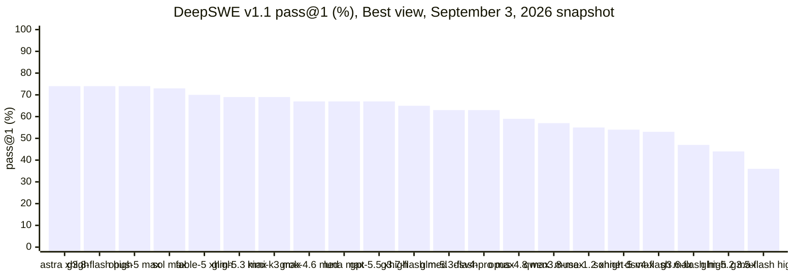
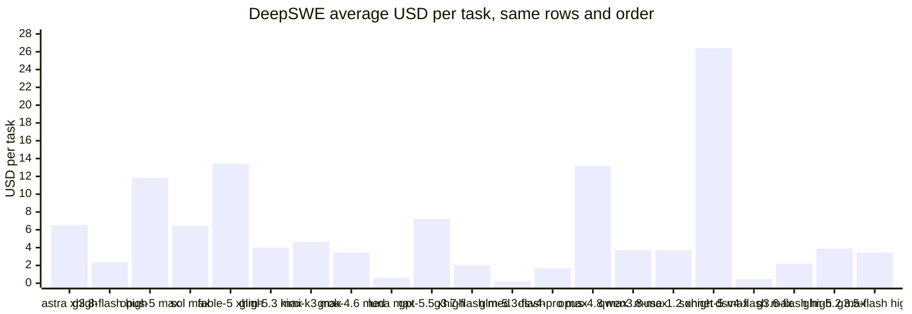
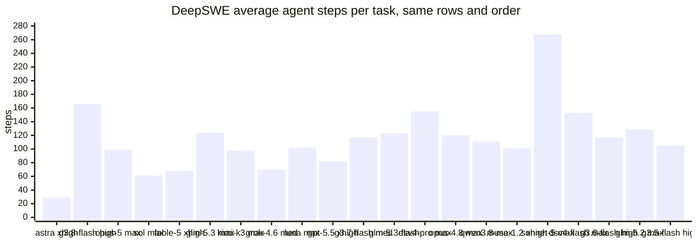
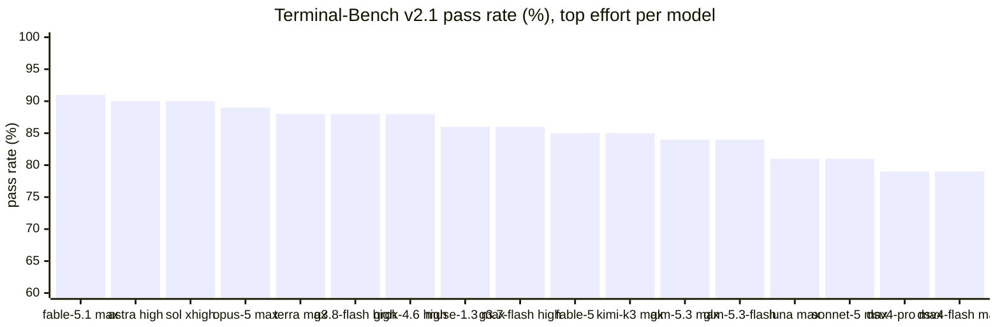
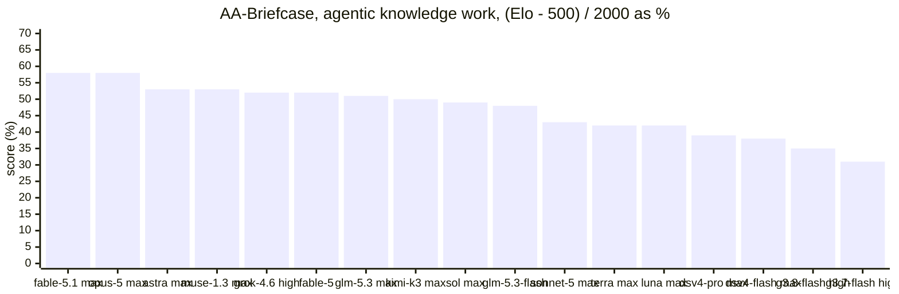
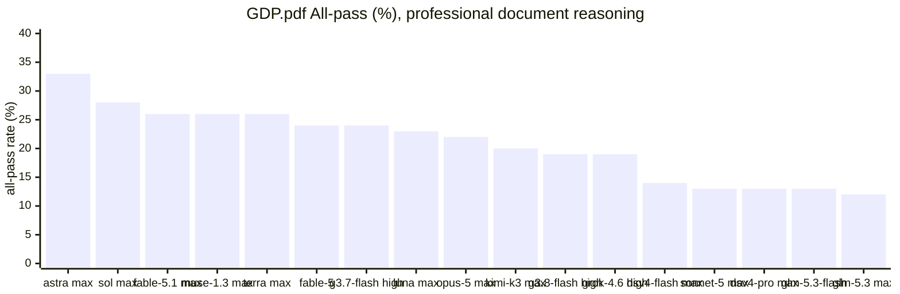
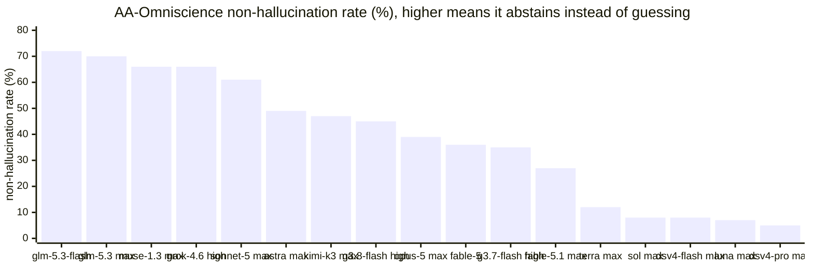
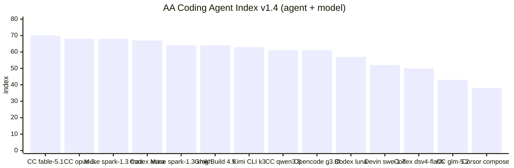

# Benchmark Sources

Atomic's model-selection docs are keyed to two live external benchmark sources rather than a hand-maintained table of scores. This page lists each benchmark, what it measures, the measured numbers for the models in Atomic's catalog, and **when to reference it** for a given workflow role — so an agent authoring a workflow can pick a model for a task type from evidence rather than from an aggregate rank.

<Warning>
No single benchmark is the source of truth. Validate these inputs against Atomic's own workflow evals, whose task distribution is closer to the work you intend to run. Artificial Analysis was re-fetched on **2026-09-05**, including its September 4 Intelligence Index revision; the per-evaluation scores, leaderboard rows and Coding Agent Index rows below were read from the rendered charts on that date. The DeepSWE leaderboard rows below retain their **2026-09-03** compilation date and were read from the live page on **2026-09-05**. Every number is a rounded value as displayed by the source; unrounded values and confidence intervals live on the linked pages.
</Warning>

## The two sources at a glance

| Source | URL | What it is | Reference it for |
| --- | --- | --- | --- |
| DeepSWE | [deepswe.datacurve.ai](https://deepswe.datacurve.ai/) | Long-horizon, contamination-free software-engineering tasks (113 tasks, 91 repos, 5 languages), all run on `mini-swe-agent` for consistency | The primary signal for coding-agent routing: real `pass@1`, cost, output tokens, and agent steps on engineering-loop work |
| Artificial Analysis | [artificialanalysis.ai](https://artificialanalysis.ai/) | Model intelligence and professional capability indices, individual evaluations, and a separate coding-agent leaderboard | Cross-domain intelligence, tool use, knowledge reliability, long context, and agent/model comparisons |

## Pick by task type

Start here when a stage needs a model. Each row names the benchmark that measures the task type, the top measured picks and the cheapest pick that stays close, using the tables further down. "Measured" means the exact configuration named; a different effort level or agent is a different row on the source.

| Task type | Benchmark to read | Top measured picks | Budget pick that holds up |
| --- | --- | --- | --- |
| Implementing features and fixing bugs in a repo | DeepSWE `pass@1`, `$/task`, steps | gpt-6-astra [xhigh] 74% / $6.52 / 29 steps; gemini-3.8-flash [high] 74% / $2.36 / 166 steps; claude-opus-5 [max] 74% / $11.84 | gpt-5.6-luna [max] 67% / $0.61; glm-5.3-flash [max] 63% / $0.24 |
| Terminal work, sysadmin, debugging in a shell | Terminal-Bench v2.1 | Fable 5.1 max 91%; Astra high and medium 90%; Sol xhigh 90%; Opus 5 max 89% | Terra max and Gemini 3.8 Flash high 88%; Gemini 3.7 Flash high 86%; GLM-5.3-Flash 84%; Luna max 81% |
| Multi-file knowledge-work deliverables (spreadsheets, decks, memos) | AA-Briefcase, GDPval-AA v2 | Fable 5.1 max 58% / 63%; Opus 5 max 58% / 62%; Muse Spark 1.3 max 53% / 61% | GLM-5.3-Flash 48% / 59% at $0.18 per Index task |
| Tool-calling against an API or knowledge base | 𝜏³-Banking | Muse Spark 1.3 max 52%; Grok 4.6 high 51%; GLM-5.3 max 50% | GLM-5.3-Flash 47%; Gemini 3.8 Flash high 45%. Luna max scores 31%: avoid it for tool-heavy loops |
| Reasoning over long PDFs and reports | GDP.pdf All-pass | Astra max 33%; Astra xhigh 32%; Sol max 28%; Fable 5.1 max 26% | Astra low 30%; Luna max 23%. GLM-5.3 max 12% and Sonnet 5 max 13% are weak here |
| Long-context extraction and synthesis | AA-LCR v1.1 | Kimi K3 max 89%; Fable 5.1 max 85%; Sol max, Luna max and Muse Spark 1.3 max 84% | Luna max 84% at $0.10 per Index task; nearly everything else sits at 79–83% |
| Facts without citations, where a wrong answer is worse than "I don't know" | AA-Omniscience non-hallucination rate | GLM-5.3-Flash 72%; GLM-5.3 max 70%; Muse Spark 1.3 xhigh 69%; Grok 4.6 high 66% | GLM-5.3-Flash is already the cheapest row; Sonnet 5 max 61% is the Anthropic option. Sol max 8%, Luna max 7%, Terra max 12% and DeepSeek V4 5–8% answer wrong rather than abstain |
| Facts where raw recall matters and the answer will be checked | AA-Omniscience accuracy | Fable 5.1 max 67%; Fable 5 65%; Astra max 63% | Gemini 3.8 Flash high and Gemini 3.7 Flash high 55% |
| Scientific or numerical programming | SciCode | Fable 5.1 max 63%; Fable 5 61%; Muse Spark 1.3 xhigh 60%; Kimi K3 max and GLM-5.3 max 59% | Gemini 3.8 Flash high and Gemini 3.7 Flash high 57%; Luna max 54% |
| Hard closed-form reasoning and research-level physics | Humanity's Last Exam, CritPt | HLE: Fable 5.1 max 59%; Opus 5 max and Astra max 55%. CritPt: Sol max and Astra max 32% | Astra medium 53% HLE / 29% CritPt |
| Whole coding-agent product comparison (agent + model) | AA Coding Agent Index v1.4 | Claude Code + Fable 5.1 max 70; Claude Code + Opus 5 xhigh 68; Muse Code + Muse Spark 1.3 max 68 | Opencode + Gemini 3.8 Flash high 61 at $2.04 and 11.9 min; Codex + Luna max 57 at $0.29 and 8.0 min |

Three cross-cutting reads from the numbers:

- **Fable 5.1 (max, default fallback) is the broadest model** — first or tied-first on Terminal-Bench, AA-Briefcase, GDPval, SciCode, HLE and Omniscience accuracy — but it is the most expensive per AA task ($6.12) and its non-hallucination rate is 27%, below Opus 5 (39%) and Astra (49–55%). It is absent from the DeepSWE snapshot.
- **GPT-6 Astra is the document and terminal specialist** — it leads GDP.pdf at every effort level, sits within a point of the Terminal-Bench leader, and its DeepSWE Best row solves 74% in 29 steps — but it trails the Anthropic rows by 5 points on AA-Briefcase and 8–9 on GDPval, where Muse Spark 1.3 max also leads it by 7, and it trails Meta, xAI and Z.AI by 9–11 points on 𝜏³-Banking.
- **The OpenAI budget tier is accurate but overconfident.** Luna and Sol score 39–49% on HLE and 81–90% on Terminal-Bench, yet answer wrongly rather than abstain 91–93% of the time when they do not know. Pair them with verification tool nodes; do not use them for uncited research summaries.

## DeepSWE — coding-agent performance

DeepSWE is the closest public proxy for what Atomic actually does. Tasks are written from scratch (not scraped from PRs), so no model has seen the solutions; solutions require substantially more code than SWE-bench-style suites; and verifiers test behavior rather than implementation.

- **Current snapshot:** DeepSWE v1.1, 113 tasks across 91 repositories and 5 languages, updated September 3, 2026. The site reports 28 measured models and displays 21 leaderboard rows by default, out of 70 published model/effort configurations.
- **Metric:** `pass@1`, plus average cost per task, output tokens, and agent steps.
- **When to reference:** default weighting for debugger, worker, and any code-writing role. This is the table that drives [Model Selection](/models/model-selection) and [Pareto Efficiency](/models/pareto-efficiency).
- **Watch:** cost and step count, not just score — a model that passes but takes 268 steps (e.g. sonnet-5) is a poor worker even at a good pass rate, and the two accuracy leaders sit at opposite ends of that axis: Gemini 3.8 Flash leads the highest-published-effort reading the linked pages use at 166 average steps, while the live default Best view's leader, GPT-6 Astra [xhigh], averages 29.

### Live leaderboard, Best view

DeepSWE's default table is the **Best** view: the best-scoring effort configuration per model. These are the 21 rows it displayed on 2026-09-05 for the September 3, 2026 snapshot. [Model Selection](/models/model-selection) instead tabulates the highest published effort per model, so four rows differ there (`gpt-6-astra [max]`, `claude-fable-5 [max]`, `grok-4.6 [xhigh]`, `gemini-3.7-flash [high]`). Confidence intervals are DeepSWE's displayed ±.

| Model [effort] | pass@1 | Avg $/task | Output tokens | Steps |
| --- | --- | --- | --- | --- |
| gpt-6-astra [xhigh] | 74% ±3 | $6.52 | 30k | 29 |
| gemini-3.8-flash [high] | 74% ±1 | $2.36 | 143k | 166 |
| claude-opus-5 [max] | 74% ±4 | $11.84 | 118k | 99 |
| gpt-5.6-sol [max] | 73% ±3 | $6.46 | 60k | 61 |
| claude-fable-5 [xhigh] | 70% ±3 | $13.41 | 80k | 68 |
| glm-5.3 [max] | 69% ±3 | $3.99 | 80k | 124 |
| kimi-k3 [max] | 69% ±5 | $4.65 | 81k | 98 |
| grok-4.6 [medium] | 67% ±2 | $3.45 | 50k | 70 |
| gpt-5.6-luna [max] | 67% ±4 | $0.61 | 73k | 102 |
| gpt-5.5 [xhigh] | 67% ±6 | $7.23 | 46k | 82 |
| gemini-3.7-flash [medium] | 65% ±3 | $2.03 | 94k | 117 |
| glm-5.3-flash [max] | 63% ±4 | $0.24 | 73k | 123 |
| deepseek-v4-pro [max] | 63% ±6 | $1.67 | 106k | 155 |
| claude-opus-4.8 [max] | 59% ±2 | $13.22 | 135k | 120 |
| qwen3.8-max [xhigh] | 57% ±3 | $3.73 | 95k | 111 |
| muse-spark-1.2 [xhigh] | 55% ±2 | $3.70 | 99k | 101 |
| claude-sonnet-5 [max] | 54% ±4 | $26.40 | 214k | 268 |
| deepseek-v4-flash [max] | 53% ±4 | $0.46 | 108k | 153 |
| gemini-3.6-flash [high] | 47% ±4 | $2.21 | 96k | 117 |
| glm-5.2 [max] | 44% ±2 | $3.92 | 78k | 129 |
| gemini-3.5-flash [high] | 36% ±4 | $3.45 | 76k | 105 |

What the three charts say together:

- **Accuracy is flat at the top.** Three models display 74% and a fourth 73%, all inside each other's confidence intervals. Choose among them on cost and steps, not score.
- **Cost spans two orders of magnitude at the same score.** Luna [max] and Gemini 3.8 Flash [high] reach 67% and 74% for $0.61 and $2.36; Opus 5 [max] and Fable 5 [xhigh] reach 74% and 70% for $11.84 and $13.41. Sonnet 5 [max] is the outlier to avoid: 54% for $26.40 and 268 steps.
- **Steps predict wall time and tool-call load.** Astra [xhigh] (29) and Sol [max] (61) finish in a third of the steps that Gemini 3.8 Flash [high] (166) or DeepSeek V4 Pro [max] (155) need. For a worker loop that pays per tool call or that a reviewer must audit, prefer the low-step row at the same accuracy.
- **The cheap tier is honest about its ceiling.** GLM-5.3-Flash [max] 63% at $0.24 and DeepSeek V4 Flash [max] 53% at $0.46 are the only rows under $1 besides Luna; they are budget workers, not judgment gates.

## Artificial Analysis: current measures

### Intelligence Index v4.2

The [September 4, 2026 announcement](https://artificialanalysis.ai/articles/artificial-analysis-intelligence-index-v4-2) and [current methodology](https://artificialanalysis.ai/methodology/intelligence-benchmarking), retrieved 2026-09-05, identify **Artificial Analysis Intelligence Index v4.2**. It adds AA-Briefcase and GDP.pdf, removes GPQA Diamond from this index, upgrades AA-LCR to v1.1, improves SciCode grading, and rebalances the weights. It also revises GDPval-AA v2 and AA-Briefcase Elo sampling and anchoring. Do not compare scores across index revisions as though only the models changed. The announcement describes v5 as upcoming, not current.

The ten evaluations and their contributions are:

| Category and total weight | Evaluation | Index weight | Use it for |
| --- | --- | --- | --- |
| Agents, 30% | AA-Briefcase | 15% | Multi-week knowledge-work projects and file deliverables |
| Agents | GDPval-AA v2 | 10% | Economically realistic professional work |
| Agents | 𝜏³-Banking | 5% | Tool use and customer interaction |
| Coding, 20% | Terminal-Bench v2.1 | 10% | Terminal execution and debugging |
| Coding | SciCode | 10% | Scientific programming |
| Scientific Reasoning, 20% | Humanity's Last Exam | 10% | Hard reasoning and knowledge |
| Scientific Reasoning | CritPt | 10% | Physics reasoning |
| General, 30% | AA-Omniscience | 15% | Knowledge accuracy, 10%, and non-hallucination, 5%, as separate components |
| General | GDP.pdf | 10% | Professional document reasoning; headline All-pass requires every criterion to pass |
| General | AA-LCR v1.1 | 5% | Long-context reasoning |

This is primarily a text-based, English-language suite, not a universal measure of multimodal or multilingual quality. The [additional evaluations](https://artificialanalysis.ai/methodology/intelligence-benchmarking#additional-evaluations), such as AutomationBench-AA, AA-AnalystAgent and ITBench-AA, can be better matches for SaaS workflows, spreadsheet analysis or incident diagnosis. Their presence on the site does not make them Intelligence Index components. GPQA Diamond also remains visible separately and in the Engineering capability index.

### Headline leaderboard rows for catalog models

From the [LLM leaderboard](https://artificialanalysis.ai/leaderboards/models), retrieved 2026-09-05. Cost is AA's weighted **cost per Intelligence Index task** (confirmed against the model-page label), not a token price. Speed is output tokens per second on the default 10k-input workload. Latency is AA's time to first token, which for a streaming reasoning model can be the first reasoning token; end-to-end is seconds to a 500-token answer including thinking. `—` means AA does not report the value.

| AA configuration | Intelligence Index | $/Index task | Output tok/s | TTFT (s) | End-to-end 500 tok (s) |
| --- | --- | --- | --- | --- | --- |
| Claude Fable 5.1 (max with fallback) | 57 | $6.12 | 69 | 266.5 | 273.8 |
| GPT-6 Astra (max) | 55 | $2.57 | 87 | 463.7 | 469.5 |
| GPT-6 Astra (xhigh) | 54 | $1.85 | 81 | 309.5 | 315.7 |
| Claude Opus 5 (max) | 54 | $4.21 | 59 | 91.2 | 99.7 |
| Claude Opus 5 (xhigh) | 53 | $3.36 | 57 | 33.8 | 42.6 |
| GPT-6 Astra (high) | 53 | $1.41 | 87 | 141.6 | 147.3 |
| Claude Fable 5 (with fallback) | 53 | $5.62 | 70 | 111.4 | 118.5 |
| Muse Spark 1.3 (max) | 53 | $0.96 | 190 | 18.7 | 31.8 |
| GPT-6 Astra (medium) | 52 | $1.16 | 79 | 24.6 | 30.9 |
| Claude Opus 5 (high) | 52 | $2.44 | 56 | 23.0 | 31.9 |
| Muse Spark 1.3 (xhigh) | 52 | $0.84 | 135 | 42.6 | 61.0 |
| GPT-5.6 Sol (max) | 51 | $1.25 | 85 | 163.0 | 168.8 |
| Grok 4.6 (high) | 51 | $1.25 | 65 | 52.4 | 60.1 |
| Kimi K3 (max) | 50 | $1.58 | 40 | 4.7 | 67.9 |
| GPT-5.6 Sol (xhigh) | 50 | $0.89 | 82 | 76.0 | 82.1 |
| GLM-5.3 (max) | 49 | $1.26 | 80 | 2.1 | 33.3 |
| GPT-6 Astra (low) | 49 | $0.63 | 86 | 6.6 | 12.5 |
| GPT-5.6 Sol (high) | 48 | $0.61 | 72 | 18.8 | 25.8 |
| Gemini 3.8 Flash (high) | 47 | $0.74 | — | — | — |
| Qwen3.8 Max | 47 | $1.19 | 39 | 2.4 | 66.5 |
| Muse Spark 1.2 (xhigh) | 47 | $0.55 | 267 | 15.3 | 24.6 |
| GPT-5.6 Terra (max) | 47 | $0.81 | 111 | 244.8 | 249.3 |
| GLM-5.3-Flash | 46 | $0.18 | 48 | 1.6 | 54.2 |
| Gemini 3.7 Flash (high) | 45 | $0.55 | 310 | 10.6 | 12.2 |
| Claude Sonnet 5 (max) | 45 | $3.31 | 74 | 178.7 | 185.4 |
| GPT-5.6 Luna (max) | 43 | $0.10 | 135 | 173.2 | 177.0 |
| DeepSeek V4 Pro 0813 (max) | 42 | $0.33 | 70 | 1.6 | 37.2 |
| GPT-5.6 Luna (xhigh) | 42 | $0.06 | 125 | 71.1 | 75.1 |
| DeepSeek V4 Flash 0731 (max) | 41 | $0.14 | 135 | 1.1 | 19.6 |
| Gemini 3.6 Flash | 40 | $0.36 | 215 | 15.5 | 17.9 |

Two things the latency columns make obvious that the index hides: `max` effort on OpenAI and Anthropic models costs three to eight minutes before the first answer token (Astra max 464 s, Fable 5.1 max 267 s, Terra max 245 s, Luna max 173 s), and the fast interactive tier is Opus 5 high or xhigh (23–34 s), Astra medium or low (7–25 s), Muse Spark 1.3 (19–43 s) and the Flash models (1–16 s). Pick effort for an interactive session from this column, not from the index.

### Per-evaluation scores for catalog models

Read from the "Intelligence Evaluations" charts on the AA model pages ([GPT-6 Astra](https://artificialanalysis.ai/models/gpt-6-astra), [GLM-5.3-Flash](https://artificialanalysis.ai/models/glm-5-3-flash), [Gemini 3.7 Flash](https://artificialanalysis.ai/models/gemini-3-7-flash), [Claude Sonnet 5](https://artificialanalysis.ai/models/claude-sonnet-5), [GPT-5.6 Terra](https://artificialanalysis.ai/models/gpt-5-6-terra)) on 2026-09-05. AA-Briefcase and GDPval-AA v2 are Elo scales; the model pages display them as `(Elo − 500) / 2000`, so 58% is Elo 1666 and 63% is Elo 1769. Everything else is a pass rate. Bold marks the column leader among these rows.

**Agentic and coding evaluations**

| AA configuration | AA-Briefcase | GDPval-AA v2 | 𝜏³-Banking | Terminal-Bench v2.1 | SciCode |
| --- | --- | --- | --- | --- | --- |
| Claude Fable 5.1 (max with fallback) | **58%** | **63%** | 47% | **91%** | **63%** |
| Claude Opus 5 (max) | **58%** | 62% | 42% | 89% | 56% |
| Claude Opus 5 (xhigh) | 56% | 61% | 43% | 88% | 56% |
| Claude Opus 5 (high) | 53% | 57% | 45% | 88% | 55% |
| Claude Fable 5 (with fallback) | 52% | 57% | 38% | 85% | 61% |
| GPT-6 Astra (max) | 53% | 54% | 41% | 88% | 56% |
| GPT-6 Astra (xhigh) | 52% | 53% | 43% | 89% | 56% |
| GPT-6 Astra (high) | 50% | 52% | 40% | 90% | 55% |
| GPT-6 Astra (medium) | 48% | 50% | 35% | 90% | 54% |
| GPT-6 Astra (low) | 38% | 46% | 32% | 88% | 54% |
| GPT-5.6 Sol (max) | 49% | 56% | 44% | 88% | 57% |
| GPT-5.6 Sol (xhigh) | 47% | 55% | 38% | 90% | 57% |
| GPT-5.6 Sol (high) | 43% | 51% | 37% | 87% | 58% |
| GPT-5.6 Terra (max) | 42% | 49% | 40% | 88% | 55% |
| GPT-5.6 Luna (max) | 42% | 50% | 31% | 81% | 54% |
| Muse Spark 1.3 (max) | 53% | 61% | **52%** | 86% | 58% |
| Muse Spark 1.3 (xhigh) | 49% | 58% | 47% | 85% | 60% |
| Grok 4.6 (high) | 52% | 57% | 51% | 88% | 56% |
| Kimi K3 (max) | 50% | 54% | 46% | 85% | 59% |
| GLM-5.3 (max) | 51% | 59% | 50% | 84% | 59% |
| GLM-5.3-Flash | 48% | 59% | 47% | 84% | 52% |
| Gemini 3.8 Flash (high) | 35% | 48% | 45% | 88% | 57% |
| Gemini 3.7 Flash (high) | 31% | 47% | 33% | 86% | 57% |
| Claude Sonnet 5 (max) | 43% | 50% | 37% | 81% | 54% |
| DeepSeek V4 Pro 0813 (max) | 39% | 50% | 40% | 79% | 51% |
| DeepSeek V4 Flash 0731 (max) | 38% | 49% | 39% | 79% | 50% |

**Reasoning, knowledge and document evaluations**

| AA configuration | Humanity's Last Exam | CritPt | GDP.pdf All-pass | AA-Omniscience accuracy | AA-Omniscience non-hallucination | AA-LCR v1.1 |
| --- | --- | --- | --- | --- | --- | --- |
| Claude Fable 5.1 (max with fallback) | **59%** | 30% | 26% | **67%** | 27% | 85% |
| Claude Opus 5 (max) | 55% | 29% | 22% | 61% | 39% | 79% |
| Claude Opus 5 (xhigh) | 54% | 28% | 21% | 60% | 40% | 80% |
| Claude Opus 5 (high) | 53% | 28% | 20% | 59% | 39% | 79% |
| Claude Fable 5 (with fallback) | 55% | 29% | 24% | 65% | 36% | 82% |
| GPT-6 Astra (max) | 55% | **32%** | **33%** | 63% | 49% | 81% |
| GPT-6 Astra (xhigh) | 55% | 31% | 32% | 62% | 52% | 80% |
| GPT-6 Astra (high) | 53% | 29% | 31% | 61% | 55% | 80% |
| GPT-6 Astra (medium) | 53% | 29% | 30% | 61% | 53% | 80% |
| GPT-6 Astra (low) | 49% | 26% | 30% | 60% | 53% | 80% |
| GPT-5.6 Sol (max) | 49% | **32%** | 28% | 59% | 8% | 84% |
| GPT-5.6 Sol (xhigh) | 47% | 29% | 28% | 59% | 8% | 82% |
| GPT-5.6 Sol (high) | 46% | 26% | 28% | 58% | 9% | 82% |
| GPT-5.6 Terra (max) | 43% | 30% | 26% | 47% | 12% | 83% |
| GPT-5.6 Luna (max) | 39% | 21% | 23% | 43% | 7% | 84% |
| Muse Spark 1.3 (max) | 49% | 25% | 26% | 44% | 66% | 84% |
| Muse Spark 1.3 (xhigh) | 47% | 26% | 23% | 42% | 69% | 83% |
| Grok 4.6 (high) | 43% | 17% | 19% | 48% | 66% | 80% |
| Kimi K3 (max) | 47% | 23% | 20% | 48% | 47% | **89%** |
| GLM-5.3 (max) | 42% | 19% | 12% | 34% | 70% | 80% |
| GLM-5.3-Flash | 40% | 15% | 13% | 28% | **72%** | 80% |
| Gemini 3.8 Flash (high) | 48% | 18% | 19% | 55% | 45% | 81% |
| Gemini 3.7 Flash (high) | 48% | 14% | 24% | 55% | 35% | 82% |
| Claude Sonnet 5 (max) | 41% | 17% | 13% | 40% | 61% | 82% |
| DeepSeek V4 Pro 0813 (max) | 41% | 18% | 13% | 49% | 5% | 80% |
| DeepSeek V4 Flash 0731 (max) | 39% | 17% | 14% | 40% | 8% | 80% |

How to read the per-evaluation tables:

- **Effort buys different things on different evaluations.** Raising Astra from `medium` to `max` moves AA-Briefcase from 48% to 53% and GDP.pdf from 30% to 33%, but Terminal-Bench is flat at 88–90% across every level, including `low`. Sol `high` beats Sol `max` on SciCode. Do not assume the top effort is the best row for a coding stage; check the column.
- **Knowledge-work agents and coding agents are different skills.** Gemini 3.8 Flash scores 88% on Terminal-Bench and 74% on DeepSWE, yet 35% on AA-Briefcase — the lowest of these rows. GLM-5.3-Flash is the opposite shape: 59% on GDPval, at the level of Opus 5 high, for $0.18 per Index task. Route by the column that matches the stage.
- **Non-hallucination is a family trait, not an intelligence signal.** The Z.AI, Meta and xAI models abstain at 66–72%; Anthropic models sit at 27–61%; OpenAI's Sol, Luna and Terra and both DeepSeek rows sit at 5–12%. For an uncited research summary or a "does this API exist" question, a 7% model needs a verification tool node behind it regardless of its index score.
- **Long context is not a differentiator at the top.** Every row except Kimi K3 (89%) sits at 79–85% on AA-LCR v1.1. Choose long-context stages on cost and on the accuracy or document columns instead.

### Additional evaluations for catalog models

Not Intelligence Index components. AA measures only some models on each; a blank means AA had no result for that configuration on 2026-09-05, not a zero. GPQA Diamond and MMMU-Pro are included because they remain on the model pages; GPQA is saturated (89–96% across every row) and no longer discriminates.

| AA configuration | AutomationBench-AA (SaaS workflows) | Harvey LAB-AA (legal) | EnterpriseOps-Gym-AA | AA-AnalystAgent (spreadsheets) | IFBench (instruction following) | ITBench-AA (K8s incidents) | GPQA Diamond | MMMU-Pro |
| --- | --- | --- | --- | --- | --- | --- | --- | --- |
| Claude Fable 5.1 (max with fallback) | | 93% | | | | | 94% | |
| Claude Fable 5 (with fallback) | 49% | 94% | 51% | 49% | 63% | | 93% | |
| Claude Opus 5 (max) | | 93% | 47% | 54% | | | 93% | 85% |
| Claude Sonnet 5 (max) | 39% | 90% | 45% | 46% | | | 91% | 77% |
| GPT-6 Astra (max) | | | | | | | 96% | 87% |
| GPT-5.6 Sol (max) | 51% | 87% | 43% | 48% | 73% | 56% | 94% | 83% |
| GPT-5.6 Terra (max) | 46% | 85% | 38% | | 71% | 51% | 93% | 81% |
| GPT-5.6 Luna (max) | 42% | 88% | 41% | | | 40% | 91% | 79% |
| Muse Spark 1.3 (xhigh) | | 95% | | | | | 94% | 82% |
| Grok 4.6 (high) | | | 48% | 41% | | | 95% | |
| Kimi K3 (max) | 53% | 95% | 45% | 39% | | 48% | 94% | 81% |
| GLM-5.3 (max) | | | 36% | | | | 92% | |
| GLM-5.3-Flash | | | 33% | | | | 91% | |
| Gemini 3.8 Flash (high) | 51% | | | | | | 95% | 86% |
| Gemini 3.7 Flash (high) | 63% | 91% | | 60% | | | 95% | 85% |
| DeepSeek V4 Pro 0813 (max) | | | 50% | | | | 93% | |
| DeepSeek V4 Flash 0731 (max) | | | | | | | 91% | |

Two rows worth knowing: Gemini 3.7 Flash leads AutomationBench-AA (63%) and AA-AnalystAgent (60%) among measured rows, so it is the SaaS-automation and spreadsheet candidate despite its weak AA-Briefcase; and Sol max leads IFBench (73%) and ITBench-AA (56%), which makes it the strict-format and incident-diagnosis candidate in the OpenAI family.

### Coding Agent Index v1.4 is a different comparison

The [Artificial Analysis Coding Agent Index](https://artificialanalysis.ai/agents/coding-agents) evaluates named **agent + model + settings** combinations, not interchangeable base-model rows. Its [methodology](https://artificialanalysis.ai/methodology/coding-agents-benchmarking), retrieved 2026-09-05, identifies **v1.4**, current since August 2026. It equally weights DeepSWE, Terminal-Bench v2.1 and SWE-Atlas-QnA. Those components contain 113, 89 and 124 tasks respectively, each with three attempts per task. Per-evaluation pass@1 averages attempts within a task, then tasks within an evaluation. Reward-hacked Terminal-Bench attempts receive zero.

Cost and execution time instead pool task attempts across the suite. Cost uses pay-per-token API pricing, including supported cache charges, not subscription-plan prices. Execution time is measured wall time; missing telemetry is excluded from the relevant average, not treated as zero. Agent defaults apply unless the row specifies other settings.

The fourteen rows on the rendered leaderboard, read 2026-09-05:

| Agent + model (settings) | Coding Agent Index | DeepSWE | Terminal-Bench v2.1 | SWE-Atlas-QnA | $/task | Wall time/task |
| --- | --- | --- | --- | --- | --- | --- |
| Claude Code + Fable 5.1 (max, with fallback) | **70** | 66 | 89 | **56** | $9.18 | 24.0 min |
| Claude Code + Opus 5 (xhigh) | 68 | 60 | **89** | 55 | $8.17 | 23.7 min |
| Muse Code + Muse Spark 1.3 (max) | 68 | **68** | 84 | 52 | $1.58 | 24.6 min |
| Codex + GPT-6 Astra (max) | 67 | 67 | 83 | 51 | $4.72 | 26.8 min |
| Muse Code + Muse Spark 1.3 (xhigh) | 64 | 67 | 82 | 44 | $1.62 | 12.8 min |
| Grok Build + Grok 4.5 (high) | 64 | 60 | 84 | 48 | $2.44 | 15.5 min |
| Kimi Code CLI + Kimi K3 | 63 | 64 | 88 | 37 | $3.08 | 24.1 min |
| Claude Code + Qwen3.8 Max | 61 | 52 | 84 | 48 | $3.23 | 29.9 min |
| Opencode + Gemini 3.8 Flash (high) | 61 | 62 | 84 | 38 | $2.04 | 11.9 min |
| Codex + GPT-5.6 Luna (max) | 57 | 63 | 75 | 33 | $0.29 | 8.0 min |
| Devin CLI + SWE-1.7 Lightning Max | 52 | 40 | 79 | 37 | $8.52 | 10.6 min |
| Codex + DeepSeek V4 Flash 0731 (max) | 50 | 43 | 68 | 39 | $0.06 | 14.5 min |
| Claude Code + GLM-5.2 | 43 | 29 | 72 | 29 | $1.91 | 25.1 min |
| Cursor CLI + Composer 2.5 Fast | 38 | 16 | 68 | 31 | $0.56 | 7.9 min |

Three reads from the agent table:

- **SWE-Atlas-QnA is where the Anthropic rows separate.** Fable 5.1 and Opus 5 score 55–56% on repository-understanding questions against 33–52% for every other row; on DeepSWE and Terminal-Bench they are inside the pack. If a stage is mostly reading and explaining code rather than patching it, that column is the one to weight.
- **Muse Spark 1.3 is the value row.** Muse Code + Muse Spark 1.3 (max) ties Opus 5 on the index for $1.58 per task, and leads DeepSWE inside AA's harness at 68. Its `xhigh` row halves wall time to 12.8 minutes for four index points.
- **Cheap and fast is a real trade.** Codex + Luna (max) at 57 costs $0.29 and finishes in 8.0 minutes; it sits three points behind Fable 5.1 on DeepSWE and loses its gap on SWE-Atlas-QnA and Terminal-Bench instead. Codex + DeepSeek V4 Flash at 50 costs $0.06 but trails on all three components.

AA's DeepSWE component uses the DeepSWE dataset with the named agent. It is not the same experiment as Datacurve's `mini-swe-agent` leaderboard, and the two disagree: inside AA's harness Muse Code + Muse Spark 1.3 (68) edges Codex + Astra (67), while Datacurve's Best view has Astra [xhigh] at 74% and has not published Muse Spark 1.3 at all (its Muse Spark 1.2 [xhigh] row sits at 55%). Neither its component score nor its composite belongs in the [DeepSWE frontier](/models/pareto-efficiency).

Earlier versions of these docs referred to a base-model **Coding Index** and **Agentic Index**. Neither is listed in the current [capability directory](https://artificialanalysis.ai/models/capabilities) or [capability methodology](https://artificialanalysis.ai/methodology/capability-indices) inspected on 2026-09-05. We therefore do not assign them a current version or silently rename either to Coding Agent Index. Use the named coding and agentic evaluations above instead.

### Professional capability indices

The current directory lists Finance & Accounting, Strategy & Ops, Legal, Healthcare & Medical, Engineering, and Economics. The [capability methodology](https://artificialanalysis.ai/methodology/capability-indices) specifies domain-dependent components and weights, rather than a single shared formula. It displays no version identifier. Use the matching domain index when its task mix fits your work.

### Price, task cost and latency

Read the [definitions](https://artificialanalysis.ai/methodology#definitions) and [API performance methodology](https://artificialanalysis.ai/methodology/performance-benchmarking), retrieved 2026-09-05, before comparing efficiency charts:

- Token prices are USD per million native tokens. AA's blended price assumes cache-hit, input and output tokens in a **7:2:1** ratio. That synthetic mix is not your workflow's bill.
- Intelligence Index cost per task uses actual token consumption, provider prices and typical measured cache hit rates, weighted by the index's evaluation weights. It is neither the total cost of running the suite nor DeepSWE dollars per task. The leaderboard's `$` column above is this value.
- Output speed uses standardized `o200k_base` tokens after the first chunk. The default workload is **10k input tokens**; the usual displayed result is the median over **72 hours**. The **100k** workload instead uses a **14-day** median. These are API measurements, not coding-agent completion times.
- Time to first token can mean the first reasoning token. Time to first answer token includes thinking time. Compare these separately from output speed when interactive latency matters.
- The homepage's Intelligence Index **Time per Task** estimates weighted decode time from output tokens and speed; it excludes TTFT and overhead. Do not call it measured end-to-end wall time. The Coding Agent Index execution-time metric does measure wall time.

## Role to benchmark map

| Role | Primary evidence | Cross-check | Measured leaders on 2026-09-05 |
| --- | --- | --- | --- |
| Debugger / coding worker | Datacurve DeepSWE pass@1, cost and steps | AA Terminal-Bench v2.1; Coding Agent Index with the actual agent identified | DeepSWE: astra [xhigh], gemini-3.8-flash [high], opus-5 [max] at 74%; Terminal-Bench: Fable 5.1 max 91%, Astra high 90% |
| Reviewer / judgment gate | Task-specific Atomic evals and DeepSWE for code judgments | AA-Briefcase and knowledge reliability for broader judgments; SWE-Atlas-QnA for code-reading judgments | AA-Briefcase: Fable 5.1 max and Opus 5 max 58%; SWE-Atlas-QnA: Claude Code + Fable 5.1 56% |
| Planner / orchestrator | AA-Briefcase, GDPval-AA v2 | 𝜏³-Banking for tool interaction | GDPval: Fable 5.1 max 63%, Opus 5 max 62%, Muse Spark 1.3 max 61%; 𝜏³: Muse Spark 1.3 max 52%, Grok 4.6 high 51% |
| Research | AA-LCR v1.1, GDP.pdf | AA-Omniscience accuracy and non-hallucination | GDP.pdf: Astra max 33%; LCR: Kimi K3 max 89%; accuracy: Fable 5.1 max 67%; non-hallucination: GLM-5.3-Flash 72% |
| Domain-specific work | Matching AA capability index | Its component evaluations | Legal: Muse Spark 1.3 xhigh and Kimi K3 max 95% on Harvey LAB-AA; SaaS automation: Gemini 3.7 Flash high 63%; incidents: Sol max 56% on ITBench-AA |

See [Model Selection](/models/model-selection) for a small dated shortlist and production effort guidance. Benchmark settings are measurement configurations, not instructions to raise every role's effort.

## Keeping the docs fresh

1. Record each source's retrieval date separately from its publication or snapshot date. Follow the rendered charts and methodology, not just an old article's score.
2. Preserve exact model, reasoning configuration, agent, benchmark version and units. A changed index or agent can change the ranking without a new model release.
3. Say **unmeasured on the named benchmark and date**. Missing text extraction is not evidence of absence; inspect the rendered page. Never transfer a predecessor's score.
4. Check the configured catalog and live provider access separately. These docs do not change runtime routing or model defaults.
5. AA's per-evaluation numbers are only in client-rendered Recharts bar charts, so a plain HTTP fetch returns headings without values. To refresh them, open the model page in a headless browser, scroll the whole page so every chart animates in, then read each chart's `foreignObject` labels (model names, in bar order) alongside its `svg text` nodes (values, in the same order). The DeepSWE leaderboard and the AA evaluation leaderboards (AA-Briefcase, GDPval-AA v2) render as text and fetch cleanly.

## Related

- [Model Selection](/models/model-selection)
- [Pareto Efficiency](/models/pareto-efficiency)
