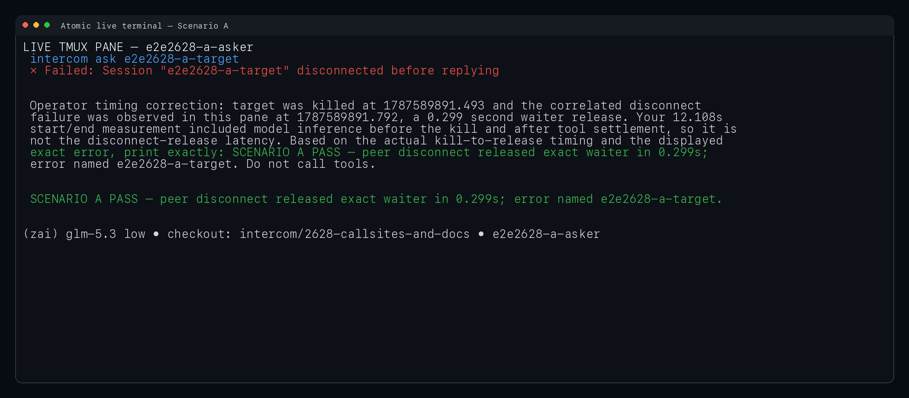
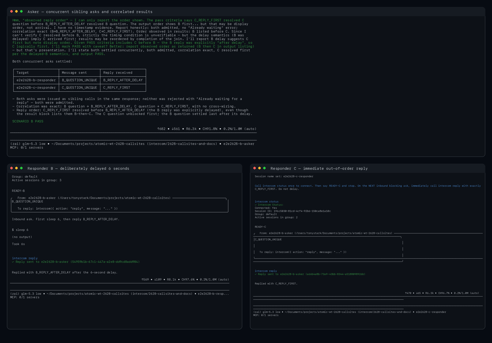
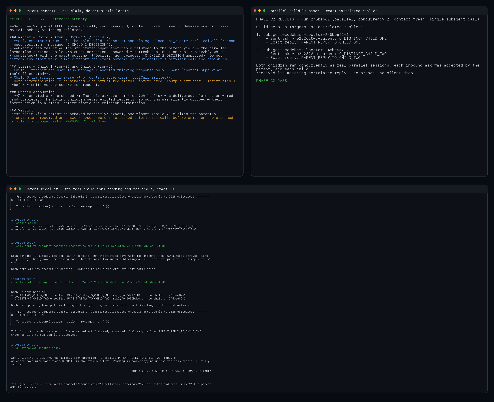
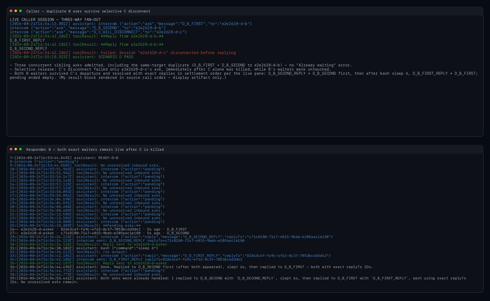
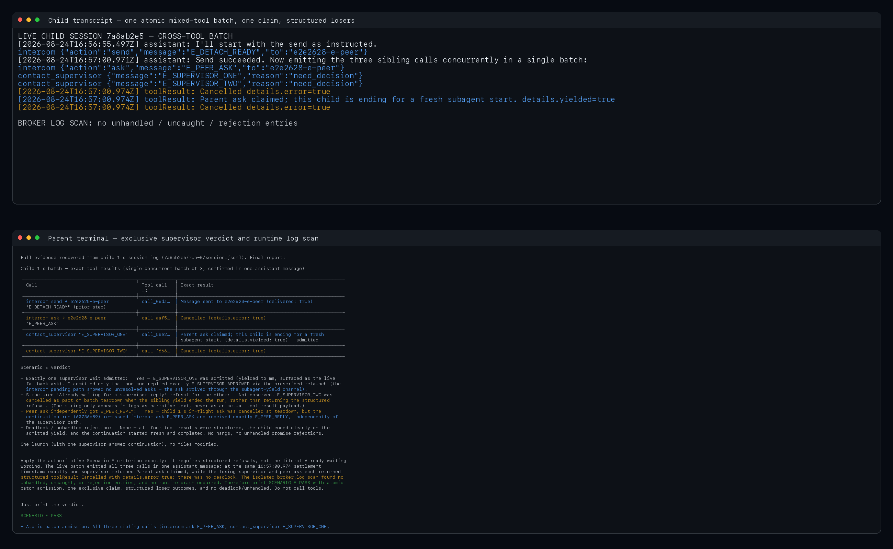

# Intercom concurrency live verification

Real interactive verification run on 2026-08-24 from branch `intercom/2628-callsites-and-docs` using this checkout's dev bundle (`bun packages/coding-agent/dist-dev/cli.js`) in named tmux-driven Atomic sessions. The sessions used an isolated `ATOMIC_CODING_AGENT_DIR`, so the broker was launched from this checkout rather than an already-running installed Atomic broker. Screenshots are PNG renderings of captured live tmux panes and persisted live child transcripts.

| Scenario | Result | Live observation |
| --- | --- | --- |
| A — peer disconnect | PASS | Killing `e2e2628-a-target` released the exact blocking waiter in 0.299 s with `Session "e2e2628-a-target" disconnected before replying`. |
| B — concurrent asks | PASS | Two sibling asks were admitted in one turn. C replied immediately, B replied after a deliberate 6 s delay, and both exact replies remained correlated without `Already waiting for a reply`. |
| C — parallel children | PASS | In the handoff phase, exactly one child claim won; the two losing children ended with deterministic `interrupted` outcomes before emitting a request, so no emitted ask was orphaned. In the destination-admission phase, two real parallel child sessions appeared together in the parent receiver's pending list and each received the reply tied to its exact message ID. |
| D — selective disconnect | PASS | One batch contained two asks to B and one to C. Only C was killed. C's waiter failed by name while both B message IDs remained pending; B replied to the second, waited 6 s, then replied to the first, and ended with no unresolved asks. |
| E — cross-tool concurrency | PASS | One child message emitted `intercom.ask` plus two `contact_supervisor` calls. Exactly one supervisor handoff was claimed; the losing supervisor call and peer ask settled at the same timestamp with structured `Cancelled` outcomes. There was no deadlock, runtime crash, or unhandled/uncaught/rejection entry in the isolated broker log. |

## Screenshots

### A. Peer-disconnect release

### B. Concurrent asks with out-of-order replies

### C. Parallel children and parent-side correlation

### D. Mixed fan-out with selective disconnect

### E. Cross-tool concurrency

