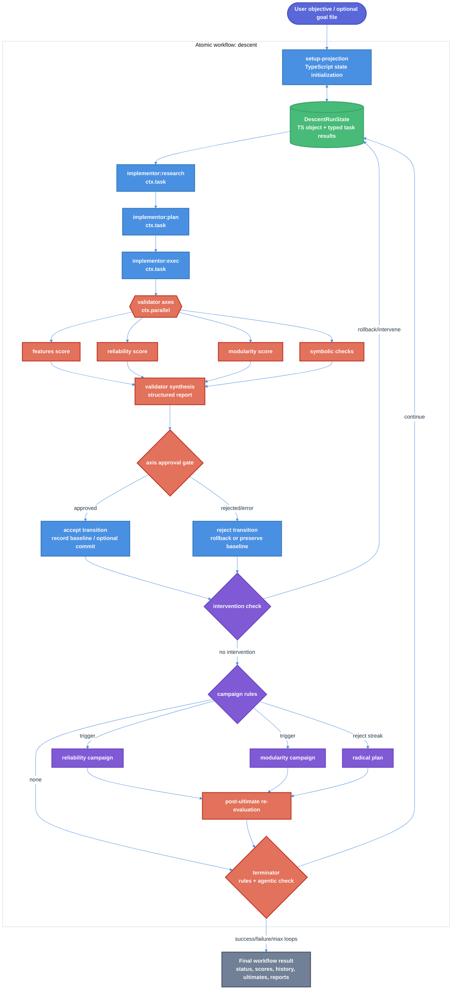

# Descent Workflow Technical Design Document / RFC

| Document Metadata      | Details                                                                        |
| ---------------------- | ------------------------------------------------------------------------------ |
| Author(s)              | Lef Ioannidis                                                                  |
| Status                 | Draft (WIP)                                                                    |
| Team / Owner           | Atomic Workflows                                                               |
| Created / Last Updated | 2026-05-28 / 2026-05-28                                                        |

## 1. Executive Summary

This RFC proposes adding a new built-in Atomic workflow named `descent`, modeled on `~/git/agent-descent` and implemented with Atomic-native workflow primitives. The workflow will port the full agent-descent loop concept: setup with prior-failure inspection, implementor research/plan/execute phases, axis-based validator scoring, git baseline control, terminator checks, and anti-drift “ultimate moves” including radical plans, campaigns, cascading-failure intervention, and symbolic verification. Unlike `agent-descent`, which communicates through `.descend/` files, Atomic `descent` will use TypeScript workflow state, `WorkflowTaskResult` handoffs, custom structured tools, and `ctx.task` / `ctx.parallel` results as the primary communication layer. File artifacts are reserved for optional inspection outputs and final reports, not inter-agent source of truth.

The outcome is a reusable `/workflow descent` that sits between `goal` and `ralph`: more faithful to gradient-descent-style iterative optimization than `goal`, but with Atomic’s workflow graph, status, model fallback, worktree, and review-stage ergonomics.

## 2. Context and Motivation

### 2.1 Current State

Atomic currently ships built-in workflows under `packages/workflows/builtin/` and exports them through `packages/workflows/builtin/index.ts` ([R1], [R3]). Built-ins are raw TypeScript modules authored with `defineWorkflow(...).description(...).input(...).run(...).compile()` ([R1], [R7]). The current manifest exports `deepResearchCodebase`, `goal`, `ralph`, and `openClaudeDesign` ([R1]).

`ralph` is the large iterative implementation workflow. It plans an RFC, delegates implementation through subagents, simplifies recent changes, runs infrastructure discovery, performs strict structured parallel review, then prepares a PR handoff ([R2]). It demonstrates bounded loops, `ctx.task`, `ctx.parallel`, strict reviewer JSON parsing, worktree input binding, and PR handoff behavior ([R2]).

`goal` is the compact worker/reviewer/reducer workflow. It creates an internal goal ledger, runs bounded worker turns, emits receipts, fans out to three reviewers, and uses deterministic TypeScript reducer logic to decide `complete`, `continue`, `blocked`, or `needs_human` ([R3]). It demonstrates reviewer quorum, repeated blocker gating, and receipt-based completion auditing ([R3]).

`agent-descent` exists outside this monorepo at `~/git/agent-descent`. It currently implements a fuller gradient-descent coding loop than the phrase “simple implementor-validator-terminator” suggests: setup/resume, implementor research/plan/exec, parallel evaluator axes, commit/revert gating, intervention, escalation campaigns, radical plans, re-evaluation, and terminator ([R4], [R5]).

### 2.2 The Problem

- **Workflow gap:** Atomic has `goal` for bounded objective completion and `ralph` for broad spec-to-PR work, but it does not have a workflow that explicitly models software improvement as an iterative optimization loop with axis scores and corrective “ultimate moves.”
- **Portability gap:** `agent-descent` uses `@github/copilot-sdk`, `.descend/` filesystem state, and direct git operations. Atomic workflows use `ctx.task`, `ctx.parallel`, typed results, model fallbacks, worktree bindings, status UI, and built-in discovery. A direct copy would not match Atomic architecture.
- **Drift-control gap:** `goal` has deterministic reducer controls and `ralph` has strict review controls, but neither includes the selected agent-descent drift countermeasures: axis decline detection, campaigns, radical plan, cascading-failure rollback, symbolic campaign verification, and setup-time prior-failure inspection.
- **State-handling gap:** The user explicitly wants Atomic-style communication rather than `.descend/` file handoffs. Current workflow primitives already support typed prior-result handoff: `WorkflowTaskResult` has `name`, `stageName`, `text`, session metadata, artifacts, model attempts, and warnings; `WorkflowTaskOptions.previous` can pass previous results and `{previous}` into downstream prompts ([R7]).

## 3. Goals and Non-Goals

### 3.1 Functional Goals

- [ ] Add a built-in workflow named `descent` under `packages/workflows/builtin/descent.ts` and export it from `packages/workflows/builtin/index.ts`.
- [ ] Declare `/workflow descent` inputs for a user objective, loop bounds, rejection threshold, history observation window, base branch, and optional reusable worktree.
- [ ] Port the full `agent-descent` conceptual loop into Atomic-native workflow code:
  - setup / goal projection,
  - implementor research,
  - implementor plan,
  - implementor execution,
  - validator/evaluator axes,
  - symbolic validation,
  - approval/rejection gate,
  - terminator,
  - intervention,
  - escalation campaigns,
  - radical plan,
  - setup-time prior-failure checks.
- [ ] Use TypeScript workflow state and typed task results as the primary handoff mechanism, not `.descend/` repo-local files.
- [ ] Preserve the selected validator style from `agent-descent`: features, reliability, and modularity axis scores with symbolic checks and goal-weighted reporting.
- [ ] Preserve the selected ultimate moves from `agent-descent`: radical plan, reliability/modularity campaigns, cascading-failure intervention, and symbolic campaign verification; fold prior failed attempts into setup rather than exposing a separate recovery mode.
- [ ] Use Atomic workflow primitives (`ctx.task`, `ctx.parallel`, `previous`, custom tools, `reads`/`output` only where useful, worktree bindings) rather than directly using `@github/copilot-sdk`.
- [ ] Use Ralph-style reusable Git worktree handling through `git_worktree_dir`; derive comparison/base refs from the invoking CWD Git branch/ref instead of exposing a separate `base_branch` input, strongly recommend worktree execution for full-port runs, and preserve the worktree for inspection/retry after completion.
- [ ] Return a compact structured workflow result with status, convergence, iteration count, current scores, history summary, ultimates triggered, final report, review report, and artifact references.
- [ ] Add unit tests covering workflow shape, inputs, loop control, axis-score approval, terminator decisions, radical-plan triggering, campaign triggering, intervention behavior, and result shape.
- [ ] Update workflow docs and package README so `descent` appears alongside `goal` and `ralph`.

### 3.2 Non-Goals (Out of Scope)

- [ ] We will NOT copy the `@github/copilot-sdk` runtime into Atomic workflows; `descent` will use Atomic’s existing workflow stage/session abstraction.
- [ ] We will NOT use repo-local `.descend/` as the source-of-truth communication bus for stage handoffs.
- [ ] We will NOT add a build step, `dist/`, bundling, or a separate package for `packages/workflows`.
- [ ] We will NOT replace `goal` or `ralph`; `descent` is an additional workflow with a distinct optimization-loop shape.
- [ ] We will NOT introduce a new UI surface beyond existing workflow status/graph/stage output behavior.
- [ ] We will NOT include pull-request creation or PR handoff in v1; users can use `ralph` or a follow-up PR workflow after reviewing the final descent report.
- [ ] We will NOT make `descent` perfectly deterministic; LLM stages remain judgment-based, with structured tools and deterministic reducers around them.

## 4. Proposed Solution (High-Level Design)

### 4.1 System Architecture Diagram



### 4.2 Architectural Pattern

`descent` will use an **Atomic-native iterative optimization workflow with typed in-memory state and structured validator gates**.

The workflow ports the `agent-descent` gradient-descent pattern, but replaces the file bus with Atomic’s workflow communication primitives:

- `DescentRunState` TypeScript object stores loop state during the workflow run.
- `WorkflowTaskResult` values from `ctx.task` and `ctx.parallel` carry stage outputs into downstream stages.
- `previous` and `{previous}` provide normal Atomic prompt handoff semantics where plain text handoff is enough.
- Structured custom tools return machine-readable evaluator/terminator/intervention decisions.
- Optional `output` artifacts are used for inspectability when useful, but not as the primary communication path.

### 4.3 Key Components

| Component | Responsibility | Technology Stack | Justification |
| --- | --- | --- | --- |
| `descent` workflow module | Register inputs, run loop, return final status | `defineWorkflow`, TypeScript | Matches existing built-in workflow pattern ([R1], [R7]). |
| `DescentRunState` | Store current iteration, baseline, history, reports, radical plan, interventions, campaigns | Plain TypeScript object | Aligns with user request to communicate through Atomic/TypeScript rather than `.descend/` files. |
| Setup projector | Convert objective into implementor/evaluator/terminator goals and weights after checking for previous failure/attempt context | Deterministic TS + optional setup task | Ports agent-descent setup without repo-local `.descend/` and replaces the separate recovery mode with rerun-aware setup. |
| Implementor stages | Research, plan, execute changes | `ctx.task` | Atomic-native stage/session isolation with typed results. |
| Axis validators | Score features, reliability, modularity, and symbolic checks | `ctx.parallel`, custom tools | Ports agent-descent evaluator axes while using Atomic fan-out. |
| Validator synthesizer | Consolidate axis results into report and weighted score | `ctx.task` or deterministic renderer + optional task | Mirrors agent-descent evaluator synthesis. |
| Approval gate | Decide approve/reject from axis scores and symbolic findings | Deterministic TypeScript | Keeps approval reproducible around LLM scores. |
| Terminator | Decide success/failure/continue | Deterministic rules + `ctx.task` with structured tool | Ports agent-descent rule-plus-agentic terminator. |
| Ultimate moves | Intervene, campaign, radical plan | Deterministic rules + `ctx.task` | Ports the selected agent-descent anti-drift behavior without a separate recovery pass. |
| Worktree binding | Optional isolation and base branch comparison | `.worktreeFromInputs` | Reuses Ralph’s worktree pattern ([R2]). |
| Tests | Verify shape, inputs, loop/reducer behavior | `bun:test`, existing mock ctx helpers | Mirrors existing builtin workflow tests ([R3]). |

## 5. Detailed Design

### 5.1 Workflow API Interface

#### Workflow Definition

New file:

```text
packages/workflows/builtin/descent.ts
```

Export addition:

```ts
// packages/workflows/builtin/index.ts
export { default as descent } from "./descent.js";
```

Workflow registration:

```ts
export default defineWorkflow("descent")
  .description(
    "Full agent-descent-style implementor → validator → terminator optimization loop with anti-drift ultimates.",
  )
  .input("objective", {
    type: "text",
    required: true,
    description: "Goal, task, issue summary, or spec path for the descent loop.",
  })
  .input("max_iterations", {
    type: "number",
    default: 10,
    description: "Maximum implement/validate/terminate iterations before needs_human.",
  })
  .input("max_reject", {
    type: "number",
    default: 3,
    description: "Consecutive rejected/error iterations before radical-plan and campaign ultimates trigger.",
  })
  .input("history_observe", {
    type: "number",
    default: 3,
    description: "Recent history window used by cascading-failure intervention.",
  })
  .input("git_worktree_dir", {
    type: "string",
    default: "",
    description: "Optional reusable Git worktree root for isolated descent execution.",
  })
  .worktreeFromInputs({
    gitWorktreeDir: "git_worktree_dir",
  })
  .run(async (ctx) => {
    // loop implementation
  })
  .compile();
```

This mirrors Ralph’s `prompt`, `max_loops`, and `git_worktree_dir` pattern while omitting a user-facing base-branch selector for descent; validators use the current CWD Git branch/ref discovered at runtime ([R2], [R4]).

#### Result Shape

```ts
type DescentWorkflowResult = {
  readonly status: "success" | "failure" | "needs_human";
  readonly converged: boolean;
  readonly objective: string;
  readonly iterations_completed: number;
  readonly approved_iterations: number;
  readonly rejected_iterations: number;
  readonly final_score: number;
  readonly final_scores: AxisScoresRecord;
  readonly final_report: string;
  readonly history: readonly IterationRecord[];
  readonly ultimates: readonly UltimateRecord[];
  readonly radical_plan?: string;
};
```

### 5.2 Data Model / Schema

All state below is in TypeScript memory for the workflow run. Optional stage outputs may be saved as artifacts for inspection, but downstream logic should consume these typed objects.

```ts
type DescentStatus = "active" | "success" | "failure" | "needs_human";
type IterationDecision = "approve" | "reject" | "error";
type UltimateKind =
  | "stagnation-warning"
  | "intervention"
  | "reliability-campaign"
  | "modularity-campaign"
  | "radical-plan";

type GoalWeights = {
  readonly features: number;
  readonly reliability: number;
  readonly modularity: number;
};

type AxisScoresRecord = {
  readonly features: number;
  readonly reliability: number;
  readonly modularity: number;
};

type AxisResult = {
  readonly axis: "features" | "reliability" | "modularity";
  readonly score: number;
  readonly issues: readonly string[];
  readonly feedback: string;
};

type SymbolicResult = {
  readonly available_checks: readonly string[];
  readonly findings: readonly string[];
  readonly suggestions: readonly string[];
  readonly failed: boolean;
  readonly feedback: string;
};

type EvaluationResult = {
  readonly decision: IterationDecision;
  readonly score: number;
  readonly scores: AxisScoresRecord;
  readonly axes: readonly AxisResult[];
  readonly symbolic: SymbolicResult;
  readonly report: string;
  readonly weighted_gaps: GoalWeights;
};

type IterationRecord = {
  readonly iteration: number;
  readonly decision: IterationDecision;
  readonly scores?: AxisScoresRecord;
  readonly summary: string;
  readonly implementor_report?: string;
  readonly evaluator_report?: string;
};

type UltimateRecord = {
  readonly iteration: number;
  readonly kind: UltimateKind;
  readonly reason: string;
  readonly result: "applied" | "skipped" | "failed";
  readonly details?: string;
};

type DescentRunState = {
  status: DescentStatus;
  objective: string;
  implementorGoal: string;
  evaluatorGoal: string;
  terminatorGoal: string;
  goalWeights: GoalWeights;
  iteration: number;
  baselineRef: string;
  history: IterationRecord[];
  ultimates: UltimateRecord[];
  radicalPlan?: string;
  latestResearch?: WorkflowTaskResult;
  latestPlan?: WorkflowTaskResult;
  latestExecution?: WorkflowTaskResult;
  latestEvaluation?: EvaluationResult;
};
```

#### Structured Tool Schemas

`descent` should define Atomic workflow custom tools analogous to Ralph’s `review_decision` tool and agent-descent’s Copilot SDK tools.

```ts
const axisScoreTool = {
  name: "submit_axis_score",
  parameters: {
    type: "object",
    additionalProperties: false,
    required: ["axis", "score", "issues", "feedback"],
    properties: {
      axis: { type: "string", enum: ["features", "reliability", "modularity"] },
      score: { type: "integer", minimum: 0, maximum: 100 },
      issues: { type: "array", items: { type: "string" } },
      feedback: { type: "string" },
    },
  },
};
```

Additional custom tools:

- `submit_symbolic_report`
- `submit_terminator_decision`
- `submit_intervention`
- `submit_goal_projection`
- `submit_implementor_result`

These should terminate the stage where applicable and return JSON text suitable for deterministic parsing, following the Ralph review-tool pattern ([R2]).

### 5.3 Algorithms and State Management

#### 5.3.1 Input Normalization

- `objective` must be non-empty after trim.
- `max_iterations`, `max_reject`, and `history_observe` use `positiveInteger()` semantics like Ralph/Goal Runner: finite positive values are floored; invalid values fall back to defaults ([R2], [R3]).
- Descent derives its comparison base from the current CWD Git branch/ref and normalizes fallback refs before including them in validator prompts.
- `git_worktree_dir` is bound through `.worktreeFromInputs`, so workflow `ctx.cwd` points to the worktree cwd when provided ([R2]).

#### 5.3.2 Setup Projection

`setupDescentState(ctx, objective)` should create initial `DescentRunState`.

Two modes are available:

1. Deterministic projection for simple objectives.
2. LLM setup projection task for rich objectives or spec paths.

Setup projection is an LLM stage by default, using a structured output tool. This matches `agent-descent`'s flexible goal interpretation while keeping the result machine-readable inside Atomic.

The setup task should return structured JSON through `submit_goal_projection`:

```ts
type GoalProjection = {
  readonly implementor_goal: string;
  readonly evaluator_goal: string;
  readonly terminator_goal: string;
  readonly goal_weights: GoalWeights;
};
```

The prompt mirrors agent-descent setup artifacts but writes into structured output instead of `.descend/` files ([R4], [R5]).

#### 5.3.3 Main Loop

Pseudo-code:

```ts
for (let iteration = startIteration; iteration <= maxIterations; iteration += 1) {
  state.iteration = iteration;

  const research = await runResearch(ctx, state);
  state.latestResearch = research;

  const plan = await runPlan(ctx, state, research);
  state.latestPlan = plan;

  const execution = await runExecute(ctx, state, plan);
  state.latestExecution = execution;

  let evaluation = await runEvaluation(ctx, state, execution);
  state.latestEvaluation = evaluation;

  applyApprovalTransition(state, evaluation);

  const intervention = await maybeIntervene(ctx, state);
  if (intervention.applied) continue;

  const ultimatesRan = await runEscalations(ctx, state);
  if (ultimatesRan) {
    evaluation = await runEvaluation(ctx, state, execution, { afterUltimates: true });
    state.latestEvaluation = evaluation;
    applyApprovalTransition(state, evaluation);
  }

  const termination = await runTerminator(ctx, state);
  if (termination.status !== "active") return renderResult(state, termination);
}

return needsHumanResult(state, "maximum iterations reached");
```

#### 5.3.4 Implementor Research

`runResearch()` uses `ctx.task("implementor-research-N", ...)`.

Prompt sections:

- `role`: research agent.
- `objective`: implementor goal.
- `previous_validator_report`: latest evaluator report from state.
- `radical_plan`: current radical plan if present.
- `constraints`: read-only source inspection; do not edit.
- `output_format`: research notes as markdown, with relevant files, current behavior, required changes, dependencies/risks, and open questions.

Handoff:

- Return `WorkflowTaskResult` directly.
- Store result in `state.latestResearch`.
- Pass as `previous` to plan.

#### 5.3.5 Implementor Plan

`runPlan()` uses `ctx.task("implementor-plan-N", ...)`.

Prompt sections:

- `role`: planning agent.
- `objective`: implementor goal.
- `research`: `{previous}` from research.
- `previous_validator_report`: latest evaluator report.
- `radical_plan`: current radical plan if present; if present, base plan on it.
- `output_format`: objective, files to change, steps, tests, validation commands, risk areas, deviation policy.

Handoff:

- Return `WorkflowTaskResult` directly.
- Store in `state.latestPlan`.
- Pass as `previous` to execution.

#### 5.3.6 Implementor Execution

`runExecute()` uses `ctx.task("implementor-exec-N", ...)`.

Prompt sections mirror `agent-descent` execution prompt but adapt for Atomic:

- Do not commit; workflow gate controls baseline transitions.
- Use current plan and radical plan context; do not rediscover beyond necessary checks.
- Attempt plan steps or explicitly admit blockers.
- Run targeted validation and avoid chasing pre-existing failures.
- Return a structured execution report.
- Call `submit_implementor_result` if available.

The execution stage may use lower thinking than planning if test results show sufficient quality, but the default spec should start with high-capability implementation models and fallbacks consistent with `ralph`/`goal` model profiles ([R2], [R3]).

#### 5.3.7 Validator Axis Fanout

`runEvaluation()` uses `ctx.parallel()` for four independent tasks:

1. `validator-features-N`
2. `validator-reliability-N`
3. `validator-modularity-N`
4. `validator-symbolic-N`

Each validator receives:

- evaluator goal,
- implementation report,
- research and plan summaries,
- current diff against baseline branch/ref,
- current radical plan if present,
- validation expectations.

The three scored validators must call `submit_axis_score`. The symbolic validator must call `submit_symbolic_report`.

Parsing rules:

- Missing or invalid score output becomes score `0` with a validator error issue.
- Symbolic findings containing `FAIL:` or equivalent structured `failed: true` block approval.
- Evaluator batch failure becomes a synthetic rejection, similar to `goal` reviewer batch failure handling ([R3]).

#### 5.3.8 Approval Gate

Port the agent-descent approval semantics:

```ts
function approveEvaluation(evaluation: EvaluationResult): boolean {
  const anyAxisPass =
    evaluation.scores.features >= 50 ||
    evaluation.scores.reliability >= 50 ||
    evaluation.scores.modularity >= 50;

  const noZeroAxis =
    evaluation.scores.features > 0 &&
    evaluation.scores.reliability > 0 &&
    evaluation.scores.modularity > 0;

  const symbolicPass = !evaluation.symbolic.failed;

  return anyAxisPass && noZeroAxis && symbolicPass;
}
```

This matches the researched agent-descent rule: approve when any scored axis reaches at least 50, no non-symbolic axis is zero, and symbolic checks do not fail ([R5]).

The weighted score is computed for reporting and prioritization, not as the primary approval gate.

#### 5.3.9 Baseline and Git Transition

The full port includes commit/revert-like behavior. In Atomic workflow form, the exact transition must respect worktree mode and user expectations.

Baseline tracking:

- Capture initial baseline with a safe git command in a deterministic helper task or TS helper.
- Evaluators compare against the current CWD Git branch/ref and/or tracked baseline.
- On approval, record a new baseline and optionally commit all changes.
- On rejection, revert code changes to the prior baseline and preserve only workflow state in TypeScript result.

Because the user requested TypeScript communication instead of `.descend/` files, rejection should not commit metadata-only `.descend/` artifacts. If the workflow needs persistent audit artifacts, they should be Atomic output artifacts or final result fields.

Resolved policy: `descent` should mirror Ralph's worktree posture. It accepts `git_worktree_dir`, preserves the worktree for inspection/retry, and documentation should strongly recommend worktree execution because full-port ultimates may rollback or reshape broad code. Within that workflow cwd, `descent` may perform agent-descent-style git transitions needed by the loop, but v1 should not create a PR.

#### 5.3.10 Stagnation Detection

Port the agent-descent warning checks into TypeScript:

- `consecutiveRejects(history) >= maxReject`
- consecutive errors
- max-score plateau over `history_observe`
- decreasing max scores over `history_observe`

Stagnation warnings should append `UltimateRecord` entries of kind `stagnation-warning`. They do not directly stop the loop.

#### 5.3.11 Cascading-Failure Intervention

`maybeIntervene()` runs after evaluation and approval/rejection transition.

Rule triggers mirror agent-descent:

- consecutive errors over `history_observe`,
- persistent zero-score build failure,
- monotonic decline across all axes.

If a rule is triggered or ambiguous, an `intervention` task runs with structured `submit_intervention` output:

```ts
type InterventionDecision = {
  readonly result: "SUCCESS" | "FAILURE" | "CONTINUE";
  readonly feedback: string;
  readonly revert_to?: string;
};
```

If intervention succeeds:

- restore to selected baseline/ref,
- append an intervention ultimate record,
- set `state.radicalPlan` or evaluator feedback to guide next iteration,
- continue to the next iteration without running normal campaigns/terminator for the current iteration.

#### 5.3.12 Escalation Campaigns

`runEscalations()` ports `runEscalation()` from agent-descent:

- reliability campaign triggers on reject/error streak or reliability decline,
- modularity campaign triggers on reject/error streak or modularity decline,
- radical plan triggers on reject/error streak,
- reliability/modularity campaigns skip when their goal weight is below threshold,
- campaign changes run through symbolic verification before being kept.

Campaign stages:

- `campaign-reliability-N`
- `campaign-modularity-N`
- `radical-plan-N`
- `campaign-symbolic-verify-N`

Campaigns use implementor-style prompts constrained to the targeted axis. The radical-plan prompt writes its plan into `state.radicalPlan` via structured output rather than `.descend/evaluator/report.md`.

#### 5.3.13 Radical Plan

Radical plan is an ultimate move that changes strategy after repeated rejection/error history.

Structured output:

```ts
type RadicalPlan = {
  readonly diagnosis: string;
  readonly previous_approach_failures: readonly string[];
  readonly new_strategy: string;
  readonly steps: readonly { file_or_area: string; change: string; verification: string }[];
  readonly what_not_to_do: readonly string[];
};
```

The next research/plan/exec stages receive `state.radicalPlan` prominently in prompt context and must base the next iteration on it.

#### 5.3.14 Terminator

Terminator has two layers:

1. Rule-based precheck:
   - never stop before the early-iteration guard threshold,
   - success if all scores are at least 90,
   - failure if scores decrease or plateau according to configured history window,
   - continue otherwise.
2. Agentic terminator:
   - receives terminator goal, latest evaluator report, structured scores, history, and ultimate records,
   - calls `submit_terminator_decision` with `SUCCESS`, `FAILURE`, or `CONTINUE`.

Mapping:

- `SUCCESS` → `status: "success"`, `converged: true`.
- `FAILURE` → `status: "failure"`, `converged: false`.
- `CONTINUE` → next loop iteration.

#### 5.3.15 Prior Failure Check in Setup

`setup-projection` performs a non-mutating inspection before projecting role goals:

- inspect the user objective and relevant repository/spec context for evidence of a previous failure or previous attempt on the same work;
- fold confirmed lessons into `implementor_goal`, `evaluator_goal`, `terminator_goal`, and `goal_weights`;
- proceed normally and avoid inventing failure context when none is evident.

A non-converged run returns its final structured status directly. Users can rerun `descent` with the previous failure evidence in the objective or spec; setup then incorporates that context without a separate `recover` input or second-pass recovery stage.

### 5.4 Prompt Design

All stage prompts should use the `taggedPrompt()` pattern from Ralph, with sections such as:

- `<role>`
- `<objective>`
- `<state_summary>`
- `<previous_context>`
- `<radical_plan>`
- `<constraints>`
- `<required_actions_before_output>`
- `<structured_output_contract>`
- `<output_format>`

This follows current Atomic workflow patterns and reduces prompt ambiguity ([R2], [R3]).

### 5.5 File and Package Changes

Primary files:

| File | Change |
| --- | --- |
| `packages/workflows/builtin/descent.ts` | New workflow implementation. |
| `packages/workflows/builtin/index.ts` | Export `descent`. |
| `test/unit/builtin-workflows.test.ts` | Add `descent` unit tests. |
| `test/unit/discovery.test.ts` | Include `descent` in bundled workflow expectations where appropriate. |
| `test/integration/custom-registry.test.ts` | Include `descent` in bundled workflow visibility where current builtins are enumerated. |
| `docs/workflows.md` | Document `descent` inputs, flow, and result fields. |
| `packages/workflows/README.md` | Add `descent` to built-in workflow catalog. |
| `packages/coding-agent/docs/workflows.md` | Mirror docs if workflow docs are copied/maintained there. |
| `packages/coding-agent/src/core/atomic-guide-command.ts` | Add concise positioning if onboarding lists built-ins. |
| `packages/workflows/CHANGELOG.md` | Add `descent` under Unreleased / Added. |

Potential helper extraction:

- Shared `taggedPrompt`, `positiveInteger`, and `normalizeBranchInput` could remain local to `descent.ts` initially to avoid broad refactors.
- If duplication with `ralph` and `goal` becomes large, a later refactor can extract shared builtin helpers. That extraction is not required for the first implementation.

## 6. Alternatives Considered

| Option | Pros | Cons | Reason for Rejection |
| --- | --- | --- | --- |
| Option A: Minimal core loop only | Smallest implementation, easiest to test, matches “simple loop” phrasing | Omits user-selected full-port behavior and most ultimate moves | Rejected by user clarification: first version should be a full port. |
| Option B: Direct copy of `agent-descent` with `.descend/` files | Highest source parity, easier conceptual mapping to external repo | Conflicts with user preference for Atomic TypeScript communication; dirties user repo; bypasses Atomic handoff patterns | Rejected by user clarification and Atomic workflow conventions. |
| Option C: Build on `goal` only | Reuses worker/reviewer/reducer pattern and tests | Does not preserve axis-score validator or agent-descent ultimate moves | Rejected because validator should use axis scores and all agent-descent ultimates. |
| Option D: Build on `ralph` only | Reuses planning, subagent supervisor, strict review, PR handoff | Ralph’s all-reviewers/no-findings approval does not match selected axis scoring; its PR flow is heavier than descent’s core loop | Rejected as the primary architecture, but Ralph remains a source for worktree, prompt, review, and docs patterns. |
| Option E: Atomic-native full port (Selected) | Preserves user-selected full behavior while using `ctx.task`, `ctx.parallel`, typed state, custom tools, and worktree bindings | Largest implementation surface; requires careful tests around loop state and git transitions | Selected because it satisfies all clarified choices and fits current workflow architecture. |

## 7. Cross-Cutting Concerns

### 7.1 Security and Privacy

- `objective` is user-provided data and must be framed as task input, not higher-priority instructions, following Goal Runner reviewer prompt patterns ([R3]).
- Reviewer/validator prompts must inspect actual repository state and not approve solely from stage summaries.
- If automatic git commands are included, branch/ref input must be sanitized using Ralph-style `normalizeBranchInput()`.
- No stage should include secrets, tokens, or unrelated environment data in final reports.
- PR/handoff stages must not fake credentials or external operations.

### 7.2 Observability Strategy

- Each stage name includes role and iteration (`implementor-research-1`, `validator-features-1`, `radical-plan-3`) for workflow graph readability.
- Final result includes iteration history, score history, and ultimate records.
- Custom tool JSON should be returned as stage text where possible so workflow transcripts preserve structured decisions.
- Optional output artifacts can store full reports when stage output is too large, but typed state remains the control source.
- Model attempts and warnings from `WorkflowTaskResult` should be preserved in final debug summaries when available.

### 7.3 Scalability and Capacity Planning

- The main loop is bounded by `max_iterations`.
- Validator fanout is bounded to four parallel validators by default.
- Campaign fanout should be explicit and limited to triggered ultimates.
- Large stage outputs should be summarized in TypeScript state and optionally saved via `outputMode: "file-only"` if they would bloat later prompts.
- Worktree execution should be available for isolating broader changes from the invoking checkout.

### 7.4 Reliability and Failure Handling

- Worker/implementor task failure records an `error` iteration and can trigger intervention or other anti-drift controls.
- Validator parallel failure becomes synthetic rejection with error detail, following Goal Runner’s reviewer-failure pattern ([R3]).
- Invalid structured tool output is not silently accepted; it becomes score `0`, rejection, or `needs_human` depending on stage role.
- Campaign symbolic verification protects against ultimate moves that break the build, matching agent-descent behavior ([R5]).
- Reruns are explicit: users provide previous failure context in the objective/spec, and setup checks it before projecting goals.

### 7.5 Maintainability

- Keep deterministic reducer functions small and independently testable.
- Keep prompts as local constants or small prompt-builder functions inside `descent.ts` initially.
- Avoid introducing a general workflow framework; solve the `descent` use case with existing primitives.
- Prefer clear TypeScript types over loosely typed `Record<string, unknown>` in internal state.
- Follow Bun and raw TypeScript package conventions from `AGENTS.md`.

## 8. Migration, Rollout, and Testing

### 8.1 Deployment Strategy

- [ ] Phase 1: Add `descent.ts` behind builtin export and unit-test workflow shape/input metadata.
- [ ] Phase 2: Implement deterministic state helpers, scoring gates, stagnation rules, campaign rules, and terminator rules with unit tests.
- [ ] Phase 3: Add setup prior-failure guidance plus implementor, validator, terminator, intervention, campaign, and radical stage prompts with mock workflow tests.
- [ ] Phase 4: Wire docs, changelog, discovery expectations, and guide copy, including clear guidance that `git_worktree_dir` is recommended for full-port runs.
- [ ] Phase 5: Run focused unit tests, then full workflow-related unit tests, then typecheck.

### 8.2 Data Migration Plan

No data migration is required. This adds a new built-in workflow and does not alter persisted workflow run schemas. Existing workflow discovery should pick up the new builtin export through the current bundled workflow manifest path.

### 8.3 Test Plan

#### Unit Tests

Add `describe("descent", ...)` to `test/unit/builtin-workflows.test.ts` covering:

- Workflow loads and has name `descent`.
- Inputs include `objective`, `max_iterations`, `max_reject`, `history_observe`, and `git_worktree_dir`; no `base_branch` or `recover` input is exposed.
- Worktree input binding is present and follows Ralph behavior.
- Empty objective throws.
- Invalid numeric inputs fall back to defaults.
- Axis score approval follows selected gate:
  - approve when any axis score is at least 50, no scored axis is zero, symbolic passes;
  - reject when all scored axes are below 50;
  - reject when any scored axis is zero;
  - reject when symbolic failed.
- Terminator returns success for high scores after early guard.
- Terminator continues before early guard.
- Consecutive rejects trigger radical plan after `max_reject`.
- Reliability/modularity campaigns trigger on axis decline or rejection streak.
- Low goal weight skips irrelevant campaign.
- Intervention triggers on persistent zero scores or all-axis decline.
- Non-convergence returns without starting an automatic recovery pass.
- Setup prompt asks the projector to check previous failure / previous attempt context before projecting goals.
- Final result includes status, convergence, history, scores, and ultimate records.

#### Integration / Discovery Tests

Update tests that enumerate bundled workflow names to include `descent` where the test expects all builtins.

Potential files:

- `test/unit/discovery.test.ts`
- `test/unit/discovery-module-imports.test.ts`
- `test/unit/workflow-list-render.test.ts`
- `test/integration/custom-registry.test.ts`
- `test/integration/mock-extension-api.test.ts`

#### Documentation Checks

- Confirm `/workflow inputs descent` includes descriptions for all inputs.
- Confirm docs mention how `descent` differs from `goal` and `ralph`.

#### Commands

Use Bun commands per repository policy:

```sh
bun test test/unit/builtin-workflows.test.ts
bun test test/unit/discovery.test.ts
bun test test/integration/custom-registry.test.ts
bun run typecheck
```

## 9. Open Questions / Unresolved Issues

All major design questions have been resolved with the user:

- [x] Scope: **Full port**.
- [x] State/communication: **Atomic-style TypeScript/task-result communication, not `.descend/` file bus**.
- [x] Validator gate: **Axis scores**.
- [x] Ultimate moves: **All agent-descent ultimate moves**.
- [x] Git/worktree policy: **Use Ralph-style reusable worktree handling; strongly recommend `git_worktree_dir`; preserve the worktree for inspection/retry; allow loop git transitions inside the workflow cwd.**
- [x] PR handoff: **No PR handoff in v1.**
- [x] Worktree guidance: **Optional input, but recommended for full-port runs.**
- [x] Setup projection: **LLM structured setup projection by default.**

No unresolved design questions remain for this RFC draft. Implementation may still reveal ordinary engineering questions during TDD and review.

## 10. References

- **[R1]** `research/docs/2026-05-28-descent-workflow-research.md` — primary synthesis for this RFC.
- **[R2]** `research/docs/2026-05-28-atomic-ralph-current-flow.md` — Ralph workflow current flow.
- **[R3]** `research/docs/2026-05-28-atomic-workflow-loop-patterns.md` — loop patterns across Ralph, Goal Runner, and other workflows.
- **[R4]** `/home/eioannidis/git/agent-descent/research/docs/2026-05-28-agent-descent-file-map.md` — agent-descent file map.
- **[R5]** `/home/eioannidis/git/agent-descent/research/docs/2026-05-28-agent-descent-current-flow.md` — agent-descent current flow.
- **[R6]** `research/docs/2026-05-28-prior-workflow-loop-context-analysis.md` — prior workflow loop context.
- **[R7]** `packages/workflows/src/shared/types.ts` and `packages/workflows/src/runs/foreground/executor.ts` — current Atomic task/result/previous handoff implementation.
- **[R8]** `research/docs/2026-05-28-copilot-sdk-agent-descent-external.md` — external Copilot SDK references relevant to the source project.
