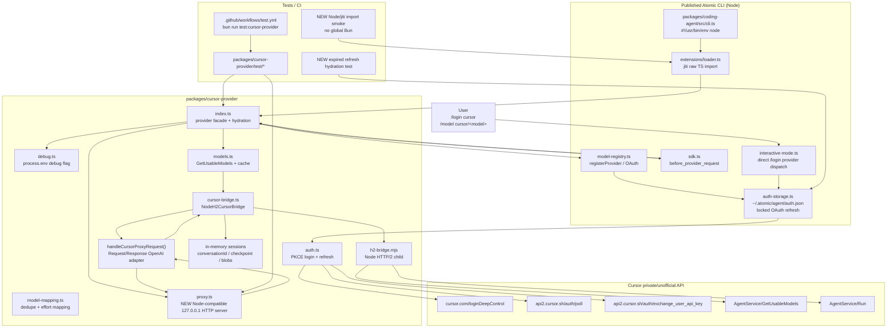

# Atomic Cursor Provider Extension Technical Design Document / RFC

| Document Metadata      | Details                                                 |
| ---------------------- | ------------------------------------------------------- |
| Author(s)              | Norin Lavaee                                            |
| Status                 | In Review (RFC)                                        |
| Team / Owner           | flora131/atomic maintainers / Provider + Runtime owners |
| Created / Last Updated | 2026-05-28 / 2026-05-28                                |

## 1. Executive Summary

Issue [#1031](https://github.com/flora131/atomic/issues/1031) requests an experimental Cursor provider extension so Atomic users can authenticate with Cursor and select available Cursor/Composer models through normal provider flows:

```text
/login cursor
/model cursor/<available-model>
```

The current working tree already contains the experimental bundled provider under `packages/cursor-provider`, including Cursor PKCE login, token refresh, dynamic model discovery, a localhost OpenAI-compatible proxy, a Node HTTP/2 protobuf bridge, documentation, package wiring, CI wiring, and provider-specific tests.

Iteration 10 must address the latest review findings before the feature is considered shippable:

| Review finding | Iteration 10 design response |
| -------------- | ---------------------------- |
| `[P1] Avoid Bun-only APIs in the Node-loaded provider` | Replace provider runtime usage of `Bun.env` in `packages/cursor-provider/debug.ts:31` and `packages/cursor-provider/proxy.ts:203`, plus `Bun.serve()` in `packages/cursor-provider/proxy.ts:204-207`, with Node-compatible APIs. Atomic’s published package has a Node CLI entrypoint (`packages/coding-agent/src/cli.ts:1`, `packages/coding-agent/package.json:14-20`) and loads raw TypeScript extensions through jiti (`packages/coding-agent/src/core/extensions/loader.ts:387-399`), so the built-in Cursor extension must import and register under Node without `ReferenceError: Bun is not defined`. |
| `[P2] Re-discover models after auth-storage refresh` | Update expired-credential startup hydration in `packages/cursor-provider/index.ts:190-194`. After `authStorage.getApiKey("cursor", { includeFallback: false })` forces a refresh or observes another process’s refresh, re-read Cursor OAuth credentials and run the same model discovery / provider re-registration path used by login and refresh hooks. This closes the edge case where `oauth.getApiKey()` sets `currentAccessToken` but no selectable `cursor/*` models are registered. |

Current investigation evidence:

```sh
git config user.name
# Norin Lavaee

date '+%Y-%m-%d'
# 2026-05-28

AGENT=1 bun run test:cursor-provider
# 57 pass, 0 fail
```

The current passing Cursor provider tests cover many provider behaviors, including tree-navigation session reset and HTTP/2 status propagation, but they do not yet prove that the provider imports under a Node-loaded extension path without Bun globals or that cross-process auth-storage refresh re-registers models.

## 2. Context and Motivation

### 2.1 Current State

Repository evidence for the Cursor provider implementation:

- `packages/cursor-provider/index.ts` registers provider id `cursor`, starts the localhost proxy, rehydrates saved OAuth credentials on `session_start`, discovers live models, scopes fallback models by token fingerprint, injects `pi_session_id` via `before_provider_request`, clears Cursor bridge state on `session_tree`, and closes the proxy/bridge on `session_shutdown`.
- `packages/cursor-provider/auth.ts` implements Cursor PKCE login against `https://cursor.com/loginDeepControl`, auth polling against `https://api2.cursor.sh/auth/poll`, token refresh against `https://api2.cursor.sh/auth/exchange_user_api_key`, and credential normalization.
- `packages/cursor-provider/models.ts` calls Cursor `AgentService/GetUsableModels`, normalizes response shapes, deduplicates model variants, and caches results per access-token hash.
- `packages/cursor-provider/model-mapping.ts` maps Atomic thinking levels to Cursor effort labels and resolves provider-facing deduped ids to raw Cursor variant ids.
- `packages/cursor-provider/proxy.ts` exposes localhost-only `/v1/chat/completions` and `/v1/models`, requires a per-process bearer secret, rejects Cursor-native tools, rewrites model ids through `resolveCursorRequestModelId()`, and emits OpenAI-compatible SSE chunks. Its current server startup uses `Bun.env` and `Bun.serve()`.
- `packages/cursor-provider/debug.ts` implements opt-in redacted debug logging, but currently reads `Bun.env.ATOMIC_CURSOR_PROVIDER_DEBUG`.
- `packages/cursor-provider/cursor-bridge.ts` translates Cursor protobuf streams, manages in-memory sessions/checkpoints, handles MCP tool-call conversion, separates thinking from answer text, assigns stable tool-call indexes, implements a bounded tool-call collection window, and spawns `packages/cursor-provider/h2-bridge.mjs`.
- `packages/cursor-provider/h2-bridge.mjs` is a Node HTTP/2 child-process pipe because Bun’s `node:http2` behavior is documented in that file as unsuitable for this stream.
- `packages/coding-agent/src/core/model-registry.ts:821-893` supports dynamic provider registration and OAuth registration through `pi.registerProvider()`.
- `packages/coding-agent/src/core/auth-storage.ts:440-542` refreshes OAuth tokens with file locking and can return an API key from either this process’s refresh hook or credentials refreshed by another process.
- `packages/coding-agent/src/core/sdk.ts:417-422` invokes `before_provider_request` with provider/model metadata.
- `packages/coding-agent/src/modes/interactive/interactive-mode.ts:3042-3049` supports direct `/login <provider>` dispatch.
- `packages/coding-agent/src/core/builtin-packages.ts:22-61` includes `@bastani/cursor-provider` as a built-in workspace package.
- `packages/coding-agent/scripts/copy-builtin-packages.ts:17-24` copies `packages/cursor-provider` into `dist/builtin/cursor-provider`.
- `.github/workflows/test.yml:46` runs `bun run test:cursor-provider`; `.github/workflows/test.yml:71-74` verifies Cursor provider artifacts exist in the release archive.
- `packages/coding-agent/docs/providers.md:39-55` and `packages/cursor-provider/README.md` document `/login cursor`, `/model cursor/<available-model>`, private API warnings, localhost proxy behavior, and Atomic tool-authority constraints.

Relevant runtime evidence:

- Atomic’s npm package is Node-facing: `packages/coding-agent/package.json:14-20` maps the `atomic` bin to `dist/cli.js`, and `packages/coding-agent/src/cli.ts:1` has `#!/usr/bin/env node`.
- Extensions are loaded by jiti: `packages/coding-agent/src/core/extensions/loader.ts:387-399`.
- The root monorepo development workflow is Bun-based (`package.json:5-26`, `AGENTS.md`), but that does not make built-in extensions safe to import with Bun globals in npm/Node installs.
- Cursor provider package metadata currently declares only a Bun engine in `packages/cursor-provider/package.json:6-8`, which is misleading for a built-in extension loaded by the Node CLI.

### 2.2 The Problem

Two correctness and compatibility problems remain.

1. **The provider imports Bun globals in code loaded by Node.**

   `packages/cursor-provider/debug.ts:31` reads:

   ```ts
   const enabled = options.enabled ?? Bun.env.ATOMIC_CURSOR_PROVIDER_DEBUG === "1";
   ```

   `packages/cursor-provider/proxy.ts:202-204` reads:

   ```ts
   const requestedPort = Number(Bun.env.ATOMIC_CURSOR_PROVIDER_PORT ?? 0);
   const server = Bun.serve({
   ```

   This works in Bun tests but fails under the documented npm/Node entrypoint before users can run `/login cursor`. Because Atomic’s published CLI runs under Node and loads built-in extensions through jiti, the Cursor extension must be Node-loadable. The Node HTTP/2 child bridge is already required for Cursor transport, so the provider should use Node-compatible APIs in the extension process as well.

2. **Expired stored credentials can refresh without model re-registration in one process.**

   `packages/cursor-provider/index.ts:190-194` currently does this during startup hydration:

   ```ts
   if (Date.now() >= credentials.expires) {
     await authStorage?.getApiKey("cursor", { includeFallback: false });
   } else {
     await applyCredentials(credentials);
   }
   ```

   `AuthStorage.getApiKey()` in `packages/coding-agent/src/core/auth-storage.ts:495-542` can legitimately return an API key after another Atomic process has already refreshed the token under the file lock. In that case this process’s `oauth.getApiKey()` can set `currentAccessToken`, but `applyCredentials()` is not called, so no dynamic Cursor model discovery or `pi.registerProvider("cursor", ...)` with selectable models runs. The process remains auth-only until another login/session event happens to trigger discovery.

## 3. Goals and Non-Goals

### 3.1 Functional Goals

- Keep Cursor support isolated in `packages/cursor-provider` as an experimental bundled extension.
- Preserve `/login cursor` and `/model cursor/<available-model>` flows.
- Preserve dynamic Cursor model discovery through `AgentService/GetUsableModels`.
- Preserve localhost OpenAI-compatible proxy behavior and per-process proxy bearer secret enforcement.
- Make Cursor provider runtime code importable under Atomic’s Node/jiti extension loader without requiring `globalThis.Bun`.
- Replace `Bun.env` reads with `process.env` reads.
- Replace `Bun.serve()` proxy startup with a Node-compatible loopback HTTP server while preserving the existing `handleCursorProxyRequest()` Request/Response seam.
- Preserve compatibility with Bun-based development and Bun tests.
- After expired stored credentials are refreshed or observed from auth storage, re-run model discovery and provider re-registration.
- Avoid duplicate model discovery when this process’s `refreshToken()` hook already called `applyCredentials()`.
- Keep Cursor credentials, proxy secret, and access token separation unchanged: Atomic provider auth returns the local proxy secret, not the Cursor access token.
- Keep tree-navigation bridge reset and HTTP/2 non-2xx status propagation already present in the current working tree.
- Add regression tests covering Node-loadability without Bun globals and expired-credential refresh hydration.
- Keep `AGENT=1 bun run test:cursor-provider`, `AGENT=1 bun run typecheck`, and release archive checks passing.

### 3.2 Non-Goals (Out of Scope)

- Do not make Cursor the default provider or default model.
- Do not publish `@bastani/cursor-provider` independently; it remains bundled into `@bastani/atomic`.
- Do not move Cursor private protocol code into Atomic core.
- Do not claim official Cursor API support or stability.
- Do not add billing-accurate Cursor cost metadata.
- Do not support image/multimodal input until protocol translation is tested.
- Do not persist Cursor conversation checkpoints across Atomic restarts.
- Do not persist discovered Cursor model catalogs to disk.
- Do not add a broad public credential-reading API to `ExtensionContext`.
- Do not replace Atomic’s agent loop with Cursor Agent/ACP task delegation.
- Do not rewrite `@earendil-works/pi-ai`’s OpenAI parser.
- Do not forward private Cursor error response bodies to users by default.
- Do not remove the Node HTTP/2 child bridge; Cursor transport still requires Node’s `node:http2`.
- Do not gate the whole provider as Bun-only; the selected solution is Node-compatible provider runtime code.

## 4. Proposed Solution (High-Level Design)

### 4.1 System Architecture Diagram

Include a Mermaid system architecture diagram grounded in the actual components this work touches.



### 4.2 Architectural Pattern

The provider continues to use an **Adapter + Facade** architecture:

- `packages/cursor-provider/index.ts` remains the facade for provider registration, OAuth, model discovery, proxy lifecycle, startup hydration, session lifecycle handling, and cleanup.
- `packages/cursor-provider/proxy.ts` remains the OpenAI-compatible adapter used by Atomic’s normal provider pipeline.
- `packages/cursor-provider/cursor-bridge.ts` remains the private Cursor protocol adapter and owns all Cursor conversation/checkpoint state.
- `packages/cursor-provider/h2-bridge.mjs` remains the Node HTTP/2 transport adapter.
- Atomic core should not learn Cursor private protocol details.

Iteration 10 adds two compatibility seams:

1. A **Node-compatible local proxy server** behind the existing `startCursorProxy()` function. The rest of the provider still calls `handleCursorProxyRequest()` with Fetch-standard `Request`/`Response` objects.
2. A **hydration completion helper** that applies current Cursor OAuth credentials after `AuthStorage.getApiKey()` resolves, regardless of whether the token was refreshed in this process or another process.

This preserves separation of concerns: Atomic core manages auth storage and model registry, while the Cursor extension owns Cursor-specific refresh side effects and model discovery.

### 4.3 Key Components

| Component | Responsibility | Technology Stack | Justification |
| --------- | -------------- | ---------------- | ------------- |
| `packages/cursor-provider/debug.ts` | Opt-in redacted debug logging | TypeScript, `process.env` | Must not reference `Bun.env` in Node-loaded extension code. |
| `packages/cursor-provider/proxy.ts` | Local OpenAI-compatible proxy | TypeScript, `node:http`, Fetch `Request`/`Response` | Replaces `Bun.serve()` while preserving existing proxy behavior and tests. |
| `handleCursorProxyRequest()` | Route/auth/body/SSE handling | Web-standard Request/Response | Existing testable seam; keep independent of the server implementation. |
| `startCursorProxy()` | Bind `127.0.0.1`, choose port, return `baseUrl` + `close()` | Node HTTP server | Required for npm/Node Atomic installs. |
| `packages/cursor-provider/index.ts` | Provider facade, OAuth callbacks, startup hydration | Atomic Extension API | Must re-run model discovery after expired stored credentials refresh through auth storage. |
| `applyCredentialsIfNeeded()` / equivalent helper | Avoid duplicate discovery for same access-token fingerprint | TypeScript closure in `index.ts` | Prevents double discovery when `refreshToken()` already called `applyCredentials()`. |
| `AuthStorage.getApiKey()` | Existing locked OAuth refresh path | `packages/coding-agent/src/core/auth-storage.ts` | Existing behavior can return credentials refreshed by another process. |
| Node/jiti smoke test | Import provider with no Bun global | `bun:test` spawning Node or jiti-backed harness | Directly covers reviewer P1. |
| Expired hydration regression test | Verify expired stored credentials register models after refresh path | `bun:test` with auth storage stub | Directly covers reviewer P2. |

## 5. Detailed Design

### 5.1 API Interfaces

#### Debug logger

Change the environment lookup from Bun-specific to Node-compatible:

```ts
export function createCursorDebugLogger(options: CursorDebugLoggerOptions = {}): (event: string, details?: unknown) => void {
  const enabled = options.enabled ?? process.env.ATOMIC_CURSOR_PROVIDER_DEBUG === "1";
  // existing redaction and sink behavior unchanged
}
```

#### Proxy startup

Keep the public provider-facing interface unchanged:

```ts
export interface CursorProxyHandle {
  baseUrl: string;
  close(): void;
}

export async function startCursorProxy(deps: CursorProxyDependencies): Promise<CursorProxyHandle>;
```

Replace the Bun server implementation with an internal Node server:

```ts
import { createServer, type IncomingMessage, type ServerResponse } from "node:http";

export async function startCursorProxy(deps: CursorProxyDependencies): Promise<CursorProxyHandle> {
  const requestedPort = Number(process.env.ATOMIC_CURSOR_PROVIDER_PORT ?? 0);
  const server = createServer((incoming, outgoing) => {
    void dispatchNodeRequestToFetchHandler(incoming, outgoing, deps);
  });

  await listenOnLoopback(server, Number.isFinite(requestedPort) ? requestedPort : 0);

  const address = server.address();
  const port = typeof address === "object" && address ? address.port : requestedPort;

  return {
    baseUrl: `http://127.0.0.1:${port}/v1`,
    close: () => server.close(),
  };
}
```

`dispatchNodeRequestToFetchHandler()` should:

- construct an absolute URL with host `127.0.0.1:<port>` unless the incoming `Host` header supplies one;
- copy incoming headers into a `Headers` object;
- read request body bytes for non-`GET`/`HEAD` methods;
- create a Fetch `Request`;
- call `handleCursorProxyRequest(request, deps)`;
- copy response status and headers to `ServerResponse`;
- stream `response.body` to the Node response when present;
- end the response cleanly on completion;
- emit a JSON `500` response only for internal adapter errors.

This preserves all existing `handleCursorProxyRequest()` behavior, including localhost checks, bearer secret enforcement, `/v1/models`, `/v1/chat/completions`, and SSE error chunks.

#### Startup hydration after expired credential refresh

Introduce an idempotent apply helper:

```ts
const applyCredentialsIfNeeded = async (credentials: CursorCredentials): Promise<void> => {
  const fingerprint = tokenFingerprint(credentials.access);
  if (fingerprint === lastHydratedTokenFingerprint && registeredModelState.tokenFingerprint === fingerprint) {
    debug("startup-hydration-skip", { reason: "already-applied", tokenFingerprint: fingerprint });
    return;
  }
  await applyCredentials(credentials);
};
```

Update expired hydration:

```ts
if (Date.now() >= credentials.expires) {
  await authStorage?.getApiKey("cursor", { includeFallback: false });

  const refreshedCredentials = authStorage?.get("cursor");
  if (isCursorOAuthCredential(refreshedCredentials)) {
    await applyCredentialsIfNeeded(refreshedCredentials);
  } else if (currentAccessToken) {
    await refreshDiscoveredModels(currentAccessToken);
    lastHydratedTokenFingerprint = tokenFingerprint(currentAccessToken);
  }
} else {
  await applyCredentialsIfNeeded(credentials);
}
```

The preferred path is to re-read `authStorage.get("cursor")` because `getApiKey()` returns the local proxy secret for Cursor, not the Cursor access token. The `currentAccessToken` fallback covers any case where the provider’s `oauth.getApiKey()` side effect ran but storage readback is unavailable in a test double.

#### Package metadata and docs

Update `packages/cursor-provider/package.json` to avoid implying that the provider runtime is Bun-only. The package remains private and tested with Bun, but the extension code must be Node-loadable. Acceptable metadata:

```json
"engines": {
  "node": ">=20.6.0",
  "bun": ">=1.3.14"
}
```

Docs in `packages/cursor-provider/README.md` should state:

- Atomic development/tests use Bun.
- Published Atomic npm installs load the built-in extension under Node.
- The Cursor private HTTP/2 bridge requires a `node` executable.
- Debug and proxy port env vars are `ATOMIC_CURSOR_PROVIDER_DEBUG` and `ATOMIC_CURSOR_PROVIDER_PORT`.

### 5.2 Data Model / Schema

No persistent schema changes are required.

Existing credential shape remains:

```ts
interface CursorCredentials extends OAuthCredentials {
  access: string;
  refresh: string;
  expires: number;
}
```

Existing in-memory provider state remains:

```ts
interface CursorRegisteredModelState {
  tokenFingerprint?: string;
  models: CursorModel[];
}
```

Existing in-memory bridge session state remains:

```ts
interface StoredSession {
  conversationId: string;
  checkpoint?: Uint8Array;
  blobStore: Map<string, Uint8Array>;
  lastAccessMs: number;
}
```

Iteration 10 changes lifecycle behavior only:

- The proxy server implementation changes from Bun’s server object to a Node `http.Server`.
- Cursor OAuth credentials remain persisted in Atomic auth storage under provider id `cursor`.
- `authStorage.getApiKey("cursor")` still returns the proxy secret to Atomic, not the Cursor access token.
- After expired credential refresh, the provider re-reads persisted Cursor credentials and refreshes model registration.
- No model catalogs, proxy secrets, access tokens, or Cursor checkpoints are newly persisted.

### 5.3 Algorithms and State Management

#### Node-compatible proxy algorithm

1. `createCursorProviderExtension()` calls `startCursorProxy()` during extension registration.
2. `startCursorProxy()` reads `process.env.ATOMIC_CURSOR_PROVIDER_PORT`.
3. It creates a Node `http.Server` bound to `127.0.0.1`.
4. For each request:
   - convert `IncomingMessage` into a Fetch `Request`;
   - call existing `handleCursorProxyRequest()`;
   - copy status/headers/body from Fetch `Response` to `ServerResponse`.
5. `handleCursorProxyRequest()` continues to enforce:
   - hostname must be `127.0.0.1` or `localhost`;
   - authorization must match `Bearer <proxySecret>`;
   - `GET /v1/models` returns OpenAI-style model objects;
   - `POST /v1/chat/completions` streams OpenAI-compatible SSE;
   - Cursor-native tools are rejected.
6. On `session_shutdown`, `proxy.close()` closes the Node server and `bridge.close()` kills active child bridges.

#### Expired startup hydration algorithm

Current problematic behavior:

1. `session_start` sees expired stored Cursor OAuth credentials.
2. It calls `authStorage.getApiKey("cursor")`.
3. `AuthStorage` refreshes or observes a refreshed token.
4. Cursor `oauth.getApiKey()` can set `currentAccessToken`.
5. Hydration returns without model discovery.
6. Provider remains auth-only.

Proposed behavior:

1. `session_start` sees expired stored Cursor OAuth credentials.
2. It calls `authStorage.getApiKey("cursor", { includeFallback: false })` to trigger the normal locked refresh path.
3. It re-reads `authStorage.get("cursor")`.
4. If fresh Cursor OAuth credentials are present:
   - call `applyCredentialsIfNeeded(refreshedCredentials)`;
   - this sets `currentAccessToken`, discovers models, and registers provider models unless the same token was already applied by the refresh hook.
5. If storage readback is unavailable but `currentAccessToken` was set:
   - call `refreshDiscoveredModels(currentAccessToken)`;
   - update `lastHydratedTokenFingerprint`.
6. Debug completion logs use the final token fingerprint and registered model count.

#### Duplicate discovery avoidance

A refresh performed in this process can already call:

```ts
oauth.refreshToken() -> applyCredentials() -> refreshDiscoveredModels()
```

The post-`getApiKey()` hydration step must not always discover a second time. Use token fingerprint state:

- If `lastHydratedTokenFingerprint` and `registeredModelState.tokenFingerprint` already match the re-read credential access token, skip.
- Otherwise apply credentials normally.
- Same-token discovery failures may still retain registered models as currently designed in `refreshDiscoveredModels()`.

## 6. Alternatives Considered

| Option | Pros | Cons | Reason for Rejection |
| ------ | ---- | ---- | -------------------- |
| Keep `Bun.env` and `Bun.serve()` | No implementation work; current Bun tests pass | Published npm/Node CLI fails while loading the bundled provider before `/login cursor` can run | Rejected; directly violates P1 review finding and documented install path. |
| Gate Cursor provider to Bun-only distributions | Smaller code change than porting proxy startup | npm/Node users cannot use the bundled provider even though Atomic’s published package loads extensions under Node | Rejected; issue #1031 expects normal provider availability in Atomic. |
| Replace only `Bun.env` but keep `Bun.serve()` behind runtime checks | Debug import works under Node until proxy startup | Provider registration still fails because startup starts the proxy immediately | Rejected; incomplete fix for P1. |
| Use Node `http.Server` behind existing `handleCursorProxyRequest()` | Node-compatible, small surface area, preserves tests and Request/Response logic | Requires adapter code for headers/body/streaming | Chosen. |
| Implement provider as `streamSimple` instead of a local OpenAI-compatible proxy | Avoids local server entirely | Requires deeper Atomic API integration and bypasses existing OpenAI-compatible parser path | Rejected for this issue; proxy isolates Cursor private API surface. |
| After expired `getApiKey()`, do nothing | Current behavior; no extra requests | Leaves auth-only provider after cross-process refresh | Rejected; directly violates P2 review finding. |
| After expired `getApiKey()`, always call `refreshDiscoveredModels(currentAccessToken)` | Simple and works when side effect set `currentAccessToken` | Can double-discover after this process’s refresh hook already applied credentials; misses storage truth if side effect is absent | Rejected in favor of re-read + idempotent apply. |
| Add a new public AuthStorage API returning refreshed OAuth credentials | Cleaner semantic API | Broader core API change not needed for this extension | Deferred; use existing `get()` and `getApiKey()` surfaces. |

## 7. Cross-Cutting Concerns

### 7.1 Security and Privacy

- Cursor access/refresh tokens remain in Atomic auth storage under provider id `cursor`.
- The local proxy remains bound to `127.0.0.1`.
- Every proxy route continues to require `Authorization: Bearer <proxySecret>`.
- The provider auth API continues returning the local proxy secret to Atomic; Cursor access tokens are used only inside the extension/bridge.
- Node HTTP adapter errors must not include request bodies, access tokens, refresh tokens, authorization headers, or Cursor private response bodies.
- Debug logging remains opt-in via `ATOMIC_CURSOR_PROVIDER_DEBUG=1`.
- `packages/cursor-provider/debug.ts` continues redacting token-like values.
- `h2-bridge.mjs` and `cursor-bridge.ts` continue sanitizing non-2xx status diagnostics and child stderr.
- CI tests must use fakes/local HTTP servers only; no real Cursor credentials are required.
- Cursor-native filesystem/shell tools remain rejected in `proxy.ts`.
- Docs must continue warning that Cursor support uses private/unofficial APIs and may break without notice.

### 7.2 Observability Strategy

User-visible behavior after iteration 10:

- npm/Node Atomic installs should start normally with the bundled Cursor provider enabled.
- `/login cursor` should be available under the Node-loaded extension path.
- Stored expired Cursor credentials should refresh on startup and result in selectable `cursor/*` models when model discovery succeeds.
- If refresh succeeds but discovery fails, existing fallback/retention warnings should remain visible through debug logs and provider state.

Recommended debug events:

- `startup-hydration-start` with expired status and old token fingerprint.
- `startup-hydration-refresh-applied` or reuse `startup-hydration-complete` with final token fingerprint and model count.
- `startup-hydration-skip` with `reason: "already-applied"` for duplicate refresh-hook paths.
- Existing `registered`, `registered-auth-only`, `model-discovery-warning`, `bridge.exit`, and `session-state-cleared` events remain useful.

Tests should assert that:

- importing `debug.ts`, `proxy.ts`, and `index.ts` does not require `Bun`;
- proxy port/debug env vars are read through `process.env`;
- expired credential hydration registers models after `getApiKey()` returns through an auth-storage refresh path;
- raw access/refresh tokens are not present in debug or thrown error output.

### 7.3 Scalability and Capacity Planning

This remains a local single-user experimental provider.

- Replacing `Bun.serve()` with `node:http` does not change external capacity assumptions: one loopback proxy per Atomic process.
- Node HTTP request adaptation buffers only incoming JSON request bodies; SSE response streaming should remain streaming from `Response.body` to `ServerResponse`.
- Model discovery cache TTL remains 10 minutes in `packages/cursor-provider/models.ts`.
- Bridge session TTL remains 30 minutes in `packages/cursor-provider/cursor-bridge.ts`.
- Expired startup hydration adds at most one model discovery call per refreshed token per process.
- Duplicate discovery avoidance prevents unnecessary Cursor model discovery calls when this process’s refresh hook already ran.
- No multi-user or remote-service capacity planning is introduced.

## 8. Migration, Rollout, and Testing

### 8.1 Deployment Strategy

1. Keep `@bastani/cursor-provider` private and bundled into `@bastani/atomic`.
2. Implement iteration 10 as focused changes in:
   - `packages/cursor-provider/debug.ts`;
   - `packages/cursor-provider/proxy.ts`;
   - `packages/cursor-provider/index.ts`;
   - `packages/cursor-provider/package.json`;
   - `packages/cursor-provider/README.md`;
   - `packages/cursor-provider/test/index.test.ts`;
   - `packages/cursor-provider/test/proxy.test.ts` or a new Node-load smoke test;
   - optionally `packages/coding-agent/test/builtin-cursor-provider.test.ts` for release/built-in loading coverage.
3. Do not require Atomic core changes unless existing extension-loading tests reveal a missing Node/jiti import path.
4. Preserve current package wiring in:
   - `packages/coding-agent/src/core/builtin-packages.ts`;
   - `packages/coding-agent/scripts/copy-builtin-packages.ts`;
   - `.github/workflows/test.yml`;
   - `.github/workflows/publish.yml`.
5. Preserve docs in:
   - `packages/coding-agent/docs/providers.md`;
   - `packages/cursor-provider/README.md`.
6. Update docs only for Node-compatible runtime notes and environment variables.
7. Do not make Cursor a default provider/model.

### 8.2 Data Migration Plan

No persistent data migration is required.

- Existing Cursor credentials in `~/.atomic/agent/auth.json` remain valid.
- Startup hydration continues to rediscover live models from existing credentials.
- Proxy secret remains ephemeral per process.
- Model discovery cache remains in memory.
- Registered model token fingerprint remains in memory.
- Bridge conversation checkpoints remain in memory.
- The only behavior change is that expired stored credentials refreshed through auth storage now also trigger model discovery/provider re-registration in the same process.

### 8.3 Test Plan

Use TDD for the iteration 10 fixes.

Node/Bun compatibility tests:

- Add a regression test proving `packages/cursor-provider/debug.ts` no longer depends on `Bun.env`.
- Add a regression test proving `startCursorProxy()` no longer depends on `Bun.serve()`.
- Add a Node/jiti import smoke test that imports `packages/cursor-provider/index.ts` in a Node process where `globalThis.Bun` is absent and verifies import/registration does not throw.
- Add or update tests to verify `process.env.ATOMIC_CURSOR_PROVIDER_PORT` controls the proxy port when set.
- Keep existing proxy tests for:
  - localhost-only access;
  - bearer authorization;
  - `/v1/models`;
  - `/v1/chat/completions`;
  - Cursor-native tool rejection;
  - SSE bridge error chunks.

Expired hydration tests:

- Add a failing test in `packages/cursor-provider/test/index.test.ts` where:
  1. stored Cursor credentials are expired;
  2. `authStorage.getApiKey("cursor", { includeFallback: false })` simulates another process refreshing credentials by updating what `authStorage.get("cursor")` returns;
  3. the Cursor provider’s `refreshToken()` hook is not called;
  4. `discoverModels()` is called with the refreshed access token;
  5. provider registration ends with discovered models selectable.
- Add a second test where this process’s `oauth.refreshToken()` path already calls `applyCredentials()` and the post-`getApiKey()` hydration step does not double-call `discoverModels()` for the same token.
- Keep existing tests for:
  - auth-only startup registration;
  - dynamic model registration after login/refresh;
  - startup unexpired credential hydration;
  - `before_provider_request` injecting the real Atomic session id;
  - session tree clearing;
  - token redaction.

Existing bridge/status tests to preserve:

- `packages/cursor-provider/test/cursor-bridge.test.ts` already covers:
  - sanitized missing Node executable errors;
  - sanitized missing `h2-bridge.mjs` errors;
  - model discovery fallback when bridge startup fails;
  - sanitized nonzero child stderr for unary and streaming calls;
  - direct `h2-bridge.mjs` non-2xx suppression of stdout and sanitized stderr;
  - `clearSession()` dropping stale checkpoints;
  - thinking/text/tool-call translation.

Validation commands:

```sh
AGENT=1 bun run test:cursor-provider
AGENT=1 bun run test:unit
AGENT=1 bun run typecheck
bun run --cwd packages/coding-agent docs:check
bun run --cwd packages/coding-agent build
bun run --cwd packages/coding-agent copy-builtin-packages
git status --short --untracked-files=all
```

Manual smoke tests:

1. Install/run Atomic through the Node/npm-style CLI path.
2. Confirm the CLI starts with bundled extensions enabled and no `Bun is not defined` error.
3. Run `/login cursor`.
4. Complete browser login.
5. Confirm Cursor/Composer models appear.
6. Select `/model cursor/<available-model>`.
7. Send a normal prompt and confirm text streams as answer content.
8. Restart with stored unexpired credentials and confirm models re-register on startup.
9. Simulate expired credentials refreshed by another process and confirm this process re-registers models without another `/login cursor`.
10. Confirm unauthorized `GET /v1/models` returns 401.
11. Build package and verify `dist/builtin/cursor-provider` contains `index.ts`, `h2-bridge.mjs`, `proto/agent_pb.ts`, `README.md`, and `package.json`.

## 9. Open Questions / Unresolved Issues

1. **Node import smoke location** — Should the Node/jiti no-Bun smoke test live under `packages/cursor-provider/test` or `packages/coding-agent/test/builtin-cursor-provider.test.ts` so it exercises the same loader path as built-in packages? `[OWNER: provider/runtime team]`

2. **Node minimum for Fetch primitives** — Atomic declares Node `>=20.6.0`; is that sufficient for the Fetch `Request`/`Response` APIs and stream bridging used by the proxy adapter on all supported platforms? `[OWNER: runtime/release team]`

3. **Proxy body buffering limit** — Should the Node HTTP adapter impose an explicit maximum JSON body size for `/v1/chat/completions`, or rely on existing local-only + bearer-secret constraints? `[OWNER: security/provider team]`

4. **Package engine metadata** — Should `packages/cursor-provider/package.json` list both Node and Bun engines, or omit engines because the package is private and bundled? `[OWNER: maintainers]`

5. **AuthStorage credential API** — Should Atomic core eventually expose a typed “get refreshed OAuth credentials” API to avoid extension-side re-read patterns after `getApiKey()`? `[OWNER: runtime team]`

6. **Refresh discovery timing** — Should model discovery after startup refresh block session startup, or should the provider register auth-only immediately and update models asynchronously? Current design preserves the existing awaited hydration behavior. `[OWNER: UX/runtime team]`

7. **Private API drift** — Does Cursor expose a more reliable protocol-level error frame or trailer that should be parsed in addition to HTTP `:status`? `[OWNER: provider team]`

8. **Experimental opt-in** — Should Cursor remain loaded by default as a bundled extension, or be gated behind an explicit setting because it uses private APIs? `[OWNER: maintainers]`

9. **Legal/ToS review** — Are the current private/unofficial Cursor API warnings sufficient for shipping this as a bundled first-party extension? `[OWNER: project owner]`
