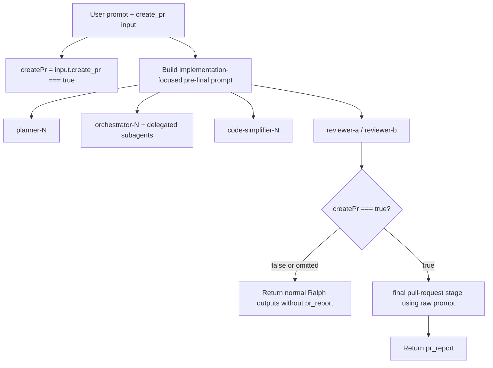

# Atomic Workflows Ralph `create_pr` Flag Technical Design Document / RFC

| Document Metadata      | Details                              |
| ---------------------- | ------------------------------------ |
| Author(s)              | Alex Lavaee                          |
| Status                 | Updated after review                 |
| Team / Owner           | Atomic Workflows / Ralph maintainers |
| Created / Last Updated | 2026-06-05 / 2026-06-05              |

## 1. Executive Summary

Implement GitHub issue #1255 by making Ralph pull-request creation opt-in through a `create_pr` boolean workflow input. The input defaults to `false`; Ralph runs the final `pull-request` stage only when `create_pr === true`.

A follow-up review clarified two additional behavior requirements:

1. Ralph's planner, orchestrator, simplifier, reviewers, delegated workers, generated spec path, and implementation notes must not contain pull-request handoff language before the final workflow step. If the user's raw prompt includes a final handoff request, Ralph should use implementation-focused prompt text for earlier stages and reserve the original prompt for the final `pull-request` step.
2. When `create_pr` is omitted or `false`, Ralph should omit `pr_report` entirely instead of returning a skipped report.

## 2. Context and Motivation

Before this change, `packages/workflows/builtin/ralph.ts` always reached a final `ctx.task("pull-request", ...)` stage. The first implementation gated that final stage with `create_pr`, but it also injected a pre-final pull-request policy into planner/orchestrator/simplifier/reviewer prompts and returned a deterministic skipped `pr_report` when disabled.

The revised requirement prefers stricter separation: earlier stages should focus only on implementation work and avoid pull-request handoff concepts entirely. Users still opt into the final stage with `create_pr=true`; otherwise Ralph completes after review without a `pr_report` key.

## 3. Goals and Non-Goals

### 3.1 Functional Goals

1. Expose `create_pr` in Ralph workflow inputs.
   - Type: boolean.
   - Default: `false`.
   - Strict opt-in: only `create_pr === true` runs the final stage.
2. Keep all pre-final Ralph stage prompts implementation-focused.
   - Planner, orchestrator, simplifier, reviewer prompts, parallel shared task metadata, generated spec path, and initialized implementation notes should not include final pull-request handoff language.
   - If the raw prompt contains pull-request handoff wording, redact that wording for pre-final stages.
   - Preserve the original raw prompt for the final `pull-request` stage when it is enabled.
3. Omit `pr_report` when `create_pr` is omitted or `false`.
4. Preserve `pr_report` when `create_pr=true` by returning the final `pull-request` stage report.
5. Update docs, changelogs, and tests to describe and verify the revised behavior.

### 3.2 Non-Goals

- Do not redesign Ralph's plan/orchestrate/simplify/review loop.
- Do not change final `pull-request` stage GitHub credential checks, branch creation, PR creation, or implementation-note comment behavior.
- Do not add global configuration for PR creation.
- Do not add command-level sandboxing or a universal `gh` denylist in this issue.
- Do not create real pull requests in tests.

## 4. Proposed Solution

Add a small pre-final prompt sanitizer and use its result for all stages before the final `pull-request` step. Keep the raw prompt only for the final step.



## 5. Detailed Design

### 5.1 Input and Output Contract

Ralph input schema includes:

```ts
.input("create_pr", Type.Boolean({
  default: false,
  description:
    "Whether to run the final pull-request creation stage. Defaults to false; prompt text alone does not opt in. Set true to allow only the final stage to attempt GitHub PR creation.",
}))
```

`RalphWorkflowResult.pr_report` is optional. The returned object includes `pr_report` only when the final `pull-request` stage ran.

### 5.2 Pre-final Prompt Handling

`promptBeforeFinalStage(prompt)` removes common final handoff phrases such as "create/open/prepare/submit a pull request" from the prompt used by planner, orchestrator, simplifier, reviewers, parallel task metadata, generated spec slug, and initialized implementation notes.

If redaction leaves an empty string, Ralph uses a neutral fallback:

```text
Complete the requested implementation task.
```

The final `pull-request` stage still receives the original raw prompt in its `workflow_context` when `create_pr=true`.

### 5.3 Runtime Gate

```ts
let finalPrReport: string | undefined;

if (createPr === true) {
  const prResult = await ctx.task("pull-request", { ... });
  finalPrReport = prResult.text;
}

return {
  result,
  plan,
  plan_path,
  implementation_notes_path,
  ...(finalPrReport === undefined ? {} : { pr_report: finalPrReport }),
  approved,
  iterations_completed,
  review_report,
  ...(reviewReportPath === undefined ? {} : { review_report_path: reviewReportPath }),
};
```

## 6. Alternatives Considered

| Option | Pros | Cons | Decision |
| ------ | ---- | ---- | -------- |
| Keep pre-final policy prompts | Explicitly told workers not to create PRs | Violates the requirement to avoid mentioning PRs before the final step | Rejected |
| Sanitize pre-final prompt and omit disabled `pr_report` | Keeps earlier stages focused and satisfies new output requirement | Natural-language redaction is heuristic | Selected |
| Add command-level sandboxing | Strongest enforcement | Larger platform change outside issue scope | Deferred |

## 7. Cross-Cutting Concerns

### 7.1 Security and Privacy

Default behavior no longer starts the final `pull-request` stage and no longer generates a `pr_report`. Earlier stages receive implementation-focused prompt text and sanitized implementation notes, reducing the chance of accidental PR side effects before the opt-in final stage.

### 7.2 Observability Strategy

Unit tests assert:

- `pull-request` is not invoked when `create_pr` is omitted or `false`.
- `pr_report` is absent when disabled.
- Pre-final stage prompts and initialized implementation notes do not include pull-request handoff wording even when the raw prompt includes it.
- The final `pull-request` stage receives the raw prompt and emits `pr_report` when `create_pr=true`.

### 7.3 Scalability and Capacity Planning

Skipping the final stage by default reduces one model call and avoids GitHub credential checks. The prompt sanitizer has negligible runtime cost.

## 8. Migration, Rollout, and Testing

Validation plan:

```sh
bun test test/unit/builtin-workflows.test.ts --filter ralph
bun test test/integration/workflow-package-typing.test.ts
bun run typecheck
git diff --check origin/main
```

Users who want Ralph to attempt PR creation must pass `create_pr=true`. Existing default runs now complete without `pr_report`.

## 9. Open Questions / Unresolved Issues

1. Should a future platform-level policy prevent PR-related shell commands when `create_pr` is false? `[OWNER: workflow platform maintainers]`
2. Should the prompt sanitizer cover additional SCM-provider wording beyond GitHub pull requests? `[OWNER: Ralph maintainers]`
