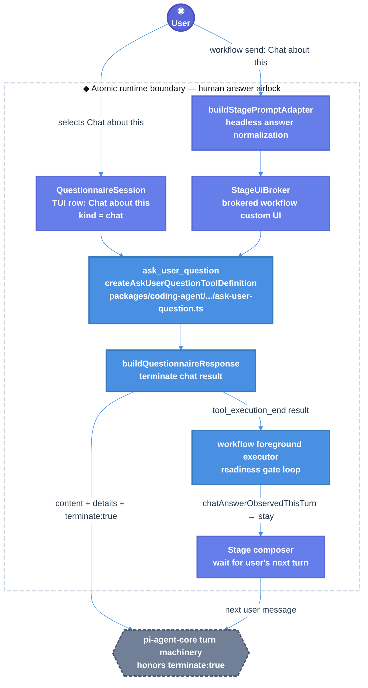

# Atomic Chat-about-this Termination Technical Design Document / RFC

| Document Metadata      | Details                         |
| ---------------------- | ------------------------------- |
| Author(s)              | Norin Lavaee                    |
| Status                 | In Review (RFC)                 |
| Team / Owner           | Atomic Coding Agent / Workflows |
| Created / Last Updated | 2026-06-05 / 2026-06-05         |

## 1. Executive Summary

GitHub issue [bastani-inc/atomic#1264](https://github.com/bastani-inc/atomic/issues/1264) reports that selecting **Chat about this** in `ask_user_question` can be treated as passive context, allowing the current task/workflow to continue instead of entering a free-form chat path.

This RFC proposes finishing the already-started branch `flora131/bug/chat-about-this` rather than restarting. The design makes the chat sentinel explicit at two doors: `buildQuestionnaireResponse`, which turns any `QuestionAnswer.kind === "chat"` into a terminating stop/wait tool result, and the workflow foreground executor readiness loop, which detects chat tool results and stays in the stage composer without showing the extra readiness gate.

The work is intentionally narrow: preserve all non-chat/cancelled behavior, preserve public tool schemas and workflow APIs, rerun the listed Bun validations, commit the existing focused fix, and open a PR against `origin/main` referencing issue #1264.

## 2. Context and Motivation

GitHub issue #1264 says repeated selections of **Chat about this** sometimes continue execution “as though the choice was contextual guidance” rather than an explicit chat-mode branch. Current branch state from investigation:

- Branch: `flora131/bug/chat-about-this`.
- No PR currently exists for this head branch (`gh pr list --head flora131/bug/chat-about-this` returned `[]`).
- Uncommitted changes exist in:
  - `packages/coding-agent/src/core/tools/ask-user-question/tool/format-answer.ts`
  - `packages/coding-agent/src/core/tools/ask-user-question/tool/response-envelope.ts`
  - `packages/coding-agent/test/ask-user-question-tool.test.ts`
  - `packages/workflows/src/runs/foreground/executor.ts`
  - `packages/workflows/src/shared/stage-prompt.ts`
  - `test/unit/executor.test.ts`
  - `test/unit/readiness-gate-decision.test.ts`
  - `test/unit/stage-prompt.test.ts`
- Prior notes at `/tmp/atomic-ralph-notes-IsRJ3u/implementation-notes.md` report all requested Bun validations previously passed.
- Prior review report `/tmp/atomic-ralph-run-fq7nKY/review-round-10.json` had no concrete findings, but both reviewer stages failed structured JSON, so approval remained false.
- The prior spec file `specs/2026-06-06-fix-issue-https-github-com-bastani-inc-atomic-issues-1264.md` exists but is effectively empty.

### 2.1 Current State

- **Architecture:** `ask_user_question` is a built-in Atomic tool registered from `packages/coding-agent/src/core/tools/index.ts`. Its TUI produces `QuestionnaireResult` / `QuestionAnswer` values from `packages/coding-agent/src/core/tools/ask-user-question/tool/types.ts`.
- **Chat sentinel:** The user-facing chat row label is `"Chat about this"` in `ROW_INTENT_META.chat.label` (`packages/coding-agent/src/core/tools/ask-user-question/state/row-intent.ts:96`). The `QuestionAnswer` union already has `kind: "chat"` (`tool/types.ts:112`).
- **Envelope door:** `buildQuestionnaireResponse` maps questionnaire results into the LLM-facing tool result (`response-envelope.ts:24`).
- **Workflow path:** workflow stage prompts are brokered through `StageUiBroker` and headlessly answered by `buildStagePromptAdapter` (`packages/workflows/src/shared/stage-prompt.ts:4-25`, `stage-ui-broker.ts:52-56`).
- **Readiness gate:** after a workflow stage turn that called `ask_user_question`, `packages/workflows/src/runs/foreground/executor.ts` may show a readiness gate before advancing (`executor.ts:378-388`).

**Leaking doors today:**

- `buildQuestionnaireResponse` historically appended `ENVELOPE_SUFFIX = "You can now continue with the user's answers in mind."`, which lets chat intent be interpreted as passive context (`response-envelope.ts:5`).
- Headless workflow answers previously resolved `"Chat about this"` as a normal text/custom answer instead of preserving `kind: "chat"` at `stage-prompt.ts`.
- The workflow executor readiness loop previously treated chat like any other answered question and could show a second readiness confirmation instead of returning to the composer.

### 2.2 The Problem

- **User Impact:** Selecting **Chat about this** does not reliably open a free-form conversation; it can allow task/workflow continuation.
- **Business Impact:** The core HITL escape hatch becomes untrustworthy, reducing confidence in Atomic’s structured-question UX.
- **Technical Debt:** Chat intent is represented at the TUI row level but was not consistently preserved through the response envelope, headless broker adapter, and workflow readiness state machine.

## 3. Goals and Non-Goals

### 3.1 Functional Goals

- [ ] Preserve the existing branch/worktree and resume the prior Ralph run output instead of reimplementing from scratch.
- [ ] Ensure any `QuestionnaireResult.answers[].kind === "chat"` produces a terminating `ask_user_question` tool result with stop/wait wording.
- [ ] Ensure non-chat option/custom/multi/cancelled paths remain non-terminating and continue to include existing continuation semantics where applicable.
- [ ] Ensure workflow headless answers normalize `"Chat about this"` to `kind: "chat"`.
- [ ] Ensure workflow foreground execution bypasses readiness confirmation for chat answers and waits for the user’s next composer turn.
- [ ] Re-run the exact requested Bun validations.
- [ ] Commit on `flora131/bug/chat-about-this` or an appropriate continuation branch and create a PR against `origin/main` referencing issue #1264.

### 3.2 Non-Goals (Out of Scope)

- [ ] Do not redesign the `ask_user_question` TUI layout or sentinel row model.
- [ ] Do not rename the `ask_user_question` tool or change its public parameter schema.
- [ ] Do not change mixed `pi-agent-core` batch termination semantics unless tests prove it is required for #1264.
- [ ] Do not add new CLI flags, workflow APIs, persistent schema, or release/version bumps.
- [ ] Do not rewrite the prior implementation; perform a focused correctness review and only fix actual issues found.

## 4. Proposed Solution (High-Level Design)

### 4.1 System Architecture Diagram



### 4.2 Architectural Pattern

Use a sentinel-discriminated result pipeline:

- The `QuestionAnswer.kind` discriminant carries user intent.
- `buildQuestionnaireResponse` is the single in-process envelope door for `ask_user_question` result semantics.
- Workflow headless input mirrors the same `QuestionnaireResult` shape through `StagePromptAdapter`.
- The foreground executor observes tool result events and updates the readiness state machine without inferring intent from display text alone.

### 4.3 Key Components

| Component | Responsibility | Technology Stack | Justification |
| --------- | -------------- | ---------------- | ------------- |
| `ROW_INTENT_META.chat` | Canonical user-facing sentinel label `"Chat about this"` | TypeScript data table | Existing single source for TUI sentinel labels (`row-intent.ts:72-104`). |
| `QuestionAnswer` / `QuestionnaireResult` | Typed questionnaire answer/result contracts | TypeScript discriminated union | `kind: "chat"` already exists and should remain the semantic source (`tool/types.ts:112-140`). |
| `buildQuestionnaireResponse` | Convert questionnaire result to LLM/tool envelope | TypeScript pure function | Best chokepoint for adding `terminate: true` without changing UI code (`response-envelope.ts:24-64`). |
| `buildStagePromptAdapter` | Convert headless workflow answers into questionnaire-shaped results | TypeScript adapter | Required for `workflow send` / programmatic answers to preserve chat intent (`stage-prompt.ts:323-337`). |
| `toolResultHasChatAnswer` | Guarded inspection of raw tool result event payload | TypeScript helper | Keeps executor robust against malformed/partial event shapes (`executor.ts:441-454`). |
| Foreground readiness loop | Decide advance/stay after ask_user_question turns | TypeScript state machine | Existing place where workflows can otherwise continue or re-gate (`executor.ts:2996-3026`). |
| Regression tests | Lock envelope, adapter, helper, and executor behavior | Bun + Vitest/Bun tests | Prior notes report all listed validations passed; implementation must rerun them. |

### 4.4 The Door Set at a Glance (Stranger-Across-Time View)

`select_chat_about_this`, `buildSingleSelectAnswer`, `buildQuestionnaireResponse`, `buildToolResult`, `buildStagePromptAdapter`, `toolResultHasChatAnswer`, `askReadinessViaStageBroker`, `runTrackedStageCall`, `confirmReadiness`, `waitForNextComposerTurn`

No door performs an irreversible external effect. The control-flow stopping effect is important, but reversible by the user’s next message.

## 5. Detailed Design

### 5.1 The Doors (Entrypoint Contracts)

```ts
type ChatAnswer = QuestionAnswer & { kind: "chat"; answer: "Chat about this" };

buildQuestionnaireResponse(
  result: QuestionnaireResult | null | undefined,
  params: QuestionParams,
): ToolResult
// Guarantee: converts questionnaire state into exactly one LLM-facing tool envelope.
// Failure set: CancelledOrMissingResult | EmptyAnswerSegments.
// Refusals: a chat answer may not receive the generic continuation suffix.

buildToolResult(
  text: string,
  details: QuestionnaireResult,
  options?: { terminate?: boolean },
): ToolResult
// Guarantee: emits terminate:true only when explicitly requested.
// Failure set: none; pure construction.
// Refusals: non-chat call sites cannot accidentally terminate unless they pass terminate:true.

buildStagePromptAdapter(
  id: string,
  kind: "ask_user_question" | "readiness_gate",
  args: unknown,
  createdAt: number,
): StagePromptAdapter | undefined
// Guarantee: creates a broker adapter only for parseable ask_user_question-shaped prompts.
// Failure set: UnparseablePromptArgs.
// Refusals: malformed prompt args remain TUI-only instead of fabricating a bad result.

answerSingle(
  question: StageInputQuestion,
  desired: string,
): BuiltAnswer
// Guarantee: maps the normalized Chat about this sentinel to kind:chat.
// Failure set: none; unknown text becomes custom.
// Refusals: authored options cannot steal the chat sentinel because the label is reserved in validate-questionnaire.ts.

toolResultHasChatAnswer(
  result: unknown,
): boolean
// Guarantee: returns true only when details.answers contains an object with kind === "chat".
// Failure set: MalformedResultShape -> false.
// Refusals: malformed event payloads cannot throw inside the executor watcher.

readinessGateTurnDecision(
  askObserved: boolean,
  chatObserved: boolean,
): "advance" | "stay" | "ask-readiness"
// Guarantee: a chat answer stays in the composer without invoking readiness confirmation.
// Failure set: GateFailure -> advance, preserving existing fail-open behavior.
// Refusals: chat intent cannot be converted into a second confirmation prompt.
```

**Per-door audit (run the rubric):**

| Door | (1) Joint | (2) One sentence, no "and" | (3) Honest name | (5) Every exit | (6) Refusals real | (7) Trust transition | (8) One chokepoint |
| ---- | --------- | -------------------------- | --------------- | -------------- | ----------------- | -------------------- | ------------------ |
| `buildQuestionnaireResponse` | ✅ questionnaire result → tool envelope | ✅ “converts questionnaire state into one LLM-facing envelope” | ✅ | chat → terminating; cancel/empty → decline; non-chat → continue | ✅ `hasChatAnswer` gates suffix/termination | n/a | ✅ envelope semantics live here |
| `buildToolResult` | ✅ tool result construction | ✅ “emits terminate only when requested” | ✅ | normal result; terminating result | ✅ optional flag only | n/a | ✅ single constructor used by tool |
| `buildStagePromptAdapter` | ✅ workflow headless answer bridge | ✅ “creates a broker adapter for parseable prompts” | ✅ | adapter or undefined | ✅ malformed args do not fabricate results | ✅ headless answer airlock | ✅ all `workflow send` structured answers pass here |
| `answerSingle` | ✅ answer normalization | ✅ “maps chat sentinel to chat kind” | ✅ | chat; option; numeric option; custom | ✅ chat checked before options | ✅ text input becomes typed result | ✅ per-question single-select mapping |
| `toolResultHasChatAnswer` | ✅ executor event guard | ✅ “detects chat answers in raw tool results” | ✅ | true; false for malformed/non-chat | ✅ guarded `unknown` inspection | n/a | ✅ executor does not duplicate shape logic |
| readiness loop in `runTrackedStageCall` | ✅ workflow advance/stay decision | ✅ “chat stays in the composer” | ✅ | advance; stay; wait next turn | ✅ chat bypasses `confirmReadiness` | n/a | ✅ workflow progression controlled here |

### 5.2 API Interfaces — The Same Doors on the Wire

Atomic does not expose this as HTTP. The relevant wire surfaces are tool calls, tool results, and workflow broker payloads.

```ts
// Tool name and parameter schema remain unchanged.
tool: "ask_user_question"
params: {
  questions: Array<{
    question: string;
    header: string;
    options: Array<{ label: string; description: string; preview?: string }>;
    multiSelect?: boolean;
  }>;
}

// Chat result envelope after selection.
{
  content: [{
    type: "text",
    text: "User wants to chat about this before choosing. Stop the current task flow and wait for the user's next message. ..."
  }],
  details: {
    answers: [{
      questionIndex: number,
      question: string,
      kind: "chat",
      answer: "Chat about this"
    }],
    cancelled: false
  },
  terminate: true
}

// Non-chat result envelope remains non-terminating.
{
  content: [{ type: "text", text: "User has answered your questions: ... You can now continue with the user's answers in mind." }],
  details: QuestionnaireResult
}

// Workflow headless answer surface remains existing workflow send/broker behavior.
StageInputAnswer =
  | { text: "Chat about this" }
  | { optionLabels: ["Chat about this"] }
  | { raw: QuestionnaireResult };
```

No new CLI flag, HTTP endpoint, extension command, persisted field, or public SDK option is introduced.

### 5.3 Data Model / Schema

No durable schema migration is required.

| Model | Current / Proposed Fields | Notes |
| ----- | ------------------------- | ----- |
| `QuestionAnswer` | `kind: "option" \| "custom" \| "chat" \| "multi"` | Existing discriminated union; `chat` already represents sentinel intent (`tool/types.ts:112`). |
| `QuestionnaireResult` | `answers: QuestionAnswer[]`, `cancelled: boolean`, `error?: QuestionnaireError` | Existing result object preserved (`tool/types.ts:139-143`). |
| Tool result envelope | `content`, `details`, optional `terminate: true` | `terminate` becomes present only for chat answers. |
| `StageInputAnswer` | `text?`, `optionLabels?`, `raw?` | Existing workflow broker answer input (`stage-prompt.ts:31-43`). |
| `BuiltAnswer` | mirrors `QuestionAnswer.kind` | Workflow adapter local mirror now preserves `kind: "chat"` (`stage-prompt.ts:49-59`). |
| Executor per-turn state | `askUserQuestionObservedThisTurn`, `chatAnswerObservedThisTurn` | In-memory only, reset per turn (`executor.ts:2654-2658`, `2992-2993`). |

### 5.4 Algorithms and State Management

1. **TUI chat path**
   - User focuses/selects the chat row.
   - `QuestionnaireSession` / key routing produces `QuestionAnswer.kind === "chat"`; existing code already does this in `key-router.ts:61-76`.
   - `buildQuestionnaireResponse` detects `hasChatAnswer(result)` and emits stop/wait text plus `terminate: true`.

2. **Headless workflow path**
   - A workflow stage provides a broker prompt through `StageUiBroker`.
   - `buildStagePromptAdapter` parses tool args into `StageInputRequest`.
   - `answerSingle` checks normalized `"Chat about this"` before option labels or numeric indices and returns `kind: "chat"`.

3. **Foreground workflow readiness path**
   - The executor watcher marks `askUserQuestionObservedThisTurn` when an `ask_user_question` call starts.
   - On matching tool end, `toolResultHasChatAnswer(event.result)` sets `chatAnswerObservedThisTurn`.
   - In the readiness loop, chat maps to `"stay"` without calling `confirmReadiness`.
   - The loop clears per-turn flags and waits for the next `agent_end` from the normal composer.

4. **Finish/resume workflow**
   - Read prior notes/spec/review report.
   - Inspect `git diff` for correctness.
   - Fix only actual issues found.
   - Re-run required Bun commands.
   - Commit and create PR against `origin/main`.

## 6. Alternatives Considered

| Option | Pros | Cons | Reason for Rejection |
| ------ | ---- | ---- | -------------------- |
| A. Prompt wording only, no `terminate` | Smallest code change | Still depends on model interpreting chat text correctly; issue reports this is unreliable | Rejected because #1264 asks for reliable state/flow transition, not softer wording. |
| B. Terminate every `ask_user_question` answer | Simple and deterministic | Breaks normal option/custom answers that should continue with selected context | Rejected as a breaking behavior change. |
| C. Bypass workflow readiness after every `ask_user_question` | Avoids extra gate | Prevents legitimate readiness confirmation after normal answers | Rejected because #1099 readiness gate behavior must remain for non-chat. |
| D. Import `ROW_INTENT_META.chat.label` from coding-agent into workflows | Avoids literal drift | Creates cross-package coupling from raw `packages/workflows` sources into coding-agent internals | Rejected for this iteration; current implementation duplicates the literal with a code comment. |
| E. Selected: discriminant-preserving chat sentinel through envelope and executor | Deterministic; narrow; preserves non-chat behavior | Touches both coding-agent and workflows packages | Selected because it fixes the leak at each existing boundary without public API churn. |

## 7. Cross-Cutting Concerns

### 7.1 Security and Privacy

- **Trust transition:** the human answer airlock remains `ask_user_question` / `StageUiBroker`; this change does not add a new untrusted input surface.
- **No new answer persistence:** raw answers already flow through `QuestionnaireResult` and workflow broker resolution; this RFC adds no durable storage.
- **Reserved sentinel protection:** `validateQuestionnaire` rejects authored options using reserved labels including `"Chat about this"` (`validate-questionnaire.ts:10`, `tool/types.ts:37-41`), preventing an option from impersonating the chat sentinel.
- **Malformed event safety:** `toolResultHasChatAnswer(result: unknown)` must return false for malformed data rather than throwing inside executor event handling.
- **No new external integrations:** the only external operation in the finish phase is `gh pr create`/PR publication after validation.

## Backwards Compatibility

Backwards compatibility is required. `@bastani/atomic` is an independently published package (`packages/coding-agent/package.json` version `0.8.26-alpha.4`), and workflows are bundled into it.

Compatibility-sensitive surfaces to preserve:

- Tool name `ask_user_question`.
- `QuestionParamsSchema` shape and option limits.
- `QuestionAnswer` union variants and `QuestionnaireResult` shape.
- Existing non-chat envelope text and continuation suffix.
- Workflow `StageInputRequest`, `StageInputAnswer`, `StageUiBroker`, and `workflow send` behavior.
- Existing readiness gate advance/stay semantics for non-chat answers.

The only intentional behavior change is for the already-documented chat sentinel: selecting or headlessly sending `"Chat about this"` now reliably stops the current task flow and waits for the next user message. The optional `terminate: true` field is additive and only present for chat answers.

## 8. Test Plan

- **Unit Tests**
  - `packages/coding-agent/test/ask-user-question-tool.test.ts`
    - chat answer returns `terminate: true`;
    - chat answer omits `ENVELOPE_SUFFIX`;
    - chat answer includes stop/wait wording;
    - option/custom/cancelled answers do not terminate.
  - `test/unit/stage-prompt.test.ts`
    - exact, lowercase, and whitespace-padded `"Chat about this"` map to `kind: "chat"`;
    - non-sentinel text remains custom;
    - `optionLabels: ["Chat about this"]` maps to chat.
  - `test/unit/readiness-gate-decision.test.ts`
    - guarded chat-result detection;
    - malformed/null/non-chat results return false.

- **Executor / Integration-style Tests**
  - `test/unit/executor.test.ts`
    - readiness gate bypasses confirmation for chat answer;
    - stage waits for the user’s next composer turn;
    - normal readiness-gate tests continue to pass.

- **Required validation commands**
  ```sh
  bun test test/unit/stage-prompt.test.ts test/unit/readiness-gate-decision.test.ts test/unit/ask-user-question-tui.test.ts
  bun test test/unit/executor.test.ts -t "readiness gate"
  cd packages/coding-agent && bun run test test/ask-user-question-tool.test.ts
  bun run typecheck
  ```

- **Interactive Verification**
  1. Start a workflow/stage that asks an `ask_user_question` prompt.
  2. Select **Chat about this**.
  3. Pass condition: the agent does not continue the task, no extra readiness confirmation appears, and the next user message is accepted in the stage composer.
  4. Repeat with a normal option.
  5. Pass condition: normal readiness/advance behavior remains unchanged.

## 9. Open Questions / Unresolved Issues

- [ ] [OWNER: workflows maintainer] Should `CHAT_ABOUT_THIS_LABEL` eventually be exported from coding-agent to avoid literal drift, or is the documented duplicate literal acceptable long-term?
- [ ] [OWNER: agent-core maintainer] Do mixed tool-call batches with one terminating `ask_user_question` and other tool results require upstream `pi-agent-core` changes? Current iteration intentionally does not change this unless tests prove it.
- [ ] [OWNER: maintainer] Should the empty prior spec file `specs/2026-06-06-fix-issue-https-github-com-bastani-inc-atomic-issues-1264.md` be committed, replaced, or left out of the PR?
- [ ] [OWNER: reviewer] Prior Ralph review round 10 had empty findings but invalid structured JSON. A focused human/agent review should confirm no concrete issue was hidden by reviewer failure before PR creation.
- [ ] [OWNER: product] Exact repro steps for #1264 remain non-isolated in the issue; acceptance relies on regression coverage plus manual chat-selection verification.
