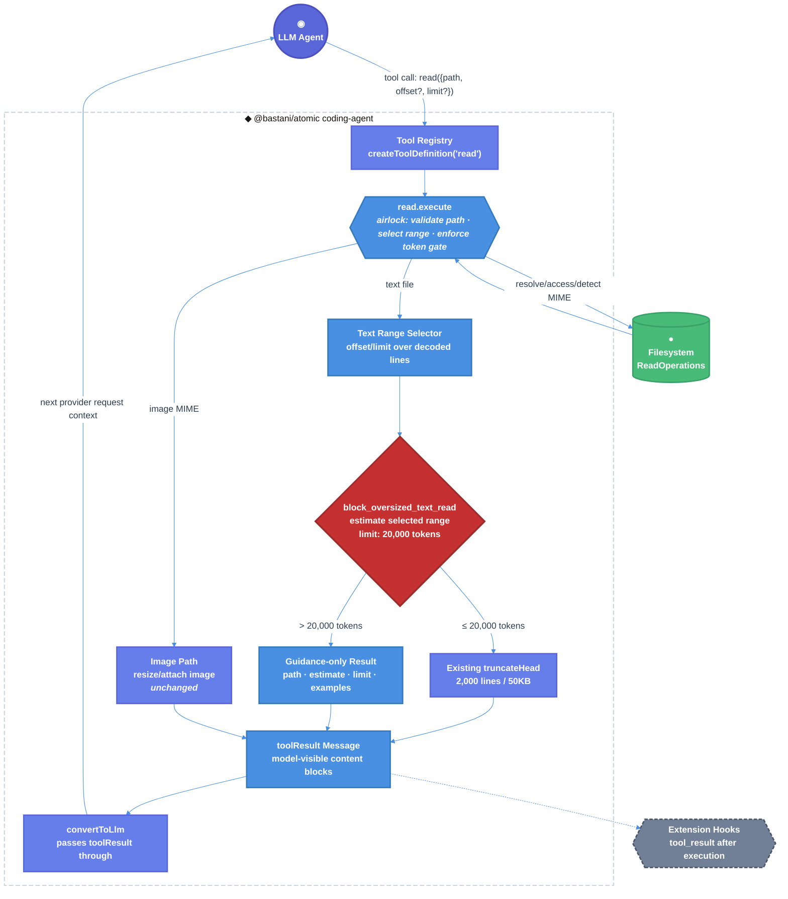

# Atomic Technical Design Document / RFC

| Document Metadata      | Details                                                                                                                                 |
| ---------------------- | --------------------------------------------------------------------------------------------------------------------------------------- |
| Author(s)              | Alex Lavaee                                                                                                                             |
| Status                 | Draft (WIP)                                                                                                                            |
| Team / Owner           | Atomic CLI / `@bastani/atomic` coding-agent tools                                                                                       |
| Created / Last Updated | 2026-06-10                                                                                                                              |
| Compatibility Posture  | Backward-compatible; breaking changes disallowed because `@bastani/atomic` is a published package with downstream users.                |
| Issue                  | [GitHub issue #1323](https://github.com/bastani-inc/atomic/issues/1323)                                                                 |
| Requirement Source     | GitHub issue #1323 and user specification. The prompt-referenced local `specs/...1323...md` file was not present in this checkout.       |

## 1. Executive Summary

This RFC proposes adding a token-aware airlock to Atomic’s built-in `read` tool in `packages/coding-agent/src/core/tools/read.ts`. Today, the Read tool protects model context with a 2,000-line / 50KB truncation rail, but a whole-file request for a large text file can still inject a large low-value chunk into the transcript before the agent discovers it should have searched or read a range instead. The proposed change introduces one load-bearing door: `read`, with an internal `block_oversized_text_read` gate that estimates the requested text range before content is returned to the model.

If the requested text range is estimated above 20,000 tokens, the tool returns only a concise “File read blocked” guidance message containing the path, estimate, threshold, and incremental-read examples. It does not include the oversized contents. Reads at or below the threshold continue through the existing offset/limit and truncation behavior. The impact is reduced accidental context flooding while preserving the existing Read tool schema and downstream API compatibility.

## 2. Context and Motivation

Requirement source: [GitHub issue #1323](https://github.com/bastani-inc/atomic/issues/1323). Relevant prior art found during codebase investigation:

- `packages/coding-agent/src/core/tools/read.ts` — current Read tool implementation.
- `packages/coding-agent/src/core/tools/truncate.ts` — existing 2,000-line / 50KB truncation utilities.
- `packages/coding-agent/src/core/compaction/compaction.ts` — existing chars/4 token-estimation heuristic for context usage.
- `packages/coding-agent/src/core/messages.ts` — `toolResult` messages are passed through into LLM context.
- `packages/coding-agent/src/core/agent-session.ts` — extension `tool_result` hook can observe/modify results after tool execution.
- `specs/2026-02-09-custom-tools-directory.md` — prior tool-output truncation and context-window protection design.
- `specs/2026-02-16-message-truncation-dual-view-system.md` — prior bounded-history/context-protection design.
- `research/docs/2026-02-13-token-counting-system-prompt-tools.md` — prior token-counting research; documents the chars/4 estimation convention.
- No prior code review artifact was provided for this iteration.

### 2.1 Current State

- **Architecture:** The built-in Read tool is exported by `packages/coding-agent/src/core/tools/read.ts:206-363` and registered through tool factory helpers in `packages/coding-agent/src/core/tools/index.ts:130-178`.
- **Tool schema:** `readSchema` currently exposes `path`, optional 1-indexed `offset`, and optional line-count `limit` at `packages/coding-agent/src/core/tools/read.ts:20-24`.
- **Text read flow:** The text branch reads the full file buffer, decodes UTF-8, splits by line, applies `offset`/`limit`, truncates via `truncateHead`, and then constructs the model-visible content block at `packages/coding-agent/src/core/tools/read.ts:278-329`.
- **Existing size rail:** `truncateHead` limits tool output to `DEFAULT_MAX_LINES = 2000` and `DEFAULT_MAX_BYTES = 50 * 1024` in `packages/coding-agent/src/core/tools/truncate.ts:11-12`, preserving complete lines where possible.
- **Context insertion:** `convertToLlm` returns `toolResult` messages unchanged at `packages/coding-agent/src/core/messages.ts:151-154`, so any text returned by `read.execute` is eligible for model context.
- **Token estimation precedent:** `estimateTokens` in `packages/coding-agent/src/core/compaction/compaction.ts:112-160` estimates tokens with `Math.ceil(chars / 4)`.
- **Leaking door today:** `read` is the correct chokepoint, but it currently uses only line/byte truncation. A request for a huge selected range can still leak the beginning of that range into context, even when the better recovery path is to search symbols or request a smaller range first.
- **Compatibility-sensitive surface:** `createReadTool`, `createReadToolDefinition`, `ReadToolInput`, `ReadToolDetails`, `ReadOperations`, and `ReadToolOptions` are exported from `packages/coding-agent/src/core/tools/index.ts:45-52` and indirectly from `packages/coding-agent/src/index.ts`.

### 2.2 The Problem

- **User Impact:** Agents can accidentally call `read` on an entire large file, insert a large low-signal blob into transcript/model context, and then struggle to find the relevant section.
- **Developer Impact:** Context flooding makes debugging and implementation sessions less reliable, because useful context can be buried after an oversized tool result.
- **Technical Debt:** The current boundary is byte/line-oriented rather than token-oriented. The read door truncates after selection but never refuses an oversized selection before constructing model-visible content.
- **Product Requirement:** For file reads estimated above approximately 20,000 tokens, Atomic must refuse to return oversized contents and instead provide clear incremental-read guidance.
- **Critical Safety Requirement:** When blocked, the oversized file contents must not appear in the returned tool result and therefore must not be inserted into model context.

## 3. Goals and Non-Goals

### 3.1 Functional Goals

- [ ] Add a 20,000-token configured threshold for model-visible text read requests in `packages/coding-agent/src/core/tools/read.ts`.
- [ ] Estimate the requested text range after `offset`/`limit` selection and before returning file contents.
- [ ] Block text reads whose selected range is estimated at `> 20,000` tokens.
- [ ] Return a concise error-style guidance message when blocked, including:
  - file path,
  - estimated token size when available,
  - configured threshold of 20,000 tokens,
  - clear instructions to search/read incrementally,
  - concrete examples using smaller line ranges and targeted searches.
- [ ] Ensure blocked results omit the oversized selected file content entirely.
- [ ] Preserve existing behavior for reads estimated at or below the threshold, including the existing 2,000-line / 50KB truncation behavior.
- [ ] Add unit tests covering:
  - allowed reads below the threshold,
  - blocked reads above the threshold,
  - no content leakage from blocked reads.
- [ ] Add a `packages/coding-agent/CHANGELOG.md` entry under `## [Unreleased]`, following AGENTS.md changelog rules.
- [ ] Validate implementation with `bun run typecheck` and `bun run test:unit`.

### 3.2 Non-Goals (Out of Scope)

- [ ] We will NOT add a user-facing setting, CLI flag, or environment variable to customize the 20,000-token threshold in this iteration.
- [ ] We will NOT remove or change the existing 2,000-line / 50KB truncation rail for allowed reads.
- [ ] We will NOT redesign all tool-output truncation across `bash`, `grep`, `find`, custom tools, MCP tools, or extension tools.
- [ ] We will NOT prevent users from producing large output via `bash cat`; this RFC scopes only the built-in `read` tool.
- [ ] We will NOT introduce a tokenizer dependency or provider-specific tokenization in this iteration.
- [ ] We will NOT change image read/resize behavior, except that image behavior remains documented as outside the text-token gate.
- [ ] We will NOT introduce streaming or file-stat preflight reads; the existing Read tool currently loads file contents before range selection.
- [ ] We will NOT create a PR in this design stage.

## 4. Proposed Solution (High-Level Design)

Add a token-limit policy gate inside the Read tool’s text branch. The gate runs after path resolution, readability checks, MIME classification, UTF-8 decoding, line splitting, and user-requested `offset`/`limit` selection, but before `truncateHead(selectedContent)` and before `content = [{ type: "text", text: outputText }]`.

The selected range is estimated using the same coarse convention already used by compaction: `Math.ceil(text.length / 4)`. If the estimate is greater than `20_000`, the tool returns a guidance-only text result. If the estimate is at or below `20_000`, execution continues through the existing truncation and continuation-message path.

### 4.1 System Architecture Diagram



### 4.2 Architectural Pattern

- **Pattern:** Policy Gate / Airlock at the Tool Boundary.
- **Selected boundary:** `read.execute` is the single built-in door where untrusted model-requested file paths and ranges become trusted model-visible file content.
- **Secondary safety rail:** Existing `truncateHead` remains in place for allowed reads.
- **Rationale:** Blocking inside `read.ts` is earlier and more targeted than agent-level context transforms. It prevents oversized content from being constructed as a tool-result content block.

### 4.3 Key Components

| Component | Responsibility | Technology Stack | Justification |
| --------- | -------------- | ---------------- | ------------- |
| `read.execute` | Resolve path, branch image/text, select text range, return tool result | TypeScript, TypeBox, Bun runtime | Existing Read tool door and correct chokepoint for file-read behavior |
| `READ_TOOL_MAX_RESULT_TOKENS` | Hard-coded configured threshold of `20_000` | TypeScript constant | Keeps scope tight and testable without settings migration |
| `estimateReadTextTokens(text)` | Estimate selected text range as tokens | Local helper using chars/4 heuristic | Matches existing compaction convention without adding tokenizer dependencies |
| `buildOversizedReadMessage(...)` | Build concise guidance-only tool result text | Local helper in `read.ts` | Keeps wording stable and unit-testable |
| `ReadToolDetails.oversizedRead` | Optional structured metadata for blocked reads | Additive TypeScript interface field | Gives tests/extensions a machine-readable signal without changing input schema |
| `truncateHead` | Preserve existing allowed-read line/byte truncation | Existing `truncate.ts` helper | Maintains current behavior for allowed content |
| `packages/coding-agent/CHANGELOG.md` | User-visible release note | Markdown | Required by AGENTS.md changelog policy |

### 4.4 The Door Set at a Glance (Stranger-Across-Time View)

`read`, `resolve_read_path`, `select_text_range`, `estimate_read_text_tokens`, `block_oversized_text_read`, `format_incremental_read_guidance`, `truncate_allowed_text_read`, `render_read_result`

No door in this design performs an irreversible effect.

## 5. Detailed Design

### 5.1 The Doors (Entrypoint Contracts)

```ts
read(
  input: {
    path: string;
    offset?: number; // 1-indexed line number
    limit?: number; // max lines to read
  },
): Promise<ReadToolResult>
// Guarantee: For text reads, returns file content only when the selected range is at or below the token limit.
// ReadError = OperationAborted | FileNotReadable | OffsetBeyondEnd | OversizedReadBlocked
```

```ts
estimate_read_text_tokens(
  text: string,
): number
// Guarantee: returns a deterministic conservative-enough token estimate for text.
```

```ts
block_oversized_text_read(
  selectedContent: string,
  context: {
    path: string;
    startLine: number;
    limit?: number;
    totalFileLines: number;
  },
): { kind: "allowed"; estimatedTokens: number } | { kind: "blocked"; result: ReadToolResult }
// Guarantee: refuses to construct a content-bearing read result when the selected text exceeds 20,000 estimated tokens.
```

```ts
format_incremental_read_guidance(
  details: {
    path: string;
    estimatedTokens?: number;
    maxTokens: 20_000;
    startLine: number;
  },
): string
// Guarantee: tells the agent how to recover using targeted search or smaller line ranges.
```

**Per-door audit (run the rubric):**

| Door | (1) Joint | (2) One sentence, no "and" | (3) Honest name | (5) Every exit | (6) Refusals real | (7) Trust transition | (8) One chokepoint |
| ---- | --------- | -------------------------- | --------------- | -------------- | ----------------- | -------------------- | ------------------ |
| `read` | ✅ built-in file-read verb | ✅ “returns content only when the selected range is within the token gate” | ✅ visible tool name matches purpose | allowed content, blocked guidance, abort, unreadable file, offset error, image note | ✅ refuses oversized text before content block construction | ✅ model-requested file path/range becomes model-visible content here | ✅ for built-in file reads |
| `estimate_read_text_tokens` | ✅ policy helper | ✅ “returns a deterministic text-token estimate” | ✅ explicit estimate wording | numeric estimate | ✅ no content result is produced here | n/a | n/a |
| `block_oversized_text_read` | ✅ policy gate | ✅ “refuses selected text above the configured token threshold” | ✅ names refusal | allowed, blocked | ✅ blocked union variant contains no selected content | ✅ sits inside `read` airlock | ✅ text-read token policy chokepoint |
| `format_incremental_read_guidance` | ✅ recovery helper | ✅ “formats recovery instructions for smaller reads” | ✅ names guidance purpose | guidance string | ✅ accepts metadata only, not selected content | n/a | n/a |
| `truncate_allowed_text_read` | ✅ existing safety rail | ✅ “bounds allowed text output by line and byte limits” | ✅ existing `truncateHead` behavior | full content, truncated content, first-line-too-large note | ✅ avoids partial-line output except existing edge cases | n/a | secondary rail, not token gate |

### 5.2 API Interfaces — The Same Doors on the Wire

Atomic’s “wire” for this feature is the model-visible tool interface, not an HTTP endpoint. The external Read tool input schema remains unchanged.

```ts
// Existing model-visible tool schema: unchanged
read({
  path: string,
  offset?: number,
  limit?: number,
})
```

Allowed result shape remains the existing tool-result shape:

```ts
{
  content: [{ type: "text", text: "<file contents or existing truncation message>" }],
  details?: {
    truncation?: TruncationResult
  }
}
```

Blocked result shape is additive and guidance-only:

```ts
{
  content: [{
    type: "text",
    text: `File read blocked: requested content is too large (~31,200 tokens; limit: 20,000).
Path: /path/to/large-file.ts

Read only the needed context incrementally. For example:
- Search for relevant symbols first: grep({ "pattern": "functionName", "path": "/path/to/large-file.ts", "limit": 20 })
- Read a smaller line range: read({ "path": "/path/to/large-file.ts", "offset": 1, "limit": 200 })
- Request chunks around matching lines: read({ "path": "/path/to/large-file.ts", "offset": 120, "limit": 80 })`
  }],
  details: {
    oversizedRead: {
      blocked: true,
      path: "/path/to/large-file.ts",
      estimatedTokens: 31200,
      maxTokens: 20000,
      startLine: 1,
      requestedLimit: undefined,
      totalFileLines: 4200
    }
  }
}
```

Rules:

- The blocked result MUST NOT include `selectedContent`, `truncation.content`, or any substring from the oversized file range.
- The blocked result SHOULD include the resolved absolute path or the path form already used by the Read tool consistently. The example above uses the resolved path for clarity.
- The blocked result SHOULD be short enough to stay far below the threshold.
- The tool input schema MUST NOT change in this iteration.
- Existing extension hooks continue to receive `tool_result` events from `packages/coding-agent/src/core/agent-session.ts:555-580`.

### 5.3 Data Model / Schema

No database or persistent schema changes are required.

**Existing input schema:** `readSchema` in `packages/coding-agent/src/core/tools/read.ts:20-24`

| Field | Type | Constraints | Description |
| ----- | ---- | ----------- | ----------- |
| `path` | `string` | required | Relative or absolute path to read |
| `offset` | `number` | optional, 1-indexed | Starting line number |
| `limit` | `number` | optional | Maximum number of lines |

**Additive details schema:** `ReadToolDetails`

| Field | Type | Constraints | Description |
| ----- | ---- | ----------- | ----------- |
| `truncation` | `TruncationResult` | optional, existing | Existing line/byte truncation metadata |
| `oversizedRead` | `OversizedReadDetails` | optional, new | Present only when a text read is blocked by the token gate |

**New `OversizedReadDetails` shape:**

| Field | Type | Constraints | Description |
| ----- | ---- | ----------- | ----------- |
| `blocked` | `true` | required | Machine-readable indicator that the read was refused |
| `path` | `string` | required | Path included in the guidance message |
| `estimatedTokens` | `number` | optional | Estimated token size if available |
| `maxTokens` | `number` | required, `20000` | Configured threshold |
| `startLine` | `number` | required | 1-indexed starting line used for selection |
| `requestedLimit` | `number` | optional | User-provided `limit`, if any |
| `totalFileLines` | `number` | optional | Total decoded line count when available |

This is a backward-compatible extension because `ReadToolDetails` is already optional and consumers ignoring unknown optional fields continue to work.

### 5.4 Algorithms and State Management

No long-lived state is added. The algorithm is pure within a single `read.execute` invocation.

**Text read algorithm:**

1. Resolve the requested path via `resolveReadPathAsync(path, cwd)` as today.
2. Check readability via `ops.access(absolutePath)` as today.
3. Detect MIME via `ops.detectImageMimeType` as today.
4. If MIME is an image, keep existing image behavior unchanged.
5. For text:
   1. Read the buffer via `ops.readFile(absolutePath)` as today.
   2. Decode UTF-8 and split lines as today.
   3. Apply `offset` and `limit` to produce `selectedContent` as today.
   4. Estimate selected range tokens with `Math.ceil(selectedContent.length / 4)`.
   5. If `estimatedTokens > 20_000`:
      - build the guidance-only message,
      - set `details.oversizedRead`,
      - return without calling `truncateHead(selectedContent)`,
      - never assign `selectedContent` to a content block.
   6. If `estimatedTokens <= 20_000`:
      - continue through the existing `truncateHead(selectedContent)` flow,
      - preserve existing continuation messages and truncation details.
6. Preserve abort handling before/after async operations exactly as today.

**Why estimate after `offset`/`limit`:**

- A full-file request for a huge file should block.
- A targeted range inside that same huge file should be allowed if the selected range is small.
- This directly supports the recovery guidance: search first, then read chunks.

**Why estimate before `truncateHead`:**

- If the gate runs after `truncateHead`, the existing 50KB rail can mask a much larger requested selection.
- Issue #1323 asks whether the requested read would exceed the threshold, not whether the already-truncated fallback is below it.
- Blocking before truncation ensures oversized contents are not inserted into context as a “helpful” first chunk.

**Message formatting:**

Recommended text:

```text
File read blocked: requested content is too large (~31,200 tokens; limit: 20,000).
Path: /path/to/large-file.ts

Read only the needed context incrementally. For example:
- Search for relevant symbols first: grep({ "pattern": "functionName", "path": "/path/to/large-file.ts", "limit": 20 })
- Read a smaller line range: read({ "path": "/path/to/large-file.ts", "offset": 1, "limit": 200 })
- Request chunks around matching lines: read({ "path": "/path/to/large-file.ts", "offset": 120, "limit": 80 })
```

**Renderer behavior:**

`formatReadResult` currently hides collapsed non-error read results at `packages/coding-agent/src/core/tools/read.ts:176-178`. The implementation should consider showing blocked guidance even when `isError` is false by checking `result.details?.oversizedRead?.blocked`. This improves TUI visibility without relying on thrown errors.

## 6. Alternatives Considered

| Option | Pros | Cons | Reason for Rejection |
| ------ | ---- | ---- | -------------------- |
| Option A: Keep existing 2,000-line / 50KB truncation only | No code change; current tests remain stable | Not token-aware; still inserts a large first chunk from an oversized requested range; does not satisfy issue #1323 acceptance criteria | Rejected because the core requirement is to refuse oversized reads and guide incremental recovery. |
| Option B: Gate at `transformContext` or provider payload time | Central place to inspect all messages before provider request | Too late: the oversized Read result has already been constructed and persisted as a tool result; harder to generate Read-specific guidance; affects all tool results | Rejected because the Read tool itself is the correct door and must avoid constructing oversized context content. |
| Option C: Throw an exception for oversized reads | Agent runtime may mark the tool result as an error; TUI error rendering may become automatic | Error handling may wrap or alter the message; unit tests become less direct; the issue asks to return a recovery prompt, not fail with a generic exception | Rejected in favor of returning an explicit guidance-only tool result. |
| Option D: Add `stat`/streaming preflight to `ReadOperations` | Could avoid reading huge files into process memory before blocking | Expands operation interface; remote implementations would need new behavior; byte size is not token size and does not account for line ranges accurately | Rejected for iteration 1 to keep scope tight and preserve `ReadOperations` compatibility. |
| Option E: Use provider-specific tokenizer library | More accurate token estimates | Adds dependency and model-specific complexity; exact tokenizer may vary by provider/model; unnecessary for a threshold safety gate | Rejected because the repo already uses a chars/4 estimate for context and the issue only requires an estimate. |
| Option F: Read-tool selected-range token gate before truncation (Selected) | Blocks whole-file oversized requests; allows small ranges; keeps existing schema; avoids content leakage; easy to unit test | Still reads file into memory before estimating; estimate is approximate | Selected because it satisfies the issue with minimal API impact. |

## 7. Cross-Cutting Concerns

### 7.1 Security and Privacy

- **Context leakage prevention:** The primary privacy improvement is that oversized file contents are not returned in the tool result when blocked.
- **Secret exposure reduction:** Accidental whole-file reads of large files that may contain secrets now produce guidance instead of the first large chunk of content.
- **Path disclosure:** The blocked message includes the path. This is acceptable because the model already requested the path in the tool call; no new file content is disclosed.
- **Extension hooks:** Extension `tool_result` hooks still receive the guidance-only result. They do not receive the omitted oversized content from this gate.
- **Dangerous doors remain few:** This RFC does not add alternate ways to read files. It hardens the existing `read` door.

### 7.2 Performance

- **CPU:** Token estimation is O(n) over the selected text range using string length. This is negligible relative to existing full-buffer read/split for typical files.
- **Memory:** This iteration does not reduce process memory used to read/decode the file because current `ReadOperations` exposes `readFile`, not streaming/stat APIs.
- **Provider cost:** The change reduces provider input tokens by replacing oversized content with a short guidance message.
- **No dependency cost:** No tokenizer package is added.

### 7.3 Observability and UX

- The guidance message is concise and actionable.
- `details.oversizedRead` gives tests, renderers, and extension hooks a machine-readable blocked signal.
- The TUI should display blocked guidance even when the tool result is not marked as a runtime error.
- The changelog entry should be placed under `packages/coding-agent/CHANGELOG.md` `## [Unreleased]` `### Fixed`:

```md
- Fixed the Read tool to block text file-read results above 20,000 estimated tokens and return incremental-read guidance instead of inserting oversized file contents into model context ([#1323](https://github.com/bastani-inc/atomic/issues/1323)).
```

### 7.4 Backwards Compatibility

- **Posture:** Breaking changes are disallowed. `@bastani/atomic` is a published package with downstream users.
- **Tool input compatibility:** The model-visible `read` input schema remains unchanged.
- **Public TypeScript compatibility:** Any `ReadToolDetails` change must be additive and optional.
- **Behavioral compatibility:** Reads at or below the new token threshold continue through the same content/truncation path as today.
- **Intentional behavior change:** A whole-file text read that previously returned a 2,000-line / 50KB leading chunk may now return guidance only if the requested selected range is estimated above 20,000 tokens. This is the desired safety fix for issue #1323.
- **Extension compatibility:** Existing extension hooks still receive valid `content` and `details`. Consumers that only read `details.truncation` continue to work.
- **Image compatibility:** Existing image behavior is preserved.

## 8. Test Plan

- **Unit Tests:**
  - Add Bun unit coverage under `test/unit/read-tool-oversized.test.ts` so `bun run test:unit` exercises the new behavior.
  - Test allowed read below threshold:
    - create a small text file,
    - call `createReadTool(...).execute(...)`,
    - assert returned text equals the file content,
    - assert no “File read blocked” message,
    - assert no `details.oversizedRead`.
  - Test blocked read above threshold:
    - create a large text file whose selected range is estimated above 20,000 tokens,
    - include a sentinel string such as `DO_NOT_LEAK_1323_CONTENT`,
    - call `read` without `limit`,
    - assert output includes `File read blocked`,
    - assert output includes the path,
    - assert output includes the estimated token count or a `~... tokens` phrase,
    - assert output includes `limit: 20,000`,
    - assert output includes incremental-read guidance (`grep`, `offset`, `limit`),
    - assert output does NOT include the sentinel content.
  - Test allowed incremental range from a large file:
    - use the same large file,
    - call `read` with a small `limit`,
    - assert the requested small range is returned normally.
  - If implementation also updates package-level Vitest coverage, add matching cases near the existing Read tool tests in `packages/coding-agent/test/tools.test.ts:51-203`.

- **End-to-End Tests:**
  - No new full CLI E2E test is required for iteration 1. The behavior is contained in the tool implementation and covered by direct tool execution tests.

- **Integration Tests:**
  - Existing extension hook behavior should remain compatible. No dedicated hook test is required unless the implementation changes the returned result shape beyond additive `details.oversizedRead`.

- **Fuzz / Property Tests:**
  - Not required for iteration 1. The boundary logic is deterministic and can be covered with focused threshold and leakage tests.

- **Interactive Verification:**
  1. Run focused test:
     ```sh
     bun test test/unit/read-tool-oversized.test.ts
     ```
     Pass condition: allowed and blocked tests pass; blocked output omits sentinel content.
  2. Run required unit suite:
     ```sh
     bun run test:unit
     ```
     Pass condition: all root unit tests pass.
  3. Run required typecheck:
     ```sh
     bun run typecheck
     ```
     Pass condition: TypeScript exits successfully.
  4. Manually inspect `packages/coding-agent/CHANGELOG.md`:
     - `## [Unreleased]` contains a `### Fixed` subsection if it did not already exist.
     - The new entry references issue #1323.
     - No released version section was modified.

## 9. Open Questions / Unresolved Issues

- [ ] Should the blocked guidance use the originally requested `path` string or the resolved absolute path? Recommended default: resolved path for clarity, but this should be confirmed with `[OWNER: coding-agent maintainers]`.
- [ ] Should `formatReadResult` display blocked guidance in collapsed TUI mode even when the tool result is not marked `isError`? Recommended default: yes, keyed off `details.oversizedRead.blocked`. Owner: `[OWNER: TUI maintainers]`.
- [ ] Should image reads eventually participate in a token/size gate? Iteration 1 preserves image behavior because issue #1323 guidance is line-range/text-oriented. Owner: `[OWNER: coding-agent maintainers]`.
- [ ] Should future work add streaming/stat preflight to avoid loading extremely large files into process memory before blocking? This is explicitly out of scope for iteration 1. Owner: `[OWNER: runtime/tools maintainers]`.
- [ ] The prompt referenced a local spec file under `specs/2026-06-10-...1323...md`, but that file was absent in the current checkout. Confirm whether a missing local spec artifact should be created in a later documentation pass. Owner: `[OWNER: RFC author / maintainers]`.
