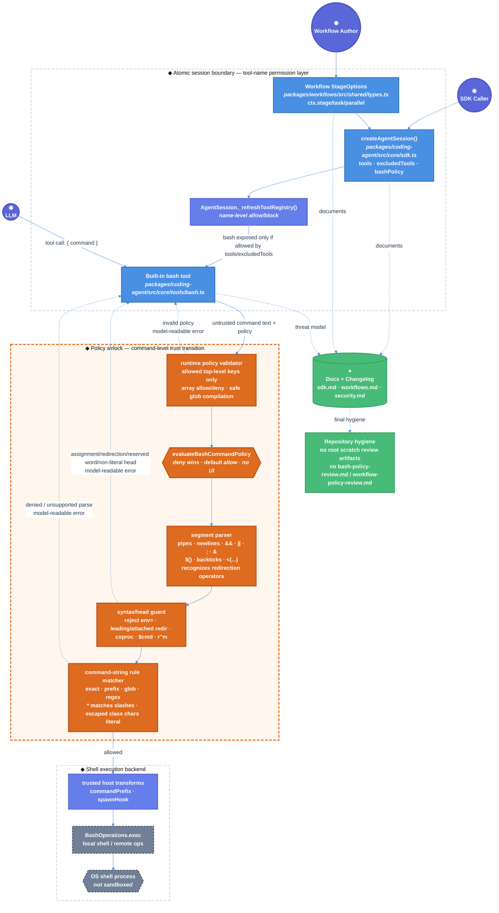

# Atomic Bash Command Policy Technical Design Document / RFC

| Document Metadata      | Details                                                |
| ---------------------- | ------------------------------------------------------ |
| Author(s)              | Alex Lavaee                                            |
| Status                 | Draft (WIP)                                           |
| Team / Owner           | Atomic SDK / Coding Agent Core + Workflows Maintainers |
| Created / Last Updated | 2026-06-10 / 2026-06-11                               |

## 1. Executive Summary

This RFC proposes adding an opt-in `BashCommandPolicy` to Atomic so SDK sessions and workflow stages can grant the `bash` tool while constraining which shell commands it may run. Today, tool permissions stop at the tool-name door: `bash` is either fully exposed or absent. That makes stages such as `open-claude-design` browser-preview tasks grant full shell access just to run `browse ...`.

The proposal introduces two load-bearing doors: `createAgentSession({ bashPolicy })` for session-wide command policy and workflow `StageOptions` / `WorkflowTaskOptions` `bashPolicy` for per-stage policy. Enforcement sits inside the built-in bash execution path in `packages/coding-agent/src/core/tools/bash.ts`, after `tools` / `excludedTools` decide that `bash` exists and before any shell process starts. Default behavior remains unchanged when no policy is provided.

The selected design uses a conservative shell-aware policy airlock: whole-command matching is available by opt-in, while the default segments mode parses pipes, command chaining, top-level newlines, and command/process substitutions so every executable segment must be allowed and any denied or unparsable segment blocks the entire command. Runtime policy validation fails closed for malformed shapes and unknown keys; command globs match command strings rather than filesystem path segments; escaped glob bracket-class metacharacters stay literal; and assignment-prefixed, redirection-prefixed, attached-redirection, reserved-word, and non-literal command heads are rejected until those constructs have explicit policy models. The implementation stage must also keep review scratch artifacts out of the repository diff before PR preparation.

## 2. Context and Motivation

The PRD source for this work is GitHub issue #1332 as provided in the planning prompt. This iteration revises the existing RFC in response to review round 6 findings from `/tmp/atomic-ralph-run-RnT1pp/review-round-6.json`.

### 2.1 Current State

- **Architecture:** Atomic exposes built-in tools through `createAgentSession()` and `AgentSession`’s runtime registry.
  - `packages/coding-agent/src/core/sdk.ts` defines `CreateAgentSessionOptions` with `tools`, `noTools`, `excludedTools`, and `customTools`.
  - `packages/coding-agent/src/core/tools/index.ts` includes `"bash"` in `defaultToolNames`, so default sessions expose shell execution.
  - `packages/coding-agent/src/core/agent-session.ts` applies name-level allow/block filtering in `_refreshToolRegistry()`.
  - `packages/coding-agent/src/core/tools/bash.ts` defines the built-in `bash` tool, `BashOperations`, `commandPrefix`, `shellPath`, and `spawnHook`.
  - `packages/coding-agent/src/core/tools/bash-policy.ts` is the planned pure policy evaluator and parser surface for this feature.
- **Workflow stages:** Workflows already forward SDK-style session options from stages into child `AgentSession` creation.
  - `packages/workflows/src/shared/authoring-contract.ts` declares public `StageOptions` with `tools`, `noTools`, `excludedTools`, `customTools`, `cwd`, and model/session fields.
  - `packages/workflows/src/shared/types.ts` extends `CreateAgentSessionOptions` for internal `StageOptions`.
  - `packages/workflows/src/runs/foreground/executor.ts` strips task-only fields and leaves stage/session options intact.
  - `packages/workflows/src/runs/foreground/stage-runner.ts` strips workflow-only fields before calling the SDK adapter.
  - `packages/workflows/src/extension/workflow-schema.ts` hardcodes direct workflow tool schema fields such as `tools`, `noTools`, `customTools`, and the new `bashPolicy` schema surface.
- **Existing adjacent patterns:**
  - `excludedTools` already proves the registry can apply subtractive policy after allowlists.
  - Workflow MCP stage scoping (`mcp: { allow, deny }`) shows a stage-scoped capability pattern with unit coverage in `test/unit/mcp-stage-scoping.test.ts`.
  - `packages/coding-agent/examples/extensions/permission-gate.ts` shows a bash permission gate using extension `tool_call` hooks, but it depends on extension wiring and optionally UI.
- **Leaking doors today:**
  - `bash` is the current door, but it is a tool-shaped door rather than an intent-shaped command door; granting it exposes the entire shell.
  - Extension permission gates can block selected commands, but the enforcement is scattered, optional, UI-sensitive, and not part of the SDK/workflow contract.
  - Workflow stages that only need `browse open ...`, `browse snapshot`, or `grep ...` must still grant full `bash`.
  - A raw prefix policy such as “command starts with `browse `” would be bypassable by `browse snapshot; rm -rf /` or `browse snapshot\nrm -rf /` unless the shell command is segmented before matching.
- **Current review hygiene risk:** Review round 6 identified untracked root-level scratch review notes (`bash-policy-review.md` and `workflow-policy-review.md`) that are not product documentation, tests, or part of the feature. These must not be committed or included in PR preparation.

### 2.2 The Problem

- **User Impact:** Workflow authors and SDK consumers cannot scope a session or stage to a small command vocabulary. A stage that needs `browse snapshot | grep x` must either expose unrestricted `bash` or remove shell access entirely.
- **Business Impact:** Atomic ships as a published SDK/CLI package. Lack of command-scoped bash permissions makes unattended or headless workflows harder to trust and harder to package as reusable first-party workflows.
- **Technical Debt:** Permission intent is misplaced. `tools` and `excludedTools` enforce whether the `bash` tool exists, but the dangerous irreversible edge is the shell spawn in `bash.ts`. That edge currently has no built-in policy airlock.
- **Security/Trust Gap:** Existing docs correctly state Atomic is not sandboxed, but there is no middle ground between “no shell” and “full local shell.” Users need a guardrail for accidental or model-initiated overreach without mistaking it for OS isolation.
- **Repository Hygiene:** Implementation and review work can produce scratch artifacts. Those files create noisy diffs and may publish stale process chatter if swept into a PR with `git add -A`.

### 2.3 Prior Review Findings Addressed

- **Round 1 P1 — Treat newlines as segment separators:** Reviewers found that unquoted newlines can merge separate shell commands into one allowlisted segment. This RFC requires default `segments` mode to treat unquoted top-level LF and CRLF line terminators as shell command separators equivalent to `;`, and to reject or explicitly split bare CR. A command such as `browse snapshot\nrm -rf /tmp/proof` must never be matched as one `browse ...` target.
- **Round 1 P2 — Reject or normalize non-literal command heads:** Reviewers found bypasses using variable-expanded and quote-concatenated command heads such as `cmd=rm; $cmd -rf /tmp/x` and `r''m -rf /tmp/x`. This RFC requires segments mode to fail closed when the executable command head is not a statically identifiable literal word. Iteration 7 continues to select rejection, not shell normalization, for command-head quotes/expansions.
- **Round 2 P2 — Make command globs match slashes in arguments:** Reviewers found that filesystem glob semantics make `{ glob: "browse *" }` reject command strings like `browse http://localhost:3000` or `browse docs/index.html`. This RFC requires command-string glob semantics where `*` and `?` may match `/`.
- **Round 2 P1 — Do not skip assignment words before policy matching:** Reviewers found that silently skipping `NAME=value` words lets `PATH=/tmp:$PATH browse snapshot` and `LD_PRELOAD=/tmp/x browse snapshot` mutate the environment while matching only `browse snapshot`. This RFC requires assignment-prefixed and assignment-only segments to fail closed unless a future assignment policy is explicitly designed.
- **Round 2 P2 — Reject non-array `allow` and `deny` at runtime:** Reviewers found that JavaScript/JSON callers can pass malformed `allow` / `deny` values such as strings. This RFC requires runtime shape validation for policy containers, not only TypeScript typing.
- **Round 3 P1 — Fail closed on `coproc`:** Reviewers found that Bash `coproc` launches the following command while the parser can treat only `coproc` as the command head. This RFC requires rejecting Bash reserved words and compound-command introducers, including `coproc`, in segments mode.
- **Round 3 P1 — Reject leading redirections before matching the command head:** Reviewers found that `>/tmp/log rm -rf /tmp/proof` can be parsed as headed by the redirection token while Bash executes `rm`. This RFC requires rejecting leading redirections in segments mode until a precise redirection parser is designed.
- **Round 3 P2 — Convert invalid glob ranges into invalid-policy denials:** Reviewers found that malformed glob bracket ranges such as `{ glob: "echo [z-a]" }` can throw raw `SyntaxError` during glob-to-regex compilation. This RFC requires exception-safe glob compilation that returns `invalid-policy` with the standard model-readable no-exec error.
- **Round 4 P1 — Stop command heads at redirection operators:** Reviewers found that Bash accepts redirections glued to a command name, such as `rm>/dev/null -rf /tmp/proof`, while the parser can read the whole glued string as the command head. This RFC requires rejecting redirection operators attached to command-head words in segments mode.
- **Round 4 P2 — Reject unknown top-level bash policy keys:** Reviewers found that runtime policy validation can accept typoed top-level keys such as `{ denny: [{ prefix: "rm " }] }`, compiling a default-allow policy with no recognized rules. This RFC requires rejecting any top-level key other than `default`, `allow`, `deny`, and `match`.
- **Round 5 P2 — Escape glob class metacharacters literally:** Reviewers found that escaped characters inside glob bracket classes can become regex class metacharacters, so `{ glob: "echo file[0\\-9].txt" }` may overmatch `file5.txt` and `{ glob: "echo [\\^a]" }` may behave as a negated class. This RFC requires escaped bracket-class characters to remain literal and be regex-class-escaped during glob compilation.
- **Round 5 P3 — Do not split noclobber redirections as pipes:** Reviewers found that Bash `>|` is a redirection operator, not a pipeline separator, so `echo ok >|/tmp/out` must not be split into a fabricated second segment headed by `/tmp/out`. This RFC requires recognizing `>|` as redirection syntax in non-leading position and keeping it inside the current command segment rather than treating its `|` as a pipeline boundary.
- **Round 6 P2/P3 — Remove stray review artifacts:** Reviewers found untracked root-level scratch review artifacts (`bash-policy-review.md` and `workflow-policy-review.md`). This RFC now requires implementation hygiene validation to remove or keep such internal notes outside the worktree before commit/PR preparation.

## 3. Goals and Non-Goals

### 3.1 Functional Goals

- [ ] Add public `BashCommandRule` and `BashCommandPolicy` types matching the issue shape:
  - exact string rule
  - `{ prefix }`
  - `{ glob }`
  - `{ regex, flags? }`
  - `default?: "allow" | "deny"` with default `"allow"`
  - `allow?: BashCommandRule[]`
  - `deny?: BashCommandRule[]`
  - `match?: "whole" | "segments"` with default `"segments"`
- [ ] Add `bashPolicy?: BashCommandPolicy` to `CreateAgentSessionOptions`.
- [ ] Add `bashPolicy?: BashCommandPolicy` to workflow `StageOptions` / `WorkflowTaskOptions` so `ctx.stage(...)`, `ctx.task(...)`, `ctx.parallel(...)`, direct task, parallel, and chain stages can scope shell commands.
- [ ] Enforce the policy only after normal tool exposure decides `bash` is available; `tools` and `excludedTools` still own the name-level door.
- [ ] Enforce deny-over-allow precedence.
- [ ] Preserve existing behavior when `bashPolicy` is omitted or equivalent to default allow.
- [ ] Validate policy shape at runtime. A provided policy must be a non-null object; only the top-level keys `default`, `allow`, `deny`, and `match` are permitted; `allow` and `deny`, when present, must be arrays; malformed or unknown policy shapes must fail closed with `invalid-policy`.
- [ ] Compile glob rules exception-safely. Malformed glob rules, including invalid bracket classes or ranges, must fail closed with `invalid-policy` rather than throwing raw JavaScript `SyntaxError` values.
- [ ] Preserve escaped glob bracket-class metacharacters literally. Inside bracket classes, escaped `\-`, `\^`, `\]`, `\[`, and `\\` must match only their literal character and must not become range delimiters, negation markers, class terminators, nested class markers, or other regex class metacharacters.
- [ ] In default `match: "segments"` mode, parse shell operators `|`, `|&`, `&&`, `||`, `;`, `&`, unquoted line terminators, command substitutions `$()`, backticks, and process substitutions `<(...)` / `>(...)`, and require every executable segment to pass.
- [ ] Treat unquoted top-level LF (`\n`) and CRLF (`\r\n`) as shell command separators equivalent to `;`; bare CR (`\r`) must be treated as a separator or rejected, never folded into an allowlisted segment as ordinary whitespace.
- [ ] Parse shell control operators `|`, `|&`, `&&`, `||`, `;`, and background `&`, but do not split redirection operators such as `>|`, `>`, `>>`, `<`, `<>`, `<&`, `>&`, `&>`, or `&>>` as command separators.
- [ ] Recognize Bash noclobber redirection `>|` as redirection syntax, not as a pipe. A command like `echo ok >|/tmp/out` must remain one segment and may be allowed by `{ prefix: "echo " }`.
- [ ] Reject commands with unsupported, unbalanced, dynamic, reserved-word, redirection-prefixed, attached-redirection, environment-assignment-prefixed, assignment-only, or non-literal command-head constructs in segments mode instead of falling back to unsafe raw-prefix matching.
- [ ] Require the command head in segments mode to be a statically identifiable literal executable word. Heads containing variable expansion, parameter expansion, arithmetic expansion, command substitution, process substitution, backticks, quote concatenation, escape-based name construction, glob expansion, brace expansion, tilde expansion, or attached redirection syntax must be rejected unless a future implementation can resolve them deterministically without running shell code.
- [ ] Reject leading environment assignment words in policy-protected segments mode, including `PATH=... browse snapshot`, `LD_PRELOAD=... browse snapshot`, and assignment-only commands such as `FOO=bar`, unless a future policy model explicitly represents and matches assignments.
- [ ] Reject leading redirection syntax before command-head selection in segments mode, including `>file cmd`, `2>file cmd`, `<file cmd`, `>>file cmd`, `&>file cmd`, `&>>file cmd`, `>|file cmd`, `<&...`, and `>&...`, unless a future parser explicitly models redirections.
- [ ] Reject redirection syntax attached to command-head words in segments mode, including `cmd>file`, `cmd>>file`, `cmd>|file`, `cmd2>file`, `cmd>&2`, `cmd</tmp/in`, and similar unquoted redirection operators glued to the executable word.
- [ ] Reject Bash reserved words and compound-command introducers that change how following words are parsed or executed. At minimum this includes `coproc` in addition to control heads such as `if`, `for`, `while`, `case`, `{`, `}`, and `!`.
- [ ] Define glob rules as command-string glob rules, not filesystem path globs. `{ glob: "browse *" }` must match `browse http://localhost:3000`, `browse docs/index.html`, and `browse ./preview/output.html`.
- [ ] Support `match: "whole"` as an explicit opt-in for raw command string matching.
- [ ] Produce clear, model-readable tool errors for denied commands and parser rejections, and do not call `BashOperations.exec`.
- [ ] Work in non-interactive/headless workflow runs with no `ctx.ui.confirm` or TUI dependency.
- [ ] Update docs:
  - `packages/coding-agent/docs/sdk.md`
  - `packages/coding-agent/docs/workflows.md`
  - `packages/coding-agent/docs/security.md`
- [ ] Update relevant package changelogs under `## [Unreleased]`:
  - `packages/coding-agent/CHANGELOG.md`
  - `packages/workflows/CHANGELOG.md`
- [ ] Remove or keep outside the worktree any scratch review artifacts, including root-level `bash-policy-review.md` and `workflow-policy-review.md`, before commit/PR preparation.
- [ ] Add `bun:test` coverage for matcher behavior, deny-over-allow precedence, segment parsing, newline separators, non-literal command-head rejection, assignment rejection, leading redirection rejection, attached redirection rejection, `>|` non-splitting, `coproc`/reserved-word rejection, command-string glob slash matching, escaped glob class literals, invalid glob policy rejection, unknown policy key rejection, invalid runtime policy shapes, denied execution, default compatibility, and workflow stage wiring.

### 3.2 Non-Goals (Out of Scope)

- [ ] This is not a security sandbox. It does not isolate the filesystem, network, process tree, environment variables, shell aliases/functions, allowed binaries, or credentials.
- [ ] Do not remove or redesign `tools`, `noTools`, `excludedTools`, or `customTools`.
- [ ] Do not change the default active tool set; default sessions still expose `bash` unless existing options remove it.
- [ ] Do not require workflow authors to use MCP, extensions, or UI prompts to enforce this policy.
- [ ] Do not implement a complete POSIX/Bash AST parser in iteration 1. The segment parser should support the constructs required by issue #1332 and reject unsupported constructs conservatively.
- [ ] Do not add shell execution simulation or shell expansion evaluation. Dynamic command names must fail closed rather than be evaluated.
- [ ] Do not model environment assignment permissions in this iteration. Assignment words are rejected rather than silently skipped.
- [ ] Do not model command-head redirection permissions in this iteration. Leading and attached-to-head redirections are rejected rather than skipped.
- [ ] Do not treat non-leading redirections after a valid literal command head as separate command segments or filesystem sandbox rules. They remain part of the allowed command’s shell semantics unless future policy explicitly models redirections.
- [ ] Do not treat Bash reserved words or compound command syntax as ordinary executable heads.
- [ ] Do not use filesystem path glob semantics for command rule matching.
- [ ] Do not let malformed glob patterns escape as raw JavaScript exceptions.
- [ ] Do not allow unknown top-level policy keys as forwards-compatible no-ops in this iteration; typoed guardrail keys must fail closed.
- [ ] Do not add scratch review notes, subagent transcripts, temporary analysis markdown, or process artifacts as repository files. Keep them in `/tmp`, `.atomic/` run directories where appropriate, or delete them.
- [ ] Do not add a build step, `dist/`, `tsconfig.build.json`, `outDir`, or bundling to `packages/workflows`.
- [ ] Do not add Node/npm/yarn/pnpm development commands. Validation remains Bun-based.
- [ ] Do not open a pull request in this RFC stage.
- [ ] Do not solve OS-level sandboxing; refer users to container/VM/Gondolin guidance for isolation.

## 4. Proposed Solution (High-Level Design)

Introduce a first-class `bashPolicy` option and enforce it at the bash execution chokepoint. The policy is evaluated before shell spawn and before `BashOperations.exec` receives the command. The existing tool registry continues to decide whether `bash` is exposed at all.

Session-level example:

```ts
await createAgentSession({
  tools: ["read", "bash"],
  bashPolicy: {
    default: "deny",
    allow: [
      "pwd",
      { prefix: "browse " },
      { glob: "browse *" },
      { prefix: "grep " },
      { glob: "bun test *" },
      { regex: "^rg\\b" },
    ],
    deny: [{ regex: "\\brm\\b" }],
  },
});
```

Workflow-stage example:

```ts
await ctx.task("preview-display", {
  tools: ["bash"],
  bashPolicy: {
    default: "deny",
    allow: [
      "which browse",
      { glob: "browse open *" },
      { prefix: "browse snapshot" },
      { prefix: "grep " },
    ],
  },
  prompt: "Open the generated preview using browse, then summarize the visible state.",
});
```

### 4.1 System Architecture Diagram



### 4.2 Architectural Pattern

This design uses a **Policy Airlock at the dangerous door**:

- The public facades (`createAgentSession`, workflow `StageOptions`) accept declarative policy.
- The registry filter continues to own tool-name exposure.
- The bash tool owns command-level enforcement immediately before shell execution.
- The shell backend remains pluggable through `BashOperations`, `commandPrefix`, `shellPath`, and `spawnHook`.
- Segments mode is intentionally fail-closed: when Atomic cannot safely identify a literal executable head for every command segment, it blocks the command rather than guessing.
- Runtime policy validation is part of the security contract. JavaScript or JSON-loaded callers get the same fail-closed behavior as TypeScript callers.
- Bash syntax words and pre-command shell operators are not treated as safe command heads. Reserved words such as `coproc`, leading redirections, and redirections attached to command words are syntax that can hide or alter the executable, so they are rejected.
- Non-leading redirections after a valid literal command head are recognized as shell syntax inside the same command segment, not as command separators. This prevents false synthetic segments such as splitting `>|` into `>` plus pipeline.
- Repository hygiene is treated as a release-readiness gate: temporary review notes and scratch artifacts must be removed before commit/PR staging.

This is intentionally not a separate extension permission hook. Extension hooks remain useful for custom prompts and organization-specific policy, but the built-in guardrail must be deterministic, SDK-configurable, stage-scoped, and headless-safe.

### 4.3 Key Components

| Component | Responsibility | Technology Stack | Justification |
| --------- | -------------- | ---------------- | ------------- |
| `BashCommandRule` / `BashCommandPolicy` | Public declarative command policy contract. | TypeScript types exported from `@bastani/atomic`. | Required API surface for sessions and workflow stages. |
| `packages/coding-agent/src/core/tools/bash-policy.ts` | Pure policy evaluator, runtime policy shape validator, exception-safe command-string glob compiler, shell segment tokenizer, assignment/redirection/reserved-word/non-literal command-head guard, error formatting. | TypeScript, internal glob-to-RegExp helper. | Keeps parsing/matching testable without spawning shells or constructing sessions. |
| `packages/coding-agent/src/core/tools/bash.ts` | Enforce policy before `BashOperations.exec`; expose policy on `BashToolOptions`. | Existing TypeBox tool schema and `BashOperations`. | This is the chokepoint for LLM `bash` tool calls. |
| `packages/coding-agent/src/core/sdk.ts` | Add `bashPolicy?: BashCommandPolicy` to `CreateAgentSessionOptions` and forward it to `AgentSession`. | TypeScript SDK facade. | Session-level public API belongs here next to `tools` and `excludedTools`. |
| `packages/coding-agent/src/core/agent-session.ts` | Store session policy, validate it at session construction, pass it to `createAllToolDefinitions(... bash: { policy })`, and apply the same evaluator to `AgentSession.executeBash()`. | Existing `AgentSession` runtime. | Ensures policy is session-scoped and applies to both LLM bash tool calls and direct user/RPC bash execution for the session. |
| `packages/coding-agent/src/core/agent-session-services.ts` | Forward `bashPolicy` through service-based session creation. | TypeScript. | Keeps `createAgentSessionFromServices()` parity with direct SDK session creation. |
| `packages/workflows/src/shared/authoring-contract.ts` | Add public workflow authoring `bashPolicy` field. | Raw TypeScript, type-only imports. | Makes policy visible to workflow authors and standalone typing surface. |
| `packages/workflows/src/shared/types.ts` | Carry `bashPolicy` through internal `StageOptions`, `WorkflowTaskOptions`, direct options, and task defaults. | Raw TypeScript. | Existing spread/strip paths already preserve SDK session fields. |
| `packages/workflows/src/extension/workflow-schema.ts` | Add TypeBox schema for serialized direct workflow tool calls with `bashPolicy`. | TypeBox. | Direct headless workflow runs need schema validation for the new field. |
| `packages/workflows/builtin/open-claude-design.ts` | Optional motivating adopter for browser-only stages. | Raw TypeScript workflow. | Can use stage `bashPolicy` to grant `browse`/`grep` without unrestricted shell. |
| Docs | Document session-level, workflow-stage, command-string glob, assignment/redirection/reserved-word rejection, runtime validation, and threat-model behavior. | Markdown. | Required acceptance criteria. |
| Changelogs | Record user-facing SDK/workflow feature additions. | Markdown. | Required repo convention. |
| Repository hygiene check | Ensure scratch review artifacts are not in the final working tree. | `git status --short`, file cleanup. | Prevents internal review notes from being published as project files. |
| Unit tests | Prove matching, parsing, denial, newline handling, assignment/redirection/reserved-word rejection, non-literal head rejection, invalid policy rejection, no-exec, defaults, and workflow wiring. | `bun:test` + `node:assert/strict`. | Required repo convention and acceptance criteria. |

### 4.4 The Door Set at a Glance (Stranger-Across-Time View)

`createAgentSession`, `createAgentSessionFromServices`, `define_bash_command_policy`, `validate_bash_command_policy`, `compile_command_string_glob`, `parse_bash_command_segments`, `recognize_redirection_operator`, `reject_assignment_command_head`, `reject_leading_redirection`, `reject_attached_redirection`, `reject_reserved_word_head`, `reject_non_literal_command_head`, `evaluate_bash_command_policy`, `createBashToolDefinition`, `execute_bash_tool` ⚠, `AgentSession.executeBash` ⚠, `ctx.stage`, `ctx.task`, `ctx.parallel`, `workflow_direct_task`, `verify_repository_hygiene`.

## 5. Detailed Design

### 5.1 The Doors (Entrypoint Contracts)

```ts
export type BashCommandRule =
  | string
  | { prefix: string }
  | { glob: string }
  | { regex: string; flags?: string };

export interface BashCommandPolicy {
  default?: "allow" | "deny";
  allow?: readonly BashCommandRule[];
  deny?: readonly BashCommandRule[];
  match?: "whole" | "segments";
}
```

Guarantee: describes which model-supplied shell commands may cross the bash execution airlock.

Failures:

- `InvalidPolicy`: malformed policy shape, unknown top-level policy key, non-object policy, non-array `allow` / `deny`, malformed rule object, invalid regex, invalid glob, unsupported regex flags.
- `DeniedByPolicy`: a segment or whole command matched deny or failed to match allow under `default: "deny"`.
- `UnsupportedShellSyntax`: segments mode encountered syntax it cannot safely tokenize.
- `EnvironmentAssignmentUnsupported`: segments mode found a leading assignment word such as `PATH=...` or `LD_PRELOAD=...`.
- `LeadingRedirectionUnsupported`: segments mode found redirection syntax before the command head.
- `AttachedRedirectionUnsupported`: segments mode found a redirection operator attached to the command-head word.
- `ReservedWordUnsupported`: segments mode found a Bash reserved/control word such as `coproc`.
- `NonLiteralCommandHead`: segments mode found an executable head that cannot be statically identified without shell expansion or quote removal.

Refusals:

- A denied command never reaches `BashOperations.exec`.
- A command rejected by segments parsing never falls back to raw string prefix matching.
- A command with an environment assignment, leading redirection, attached redirection, reserved-word head, dynamic executable head, or quote-constructed executable head never reaches the shell in segments mode.
- A malformed runtime policy, including one with unknown top-level keys such as `denny`, never weakens enforcement by being partially interpreted.
- Malformed glob patterns never escape as raw JavaScript exceptions.
- Escaped characters inside glob bracket classes never become active regex class operators.
- `deny` always wins over `allow`.

```ts
createAgentSession(options?: CreateAgentSessionOptions & {
  bashPolicy?: BashCommandPolicy;
}): Promise<CreateAgentSessionResult>
```

Guarantee: creates an Atomic agent session whose exposed `bash` tool enforces `bashPolicy` if and only if `bash` is exposed by normal tool-name policy.

Failures:

- Existing session/model/auth failures.
- `InvalidPolicy` if policy compilation fails.

Refusals:

- `bashPolicy` cannot expose `bash` when `tools` omits it or `excludedTools` removes it.
- `bashPolicy` cannot bypass `noTools`.

```ts
evaluateBashCommandPolicy(
  command: string,
  policy: BashCommandPolicy | undefined,
): BashCommandPolicyDecision
```

Guarantee: returns an allow/deny decision for the command without executing it.

Failures:

- `InvalidPolicy`
- `UnsupportedShellSyntax`
- `EnvironmentAssignmentUnsupported`
- `LeadingRedirectionUnsupported`
- `AttachedRedirectionUnsupported`
- `ReservedWordUnsupported`
- `NonLiteralCommandHead`

Refusals:

- Does not spawn, mutate cwd/env, call `spawnHook`, or prompt UI.
- Does not treat top-level newlines as ordinary whitespace.
- Does not split Bash noclobber redirection `>|` as a pipeline.
- Does not accept `PATH=... browse`, `LD_PRELOAD=... browse`, `FOO=bar`, `>/tmp/log rm`, `2>/tmp/log rm`, `rm>/tmp/log`, `rm>>/tmp/log`, `rm</tmp/in`, `rm>&2`, `coproc sh`, `$cmd`, `${cmd}`, `r''m`, `'rm'`, `r\m`, `$(which rm)`, or backtick command heads in segments mode.
- Does not interpret non-array `allow` / `deny` values as iterable rule lists.
- Does not accept unknown top-level policy keys.
- Does not throw raw glob compilation exceptions for malformed glob rules.

```ts
createBashToolDefinition(
  cwd: string,
  options?: BashToolOptions & {
    policy?: BashCommandPolicy;
    policyLabel?: string;
  },
): ToolDefinition<typeof bashSchema, BashToolDetails | undefined, BashRenderState>
```

Guarantee: constructs a bash tool that checks policy before executing the command.

Failures:

- Existing bash execution failures.
- Policy denial or parse rejection returned as a tool error.

Refusals:

- Does not call `ops.exec` on denied commands.
- Does not ask for UI confirmation.

```ts
ctx.task(name: string, options?: WorkflowTaskOptions & {
  bashPolicy?: BashCommandPolicy;
}): Promise<WorkflowTaskResult>

ctx.parallel(
  steps: readonly WorkflowTaskStep[],
  options?: WorkflowParallelOptions & { bashPolicy?: BashCommandPolicy },
): Promise<readonly WorkflowTaskResult[]>

ctx.stage(name: string, options?: StageOptions & {
  bashPolicy?: BashCommandPolicy;
}): StageContext
```

Guarantee: stage sessions receive `bashPolicy` as part of their SDK session options.

Failures:

- Existing workflow/stage failures.
- Stage session creation fails on invalid policy.
- Stage bash tool calls fail clearly on denied commands.

Refusals:

- A stage policy does not affect sibling stages unless supplied through shared defaults.
- A stage policy does not expose `bash`; `tools` must still grant `bash`.

```ts
verify_repository_hygiene(): Result<CleanWorktreeForFeature, RepositoryHygieneError>
```

Guarantee: verifies that implementation/review scratch artifacts are not present in the final feature diff.

Failures:

- `ScratchArtifactPresent`: root-level internal review artifacts such as `bash-policy-review.md` or `workflow-policy-review.md` exist.
- `UnexpectedUntrackedFile`: an untracked file is unrelated to source, docs, tests, changelog, or required generated lockfile updates.

Refusals:

- Does not allow PR preparation to sweep internal review notes into the repository.

**Per-door audit (run the rubric):**

| Door | (1) Joint | (2) One sentence, no "and" | (3) Honest name | (5) Every exit | (6) Refusals real | (7) Trust transition | (8) One chokepoint |
| ---- | --------- | -------------------------- | --------------- | -------------- | ----------------- | -------------------- | ------------------ |
| `createAgentSession` | ✅ session boundary | ✅ creates a policy-carrying session | ✅ | invalid policy → throw; absent policy → unchanged | cannot expose excluded `bash` | n/a | forwards to bash door |
| `ctx.task` / `ctx.parallel` / `ctx.stage` | ✅ workflow stage boundary | ✅ creates a stage session with scoped policy | ✅ | invalid stage policy → stage failure | cannot affect sibling stages unless defaulted | n/a | forwards to SDK session |
| `validate_bash_command_policy` | ✅ policy config boundary | ✅ rejects malformed policy shapes | ✅ | valid; invalid policy | unknown keys, non-array rules, invalid globs, unsafe class escapes fail closed | ✅ untyped config becomes trusted policy | feeds central decision |
| `parse_bash_command_segments` | ✅ shell list boundary | ✅ enumerates executable shell segments | ✅ | segments; unsupported syntax; non-literal head; assignment head; redirection head; reserved word | newlines split; noclobber redirection not split as pipe; assignments/redirections/coproc/dynamic heads rejected | ✅ untrusted shell text becomes parsed targets | feeds central decision |
| `evaluate_bash_command_policy` | ✅ command policy airlock | ✅ decides whether command text may execute | ✅ | allow; deny; unsupported syntax; invalid policy | no execution side effects | ✅ parsed commands become trusted commands | ✅ central decision |
| `createBashToolDefinition` ⚠ | ✅ shell tool boundary | ✅ refuses disallowed commands before spawn | ✅ | tool success; tool error; policy denial | denied command never reaches `ops.exec` | ✅ final edge before shell | ✅ LLM bash tool chokepoint |
| `AgentSession.executeBash` ⚠ | ✅ user/RPC bash boundary | ✅ applies the same session policy to direct bash execution | ✅ | bash result; thrown policy error | denied command never reaches executor | ✅ direct session bash edge | secondary chokepoint using same evaluator |
| `verify_repository_hygiene` | ✅ release-readiness boundary | ✅ rejects scratch artifacts before staging | ✅ | clean; scratch artifact present | review notes cannot be swept into PR | n/a | ✅ final repo hygiene gate |

### 5.2 API Interfaces — The Same Doors on the Wire

Atomic does not expose this feature through HTTP/gRPC. The “wire” surfaces are the TypeScript SDK API and the serialized workflow tool schema.

#### SDK surface

```ts
import { createAgentSession, type BashCommandPolicy } from "@bastani/atomic";

const browseOnlyPolicy: BashCommandPolicy = {
  default: "deny",
  allow: [
    "which browse",
    { glob: "browse *" },
    "grep",
    { prefix: "grep " },
  ],
  deny: [
    { regex: "\\brm\\b" },
    { regex: "\\bsudo\\b" },
  ],
};

const { session } = await createAgentSession({
  tools: ["read", "bash"],
  bashPolicy: browseOnlyPolicy,
});
```

Expected behavior:

- `bash` must still be listed in `tools` or available by default.
- `excludedTools: ["bash"]` removes `bash` before policy is relevant.
- `default` defaults to `"allow"` for backward compatibility.
- To build an allowlist-only session, callers must set `default: "deny"`.
- In default `segments` mode, `browse snapshot\nrm -rf /tmp/proof` is evaluated as two commands and denied unless `rm` is also allowed.
- In default `segments` mode, dynamic heads such as `$cmd -rf /tmp/x` are rejected even when `default` is `"allow"`.
- In default `segments` mode, assignment-prefixed commands such as `PATH=/tmp:$PATH browse snapshot` are rejected.
- In default `segments` mode, leading redirection commands such as `>/tmp/log rm -rf /tmp/proof` are rejected.
- In default `segments` mode, attached redirection commands such as `rm>/tmp/log -rf /tmp/proof` are rejected.
- In default `segments` mode, non-leading redirection syntax such as `echo ok >|/tmp/out` remains in the `echo` segment and is not split into a pipeline.
- In default `segments` mode, Bash reserved-word constructs such as `coproc sh -c "..."` are rejected.
- `{ glob: "browse *" }` matches command text containing paths and URLs, including `browse docs/index.html` and `browse http://localhost:3000`.
- Escaped class metacharacters in glob rules stay literal. For example, `file[0\\-9].txt` does not match `file5.txt` merely because `\-` was mistranslated into a range delimiter.
- Runtime malformed policies such as `{ deny: "rm" }`, `{ denny: [{ prefix: "rm " }] }`, or `{ allow: [{ glob: "echo [z-a]" }] }` are invalid and block execution.

#### Workflow authoring surface

```ts
await ctx.task("browser-preview", {
  tools: ["bash"],
  bashPolicy: {
    default: "deny",
    allow: [
      "which browse",
      { glob: "browse open *" },
      { prefix: "browse snapshot" },
      { prefix: "grep " },
      "grep",
    ],
  },
  prompt: "Open the local preview with browse and summarize the browser snapshot.",
});
```

#### Direct workflow tool schema surface

```ts
workflow({
  task: {
    name: "preview",
    prompt: "Open the preview and capture snapshot evidence.",
    tools: ["bash"],
    bashPolicy: {
      default: "deny",
      allow: [
        "which browse",
        { glob: "browse open *" },
        { prefix: "browse snapshot" }
      ],
      match: "segments"
    },
    output: "preview.md"
  },
  async: true
})
```

#### Denied tool error surface

A denied command should produce a model-readable tool error similar to:

```text
Bash command blocked by stage bash policy.

Command head: `rm`
Rejected segment: `rm -rf /`
Segment source: top-level
Reason: no allow rule matched and the policy default is deny.
Policy mode: segments.

No shell process was started.
```

For a deny rule match:

```text
Bash command blocked by session bash policy.

Command head: `sudo`
Rejected segment: `sudo rm -rf /`
Segment source: top-level
Reason: matched a deny rule; deny rules take precedence over allow rules.
Matched deny rule: { regex: "\\bsudo\\b" }
Policy mode: segments.

No shell process was started.
```

For unsupported syntax:

```text
Bash command blocked by stage bash policy.

The command uses shell syntax that Atomic cannot safely parse in `segments` mode.
Reason: unclosed command substitution `$(`.
Parser source: top-level at offset 5.
Use match: "whole" only if the caller intentionally accepts raw-command matching semantics.
Policy mode: segments.

No shell process was started.
```

For an environment assignment:

```text
Bash command blocked by stage bash policy.

The command uses shell syntax that Atomic cannot safely parse in `segments` mode.
Reason: environment assignment words are not supported by bash policy segments mode.
Parser source: top-level at offset 0.
Policy mode: segments.

No shell process was started.
```

For a leading redirection:

```text
Bash command blocked by stage bash policy.

The command uses shell syntax that Atomic cannot safely parse in `segments` mode.
Reason: leading redirections are not supported by bash policy segments mode.
Parser source: top-level at offset 0.
Policy mode: segments.

No shell process was started.
```

For an attached redirection:

```text
Bash command blocked by stage bash policy.

The command uses shell syntax that Atomic cannot safely parse in `segments` mode.
Reason: redirections attached to command heads are not supported by bash policy segments mode.
Parser source: top-level at offset 2.
Policy mode: segments.

No shell process was started.
```

For a reserved-word construct:

```text
Bash command blocked by stage bash policy.

The command uses shell syntax that Atomic cannot safely parse in `segments` mode.
Reason: unsupported shell control syntax starting with "coproc".
Parser source: top-level at offset 0.
Policy mode: segments.

No shell process was started.
```

For an invalid runtime policy:

```text
Bash command blocked by session bash policy.

The configured bash command policy is invalid.
Reason: bash policy contains unknown top-level key "denny".
Policy mode: segments.

No shell process was started.
```

### 5.3 Data Model / Schema

No database migration is required. This feature adds TypeScript and TypeBox schemas only.

**Type:** `BashCommandPolicy`

| Field | Type | Default | Description |
| ----- | ---- | ------- | ----------- |
| `default` | `"allow" \| "deny"` | `"allow"` | Fallback decision when no rule matches. Defaults to allow for backward compatibility. |
| `allow` | `readonly BashCommandRule[]` | `[]` | Rules that permit matching command targets unless a deny rule also matches. Runtime value must be an array when present. |
| `deny` | `readonly BashCommandRule[]` | `[]` | Rules that deny matching command targets. Deny wins. Runtime value must be an array when present. |
| `match` | `"whole" \| "segments"` | `"segments"` | Whether rules match the raw command or parsed executable segments. |

Only the top-level keys above are valid. Runtime validation must reject unknown keys such as `denny`, `disallow`, or `rules` instead of silently ignoring them.

**Type:** `BashCommandRule`

| Variant | Target | Example | Notes |
| ------- | ------ | ------- | ----- |
| `string` | Exact target string | `"pwd"` | In `segments` mode matches the normalized segment command text exactly. |
| `{ prefix }` | Target starts with prefix | `{ prefix: "browse " }` | Common way to allow a command plus arbitrary args. |
| `{ glob }` | Command-string glob | `{ glob: "browse *" }` | Glob over command target text, not filesystem path segments. `*` and `?` may match `/`, so this example matches URLs and paths. Escaped bracket-class metacharacters are literal. Invalid or unsupported glob patterns fail policy compilation with `invalid-policy`. |
| `{ regex, flags? }` | JavaScript regex | `{ regex: "^rg\\b", flags: "i" }` | Invalid regexes fail policy compilation; stateful `g`/`y` flags are rejected for deterministic matching. |

**Internal type:** `BashCommandSegment`

| Field | Type | Description |
| ----- | ---- | ----------- |
| `raw` | `string` | Original segment text slice. |
| `target` | `string` | Normalized command text matched by rules. It begins at a statically literal command head. |
| `head` | `string` | First executable word used in errors, e.g. `grep`, `browse`, `rm`. This must be statically literal in segments mode and must not be a rejected reserved/control word. |
| `start` / `end` | `number` | Source offsets for diagnostics. |
| `source` | `"top-level" \| "command-substitution" \| "process-substitution" \| "backtick"` | Where the segment was found. |

**Internal parse error:** `BashCommandParseError`

| Field | Type | Description |
| ----- | ---- | ----------- |
| `reason` | `string` | Human-readable reason, e.g. unclosed quote, unsupported here-document, environment assignment, leading redirection, attached redirection, reserved word, non-literal command head. |
| `offset` | `number` | Offset in the original command string. |
| `source` | `BashCommandSegmentSource` | Parser source where the error occurred. |

**Workflow TypeBox schema sketch:**

```ts
const BashCommandRuleSchema = Type.Union([
  Type.String(),
  Type.Object({ prefix: Type.String() }, { additionalProperties: false }),
  Type.Object({ glob: Type.String() }, { additionalProperties: false }),
  Type.Object({
    regex: Type.String(),
    flags: Type.Optional(Type.String()),
  }, { additionalProperties: false }),
]);

const BashCommandPolicySchema = Type.Object({
  default: Type.Optional(Type.Union([Type.Literal("allow"), Type.Literal("deny")])),
  allow: Type.Optional(Type.Array(BashCommandRuleSchema)),
  deny: Type.Optional(Type.Array(BashCommandRuleSchema)),
  match: Type.Optional(Type.Union([Type.Literal("whole"), Type.Literal("segments")])),
}, { additionalProperties: false });
```

Add `bashPolicy: Type.Optional(BashCommandPolicySchema)` to `StageSessionOptionProperties` in `packages/workflows/src/extension/workflow-schema.ts`.

Runtime validation must mirror the schema. A JavaScript caller bypassing TypeScript or loading JSON must not be able to provide `allow: "..."`, `deny: "..."`, or typoed top-level properties and have them interpreted as a weaker policy.

### 5.4 Algorithms and State Management

#### Policy evaluation order

For each command:

1. If `bashPolicy` is `undefined`, allow without parsing.
2. Validate policy container shape:
   - policy must be a non-null object.
   - only `default`, `allow`, `deny`, and `match` are permitted as own top-level keys.
   - `default`, when present, must be `"allow"` or `"deny"`.
   - `match`, when present, must be `"whole"` or `"segments"`.
   - `allow`, when present, must be an array.
   - `deny`, when present, must be an array.
3. Normalize policy defaults:
   - `default = policy.default ?? "allow"`
   - `match = policy.match ?? "segments"`
   - `allow = policy.allow ?? []`
   - `deny = policy.deny ?? []`
4. Compile/validate rules:
   - exact string: non-empty string
   - prefix: non-empty string
   - glob: non-empty string compiled using command-string glob semantics; any compilation error returns `invalid-policy`
   - regex: construct `RegExp`; reject invalid patterns/flags and reject stateful `g` / `y`
5. Select targets:
   - `match: "whole"` → one target: the raw command string as supplied to the tool.
   - `match: "segments"` → parse shell-aware executable segments.
6. In `segments` mode, before matching any segment:
   - split top-level unquoted LF and CRLF line terminators as command separators.
   - reject or split bare CR, but never treat it as ordinary whitespace that can merge commands.
   - parse shell control operators `|`, `|&`, `&&`, `||`, `;`, and background `&`.
   - recognize redirection operators so `>|` and related redirection forms are not misclassified as control operators.
   - reject any segment whose first shell word is an environment assignment word.
   - reject any segment whose first shell word is leading redirection syntax.
   - reject any segment whose candidate command-head word contains an unquoted redirection operator attached to the executable name.
   - reject reserved/control heads such as `coproc`, `if`, `for`, `while`, `case`, `{`, `}`, and `!`.
   - require every segment command head to be a statically literal executable word.
   - reject non-literal heads such as `$cmd`, `${cmd}`, `$(which rm)`, `` `which rm` ``, `r''m`, `'rm'`, `r\m`, `~/bin/rm`, `r*m`, and brace/glob-expanded heads.
7. For every target:
   - if any deny rule matches, deny immediately.
   - else if any allow rule matches, allow that target.
   - else use `default`.
8. If any target is denied, block the whole command.
9. Only after the command is allowed:
   - apply trusted `commandPrefix`
   - resolve `spawnHook`
   - call `ops.exec`

#### Runtime policy shape validation

`compilePolicy()` must fail closed for malformed runtime input:

```ts
const VALID_POLICY_KEYS = new Set(["default", "allow", "deny", "match"]);

function compilePolicy(policy: BashCommandPolicy): CompileResult {
  if (typeof policy !== "object" || policy === null || Array.isArray(policy)) {
    return { ok: false, message: "bash policy must be a non-null object" };
  }

  for (const key of Object.keys(policy)) {
    if (!VALID_POLICY_KEYS.has(key)) {
      return { ok: false, message: `bash policy contains unknown top-level key ${JSON.stringify(key)}` };
    }
  }

  if (policy.allow !== undefined && !Array.isArray(policy.allow)) {
    return { ok: false, message: "bash policy allow must be an array" };
  }

  if (policy.deny !== undefined && !Array.isArray(policy.deny)) {
    return { ok: false, message: "bash policy deny must be an array" };
  }

  // validate default, match, and rules...
}
```

`compileRules()` must never iterate arbitrary `.length` values. Non-array `allow` / `deny` and unknown top-level keys must produce `invalid-policy` and block execution.

#### Command-string glob matching

Glob rules are compiled against command target strings, not filesystem paths. Before matching, the implementation must use command-string glob semantics:

- `*` matches zero or more characters, including `/`.
- `?` matches one character, including `/`.
- bracket classes may be supported as a documented subset.
- matching is against the entire target string unless the pattern itself includes leading/trailing wildcards.
- escaping rules must be documented and covered by tests for any supported escape syntax.

The documented example `{ glob: "browse *" }` must match:

- `browse http://localhost:3000`
- `browse docs/index.html`
- `browse ./preview/output.html`

If `minimatch` is retained internally, it must be wrapped or configured so command target text is not treated as a filesystem path. Direct `minimatch(target, pattern)` with default path-segment semantics is not acceptable for this API.

Glob compilation must be exception-safe. Any error while converting or compiling a glob pattern must return a compile failure such as `allow[0].glob is not a valid command-string glob` or `deny[0].glob is not a valid command-string glob`. Malformed patterns such as `echo [z-a]` must not throw raw `SyntaxError` values from `evaluateBashCommandPolicy()` or tool execution.

For glob bracket classes:

- leading unescaped `!` or `^` is the only supported class-negation syntax.
- escaped characters inside bracket classes are literals.
- any character consumed after `\` inside a bracket class must be escaped for JavaScript regex character-class context.
- at minimum, escaped `\-`, `\^`, `\]`, `\[`, and `\\` must match only their literal character.
- escaped `-` must not create or participate in a range.
- escaped `^` must not become a negation marker, even in first position after `[`.
- escaped `]` must not terminate the class.

Examples:

| Glob | Should match | Should not match |
| ---- | ------------ | ---------------- |
| `echo file[0\\-9].txt` | `echo file0.txt`, `echo file-.txt`, `echo file9.txt` | `echo file5.txt` |
| `echo [\\^a]` | `echo ^`, `echo a` | `echo b` |
| `echo file[12].txt` | `echo file1.txt`, `echo file2.txt` | `echo file3.txt` |

#### Segment mode parsing

The first iteration should implement a conservative scanner, not a complete Bash AST. It must track:

- single quotes
- double quotes
- backslash escapes
- command substitutions `$(` ... `)`
- backtick command substitutions `` `...` ``
- process substitutions `<(` ... `)` and `>(...)`
- top-level operators:
  - `|`
  - `|&`
  - `&&`
  - `||`
  - `;`
  - `&`
  - LF / CRLF line terminators
- redirection operators sufficiently to avoid mistaking redirection syntax for command separators or executable heads.

Parsing behavior:

- Split top-level simple commands on recognized control operators and unquoted line terminators outside quotes and substitutions.
- Do not split redirection operators as command separators.
- Specifically, do not split the `|` in Bash noclobber redirection `>|`.
- Recursively parse command substitutions and process substitutions, and add their inner commands as required policy targets.
- Newlines inside single quotes or double quotes are part of the quoted word and do not split the containing segment.
- Newlines inside nested command substitutions, process substitutions, or backticks are parsed according to that nested command source.
- For each simple command segment:
  - trim leading/trailing whitespace around the segment.
  - read the first shell word.
  - if the first shell word is an environment assignment word such as `FOO=bar`, reject the segment.
  - if the first shell word is redirection syntax, reject the segment.
  - if an unquoted redirection operator appears attached to the candidate command-head word, reject the segment.
  - identify the first shell word as the command head only when it is not an assignment, redirection, reserved/control word, or other unsupported syntax.
  - reject the segment if the command head is not statically literal.
  - use the command text starting at that literal head as the rule-matching target.
- Empty segments are ignored only when produced by safe whitespace input, not assignment-only or redirection-only input.
- A parse error blocks execution.

#### Environment assignment behavior

`buildSegment()` must not search past leading assignment words for a later executable head. It should treat an assignment word in command-head position as unsupported shell syntax and return a parse error.

Rejected examples:

- `PATH=/tmp:$PATH browse snapshot`
- `LD_PRELOAD=/tmp/x browse snapshot`
- `FOO=bar`
- `echo ok; PATH=/tmp:$PATH browse snapshot`

Rationale:

- Assignments affect command resolution and process environment.
- Silently discarding assignments makes deny rules unable to see or block the mutation.
- Assignment-specific policy can be added later as an explicit typed feature if needed.

#### Redirection behavior

`buildSegment()` must not set the command head to a leading redirection token, and `readShellWord()` / command-head extraction must not treat unquoted redirection operators attached to an executable name as ordinary word characters. Iteration 7 selects conservative rejection for command-head redirections rather than skipping or modeling them.

Rejected leading redirection examples:

- `>/tmp/log rm -rf /tmp/proof`
- `2>/tmp/log rm -rf /tmp/proof`
- `<input cat`
- `>>/tmp/log echo ok`
- `&>/tmp/log rm -rf /tmp/proof`
- `&>>/tmp/log rm -rf /tmp/proof`
- `>|/tmp/log rm -rf /tmp/proof`
- `<&0 cat`
- `>&2 echo error`

Rejected attached redirection examples:

- `rm>/dev/null -rf /tmp/proof`
- `rm>>/tmp/log -rf /tmp/proof`
- `rm>|/tmp/log -rf /tmp/proof`
- `rm</tmp/input -rf /tmp/proof`
- `rm>&2 -rf /tmp/proof`
- `rm<>/tmp/file -rf /tmp/proof`
- `echo>/tmp/out ok`

Allowed-to-parse non-leading redirection examples, subject to the command head’s normal allow/deny policy:

- `echo ok >|/tmp/out`
- `echo ok >/tmp/out`
- `echo ok 2>/tmp/err`
- `echo ok >>/tmp/out`

Algorithm requirement:

- While reading the first executable shell word, the parser must detect unquoted redirection operator starts before returning the command head.
- If an unquoted `<` or `>` appears inside the candidate command-head word, or if an optional numeric file-descriptor prefix immediately precedes a redirection operator in the candidate head, return `unsupported-shell-syntax` with a redirection-specific reason.
- When scanning top-level separators after a valid command head, the parser must recognize redirection operators and their operator characters. In particular, an unquoted `|` that is part of `>|` is redirection syntax, not a pipeline boundary.
- This check applies outside single quotes and double quotes.
- This check must preserve process substitution handling for `<(...)` and `>(...)` elsewhere in the segment.

Rationale:

- Redirections are shell syntax, not executable heads.
- Bash can process redirections before or attached to the command word while still executing the command.
- Matching a redirection token or glued `cmd>file` text as the policy target can hide a denied executable.
- Non-leading redirections after an allowed literal command are still side effects of that allowed command. This policy is not a filesystem sandbox.
- A future parser may skip and separately model redirections, but this iteration fails closed only for redirections that obscure command-head selection.

#### Reserved word / compound command behavior

Segments mode rejects Bash reserved words and compound-command introducers that alter how following words are parsed or executed. The unsupported set must include at least:

- `!`
- `case`
- `coproc`
- `do`
- `done`
- `elif`
- `else`
- `esac`
- `fi`
- `for`
- `function`
- `if`
- `in`
- `select`
- `then`
- `time`
- `until`
- `while`
- `{`
- `}`

`coproc` is explicitly included because it launches the following command. A segment such as `coproc s''h -c "echo bypass"` must fail with `unsupported-shell-syntax`; the evaluator must not match only `coproc` while Bash executes `sh`.

#### Literal command-head requirements

In `segments` mode, the command head must be a literal executable token that the scanner can identify without running shell expansion.

Allowed examples:

- `browse snapshot`
- `grep title preview.html`
- `./scripts/check`
- `/usr/bin/grep x file`
- `bun test`
- `git status`

Rejected examples:

- `$cmd -rf /tmp/x`
- `${cmd} -rf /tmp/x`
- `cmd=rm; $cmd -rf /tmp/x`
- `$(which rm) -rf /tmp/x`
- `` `which rm` -rf /tmp/x ``
- `r''m -rf /tmp/x`
- `'rm' -rf /tmp/x`
- `r\m -rf /tmp/x`
- `~/bin/rm -rf /tmp/x`
- `r*m -rf /tmp/x`
- `{rm,echo} -rf /tmp/x`
- `rm>/tmp/log -rf /tmp/x`

The selected iteration-7 behavior is rejection, not quote normalization. A future parser may choose to implement bash-compatible quote removal for command heads, but until then a raw head such as `r''m` must not be evaluated as safe just because a deny rule such as `\brm\b` does not match the raw string.

Conservative rejections in `segments` mode:

- unclosed quotes
- unclosed `$(`, process substitution, or backtick substitution
- invalid, leading, or attached command-head redirections
- here-documents (`<<`, `<<-`) because delimiter/body handling is easy to mis-tokenize
- shell functions (`name() { ... }`)
- unsupported control structures (`if`, `case`, `for`, `while`, `until`, `select`, function definitions)
- `coproc`
- unmatched grouping parentheses or braces
- environment assignment words in command-head position
- dynamic or quote-constructed command heads
- unknown or ambiguous shell syntax the scanner cannot classify

Examples:

| Command | Policy | Result |
| ------- | ------ | ------ |
| `browse snapshot` | `default:"deny", allow:[{ prefix:"browse " }]` | allow |
| `browse docs/index.html` | `default:"deny", allow:[{ glob:"browse *" }]` | allow |
| `browse http://localhost:3000` | `default:"deny", allow:[{ glob:"browse *" }]` | allow |
| `browse snapshot \| grep x` | allow `browse`, no `grep` | deny entire command |
| `browse snapshot \| grep x` | allow `browse`, allow `grep` | allow |
| `browse snapshot; rm -rf /` | allow `browse`, deny default | deny on `rm` |
| `browse snapshot\nrm -rf /` | allow `browse`, deny default | deny on `rm` |
| `echo "$(browse snapshot \| grep x)"` | allow `echo`, `browse`, `grep` | allow |
| `echo "$(rm -rf /)"` | allow `echo`, deny default | deny on nested `rm` |
| `diff <(browse snapshot) <(grep x file)` | allow `diff`, `browse`, `grep` | allow |
| `echo ok >|/tmp/out` | allow `echo` | allow; not split as pipeline |
| `PATH=/tmp:$PATH browse snapshot` | allow `browse` | reject unsupported assignment head |
| `LD_PRELOAD=/tmp/x browse snapshot` | allow `browse` | reject unsupported assignment head |
| `FOO=bar` | any explicit policy | reject unsupported assignment-only segment |
| `>/tmp/log rm -rf /tmp/proof` | default allow, deny `rm` | reject unsupported leading redirection |
| `2>/tmp/log rm -rf /tmp/proof` | default allow, deny `rm` | reject unsupported leading redirection |
| `rm>/dev/null -rf /tmp/proof` | default allow, deny `rm` | reject unsupported attached redirection |
| `rm>&2 -rf /tmp/proof` | default allow, deny `rm` | reject unsupported attached redirection |
| `coproc s''h -c "echo bypass"` | default allow, deny `sh` | reject unsupported `coproc` construct |
| `cmd=rm; $cmd -rf /tmp/x` | default allow, deny `rm` | reject unsupported assignment/dynamic head |
| `r''m -rf /tmp/x` | default allow, deny `rm` | reject unsupported quote-constructed head |
| `browse snapshot <<EOF ...` | any segments policy | reject unsupported syntax |
| `{ glob: "echo [z-a]" }` | any command | invalid-policy; no raw SyntaxError |
| `{ glob: "echo file[0\\-9].txt" }` | `echo file5.txt` | deny; escaped `-` is literal |
| `{ denny: [{ prefix: "rm " }] }` | any command | invalid-policy; no fail-open |
| `browse snapshot; rm -rf /` with `match:"whole", allow:[{ prefix:"browse " }]` | whole mode | allow by explicit raw-string opt-in |

#### Whole mode semantics

`match: "whole"` matches the raw command string as provided. It exists for compatibility and simple exact command cases, but it is not safe for “starts with X” command scoping because shell operators and newlines remain inside the same raw string. Docs must explicitly warn that `whole` is an opt-in escape hatch.

Runtime policy shape validation and glob/regex compilation validation still apply in whole mode. Command segmentation, newline splitting, assignment rejection, redirection rejection, reserved-word rejection, and literal-head rejection do not apply in whole mode because the caller explicitly asked to match raw command text.

#### Interaction with `commandPrefix` and `spawnHook`

Policy evaluates the model/user-supplied command before host-injected transforms:

```ts
const decision = evaluateBashCommandPolicy(command, policy);
if (!decision.allowed) throw new Error(formatPolicyError(decision));

const resolvedCommand = commandPrefix ? `${commandPrefix}\n${command}` : command;
const spawnContext = resolveSpawnContext(resolvedCommand, cwd, spawnHook);
await ops.exec(spawnContext.command, spawnContext.cwd, ...);
```

Rationale:

- `commandPrefix` and `spawnHook` are trusted host/session configuration, not model-provided command text.
- Checking after `commandPrefix` would break existing shell setup prefixes under `default: "deny"`.
- A malicious or untrusted `spawnHook` is outside this feature’s threat model because extension/runtime code already runs with user permissions.

#### Repository hygiene

Before the implementation is considered ready for PR preparation:

- Remove root-level scratch artifacts `bash-policy-review.md` and `workflow-policy-review.md` if present.
- Keep any future review notes outside the worktree, for example under `/tmp` or tool-managed session artifact directories.
- Run `git status --short` and inspect untracked files.
- The final staged/committed diff should include only source, tests, docs, changelog, and intentional lockfile/package metadata changes.

#### State management

- The policy is immutable per `AgentSession` construction.
- Invalid policy is rejected during `AgentSession` construction so failures happen before model/tool execution when possible.
- The compiled evaluator can be held by the bash tool closure to avoid recompiling regexes/globs per call.
- Workflow stages naturally get independent policies because each stage creates an independent child session.
- Direct workflow top-level defaults propagate through existing `directTaskWithDefaults()` behavior; per-task `bashPolicy` overrides by normal object spread semantics.
- No session transcript schema change is required.
- Denied bash tool calls are recorded as normal tool errors by the agent runtime; they should not create a successful `bashExecution` message.
- Denied `AgentSession.executeBash()` calls throw before `recordBashResult()` and before `executeBashWithOperations()`.

## 6. Alternatives Considered

| Option | Pros | Cons | Reason for Rejection |
| ------ | ---- | ---- | -------------------- |
| Option A: Extension `tool_call` permission gate only | Already possible today; flexible; examples exist in `packages/coding-agent/examples/extensions/permission-gate.ts`. | Optional and scattered; not SDK/stage declarative; may depend on UI; easy for headless runs to misconfigure; does not solve direct workflow schema or public API. | Rejected because issue #1332 asks for first-class session and stage policy, not an extension recipe. |
| Option B: Raw prefix check on full command string | Simple to implement; low code footprint. | Trivially bypassed by `browse snapshot; rm -rf /`, `browse snapshot\nrm -rf /`, command substitutions, process substitutions, assignments, redirections, and compound syntax. | Rejected by the issue specification and review findings; it fails the core safety requirement. |
| Option C: Whole-command exact/prefix/glob/regex only | Clear semantics; no parser work; useful for exact one-shot commands. | Cannot safely express “allow `browse` and `grep` in pipelines” without overmatching; prefix/glob can hide disallowed chained commands and newline-separated commands. | Kept only as explicit `match: "whole"` opt-in, not the default. |
| Option D: Replace `bash` with dedicated tools such as `browse`, `grep`, `rg` | Stronger tool-level semantics; avoids shell parsing. | Does not cover arbitrary existing CLIs; multiplies tool API surface; cannot express all local workflows; still leaves users needing shell composition. | Deferred. Good future direction for high-value tools, but not a replacement for bash command policy. |
| Option E: OS/container sandbox | Stronger security boundary; can restrict filesystem/network/processes. | Requires external runtime setup; platform-specific; heavier than command scoping; out of scope for published SDK API. | Rejected for this feature. Docs should point to containerization/Gondolin for real isolation. |
| Option F: Full Bash parser dependency | More complete syntax support; fewer conservative rejections. | New dependency/security surface; Bash grammar is complex; still not a sandbox; iteration risk. | Rejected for iteration 1. A conservative in-repo scanner with explicit rejections is enough for the acceptance cases. |
| Option G: Normalize shell-quoted command heads | Allows `'grep' x` or `gr""ep x`; can turn `r''m` into `rm` before matching. | Requires implementing exact shell quote-removal semantics; still does not safely resolve variables, command substitutions, aliases, or shell functions. | Deferred. Iteration 7 selects fail-closed rejection for any quoted or expansion-bearing command head. |
| Option H: Skip leading assignment words | Preserves common shell shorthand like `FOO=bar command`. | Allows policy bypasses that mutate `PATH`, `LD_PRELOAD`, locale, proxies, or other execution-critical environment while matching only the remaining command. | Rejected by review round 2. Assignments must be explicit policy targets in a future design or rejected now. |
| Option I: Use filesystem path glob semantics for `{ glob }` | Easy to implement with default `minimatch`; familiar for file paths. | Breaks documented command examples involving URLs and paths because `*` does not match `/`. | Rejected by review round 2. Bash policy globs are command-string globs. |
| Option J: Skip leading redirections and match the following command | Preserves valid Bash forms like `>file echo ok`. | Requires correctly parsing redirection operators, optional file descriptors, descriptor duplication, here-docs, and redirection operands before command-head selection. Mistakes can hide denied commands. | Deferred. Iteration 7 rejects leading redirections until they have a precise parser and policy model. |
| Option K: Treat reserved words as normal literal command heads | Simple; lets Bash builtins/reserved words through when allow/default policy permits. | Reserved words such as `coproc` alter parsing and can execute hidden following commands. | Rejected by review round 3. Reserved/compound syntax is rejected in segments mode. |
| Option L: Let invalid command globs throw raw regex errors | Implementation is simpler. | Breaks the documented invalid-policy contract and surfaces unstructured exceptions from a permissions API. | Rejected by review round 3. Invalid globs must become invalid-policy denials. |
| Option M: Allow unknown policy keys for forward compatibility | Future versions could add fields without breaking older runtimes. | Typos such as `denny` silently disable intended guardrails and fail open. | Rejected by review round 4. This is a permissions API; unknown keys fail closed. |
| Option N: Treat redirection attached to command words as part of the command target | Simple scanner behavior. | Bash executes the word before the redirection operator, so `rm>/tmp/log` can hide a denied `rm`. | Rejected by review round 4. Attached command-head redirections are rejected until modeled precisely. |
| Option O: Split all `|` characters as pipelines | Simple operator parsing. | Bash `>|` is a redirection operator, so splitting it as a pipe fabricates a bogus segment and causes false denials. | Rejected by review round 5. `>|` must be recognized as redirection syntax. |
| Option P: Treat escaped bracket-class characters as raw regex class content | Simple glob-to-regex implementation. | Escaped `-` or `^` can become range/negation syntax and over-permit commands. | Rejected by review round 5. Escaped glob class characters are literals. |
| Option Q: Keep review artifacts in repo root for traceability | Makes review notes easy to inspect locally. | Publishes stale process chatter and unrelated artifacts if swept into a PR. | Rejected by review round 6. Review artifacts belong outside the feature diff. |
| Option R: Internal bash policy airlock with conservative segment parser (Selected) | First-class API; headless-safe; stage-scoped; deny-before-spawn; supports pipelines/chains/substitutions/newlines required by issue; rejects dynamic heads, assignments, command-head redirections, and reserved words; validates runtime shape and glob compilation. | More implementation work than raw matching; rejects some unusual but valid shell commands; not a sandbox. | Selected because it places the guardrail at the shell execution door and satisfies the acceptance criteria without pretending to isolate the OS. |

## 7. Cross-Cutting Concerns

### 7.1 Security and Privacy

- **The dangerous door is explicit:** command policy is enforced immediately before shell execution. This is the correct airlock for untrusted model-supplied shell text.
- **Name-level and command-level policy compose:** `tools` / `excludedTools` decide whether `bash` exists; `bashPolicy` decides which command text may execute after `bash` exists.
- **Runtime validation is part of enforcement:** malformed policy objects, unknown policy keys, malformed glob rules, and unsafe glob class translations must fail closed. TypeScript types are not sufficient because SDK consumers can call Atomic from JavaScript or load JSON.
- **No UI dependency:** denial does not use `ctx.ui.confirm`, so non-interactive workflows fail closed for disallowed commands.
- **No sandbox claim:** An allowed command can still have side effects. For example, allowing `python`, `bash`, `sh`, `node`, `perl`, `curl`, `git`, or `browse` can delegate work to powerful programs. Redirections, shell startup files, aliases, functions, environment variables, and allowed binaries remain part of the local trust boundary.
- **Environment assignments are policy-relevant:** `PATH=...`, `LD_PRELOAD=...`, proxy variables, locale variables, and similar assignments can change command resolution or runtime behavior. This iteration rejects leading assignment words in segments mode rather than hiding them from the policy.
- **Redirections are policy-relevant syntax:** a leading redirection can precede the actual command Bash executes, and an attached redirection can hide the command name before `>` or `<`. This iteration rejects leading and attached-to-head redirections in segments mode rather than matching redirection text as the command head. Redirections after a valid command head remain shell side effects of that allowed command and are not filesystem isolation.
- **Reserved words are syntax, not ordinary executables:** “literal head” does not mean “safe to match” when the literal word is Bash syntax. Reserved words such as `coproc` are rejected because they can cause Bash to execute a subsequent command as part of a compound construct.
- **Glob rules are command text rules:** `glob` does not mean filesystem path authorization. `{ glob: "browse *" }` matches command strings containing URLs and slash-bearing paths. It does not constrain which files an allowed command may access.
- **Escaped glob class characters are literal:** Escaping `-`, `^`, `[`, `]`, or `\` inside a glob bracket class must not broaden the class. This prevents accidental over-permission from glob-to-regex translation.
- **Literal head guarantee:** In segments mode, Atomic only promises command-head policy decisions for statically identifiable literal heads. If the executable name requires variable expansion, command substitution, quote concatenation, globbing, brace expansion, tilde expansion, aliases, functions, attached redirection parsing, or other shell runtime behavior, segments mode fails closed.
- **Newline separator guarantee:** In segments mode, unquoted line terminators are command boundaries. They must not be folded into an allowlisted prefix target.
- **Deny rules are guardrails, not shell expansion analyzers:** Deny rules are evaluated against parsed segment targets with literal heads. They should not be treated as a complete parser for shell-expanded arguments or embedded languages.
- **Prompt injection remains in scope for local-agent risk:** repository content can still convince the model to try disallowed commands; the policy will block configured disallowed execution, but it cannot make untrusted content safe.
- **Project trust remains separate:** project trust controls whether project-local Atomic inputs are loaded. It does not sandbox commands after a trusted session starts.
- **Regex safety:** invalid regexes fail fast. Stateful flags `g` and `y` are rejected to avoid non-deterministic matches. The implementation should not add a ReDoS-prone custom regex engine; JavaScript regex is already user-supplied code-like configuration, so docs should caution against complex untrusted patterns.
- **Repository hygiene:** Scratch review notes can contain stale file paths, line numbers, private reasoning, or process chatter. They must be deleted or kept outside the worktree before PR staging.
- **Error content:** denied-command errors should include command head and rejected segment when available, but avoid dumping very large commands unbounded. Apply a short diagnostic truncation for model-visible errors.

## Backwards Compatibility

This project must preserve backward compatibility for real downstream users because `@bastani/atomic` is a published SDK/CLI package and the issue explicitly requires default behavior to remain unchanged.

Compatibility posture:

- `bashPolicy` is optional.
- Omitted `bashPolicy` preserves all existing bash behavior.
- `{}` or `{ default: "allow" }` with no allow/deny rules preserves current behavior and should not parse commands.
- Existing `tools`, `noTools`, `excludedTools`, and `customTools` semantics remain unchanged.
- Existing sessions and transcript files require no migration.
- Existing workflow files continue to type-check unless they opt into `bashPolicy`.
- Existing `commandPrefix`, `shellPath`, `spawnHook`, and custom `BashOperations` behavior remains intact for allowed commands.
- Existing extension `tool_call` permission gates continue to run. Built-in policy should execute before `ops.exec`; extension `tool_call` hooks may still block or mutate input before the bash tool implementation receives it, following existing hook semantics.
- `match: "whole"` is included for callers that intentionally want raw-command compatibility.
- Invalid policies are a new failure mode only for callers that provide `bashPolicy`.
- Conservative parser rejections occur only when `bashPolicy.match` is omitted/defaulted to `"segments"` or explicitly set to `"segments"`.
- Commands with quoted/dynamically expanded executable names, leading environment assignments, leading redirections, attached command-head redirections, or compound Bash reserved words may be valid Bash but are rejected only under active segments-mode policy. Callers can write simple literal command heads such as `grep pattern file` instead.
- Commands with non-leading redirections after a literal command head, such as `echo ok >|/tmp/out`, remain part of that command segment and can be allowed by policies that allow the command head/target.
- Command-string glob semantics may match more slash-bearing command text than default filesystem glob semantics. This is the intended public API behavior because `BashCommandRule.glob` applies to command strings, not filesystem paths.
- Unknown top-level policy keys are rejected. This is intentionally stricter than permissive forward-compatible config parsing because a typoed policy should not fail open.
- Repository hygiene cleanup removes only scratch/review artifacts. It does not change public API behavior.

Public compatibility-sensitive surfaces to update carefully:

- `CreateAgentSessionOptions`
- `CreateAgentSessionFromServicesOptions`
- root `@bastani/atomic` exports
- `BashToolOptions`
- `ToolsOptions`
- workflow `StageOptions`
- workflow `WorkflowTaskOptions`
- workflow direct tool parameter schema
- generated or documented SDK examples

## 8. Test Plan

- **Unit Tests: pure policy evaluator**
  - File: `test/unit/bash-command-policy.test.ts` or `packages/coding-agent/test/...` depending on maintainers’ preferred test ownership.
  - Use `bun:test` + `node:assert/strict`.
  - Cases:
    - exact rule allows exact command target.
    - prefix rule allows command plus args.
    - glob rule allows matching command text.
    - glob `*` and `?` match slash-bearing command text.
    - escaped glob bracket-class metacharacters remain literal.
    - malformed glob patterns reject as `invalid-policy` without throwing raw `SyntaxError`.
    - regex rule allows matching command text.
    - invalid regex returns/fails `InvalidPolicy`.
    - regex flags `g` and `y` are rejected.
    - non-array `allow` and `deny` reject with `invalid-policy`.
    - unknown top-level policy keys reject with `invalid-policy`.
    - deny-over-allow precedence.
    - default allow permits unmatched commands.
    - `default: "deny"` blocks unmatched commands.
    - `match: "whole"` matches raw command string.
    - `match: "segments"` blocks `browse snapshot | grep x` unless both `browse` and `grep` are allowed.
    - `&&`, `||`, `;`, `&`, `|`, and `|&` split into independent segments.
    - `>|` is not split as a pipe.
    - top-level LF and CRLF line terminators split into independent segments.
    - bare CR is either split or rejected, but never merged into one allowed segment.
    - leading assignment words reject in segments mode.
    - assignment-only segments reject in segments mode.
    - leading redirections reject in segments mode.
    - redirections attached to command-head words reject in segments mode.
    - non-leading redirections after literal command heads remain in the same segment.
    - `coproc` and other unsupported reserved/control heads reject in segments mode.
    - nested `$()` commands are evaluated.
    - backtick commands are evaluated.
    - process substitutions `<(...)` / `>(...)` are evaluated.
    - unsupported/unbalanced syntax rejects with a clear parser error.

- **Regression Tests: review round 1 findings**
  - Newline separator bypass:
    ```ts
    assert.deepEqual(targetList("browse snapshot\nrm -rf /tmp/proof"), [
      "browse snapshot",
      "rm -rf /tmp/proof",
    ]);

    const decision = evaluateBashCommandPolicy("browse snapshot\nrm -rf /tmp/proof", {
      default: "deny",
      allow: [{ prefix: "browse " }],
    });

    assertDenied(decision);
    assert.equal(decision.rejection.target?.head, "rm");
    ```
  - Quoted newlines remain quoted data:
    ```ts
    assert.deepEqual(targetList("printf 'a\nb'"), ["printf 'a\nb'"]);
    ```
  - Variable-expanded command heads reject:
    ```ts
    const decision = evaluateBashCommandPolicy("cmd=rm; $cmd -rf /tmp/x", {
      default: "allow",
      deny: [{ regex: "\\brm\\b" }],
    });

    assertDenied(decision);
    assert.equal(decision.rejection.reason, "unsupported-shell-syntax");
    ```
  - Braced parameter command heads reject:
    ```ts
    assertDenied(evaluateBashCommandPolicy("${cmd} -rf /tmp/x", {
      default: "allow",
      deny: [{ regex: "\\brm\\b" }],
    }));
    ```
  - Command-substitution command heads reject:
    ```ts
    for (const command of ["$(which rm) -rf /tmp/x", "`which rm` -rf /tmp/x"]) {
      const decision = evaluateBashCommandPolicy(command, {
        default: "allow",
        deny: [{ regex: "\\brm\\b" }],
      });
      assertDenied(decision);
      assert.equal(decision.rejection.reason, "unsupported-shell-syntax");
    }
    ```
  - Quote-constructed command heads reject:
    ```ts
    const decision = evaluateBashCommandPolicy("r''m -rf /tmp/x", {
      default: "allow",
      deny: [{ regex: "\\brm\\b" }],
    });

    assertDenied(decision);
    assert.equal(decision.rejection.reason, "unsupported-shell-syntax");
    ```

- **Regression Tests: review round 2 findings**
  - Command-string glob semantics:
    ```ts
    test("glob rules match command strings containing slashes", () => {
      const policy = {
        default: "deny",
        allow: [{ glob: "browse *" }],
      } satisfies BashCommandPolicy;

      assertAllowed(evaluateBashCommandPolicy("browse http://localhost:3000", policy));
      assertAllowed(evaluateBashCommandPolicy("browse docs/index.html", policy));
      assertAllowed(evaluateBashCommandPolicy("browse ./preview/output.html", policy));
      assertDenied(evaluateBashCommandPolicy("echo browse docs/index.html", policy));
    });
    ```
  - Assignment-prefixed commands reject:
    ```ts
    test("rejects leading environment assignments in segments mode", () => {
      const policy = {
        default: "deny",
        allow: [{ prefix: "browse " }],
      } satisfies BashCommandPolicy;

      for (const command of [
        "PATH=/tmp:$PATH browse snapshot",
        "LD_PRELOAD=/tmp/x browse snapshot",
        "FOO=bar",
      ] as const) {
        const decision = evaluateBashCommandPolicy(command, policy);
        assertDenied(decision);
        assert.equal(decision.rejection.reason, "unsupported-shell-syntax");
        assert.match(decision.rejection.message, /assignment/i);
      }
    });
    ```
  - Assignment after a separator rejects:
    ```ts
    const chained = evaluateBashCommandPolicy("echo ok; PATH=/tmp:$PATH browse snapshot", {
      default: "deny",
      allow: [{ prefix: "echo " }, { prefix: "browse " }],
    });

    assertDenied(chained);
    assert.equal(chained.rejection.reason, "unsupported-shell-syntax");
    ```
  - Non-array `allow` / `deny` reject:
    ```ts
    test("rejects non-array allow and deny at runtime", () => {
      const denyString = evaluateBashCommandPolicy("rm -rf /", {
        deny: "rm",
      } as unknown as BashCommandPolicy);

      assertDenied(denyString);
      assert.equal(denyString.rejection.reason, "invalid-policy");
      assert.match(denyString.rejection.message, /deny.*array/i);

      const allowString = evaluateBashCommandPolicy("echo ok", {
        default: "deny",
        allow: "echo",
      } as unknown as BashCommandPolicy);

      assertDenied(allowString);
      assert.equal(allowString.rejection.reason, "invalid-policy");
      assert.match(allowString.rejection.message, /allow.*array/i);
    });
    ```
  - `validateBashCommandPolicy()` rejects malformed rule lists:
    ```ts
    assert.throws(
      () => validateBashCommandPolicy({ deny: "rm" } as unknown as BashCommandPolicy),
      /deny.*array/i,
    );
    ```

- **Regression Tests: review round 3 findings**
  - `coproc` reserved word rejects:
    ```ts
    test("rejects coproc reserved word before matching hidden command", () => {
      const decision = evaluateBashCommandPolicy("coproc s''h -c \"echo bypass\"", {
        default: "allow",
        deny: [{ regex: "\\bsh\\b" }],
      });

      assertDenied(decision);
      assert.equal(decision.rejection.reason, "unsupported-shell-syntax");
      assert.match(decision.rejection.message, /coproc|control syntax/i);
    });
    ```
  - Leading redirections reject:
    ```ts
    test("rejects leading redirections before command head", () => {
      const policy = {
        default: "allow",
        deny: [{ prefix: "rm " }, "rm"],
      } satisfies BashCommandPolicy;

      for (const command of [
        ">/tmp/log rm -rf /tmp/proof",
        "2>/tmp/log rm -rf /tmp/proof",
        "&>/tmp/log rm -rf /tmp/proof",
        "&>>/tmp/log rm -rf /tmp/proof",
        ">|/tmp/log rm -rf /tmp/proof",
        "<input cat",
      ] as const) {
        const decision = evaluateBashCommandPolicy(command, policy);
        assertDenied(decision);
        assert.equal(decision.rejection.reason, "unsupported-shell-syntax");
        assert.match(decision.rejection.message, /redirection/i);
      }
    });
    ```
  - `parseBashCommandSegments()` exposes leading redirection rejection:
    ```ts
    const parsed = parseBashCommandSegments(">/tmp/log rm -rf /tmp/proof");
    assert.equal(parsed.ok, false);
    if (!parsed.ok) assert.match(parsed.error.reason, /redirection/i);
    ```
  - Malformed glob patterns return invalid-policy instead of throwing:
    ```ts
    test("malformed glob rules return invalid-policy instead of throwing", () => {
      const decision = evaluateBashCommandPolicy("echo ok", {
        allow: [{ glob: "echo [z-a]" }],
      } as unknown as BashCommandPolicy);

      assertDenied(decision);
      assert.equal(decision.rejection.reason, "invalid-policy");
      assert.match(decision.rejection.message, /glob.*valid/i);
    });
    ```
  - `validateBashCommandPolicy()` rejects malformed glob patterns:
    ```ts
    assert.throws(
      () => validateBashCommandPolicy({ allow: [{ glob: "echo [z-a]" }] }),
      /glob.*valid/i,
    );
    ```

- **Regression Tests: review round 4 findings**
  - Attached redirections reject:
    ```ts
    test("rejects redirections attached to command-head words in segments mode", () => {
      const policy = {
        default: "allow",
        deny: [{ prefix: "rm " }],
      } satisfies BashCommandPolicy;

      for (const command of [
        "rm>/dev/null -rf /tmp/proof",
        "rm>>/tmp/log -rf /tmp/proof",
        "rm>|/tmp/log -rf /tmp/proof",
        "rm</tmp/input -rf /tmp/proof",
        "rm>&2 -rf /tmp/proof",
        "rm<>/tmp/file -rf /tmp/proof",
      ] as const) {
        const decision = evaluateBashCommandPolicy(command, policy);
        assertDenied(decision);
        assert.equal(decision.rejection.reason, "unsupported-shell-syntax");
        assert.match(decision.rejection.message, /redirection/i);
      }
    });
    ```
  - Review example does not fail open:
    ```ts
    test("does not allow denied command hidden before attached redirection", () => {
      const decision = evaluateBashCommandPolicy("rm>/dev/null -rf /tmp/proof", {
        default: "allow",
        deny: [{ prefix: "rm " }],
      });

      assertDenied(decision);
      assert.equal(decision.rejection.reason, "unsupported-shell-syntax");
    });
    ```
  - Unknown top-level policy keys reject:
    ```ts
    test("rejects unknown top-level policy keys instead of default-allowing typoed policies", () => {
      const decision = evaluateBashCommandPolicy("rm -rf /tmp/proof", {
        denny: [{ prefix: "rm " }],
      } as unknown as BashCommandPolicy);

      assertDenied(decision);
      assert.equal(decision.rejection.reason, "invalid-policy");
      assert.match(decision.rejection.message, /unknown.*denny|denny.*unknown/i);

      assert.throws(
        () => validateBashCommandPolicy({ denny: [{ prefix: "rm " }] } as unknown as BashCommandPolicy),
        /unknown.*denny|denny.*unknown/i,
      );
    });
    ```
  - Additional unknown key shapes reject:
    ```ts
    for (const policy of [
      { default: "allow", allow: [], extra: true },
      { match: "segments", rules: [] },
    ] as const) {
      const decision = evaluateBashCommandPolicy("echo ok", policy as unknown as BashCommandPolicy);
      assertDenied(decision);
      assert.equal(decision.rejection.reason, "invalid-policy");
      assert.match(decision.rejection.message, /unknown/i);
    }
    ```

- **Regression Tests: review round 5 findings**
  - Escaped glob bracket-class metacharacters remain literal:
    ```ts
    test("treats escaped glob bracket class metacharacters literally", () => {
      const literalDash = {
        default: "deny",
        allow: [{ glob: "echo file[0\\-9].txt" }],
      } satisfies BashCommandPolicy;

      assertAllowed(evaluateBashCommandPolicy("echo file0.txt", literalDash));
      assertAllowed(evaluateBashCommandPolicy("echo file-.txt", literalDash));
      assertAllowed(evaluateBashCommandPolicy("echo file9.txt", literalDash));
      assertDenied(evaluateBashCommandPolicy("echo file5.txt", literalDash));

      const literalCaret = {
        default: "deny",
        allow: [{ glob: "echo [\\^a]" }],
      } satisfies BashCommandPolicy;

      assertAllowed(evaluateBashCommandPolicy("echo ^", literalCaret));
      assertAllowed(evaluateBashCommandPolicy("echo a", literalCaret));
      assertDenied(evaluateBashCommandPolicy("echo b", literalCaret));
    });
    ```
  - Noclobber redirection does not split as a pipeline:
    ```ts
    test("does not split noclobber redirection as a pipeline", () => {
      assert.deepEqual(targetList("echo ok >|/tmp/out"), ["echo ok >|/tmp/out"]);

      assertAllowed(evaluateBashCommandPolicy("echo ok >|/tmp/out", {
        default: "deny",
        allow: [{ prefix: "echo " }],
      }));

      assert.deepEqual(targetList("echo ok | cat"), ["echo ok", "cat"]);
    });
    ```

- **Regression Tests: review round 6 findings**
  - Repository hygiene excludes stray review artifacts:
    ```sh
    test ! -e bash-policy-review.md
    test ! -e workflow-policy-review.md
    git status --short
    ```
  - Pass condition: `bash-policy-review.md` and `workflow-policy-review.md` are absent or ignored outside the worktree, and `git status --short` shows no untracked scratch review notes.
  - Before PR staging, inspect any untracked files and verify they are intentional source, docs, tests, changelog, lockfile, or package metadata changes.

- **Unit Tests: bash tool denied path**
  - Construct `createBashToolDefinition(cwd, { policy, operations })` with a spy `BashOperations`.
  - Denied command:
    - throws a tool error containing “not permitted” or “blocked by bash policy”.
    - includes command head and rejected segment when available.
    - does not call `operations.exec`.
  - Parser rejection:
    - includes “cannot safely parse” and “No shell process was started”.
    - does not call `operations.exec`.
  - Invalid policy rejection:
    - includes “policy is invalid” and “No shell process was started”.
    - does not call `operations.exec`.
  - Newline bypass regression:
    - `browse snapshot\nrm -rf /tmp/proof` with only `browse` allowed does not call `operations.exec`.
  - Assignment regression:
    - `PATH=/tmp:$PATH browse snapshot` and `LD_PRELOAD=/tmp/x browse snapshot` do not call `operations.exec`.
  - Leading redirection regression:
    - `>/tmp/log rm -rf /tmp/proof` does not call `operations.exec`.
  - Attached redirection regression:
    - `rm>/tmp/log -rf /tmp/proof` does not call `operations.exec`.
  - Reserved-word regression:
    - `coproc s''h -c "echo bypass"` does not call `operations.exec`.
  - Malformed glob regression:
    - `{ allow: [{ glob: "echo [z-a]" }] }` reports invalid policy and does not call `operations.exec`.
  - Unknown top-level policy key regression:
    - `{ denny: [{ prefix: "rm " }] }` reports invalid policy and does not call `operations.exec`.
  - Non-literal head regression:
    - `$cmd -rf /tmp/x` and `r''m -rf /tmp/x` do not call `operations.exec`.
  - Allowed command:
    - calls `operations.exec` exactly once.
    - still streams/truncates output through existing behavior.
  - Default omitted policy:
    - preserves existing behavior and calls `operations.exec`.

- **Unit Tests: SDK session wiring**
  - Create a session with `tools: ["bash"]` and `bashPolicy: { default: "deny", allow: ["echo ok"] }`.
  - Verify `bash` is still exposed when `tools` grants it.
  - Execute allowed harmless command through the bash tool and verify success.
  - Execute denied harmless command such as `printf blocked` and verify denial.
  - Execute newline-separated disallowed command such as `echo ok\nprintf blocked` and verify denial.
  - Execute assignment-prefixed command such as `FOO=bar echo ok` and verify parser rejection.
  - Execute leading redirection command such as `>/tmp/out echo ok` and verify parser rejection.
  - Execute attached redirection command such as `echo>/tmp/out ok` and verify parser rejection.
  - Execute non-leading redirection command such as `echo ok >|/tmp/out` and verify it is not split as a pipeline.
  - Verify invalid glob policy fails session/tool execution with invalid-policy rather than raw `SyntaxError`.
  - Verify unknown top-level policy keys fail session/tool execution with invalid-policy.
  - Verify `excludedTools: ["bash"]` still removes `bash` regardless of `bashPolicy`.
  - Verify service-based creation forwards `bashPolicy` through `createAgentSessionFromServices()`.
  - Verify `AgentSession.executeBash()` applies session policy before `executeBashWithOperations()`.

- **Unit Tests: workflow stage wiring**
  - Extend stage-runner tests to capture `AgentSessionAdapter.create(options, meta)`.
  - `ctx.stage("s", { tools: ["bash"], bashPolicy })` should pass `bashPolicy` to the adapter after `stripWorkflowOnlyOptions()`.
  - `ctx.task("s", { bashPolicy })` should preserve `bashPolicy` through `taskStageOptions()`.
  - `ctx.parallel([...], { bashPolicy })` should apply policy as a shared default to tasks that do not override it.
  - Direct `runTask`, `runParallel`, and `runChain` should accept serialized `bashPolicy` through `WorkflowParametersSchema`.
  - Direct workflow schema tests must reject malformed policy shapes such as invalid `default`, invalid `match`, non-array `allow` / `deny`, unknown top-level keys, and multi-variant rule objects.

- **Docs Tests / Type Tests**
  - Add compile-time checks where existing workflow typing tests validate public options.
  - Ensure standalone workflow package typing accepts `bashPolicy` on `ctx.task`, `ctx.parallel`, and `ctx.stage`.
  - Ensure SDK docs mention newline segmentation, literal command-head rejection, assignment rejection, leading redirection rejection, attached redirection rejection, noclobber redirection handling, reserved-word rejection, command-string glob slash matching, escaped glob class literals, invalid glob rejection, invalid runtime policy rejection, unknown key rejection, whole-mode caveats, and repository hygiene expectations for scratch artifacts.

- **End-to-End / Integration Tests**
  - A headless direct workflow run with a stage policy allowing `echo ok` and denying all else:
    - allowed stage succeeds.
    - disallowed stage fails with model-readable error.
    - no UI prompt occurs.
  - A workflow stage that attempts `browse snapshot | grep x`:
    - fails when `grep` is not allowed.
    - succeeds when `browse` and `grep` are allowed.
  - A workflow stage that attempts `browse snapshot\nrm -rf /tmp/proof`:
    - fails before shell spawn when only `browse` is allowed.
  - A workflow stage with `{ glob: "browse *" }`:
    - succeeds for `browse http://localhost:3000` and `browse docs/index.html`.

- **Fuzz / Property Tests**
  - Generate commands with random separators, top-level newlines, quotes, nested substitutions, assignment-like words, redirection-like words, reserved words, malformed glob patterns, escaped glob class characters, unknown policy keys, and slash-bearing arguments.
  - Assert parser never crashes.
  - Assert unbalanced syntax rejects.
  - Assert malformed glob rules return `invalid-policy`.
  - Assert unknown top-level policy keys return `invalid-policy`.
  - Assert escaped glob class metacharacters do not broaden matches.
  - Assert adding a denied segment anywhere in a compound command blocks the whole command.
  - Assert dynamic, assignment-prefixed, redirection-prefixed, attached-redirection, reserved-word, or quote-constructed command heads reject.
  - Assert command-string glob `*` can span slashes.
  - Assert `>|` is not split as a pipe.
  - Assert no denied command calls spy `ops.exec`.

- **Interactive Verification**
  - Run validation commands from repo root:
    ```sh
    bun install
    bun run typecheck
    bun run lint
    bun run test:unit
    git diff --check origin/main
    git status --short
    test ! -e bash-policy-review.md
    test ! -e workflow-policy-review.md
    ```
  - Manual SDK smoke:
    ```ts
    import { createAgentSession, SessionManager } from "@bastani/atomic";

    const { session } = await createAgentSession({
      sessionManager: SessionManager.inMemory(process.cwd()),
      tools: ["bash"],
      bashPolicy: {
        default: "deny",
        allow: ["echo ok", { prefix: "echo ok " }],
      },
    });

    const bash = session.agent.state.tools.find((tool) => tool.name === "bash");
    // Pass condition: `echo ok` succeeds; `echo nope` returns a bash-policy tool error.
    // Pass condition: `echo ok\nprintf nope` returns a bash-policy tool error.
    // Pass condition: `FOO=bar echo ok` returns a bash-policy parser error.
    // Pass condition: `>/tmp/out echo ok` returns a bash-policy parser error.
    // Pass condition: `echo>/tmp/out ok` returns a bash-policy parser error.
    // Pass condition: `echo ok >|/tmp/out` is not split as a pipe.
    ```
  - Manual workflow smoke:
    ```ts
    await ctx.task("safe-shell", {
      tools: ["bash"],
      bashPolicy: { default: "deny", allow: ["echo ok"] },
      prompt: "Run exactly `echo ok`, then report the output.",
    });
    ```
    Pass condition: stage succeeds with `ok`; changing the prompt command to `echo nope`, `echo ok\nprintf nope`, `FOO=bar echo ok`, `>/tmp/out echo ok`, `echo>/tmp/out ok`, `coproc sh -c "echo nope"`, or `$cmd nope` fails before shell spawn with a clear policy error.

## 9. Open Questions / Unresolved Issues

- [ ] Should a parent chat session’s `bashPolicy` automatically inherit into workflow stage sessions launched by the workflow tool, or should workflow stages only use explicitly supplied `StageOptions.bashPolicy` / direct-mode defaults? Proposed answer: no hidden inheritance, matching current explicit stage option behavior. [OWNER: Atomic workflows maintainers]
- [ ] Which additional shell constructs should be accepted in segments mode beyond the required operators, line terminators, and substitutions? Proposed answer: reject shell functions, here-documents, command-head redirections, assignments, and control structures until a tested parser supports them. [OWNER: Coding Agent core maintainers]
- [ ] Should output redirection (`>`, `>>`, `2>`, `&>`) ever be policy-modeled in segments mode, and if so should policy model it separately from command-head matching? Proposed answer for this iteration: reject leading and attached-to-head redirections; leave non-leading redirections as part of the allowed command’s shell semantics. [OWNER: Security/docs owner]
- [ ] Should non-leading redirections after a literal command head be parsed and policy-checked separately, or documented as part of the allowed command’s remaining shell semantics? Proposed answer for this iteration: document as part of the allowed command’s shell semantics, not a filesystem sandbox. [OWNER: Security/docs owner]
- [ ] Should policy details be shown in the system prompt/tool guidelines so the model can self-correct before calling `bash`? Proposed answer: include a concise policy summary when a policy is present, with truncation for long rule lists. [OWNER: Prompt/system-prompt maintainers]
- [ ] Should workflow `StageSnapshot` persist a redacted/summarized `bashPolicy` for status/debug views as MCP does with `mcpScope`? Proposed answer: not required for acceptance, but useful for observability. [OWNER: Workflows maintainers]
- [ ] Should a future parser normalize shell-quoted literal command heads instead of rejecting them? Proposed answer for this iteration: reject quote-constructed heads such as `r''m`; revisit only with a dedicated quote-removal test matrix. [OWNER: Coding Agent core maintainers]
- [ ] Should a future policy model support environment assignments explicitly, for example `allowEnv?: { name: string; value?: BashCommandRule[] }[]`, or should assignments remain out of scope for bash policy? Proposed answer for this iteration: assignments remain rejected in segments mode. [OWNER: Coding Agent core maintainers]
- [ ] What exact escape syntax should command-string glob support beyond `*`, `?`, and bracket classes, and should it mirror minimatch escaping or a smaller documented subset? [OWNER: Coding Agent core maintainers]
- [ ] Should unsupported or malformed glob bracket syntax always fail as invalid-policy, or should unsupported bracket syntax be treated as a literal string? Proposed answer for this iteration: malformed bracket/range syntax fails invalid-policy to avoid surprising over/under-matching. [OWNER: Coding Agent core maintainers]
- [ ] Should unknown top-level policy keys remain rejected permanently, or should a future version add an explicit extension field for forward-compatible policy metadata? Proposed answer for this iteration: unknown keys are rejected because policy typos must not fail open. [OWNER: Coding Agent core maintainers]
- [ ] Should docs recommend avoiding broad delegation commands such as `bash`, `sh`, `env`, `python -c`, and `node -e` in allow policies because they can reintroduce arbitrary command execution inside an allowed literal head? [OWNER: Security/docs owner]
