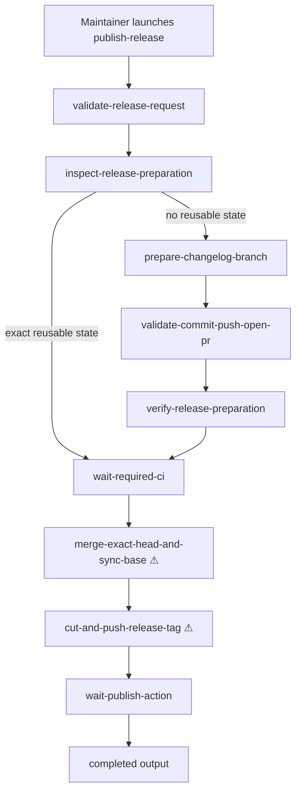

# Publish Release Workflow Technical Design Document / RFC

| Document Metadata      | Details |
| ---------------------- | ------- |
| Author(s)              | Norin Lavaee |
| Status                 | Approved for implementation |
| Team / Owner           | Atomic maintainers |
| Created / Last Updated | 2026-06-10 / 2026-08-21 |

## 1. Executive Summary

This RFC defines the project-local `publish-release` workflow under `.atomic/workflows/publish-release.ts`. The implemented workflow accepts `target_version`, `release_kind`, and a versionless `base_ref`; prepares or exactly reuses a changelog-only release branch and open PR; gates the exact PR head on configured required checks; merges and synchronizes the selected base; cuts a detached version-stamped tag with `scripts/cut-release.ts`; and verifies the automatically triggered publish run. Flexible changelog, merge, and tag work remains in tracked model stages, while preparation identity and both external wait gates are deterministic durable `ctx.tool` operations.

## 2. Context and Motivation

### 2.1 Current State

The release process is documented in `AGENTS.md` and automated by a project-local workflow discovered from `.atomic/workflows/publish-release.ts`. Workflow support code lives below `.atomic/workflows/lib/` so discovery sees only the workflow definition at the top level.

Relevant current constraints:

- Release flow is tag-driven: merging the changelog-only PR does not publish; pushing the detached version tag does.
- Supported bases remain versionless at `0.0.0`; only `scripts/cut-release.ts` stamps the detached release commit.
- Release branches contain changelog files only.
- Required-check configuration comes from GitHub branch protection and active rulesets; configured checks may materialize after the PR is opened.
- Workflow definitions use `workflow({...})`, declare outputs explicitly, and use durable `ctx.tool` nodes for workflow-owned external polling.

### 2.2 The Problem

Manual release execution is long, stateful, and contains remote side effects. The risky operations are spread across chat instructions rather than a reusable, inspectable workflow graph. Failures in CI or publish monitoring require structured handoff back to the maintainer instead of silent partial progress.

## 3. Goals and Non-Goals

### 3.1 Functional Goals

- Provide a workflow named `publish-release` discoverable from `.atomic/workflows`.
- Require `target_version` and `release_kind` up front.
- Validate release versions:
  - `release`: `MAJOR.MINOR.PATCH`
  - `prerelease`: `MAJOR.MINOR.PATCH-alpha.REVISION`
- Prepare a changelog-only `release/<version>` or `prerelease/<version>` branch from the exact current remote base, or reuse an exact existing one-commit branch and matching open PR.
- Never reset or force-push reuse state; reject conflicting base, files, commit, branch, local/remote SHA, or PR identity.
- Discover and poll all configured required check context/app identities for the captured PR head; treat missing configured checks as pending and fail on empty configuration, drift, terminal failure, command/auth error, abort, or timeout.
- Merge only the exact verified PR head and synchronize the selected versionless base.
- Run `scripts/cut-release.ts` for the detached versioned tag, then poll the exact automatically triggered publish run through success.
- Keep the release/prerelease branch after merge and return a compact result with status, version, kind, PR reference, tag, and summary.

### 3.2 Non-Goals

- Do not publish directly from the local machine.
- Do not support arbitrary prerelease labels beyond `alpha`.
- Do not introduce new release scripts or build steps.
- Do not modify workflow discovery/runtime internals.
- Do not bypass CI, force-push tags, or merge on failing checks.

### 3.3 Backwards Compatibility

This is an additive project-local workflow. It must not change existing package APIs, workflow SDK behavior, release scripts, CI configuration, or discovery semantics. Existing `.atomic/workflows` contract/HIL fixtures remain untouched.

## 4. Proposed Solution (High-Level Design)

### 4.1 System Architecture Diagram



### 4.2 Architectural Pattern

Selected starter pattern: **Classify-and-act + loop until done + adversarial verification**.

- Classify-and-act: `release_kind` selects branch prefix and version regex.
- Loop until done: CI and publish monitoring are bounded wait/check stages that continue until success/failure evidence exists.
- Adversarial verification: local validation and CI/publish status stages verify the generated release state before dangerous doors proceed.

### 4.3 Key Components

| Component | Responsibility | Implementation |
| --------- | -------------- | -------------- |
| Workflow definition | Declares the unchanged inputs/outputs and ordered release stages | `.atomic/workflows/publish-release.ts` |
| Durable boundaries | Inspect exact Git/GitHub preparation state and poll required CI/publish identity with finite timeouts and abort propagation | `ctx.tool(...)` callbacks backed by `.atomic/workflows/lib/publish-release.ts` |
| Agent stages | Prepare changelogs, create the exact PR, merge/synchronize the base, and cut the detached tag after deterministic gates admit each effect | `ctx.task(...)` prompts |
| Failure handling | Exit blocked/failed before later effects on conflict, empty protection, drift, command/auth error, terminal failure, abort, or timeout | Deterministic workflow-code checks and `ctx.exit(...)` |
| Output contract | Expose release status and exact references | Declared workflow outputs |

### 4.4 The Door Set at a Glance

`validate-release-request`, `inspect-release-preparation`, `prepare-changelog-branch`, `validate-commit-push-open-pr`, `verify-release-preparation`, `wait-required-ci`, `merge-exact-head-and-sync-base` ⚠, `cut-and-push-release-tag` ⚠, `wait-publish-action`, completed output.

## 5. Detailed Design

### 5.1 The Doors (Entrypoint Contracts)

```ts
type ReleaseKind = "release" | "prerelease";
type ReleaseStatus = "completed" | "blocked" | "failed";

validateReleaseRequest(input): ValidReleaseRequest | VersionFormatError
// Guarantee: returns typed release metadata only when kind and version format agree.

inspectReleasePreparation(input): PrepareRequired | ExactReusableRelease
// Guarantee: returns reusable state only for a clean checkout, one exact changelog-only commit atop the remote base, and one matching open PR.

waitRequiredCi(pr: ExactReleasePr): PassedCi | ReleaseFailure
// Guarantee: passes only when every exact configured required check succeeds for the captured head, or that exact PR was admin-merged.

mergeExactHeadAndSyncBase(pr: PassedCi): SynchronizedBase | ReleaseFailure
// Guarantee: merges or verifies only the captured PR head and fast-forwards the selected versionless base. IRREVERSIBLE remote effect.

cutAndPushReleaseTag(base: SynchronizedBase): DetachedRelease | ReleaseFailure
// Guarantee: runs the repository release cutter and verifies the exact detached tag/commit without moving the base. IRREVERSIBLE remote effect.

waitPublishAction(release: DetachedRelease): PublishedRelease | ReleaseFailure
// Guarantee: passes only for the exact successful publish.yml push run matching the tag and release SHA.
```

| Door | Joint | One-sentence guarantee | Refusals | Chokepoint |
| ---- | ----- | ---------------------- | -------- | ---------- |
| `validate-release-request` | Request validity | Produces validated release/base metadata. | Wrong release/prerelease format; leading `v`; invalid alpha revision; noncanonical base. | Input airlock |
| `inspect-release-preparation` / `verify-release-preparation` | Exact preparation identity | Requires a clean checkout and either no reusable state or one exact changelog-only commit plus matching open PR. | Dirty state; conflicting base, files, commit, branch, local ref, or PR identity; Git/GitHub errors. | Durable preparation gate |
| `wait-required-ci` | Exact required-CI evidence | Polls until every configured context/app identity passes for the captured head, or the exact PR was admin-merged. | Empty protection; missing checks at timeout; failure; identity drift; command/auth error; abort. | Durable CI gate |
| `merge-exact-head-and-sync-base` ⚠ | Exact-head merge and base synchronization | Merges or verifies only the CI-admitted head and synchronizes the selected versionless base. | Changed PR/head/base/check state; non-fast-forward or dirty base. | Sole merge door |
| `cut-and-push-release-tag` ⚠ | Detached release creation | Cuts and verifies the exact detached release tag from the synchronized base. | Base drift; conflicting tag; version/base-trailer mismatch; command failure. | Sole publish trigger |
| `wait-publish-action` | Exact publish completion | Polls until the matching publish workflow push run exists and succeeds. | Missing run at timeout; repository/workflow/tag/SHA/event drift; non-success; command/auth error; abort. | Final durable gate |

### 5.2 Workflow Inputs

```ts
.input("target_version", Type.String({ description: "Version to publish, without a leading v." }))
.input("release_kind", Type.Union([Type.Literal("release"), Type.Literal("prerelease")], { description: "Release type; must match target_version format." }))
```

The workflow should fail early when:

- `release_kind === "release"` and `target_version` does not match `^\d+\.\d+\.\d+$`.
- `release_kind === "prerelease"` and `target_version` does not match `^\d+\.\d+\.\d+-alpha\.[1-9]\d*$`.
- `target_version` starts with `v`.

### 5.3 Workflow Outputs

```ts
.output("status", Type.Union([Type.Literal("completed"), Type.Literal("blocked"), Type.Literal("failed")]))
.output("target_version", Type.String())
.output("release_kind", Type.Union([Type.Literal("release"), Type.Literal("prerelease")]))
.output("branch", Type.String())
.output("pr_url", Type.Optional(Type.String()))
.output("tag", Type.Optional(Type.String()))
.output("summary", Type.String())
```

### 5.4 Stage Plan

1. `validate-release-request` — deterministic version/kind and canonical base validation.
2. `inspect-release-preparation` — durable Git/GitHub preflight that requires a clean porcelain status, reads the exact remote base and release branch, optional local release branch, exhaustive paginated commit file/parent identity (including both sides of renames), and matching open PR.
3. If no branch or PR exists, `prepare-changelog-branch` creates a changelog-only diff and `validate-commit-push-open-pr` validates, commits, pushes without force, and opens the PR. `verify-release-preparation` then reruns the deterministic inspection and requires the clean worktree plus model-reported and observed PR identities to match.
4. If the exact changelog-only commit and matching open PR already exist, reuse their unchanged branch, files, head SHA, and PR identity and skip both preparation stages. Dirty, partial, or conflicting state stops before mutation.
5. `wait-required-ci` — one durable `ctx.tool` node polls for up to 45 minutes. Each observation rereads the exact PR plus required status-check configuration from branch protection and active branch rules, then reads check runs and commit statuses for the captured head SHA. Only the classic unprotected-branch status-check lookup may be absent; rules lookup errors fail closed. Missing configured checks remain pending. Empty configuration, identity drift, terminal failure, command/auth error, abort, or timeout stops the run; exact admin merge also satisfies the gate.
6. `merge-exact-head-and-sync-base` — merges only with the captured PR selector and head SHA, or verifies that exact head was already merged, then fast-forwards and verifies the selected versionless base.
7. `cut-and-push-release-tag` — runs `bun run scripts/cut-release.ts <version> --base <base_ref> --push --yes` and verifies the detached release commit/tag identity without moving the base.
8. `wait-publish-action` — one durable `ctx.tool` node polls for up to 60 minutes for the exact `bastani-inc/atomic` push run at `.github/workflows/publish.yml`, matching workflow identity, tag, and release SHA. A not-yet-created run remains pending; drift, command/auth error, abort, timeout, or a completed non-success result stops the run.
9. Return the unchanged declared output shape with compact exact identities and evidence.

The two polling callbacks forward the tool's `AbortSignal` to every `gh` process and bounded sleep. Each tool also has a finite deadline longer than its internal polling window. Large command output remains in the durable tool record while the final `summary` stays compact.

Large command output should stay in stage transcripts/artifacts, while the final returned `summary` stays compact.

## 6. Alternatives Considered

| Option | Pros | Cons | Decision |
| ------ | ---- | ---- | -------- |
| One giant stage | Simple file | Harder to inspect, recover, and attach to precise failure points | Rejected |
| Deterministic shell script | Repeatable | Loses workflow graph/HIL/status benefits and needs exact gh/CI scripting | Rejected |
| Multi-stage workflow with toolful agents | Inspectable, resumable, aligns with Atomic workflow model | Depends on agent/tool competence for command adaptation | Selected |

## 7. Cross-Cutting Concerns

- **Security:** The workflow relies on local git and `gh` credentials; it must not fabricate success when auth is missing.
- **Irreversibility:** Merging and tag pushing are separate honest doors; the `merge-exact-head-and-sync-base` task must read back and verify the exact merged head and base synchronization, return the structured `base_sha`, and the workflow validates that structured result before admitting detached tag creation.
- **Failure behavior:** CI/publish failures produce `blocked`/`failed` summaries with evidence rather than continuing.
- **Concurrency:** The workflow should refuse dirty or conflicting git state unless the stage can safely commit existing release changes as intended.
- **Bun compliance:** All local validation/version/dependency commands use Bun.
- **Evidence:** Stage responses should prefer programmatically verifiable `git`/`gh` evidence such as source SHAs, PR JSON fields, check status, remote branch presence, tag SHA, and Actions run URLs over prose assertions.

## 8. Test Plan

- Unit-test request validation, exact preparation reuse, clean-worktree enforcement, exhaustive commit-file pagination and rename-source validation, every conflicting reuse identity, configured-but-missing checks, empty configuration, partial-source rules lookup failure, failed required checks, PR identity drift, exact admin merge, timeout, abort, command/auth error propagation, publish identity drift, and terminal publish failure.
- Run a safe executable workflow scenario with an injected fake command transport below the production Git/GitHub boundary adapter. It must exercise production endpoint selection and parsing, reuse or prepare the exact release state, observe required checks absent before they pass, fake exact-head merge/base synchronization and detached-tag verification, observe the publish run absent before it succeeds, and assert that no real network or release command ran.
- Run `npm run test:unit`, repository-relevant integration/CI-contract suites, and `npm run check`.
- Inspect workflow discovery/import contracts and the final diff. Do not run a real happy-path release, merge, tag, push, or publish as validation.

## 9. Open Questions / Unresolved Issues

Resolved before implementation:

- Workflow name: `publish-release`.
- Authority: fully autonomous after required inputs; pause/report only on failures or missing credentials.
- Inputs: require both `target_version` and `release_kind`.
- Local validation: run `bun run typecheck` and `bun run test:unit` before PR creation.
