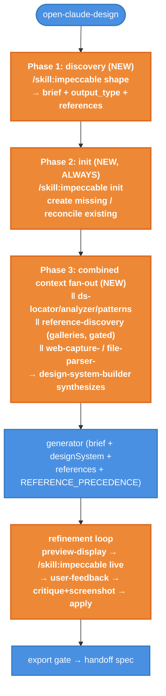

# Open Claude Design — Init, Reference Discovery & Live Interactive QA

| Document Metadata      | Details                         |
| ---------------------- | ------------------------------- |
| Author(s)              | flora131                        |
| Status                 | Draft (WIP)                     |
| Team / Owner           | Atomic CLI / Workflows          |
| Created / Last Updated | 2026-06-21                      |
| Compatibility posture  | Breaking input change (removes `reference`/`output_type`/`design_system`) |

## 1. Executive Summary

This RFC restructures the builtin `open-claude-design` workflow's front door around the accessible `impeccable` skill (`/skill:impeccable …`):

1. **Phase 1 — Discovery interview.** A new first `discovery` stage runs `/skill:impeccable shape` to interview the user for a confirmed design brief, the **output type** (`prototype`/`wireframe`/`page`/`component`/`theme`/`tokens`), and the **references** to emulate (URLs/files/screenshots/design docs). It returns a structured `{ brief, output_type, references }`. User references take **precedence over `DESIGN.md`/`PRODUCT.md`** during generation.
2. **Phase 2 — Project context (`init`, always).** The workflow always runs an `init` stage that invokes `/skill:impeccable init` (reusing the discovery answers). It detects `PRODUCT.md`/`DESIGN.md` (root, `.agents/context/`, `docs/`, case-insensitive), creates whichever is missing, and reconciles existing files against the brief without clobbering them.
3. **Combined context phase.** Onboarding (`ds-*` → builder), the gated gallery `reference-discovery`, and user-reference import all run **concurrently in one fan-out**, then the design-system synthesis closes it. A `discover_references` boolean input (default `true`) gates the gallery pass; user references take **precedence over `DESIGN.md`/`PRODUCT.md`**.
4. **Live interactive QA.** The `preview-display-*` stages drive `/skill:impeccable live` against the static `preview.html`: pick elements, annotate, generate three on-brand variants, accept; captured notes/accepts thread through the refinement feedback loop. Degrades to `playwright-cli show --annotate`.

The public input set is trimmed to `prompt`, `discover_references`, and `max_refinements`; `reference`, `output_type`, and `design_system` are removed and gathered by the discovery interview instead.

## 2. Context and Motivation

### 2.1 Current State

`open-claude-design` (`packages/workflows/builtin/open-claude-design*.ts`) runs: onboarding (locator/analyzer/patterns → design-system-builder) → import → generator (`preview.html`) → bounded refinement loop (preview-display annotation → user-feedback → critique + screenshot → apply-changes) → export gate → rich HTML spec. Each stage already delegates to a specific impeccable sub-skill by name in its prompt.

- Onboarding assumes a design system can be derived from the repo, but never **establishes** `PRODUCT.md`/`DESIGN.md` when the project is greenfield — so branding/register intent is inferred, not confirmed with the user.
- The generator works only from the repo-derived system + an optional single `reference`; there is no proactive search for best-in-class visual references.
- Interactive review uses `playwright-cli show --annotate` (passive annotation), not impeccable's richer in-browser variant QA (`live`).

### 2.2 The Problem

- **No confirmed design north star.** Greenfield runs produce generic output because register/brand/anti-references were never captured (impeccable's own `init`/`setup` requires this first; skipping it "produces generic output").
- **No reference inspiration.** Beautiful, current design references materially raise output quality; today the user must supply one URL by hand.
- **Thin interactive QA.** Annotation capture is one-directional; the user cannot pick an element and compare on-brand variants in the browser as impeccable `live` allows.

## 3. Goals and Non-Goals

### 3.1 Functional Goals

- [ ] **G1:** Run a `discovery` stage first (`/skill:impeccable shape`) that interviews the user for the design brief, output type, and references, returning structured `{ brief, output_type, references }`.
- [ ] **G2:** Run `init` second and conditionally: detect `PRODUCT.md`/`DESIGN.md` and only invoke `/skill:impeccable init` when missing, reusing discovery answers; skip when both exist or headless (best-effort, never blocks).
- [ ] **G3:** Trim inputs to `prompt`, `discover_references`, `max_refinements`; remove `reference`, `output_type`, `design_system`.
- [ ] **G4:** Make user-provided references take precedence over `DESIGN.md`/`PRODUCT.md` in import, generation, and refinement.
- [ ] **G5:** Add a gated `reference-discovery` gallery stage and thread its brief into the generator and refinement.
- [ ] **G6:** Drive `/skill:impeccable live` from the `preview-display-*` stages; capture accepted variants/notes (`live_changes`) into `previewFeedbackHistory`; degrade to `playwright-cli show --annotate`.
- [ ] **G7:** Keep every touched file ≤ 500 physical lines (file-length gate); put new logic in `open-claude-design-setup.ts`.

### 3.2 Non-Goals

- [ ] No new model providers; reuse the existing `designModelConfig` chain.
- [ ] No change to the export gate, handoff spec, or output contract (no new outputs).
- [ ] No bespoke re-implementation of the impeccable `init`/`live` scripts inside the workflow — delegate to `/skill:impeccable …`; only replicate "similar logic" (detection + degradation) in TS.
- [ ] No removal of the existing annotation-capture fallback; live is the preferred path, annotation is the floor.

## 4. Proposed Solution (High-Level Design)

### 4.1 Stage Flow



### 4.2 Architectural Pattern

Phased pipeline with a bounded refinement loop (unchanged), extended with a **classify-and-act** front door (init: detect → conditionally interview) and a **fan-in reference** stage (gather curated references → single brief). Interactive QA is a **generate-and-select** loop driven by the external impeccable `live` skill.

### 4.3 The Door Set at a Glance (Stranger-Across-Time View)

Public input door (the only caller-facing surface):

- `prompt`, `reference`, `output_type`, `design_system`, `max_refinements`, **`discover_references` (NEW)**.

Internal stage doors (named for design joints, not tools):

- `init` ⚠ (writes `PRODUCT.md`/`DESIGN.md` to the project root) → onboarding → `reference-discovery` → import → `generator` ⚠ (writes `preview.html`) → `preview-display` (drives live; may write `preview.html`) → refinement → export ⚠ (writes `spec.html`).

Reading these names alone: the workflow first *establishes the brand*, then *gathers inspiration*, then *generates*, then *iterates with the user in the browser*, then *hands off*.

## 5. Detailed Design

### 5.1 The Doors (Entrypoint Contracts)

Public input set after the change (`open-claude-design.ts` + `.d.ts`): `prompt`, `discover_references` (boolean, default `true`), `max_refinements`. The `reference`, `output_type`, and `design_system` inputs are removed; the discovery interview gathers them instead.

```ts
discover_references: Type.Boolean({
  default: true,
  description:
    "Discover beautiful, current reference designs (Awwwards, recent.design, Dribbble, Monet, Motionsites) and feed them to generation. Set false to skip the network/browser reference pass.",
})
```

New module `open-claude-design-setup.ts` exposes four internal doors (typed pseudocode):

```ts
// Phase 1. Interview the user (impeccable `shape`) for the design brief.
runDiscovery(args): Promise<{ brief: string; output_type: OutputType; references: string[] }>
// Guarantee: returns the confirmed brief, output type, and references to emulate. Tolerant of
// headless runs (falls back to the raw prompt, default output type, and an empty reference set).

// Deterministic, no LLM. Searches root, .agents/context/, docs/ (case-insensitive).
detectDesignContextFiles(cwd: string): {
  productPath?: string; designPath?: string; hasProduct: boolean; hasDesign: boolean; hasBoth: boolean;
}
// Guarantee: reports which design-context files already exist on disk. Never writes, never throws.

// Phase 2. Best-effort; runs at most one `init` task stage, reusing discovery answers.
ensureProjectDesignContext(args): Promise<{ initRan: boolean; summary: string; detection: <detect result> }>
// Guarantee: ensures PRODUCT.md/DESIGN.md exist by delegating to /skill:impeccable init when missing,
// skipped when both already exist. Never blocks the workflow: a failed/headless init degrades to "skipped".

// Reference discovery stage. Gated by discover_references upstream.
discoverReferenceDesigns(args): Promise<string>
// Guarantee: returns a curated references brief (markdown) drawn from the five galleries, or an
// explicit "no references" sentinel when gathering fails. Best-effort; persists references.md.
```

Shared helper (used by both runner and phases to keep each ≤500 lines):

```ts
buildLivePreviewDisplayPrompt(args): string
// Builds the interactive-QA-via-/skill:impeccable live prompt for preview-display-initial and
// preview-display-<iteration>, with graceful degradation to playwright-cli show --annotate.
```

**Per-door audit:**

| Door | Joint | One sentence | Honest name | Every exit | Chokepoint |
|---|---|---|---|---|---|
| `discover_references` (input) | ✅ "discover references" | ✅ toggles the reference pass | ✅ default true, opt-out | `false` → stage skipped, brief = sentinel | n/a |
| `detectDesignContextFiles` | ✅ "detect context" | ✅ reports existence only | ✅ pure read | missing dirs → `false` flags | n/a |
| `ensureProjectDesignContext` ⚠ | ✅ "establish brand context" | ✅ ensures files exist | ✅ delegates, never fabricates | headless/skip → `initRan:false` | the only door that triggers `init` |
| `discoverReferenceDesigns` | ✅ "gather inspiration" | ✅ returns one brief | ✅ best-effort | gather fail → sentinel brief | the only reference-gathering door |

### 5.2 Wiring (`open-claude-design-runner.ts`)

1. After `prepareArtifactDir`, before onboarding: `const init = await ensureProjectDesignContext({ designContext, cwd: workflowCwd, prompt, designSystemInput, designModelConfig });`
2. Onboarding unchanged; the `init` summary is appended to the design-system-builder context so the builder respects freshly written `PRODUCT.md`/`DESIGN.md`.
3. After `designSystem` is resolved, before import/generator:
   `const referencesBrief = inputs.discover_references === false ? NO_REFERENCES_SENTINEL : await discoverReferenceDesigns({ designContext, prompt, outputType, designSystem, artifactDir, workflowCwd, browserBootstrapRules, designModelConfig });`
4. Generator prompt gains a `reference_inspiration` block = `referencesBrief`.
5. `preview-display-initial` uses `buildLivePreviewDisplayPrompt(...)`; same prompt builder is used per-iteration in `refineOpenClaudeDesign`.
6. `referencesBrief` is passed into `refineOpenClaudeDesign` and surfaced to `apply-changes-*` so iterations keep pulling from the references.

### 5.3 Live QA Feedback Threading (`open-claude-design-feedback.ts`)

- Add a `live_changes` extracted field (alongside `user_notes` / `annotated_snapshot`) to `FIELD_LABELS` for bounded multi-line extraction.
- `toPreviewFeedback` captures `liveChanges`; `buildUserAnnotationsSection` includes accepted live changes inside the user-annotations block so `apply-changes-*` honors them above internal critique (existing ordering preserved).
- Since live accepts edit `preview.html` directly, the artifact already reflects them; the captured summary ensures the reviewer/apply stages know what the user explicitly approved.

### 5.4 Reference Galleries

`REFERENCE_DESIGN_SITES` = Awwwards (`/websites/`), recent.design, Dribbble (`/shots/recent`), Monet (`/c`), Motionsites. The stage prompt: open each with `playwright-cli`, screenshot 1–3 standout works each into `artifactDir`, capture title/author/URL and the concrete transferable trait (layout, type, motion, color), and synthesize a brief ranked by relevance to `prompt`/`output_type`/`designSystem`. Web search/fetch fallback when the browser is unavailable; never fabricate visual claims.

## 6. Alternatives Considered

| Option | Pros | Cons | Verdict |
|---|---|---|---|
| Init via in-TS `ctx.ui` interview | deterministic, testable | duplicates the skill's interview; drifts from impeccable | Rejected — delegate to `/skill:impeccable init`. |
| References folded into import phase | fewer stages | conflates user-supplied reference with gallery discovery; harder to gate | Rejected — dedicated gated stage. |
| Keep annotation-only QA | no live config complexity | misses element-level variant QA the user asked for | Rejected — drive `live`, keep annotation as floor. |

## 7. Cross-Cutting Concerns

- **Best-effort & non-blocking.** Init, reference discovery, and live all degrade gracefully (headless/test, no browser, no network) and never fail the run; the existing manual-path fallbacks remain.
- **File-length gate.** New logic lives in `open-claude-design-setup.ts`; runner/phases shrink by extracting the shared preview-display prompt, staying ≤500 lines.
- **No new outputs / no breaking changes.** Output contract and existing tests' assertions stay valid; new tests cover the added input, init gating, reference stage, and live prompt.

## 8. Test Plan

- **Input contract:** `discover_references` present, boolean, default `true`.
- **Init gating:** with no context files and a writable temp cwd, the `init` task runs and its prompt invokes `/skill:impeccable init`; with `design_system` supplied or both files present, no `init` task is recorded.
- **Reference stage:** runs when `discover_references !== false`; prompt names all five galleries and the `playwright-cli` bootstrap; skipped (sentinel brief, no `reference-discovery` task) when `false`.
- **Generator:** receives a `reference_inspiration` block.
- **Live QA:** `preview-display-*` prompts reference `/skill:impeccable live` and retain the `playwright-cli` degradation and `user_notes`/`annotated_snapshot` labels; existing annotation-threading tests still pass.
- **Gates:** `bun run typecheck`, `bun run lint`, `bun run check:file-length`, and the two open-claude-design unit suites.

## 9. Open Questions / Unresolved Issues

- [x] Init approach → delegate to `/skill:impeccable init`, run **second** and only when `PRODUCT.md`/`DESIGN.md` are missing (user-confirmed).
- [x] Discovery → a first `discovery` stage (`/skill:impeccable shape`) asks for the brief, output type, and references (user-confirmed).
- [x] Inputs → remove `reference`, `output_type`, `design_system`; keep `prompt`, `discover_references`, `max_refinements` (user-confirmed).
- [x] References precedence → user references are primary, `DESIGN.md` fills gaps (user-confirmed).
- [x] Live QA depth → drive `/skill:impeccable live` on `preview.html` (user-confirmed).
- [x] Reference gating → new `discover_references` input, default true (user-confirmed).
- [x] Reference tooling → browser + screenshots, web-search fallback (user-confirmed).
