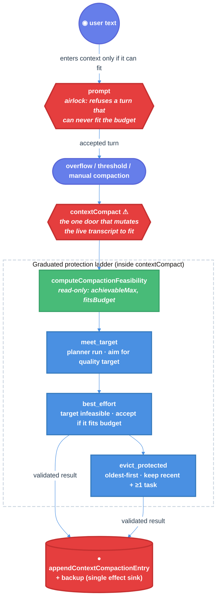

# Context Compaction: Feasibility-Aware Graduated Protection Technical Design Document / RFC

| Document Metadata      | Details                          |
| ---------------------- | -------------------------------- |
| Author(s)              | Alex Lavaee                      |
| Status                 | In Review (RFC)                  |
| Team / Owner           | Atomic CLI — core/compaction     |
| Created / Last Updated | 2026-06-27                       |

## 1. Executive Summary

Verbatim context compaction currently enforces a single hard gate: reduce the
transcript by **exactly `(1 - compression_ratio)` (default 50%) or throw**. That
gate conflates two different promises — a *quality target* (don't re-compact too
soon) and a *liveness constraint* (the next turn must fit the model's input
budget). When the strict percentage is infeasible — because protected mass
(every `user`/`custom`/`branchSummary` entry, the `preserve_recent` window, the
latest assistant thinking block, and protected tool-call/result pairs) cannot be
deleted — the run throws even when the result already fits the window. The
observed failure ("attempt reached 46.5% with 146 validated deletion target(s)")
is exactly this: a perfectly continuable compaction rejected by the quality gate,
which dead-ends auto-compaction overflow recovery.

This RFC reshapes the central door, **`contextCompact`**, from "reduce by exactly
X% or fail" into "**fit the session back inside the model's input budget, reducing
as far as protection allows, and report honestly how it got there.**" It adds one
read-only analysis door, **`computeCompactionFeasibility`**, and a two-strategy
deterministic fallback ladder (`best_effort` relax → `evict_protected`),
funnelling the new eviction effect through the *existing* compaction-entry
chokepoint. Separately, it hardens the **`prompt`** door so a single user message
that cannot ever fit the budget is **refused at submission** rather than allowed
into context where it would be permanently un-compactable — making that pathology
structurally impossible for compaction to encounter.

## 2. Context and Motivation

**Evidence:** a failing real-world session (a workflows-parent
architect session, model `github-copilot/claude-opus-4.8`), footer
`97.3%/272k (auto)`, error banner *"Auto-compaction failed: Context compaction did
not meet the strict 50% reduction requirement; attempt reached 46.5% with 146
validated deletion target(s)."* The session carried **9 prior `context_compaction`
entries**; recorded reductions across them: `50.4, 51.0, 54.2, 51.3, 50.8, 54.7,
50.3, 50.0, 40.4` — a clear declining-feasibility trend, with one prior round
already landing below 50%. In the failing case, 53.5% of a near-full `272k` window
(~141k est.) fits comfortably; the result was continuable and was thrown away
purely for missing the heuristic percentage.

### 2.1 Current State

- **Single attempt, hard throw.** `contextCompact`
  (`src/core/compaction/context-compaction-runner.ts:238-265`) runs one deletion
  assistant pass and `throw`s `formatContextCompactionTargetFailureMessage(...)`
  if `contextCompactionTargetMet(...)` is false. There is no feasibility
  pre-check and no fallback (confirmed: no `feasib|achievable|relax|best.effort`
  logic anywhere under `src/core/compaction/`).
- **Target = `(1 - compression_ratio) * 100`**, default 50%
  (`context-compaction-metrics.ts:28-30`, `context-compaction-types.ts:80-81`).
- **`tokensBefore` is a transcript estimate** (sum of per-entry chars/4 +
  fixed image constant), not provider usage
  (`context-transcript-analysis.ts:272`). The footer percentage (provider-usage
  context-window fullness) and the internal `percentReduction` use *different
  denominators*.
- **Protection is absolute and static.** `isProtectedEntry`
  (`context-transcript-analysis.ts:198-211`) marks protected, unconditionally:
  every `user`, `custom`, `branchSummary` message; the `preserve_recent` window;
  assistant `error` / tool-result `isError` / failed `bashExecution` entries.
  `canDeleteTarget` (`context-deletion-targets.ts:353-363`) never relaxes these.
- **Coupling locks more than the protected entries themselves.**
  `reconcileToolDependencies` (`context-deletion-application.ts:35-139`) throws
  if a tool call whose paired result is protected is deleted (and vice-versa);
  `assertNoLatestAssistantThinkingDeletionTargets` makes the latest retained
  assistant-with-thinking all-or-nothing and undeletable — a *moving* protection.
- **Tool *results* are size-guarded; user messages are NOT.**
  `oversized-tool-result.ts` (+ `agent-session-tool-hooks.ts`) offloads any tool
  output over `DEFAULT_MAX_RESULT_SIZE_CHARS` to a file and returns a preview;
  `truncate.ts` caps tool output at 50KB / 3000 lines. **No truncation or cap
  exists for `user` message content** at the `prompt` door
  (`agent-session-prompt.ts:11`), and user messages are always protected — so a
  single oversized user paste is both un-truncated and un-deletable.
- **Overflow recovery dead-ends.** `_checkCompaction`
  (`agent-session-auto-compaction.ts:43-72`) → `_runAutoCompaction("overflow")`
  → `contextCompact` throws → `_overflowRecoveryAttempted` latches → user sees
  *"Try reducing context or switching to a larger-context model."* The session is
  bricked.

#### Leaking door (today)

`contextCompact` is named for a *tool* ("compact") but its real domain job is
*"keep the session continuable."* Its compression is **dishonest**: the name
implies "reduce context," yet the body sometimes refuses a result that already
satisfies the only constraint that matters (fits the window), because it is
secretly gating on a quality heuristic. `prompt` is also too trusting: it accepts
a turn it can never make continuable.

### 2.2 The Problem

- **User impact:** long, productive sessions (architect/workflow parents,
  debugging marathons) hit a wall once their irreducible protected core
  approaches the window; auto-compaction fails and the session cannot continue.
- **Correctness impact:** results that fit the window are thrown away purely for
  missing a heuristic percentage.
- **Latent dead-end:** a single giant `user` paste can exceed the window with no
  mechanism to recover, because nothing refuses it at input nor evicts protected
  user content.

## 3. Goals and Non-Goals

### 3.1 Functional Goals

- [ ] `contextCompact` returns a continuable result whenever the transcript can
      be made to fit `effectiveInputBudget − reserveTokens`, even if the quality
      target is unmet.
- [ ] When the quality target is **provably infeasible** but the result fits the
      budget, **accept silently** and record a machine-readable reason (no
      user-facing error).
- [ ] When protected mass alone overflows the budget, deterministically **evict**
      oldest protected entries (`user`/`custom`/`branchSummary`) oldest-first,
      always preserving ≥1 task-bearing entry and the `preserve_recent` window,
      until the result fits.
- [ ] The **`prompt`** door **refuses** a single user message whose estimated
      tokens exceed `effectiveInputBudget − reserveTokens`, with a precise,
      actionable error — before it enters context.
- [ ] Preserve all existing invariants: ≥1 task-bearing entry, tool-call/result
      pairing integrity, latest-assistant-thinking integrity.
- [ ] All new result fields are additive; existing exported signatures and
      success behavior are unchanged for sessions that still meet the target.

### 3.2 Non-Goals (Out of Scope)

- [ ] We will NOT make protection relaxation planner/LLM-driven; the ladder is
      **deterministic** so liveness is guaranteed and unit-testable.
- [ ] We will NOT truncate/rewrite entry content inside compaction. Verbatim
      compaction stays **delete-only**; the single-oversized-message pathology is
      handled upstream by the `prompt` refusal, not by an in-compaction
      content-truncation strategy.
- [ ] We will NOT introduce a second public path that mutates the live transcript;
      the eviction effect passes the **existing** compaction-entry chokepoint only.
- [ ] We will NOT change the default `compression_ratio` (0.5) or the meaning of
      the quality target.
- [ ] We will NOT add summarization/synthesis to compaction.
- [ ] We will NOT reconcile the estimator-vs-usage denominator mismatch here
      (tracked separately); we use the transcript estimate consistently, with
      `reserveTokens` serving as the safety margin.

## 4. Proposed Solution (High-Level Design)

### 4.1 System Architecture Diagram



### 4.2 Architectural Pattern

**Loop-until-feasible with a deterministic fallback ladder, plus an airlock
refusal.** A read-only feasibility oracle decides which strategy is required; each
strategy strictly increases how much protection it relaxes, and the first strategy
that produces a budget-fitting validated result wins. The `prompt` airlock makes
the one input that no strategy could ever absorb structurally impossible.

### 4.3 Key Components

| Component                        | Responsibility                                                        | Location                                             | Justification                                          |
| -------------------------------- | -------------------------------------------------------------------- | ---------------------------------------------------- | ------------------------------------------------------ |
| `computeCompactionFeasibility`   | Pure: max deletable, achievable tokensAfter, fitsBudget, strategy needed | new `context-compaction-feasibility.ts`              | Liveness must be deterministic + unit-testable.        |
| Strategy orchestration           | Walk `meet_target`→`best_effort`→`evict_protected`; first budget-fitting result wins | `context-compaction-runner.ts` (`contextCompact`)     | Keep the ladder in the existing orchestrator door.     |
| Forced eviction path             | Validate a deletion set that intentionally includes protected entries | `context-deletion-application.ts` (`evict` flag)      | Reuse existing validator invariants; bypass only protection. |
| Oversized-input refusal          | Reject a single user message that exceeds the budget at submission   | `agent-session-prompt.ts` (`prompt`)                  | Make the un-compactable-message pathology unrepresentable. |
| Acceptance reason + telemetry    | Record how compaction succeeded for transparency/backup              | `ValidatedContextDeletionResult` / `ContextCompactionStats` additive fields | Honest exit; observability for declining feasibility.  |

### 4.4 The Door Set at a Glance (Stranger-Across-Time View)

> `prompt` ⚠, `prepareContextCompaction`, `computeCompactionFeasibility`,
> `contextCompact` ⚠, `validateContextDeletionRequest`.
>
> Reading these alone: the system *accepts a turn only if it could ever fit the
> model*, *prepares* a compactable view of the conversation (deciding what is
> sacred), *measures* how far that view can shrink and whether it will fit, *makes
> the conversation fit* through exactly one mutating door, and *validates* every
> proposed deletion against the invariants that keep the conversation coherent.
> `prompt` refuses the impossible turn; `contextCompact` is the only door that
> changes anything irreversible.

## 5. Detailed Design

### 5.1 The Doors (Entrypoint Contracts)

```
// — Vocabulary: the escalating strategies contextCompact uses to fit budget. —
type CompactionFitStrategy =
  | "meet_target"      // reduce to the quality target under full protection
  | "best_effort"      // target infeasible; keep the most feasible reduction that still fits budget
  | "evict_protected"; // protected mass overflows budget; evict oldest protected entries to fit

// — The airlock. Refuses input compaction could never absorb. —

prompt(text: string, options?: PromptOptions): Promise<void>
// Added refusal: if the estimated tokens of the resulting user message exceed
//   livenessBudget(model) = getEffectiveInputBudget(model) - reserveTokens,
//   reject with PromptExceedsBudgetError BEFORE the message enters agent state.
// Guarantee (strengthened): a user turn that enters context can always, in
//   principle, be made to fit the model's input budget.
// PromptExceedsBudgetError carries: estimatedTokens, budgetTokens, modelId — and a
//   message telling the user to shorten/split the input or switch to a larger model.

// — Analysis. Read-only. Decides which strategy the mutating door must use. —

computeCompactionFeasibility(
  transcript: CompactableTranscript,
  parameters: ContextCompactionParameters,
  budget: LivenessBudget,                 // newtype: getEffectiveInputBudget - reserveTokens (>0)
): CompactionFeasibility
// Guarantee: reports, without mutating anything, the maximal achievable verbatim
//            reduction under current protection and whether it fits `budget`.
// CompactionFeasibility = {
//   tokensBefore, maxDeletableTokens, achievableTokensAfter,
//   achievableReductionPercent, qualityTargetPercent,
//   targetFeasible: boolean,            // achievableReductionPercent >= qualityTargetPercent
//   fitsBudgetAtMaxDeletion: boolean,   // achievableTokensAfter <= budget
//   protectedFloorTokens,               // tokensBefore - maxDeletableTokens
//   recommendedStrategy: CompactionFitStrategy,
// }
// Never: never deletes, never throws on a well-formed transcript.

// — The one mutating door. Renamed promise, same symbol (back-compat). —

contextCompact(
  preparation: ContextCompactionPreparation,
  model: Model<Api>,
  apiKey: string,
  headers?: Record<string, string>,
  signal?: AbortSignal,
  thinkingLevel?: ThinkingLevel,
): Promise<ValidatedContextDeletionResult>   // now carries `fitStrategy` + telemetry
// Guarantee: returns a validated deletion plan whose estimated tokensAfter fits the
//            model's input budget, reducing as far as protection allows.
// Throws ONLY when no strategy can make the transcript fit the budget (truly irreducible),
//            or on provider/abort errors — never merely because the quality % was missed.
// fitStrategy: CompactionFitStrategy   // which strategy produced the accepted result
```

**Acceptance predicate (the heart of the change).** After the `meet_target`
planner run produces a validated result `r`, with feasibility `f` and
`budget = getEffectiveInputBudget(model) − reserveTokens`:

1. If `contextCompactionTargetMet(r)` → `fitStrategy = "meet_target"`. (unchanged)
2. Else if `f.targetFeasible === false` **and** `r.stats.tokensAfter ≤ budget`
   → accept, `fitStrategy = "best_effort"` *(accept a sub-target result ONLY when
   the target is provably infeasible AND it fits, so a merely under-performing
   planner is still retried/errored, never silently accepted — resolves §9 Q1=A)*.
3. Else if `f.fitsBudgetAtMaxDeletion === false` → run the **`evict_protected`**
   strategy, then re-validate; on fit, `fitStrategy = "evict_protected"`.
4. Else throw the existing strict-failure error (genuinely irreducible — should be
   unreachable for user-message overflow given the `prompt` refusal).

**Per-door audit (rubric):**

| Door                           | (1) Joint                         | (2) One sentence, no "and"                         | (3) Honest name                                  | (5) Every exit                                                | (6) Refusals real                                         | (8) One chokepoint                          |
| ------------------------------ | --------------------------------- | -------------------------------------------------- | ------------------------------------------------ | ------------------------------------------------------------- | --------------------------------------------------------- | ------------------------------------------- |
| `prompt` ⚠                     | ✅ "submit a turn"                 | ✅ "accept a turn that can be made to fit"          | ✅ refuses oversize before any state change       | oversize → `PromptExceedsBudgetError`; else enqueues          | an un-fittable user message is unrepresentable in context | ✅ sole entry for user text                  |
| `computeCompactionFeasibility` | ✅ "how small can this get, fits?" | ✅ "reports max reduction + budget fit"             | ✅ read-only; returns strategy signal, no mutation | malformed transcript → still returns a strategy signal, no throw | cannot mutate (no write surface in signature)             | n/a (safe door)                             |
| `contextCompact` ⚠             | ✅ "make the session continuable"  | ✅ "fit under budget, reducing as far as protection allows" | ✅ throws only on true irreducibility/abort       | provider error / abort / irreducible → throw; else fitting plan | cannot return an over-budget plan as success (predicate)  | ✅ sole producer of the applied deletion plan |

### 5.2 API Interfaces — The Same Doors In-Process

This subsystem has no network transport; its "wire" is the exported SDK surface in
`src/index.ts`. `contextCompact` and its result type are the public contract;
`prompt` is the `AgentSession` method every host calls. New fields and the new
`PromptExceedsBudgetError` are additive; no exported symbol is removed or re-typed.

### 5.3 Data Model / Schema

**`ValidatedContextDeletionResult` (additive fields):**

| Field                       | Type                                                              | Description                                              |
| --------------------------- | ---------------------------------------------------------------- | ------------------------------------------------------- |
| `fitStrategy?`              | `CompactionFitStrategy` (`"meet_target" \| "best_effort" \| "evict_protected"`) | Which strategy satisfied liveness; absent ⇒ legacy/met. |
| `evictedProtectedEntryIds?` | `string[]`                                                        | Entry ids force-evicted by `evict_protected` (oldest-first). |
| `achievedReductionPercent?` | `number`                                                         | Mirrors `stats.percentReduction` for reason-reading callers. |

**Eviction targets:** reuse `{ kind: "entry", entryId }`; the only change is a
validation-time `evict: true` option (§5.4) that bypasses the *protection* check
(`canDeleteTarget`) while keeping every other invariant (≥1 task-bearing,
tool-dependency pairing, latest-thinking). No new `ContextDeletionTarget` kind is
introduced — verbatim compaction stays delete-only.

### 5.4 Algorithms and State Management

**`prompt` oversized-input refusal (deterministic).** After skill/template
expansion yields the final user text (and images), before the message enters agent
state: if `estimateTokens(userMessage) > getEffectiveInputBudget(model) −
reserveTokens`, throw `PromptExceedsBudgetError`. Skips when no model/budget is
resolvable (cannot judge). Uses the same `estimateTokens` heuristic as compaction
so the input gate and the compaction budget agree.

**`computeCompactionFeasibility` (deterministic).**
1. Build the *maximal deletable request*: every entry/block for which
   `canDeleteTarget(transcript, target)` is true.
2. Run it through `validateContextDeletionRequest` (which applies
   `reconcileToolDependencies` + all invariants) to obtain `achievableTokensAfter`
   and `achievableReductionPercent`. Reusing the validator means the oracle and the
   planner agree on what is actually deletable.
3. `targetFeasible = achievableReductionPercent ≥ qualityTargetPercent`.
4. `fitsBudgetAtMaxDeletion = achievableTokensAfter ≤ budget`.
5. `protectedFloorTokens = tokensBefore − maxDeletableTokens`.
6. `recommendedStrategy`: `"meet_target"` if target feasible; `"best_effort"` if
   `!targetFeasible && fitsBudgetAtMaxDeletion`; `"evict_protected"` otherwise.

**`evict_protected` strategy (deterministic, oldest-first).**
- Candidate set = protected entries with role ∈ {`user`,`custom`,`branchSummary`}
  that are **not** in the `preserve_recent` window and are **not** the single
  most-recent task-bearing entry.
- Order by transcript position ascending (oldest first).
- Greedily add to the forced-eviction set, recomputing projected `tokensAfter`
  after each, stopping the instant `tokensAfter ≤ budget`.
- Validate the union (planner deletions + forced evictions) with `evict: true`.
  `validateContextDeletionRequest`'s ≥1-task-bearing guard
  (`context-deletion-application.ts:314-321`) remains the backstop.

**State transition.** Each strategy yields a `ValidatedContextDeletionResult`
applied by the existing `appendContextCompactionEntry` + backup path
(`agent-session-compaction.ts`), so the irreversible-effect chokepoint is
unchanged; only the *content* of the deletion plan differs by strategy.

## 6. Alternatives Considered

| Option                                                            | Pros                                              | Cons                                                                  | Reason for Rejection                                                     |
| ----------------------------------------------------------------- | ------------------------------------------------- | --------------------------------------------------------------------- | ------------------------------------------------------------------------ |
| A: Lower the default `compression_ratio` / target                 | One-line change                                   | Still a fixed gate; still throws on the infeasible tail; weakens every session | Treats a symptom; the gate is the wrong shape, not the wrong number.     |
| B: Accept any planner result that fits budget (no infeasibility proof) | Simplest fix to the screenshot                    | Silently accepts under-performing planner runs → frequent re-compaction | Loses the honest "we did the most we could" guarantee (§9 Q1).           |
| C: Planner-driven protection relaxation (unlock flags, let LLM choose) | Relevance-aware eviction                          | Non-deterministic; can still fail to converge; liveness not guaranteed | Liveness must be a guarantee, not a hope (decided: deterministic).        |
| D: In-compaction content-truncation strategy (middle-elide oversized entry) | Handles giant single message inside compaction    | Breaks verbatim (content rewrite); new replay effect; deep blast radius | Replaced by the `prompt` airlock refusal — refuse at input, never rewrite. |
| E: Feasibility-aware `meet_target`→`best_effort`→`evict_protected` ladder + prompt refusal (Selected) | Liveness guaranteed; honest reasons; effects funneled once; verbatim preserved | More moving parts than a one-liner                                     | **Selected:** decouples quality from liveness; deterministic; verbatim-safe. |

## 7. Cross-Cutting Concerns

### 7.1 Security / Integrity and Privacy

- **One chokepoint preserved (rubric #8):** eviction never gets its own public
  door; its effect is expressed as the same `ValidatedContextDeletionResult`
  applied through `appendContextCompactionEntry` + backup. There is no second way
  to mutate the live transcript.
- **Refusals stay real (rubric #6):** the ≥1-task-bearing-entry guard,
  tool-call/result pairing, and latest-assistant-thinking integrity are enforced
  *after* reconciliation regardless of strategy; `evict: true` relaxes **only** the
  protection predicate, nothing else. `prompt` makes an un-fittable user message
  unrepresentable in context.
- **Reversibility:** every strategy writes a backup (existing `backupLabel` path).
- **Honest exits:** `fitStrategy` records exactly which strategy was used, so
  declining feasibility is observable rather than silent.

### 7.2 Backwards Compatibility

Posture: **preserve backward compatibility** (`@bastani/atomic` is published with
downstream SDK consumers).

- Exported symbols (`contextCompact`, `prepareContextCompaction`,
  `validateContextDeletionRequest`, `ValidatedContextDeletionResult`,
  `ContextCompactionStats`, `AgentSession.prompt`) keep their signatures; all new
  fields are **optional** and `PromptExceedsBudgetError` is additive.
- Behavior changes are narrowed: the previously-throwing infeasible-but-fits
  compaction now resolves; `prompt` now refuses a genuinely un-fittable single
  message (previously it accepted then dead-ended). Target-meeting sessions behave
  identically (`fitStrategy = "meet_target"`).
- `evict` is an internal validation option, not added to the public deletion-tool
  schema exposed to the planner LLM.

## 8. Test Plan

- **Unit — `prompt` refusal:** user message estimated just above / just below
  `budget` → throws `PromptExceedsBudgetError` / passes; no-model case is skipped;
  error carries estimatedTokens, budgetTokens, modelId.
- **Unit — feasibility oracle:** transcript with known protected/deletable split →
  asserts `maxDeletableTokens`, `achievableReductionPercent`, `targetFeasible`,
  `fitsBudgetAtMaxDeletion`, `recommendedStrategy` at each boundary.
- **Unit — `best_effort` acceptance predicate:** infeasible target + fits budget →
  `fitStrategy = "best_effort"` (no throw); feasible target but planner stops short
  → NOT accepted (retry/error); infeasible + does not fit → escalates to `evict_protected`.
- **Unit — `evict_protected` determinism:** same input → identical
  `evictedProtectedEntryIds`, oldest-first; preserves `preserve_recent` window and
  the most-recent task-bearing entry; stops as soon as it fits.
- **Unit — invariant preservation under eviction:** never leaves zero
  task-bearing entries; tool-call/result pairs stay consistent
  (`validateToolDependencies` passes).
- **Regression — the screenshot case:** synthetic transcript reproducing
  "46.5% achievable, fits 272k window" → `contextCompact` resolves (not throws)
  with `fitStrategy = "best_effort"`.
- **Integration — overflow recovery:** `_checkCompaction` overflow path with an
  infeasible-but-fits transcript no longer dead-ends; session continues.
- **Property:** for any well-formed transcript, `contextCompact` either returns a
  result with `stats.tokensAfter ≤ budget` or throws the irreducible error — it
  never returns an over-budget "success".
- **Interactive verification:** load an anonymized long-architect-session fixture,
  trigger compaction at the budget boundary, assert the footer shows a completed
  compaction with the recorded reason and `tokensAfter ≤ budget`; separately, paste
  a single message larger than the window and assert `prompt` refuses with the
  actionable error before any streaming starts.

## 9. Open Questions / Unresolved Issues — RESOLVED

- [x] **Q1 — `best_effort` acceptance predicate.** RESOLVED: **(A)** accept
      best-effort only when `targetFeasible === false` AND `tokensAfter ≤ budget`;
      a merely under-performing planner still retries/errors.
- [x] **Q2 — Liveness budget definition.** RESOLVED: **(A)**
      `getEffectiveInputBudget(model) − settings.reserveTokens` (matches
      `shouldCompact`; `reserveTokens` doubles as the estimator safety margin, so
      no extra margin is added — closes the former estimator-margin question).
- [x] **Q3 — Single-oversized-entry case.** RESOLVED: **no in-compaction
      content-truncation strategy.** The `prompt` door refuses a user message larger
      than `effectiveInputBudget − reserveTokens` at submission, so an un-compactable
      single message can never enter context. Verbatim compaction stays delete-only.
- [x] **Q4 — Sequencing.** RESOLVED: implement **`best_effort` + `evict_protected`
      together** (feasibility oracle + relax + evict) as Phase 1, and the `prompt`
      refusal alongside it (it removes the only case a content-truncation strategy
      would have served).

### Remaining confirmations (non-blocking)

- [ ] Naming: `PromptExceedsBudgetError` vs reusing an existing error type — confirm
      during implementation against `copilot-errors.ts`/auth-guidance conventions.
- [ ] Should the `prompt` refusal also fire for non-interactive `source` (e.g.
      programmatic SDK callers / initial message), or interactive only? Default:
      all sources, since the pathology is source-independent.
