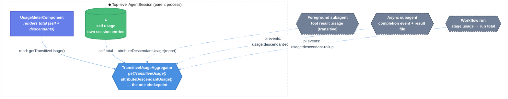

# Transitive Cost in the Status Bar — Technical Design Document / RFC

| Document Metadata      | Details                                             |
| ---------------------- | --------------------------------------------------- |
| Author(s)              | Gabriel Ebner                                       |
| Status                 | In Review (RFC) — open questions resolved            |
| Team / Owner           | Atomic / coding-agent + workflows + subagents       |
| Created / Last Updated | 2026-07-10                                           |

> Source issue: [#1636 "No insight into transitive cost"](https://github.com/bastani-inc/atomic/issues/1636) — *"The dollar amount in the status bar only measures the tokens used by the top-level agent. Tokens used by subagents in workflows don't seem to be included in this amount, giving an unrealistic picture of the token spend. I would love to see the full transitive cost in the status bar, including all subagents and subsubagents."*

## 1. Executive Summary

The status-bar dollar figure lies by omission: it sums only the **top-level session's own** assistant-message cost (`footer.ts:53-105`), so every dollar spent by subagents, sub-subagents, and workflow stages is invisible. Users reason about spend from a number that can be a small fraction of reality.

This RFC makes the number honest by introducing one headline door — **`getTransitiveUsage()`** — that returns the summed cost (and per-session tokens) of a session **plus every descendant** (subagent and workflow-stage session), counting each session exactly once. It is fed through a single accounting chokepoint — **`attributeDescendantUsage()`** — keyed by child run id so double-counting is structurally impossible. The footer renders the transitive `total` **cost** in place of the self-only figure; token badges and the context-window percentage remain strictly self-only. The compression is honest: `getTransitiveUsage()` returns a `complete` flag and the footer marks the figure with a dim `~` prefix (e.g. `~$1.284`) when a live or unreadable descendant means the total is a lower bound, rather than silently under-reporting.

## 2. Context and Motivation

### 2.1 Current State

- **Footer accounting (self-only):** `getUsageLine()` iterates `session.sessionManager.getEntries()` and sums `entry.message.usage.cost.total` for assistant messages, then renders `$${totalCost.toFixed(3)}` — `packages/coding-agent/src/modes/interactive/components/footer.ts:53-105`. The same self-only logic backs `getSessionStats()` (`agent-session-export.ts:13-55`), the `/context`-adjacent stats, and the HTML export header (`export-html/template.js:1351-1410`).
- **Subagents (separate processes, usage stranded):** each subagent invocation spawns a child coding-agent process with its own `SessionManager`/`AgentSession` and JSONL session file (`packages/subagents/src/runs/shared/pi-args.ts:109-123`, `main-session.ts`). Foreground results *do* carry usage — `SingleResult.usage = { input, output, cacheRead, cacheWrite, cost, turns }` (`packages/subagents/src/shared/types-results.ts:75-82, 236-267`) surfaced in `SubagentToolResult.details.results[].usage` — but **nothing aggregates it into the parent session**. Async/background subagents track **token-only** status via `parseSessionTokens()` (`packages/subagents/src/shared/session-tokens.ts:19-39`); the async result file and `SUBAGENT_ASYNC_COMPLETE_EVENT` payload carry **no aggregate cost** (`runs/background/subagent-runner-finalize.ts:89-132`, `result-watcher.ts:193-211`).
- **Workflows (in-process stages, no usage on snapshots):** each stage lazily creates an in-process `AgentSession` with its own `sessionFile` (`packages/workflows/src/runs/foreground/stage-runner-controller.ts:90-313`, `extension/wiring.ts:266-294`). `StageSnapshot` records `sessionId`/`sessionFile` but has **no `usage`/`cost`** (`packages/workflows/src/shared/store-types.ts:135-286`). There is no run-wide total; to compute one you must walk each stage's `sessionFile` and re-parse JSONL usage.
- **Existing linkage & primitives we can build on:** `SessionHeader.parentSession?: string` path linkage and `SessionInfo.parentSessionPath` (`session-manager-types.ts:18-28, 195-203`); internal sessions tagged `{runId, stageId, stageName}` via `markSessionInternal()` (`session-manager-core.ts:152-158`, `sdk.ts:134-144`); the shared `pi.events` bus (`core/event-bus.ts`, `extensions/api-types.ts:314-315`); `AgentSession.subscribe()` events and `ui.requestRender()` redraw cadence (`interactive-agent-events.ts`). The `Usage` type is `{ input, output, cacheRead, cacheWrite, totalTokens, cost:{input,output,cacheRead,cacheWrite,total} }` (`docs/session-format.md:101-114`, imported from `@earendil-works/pi-ai/compat`).

**Leaking door (today):** the footer's `$X` is a *dishonest compression* — the name/label promises "session cost" but the body delivers "top-level-agent-only cost." Every caller (users budgeting spend) reasons from a lie.

### 2.2 The Problem

- **User Impact:** A workflow run that fans out to a dozen stages, or a session that delegates heavily to subagents, can show `$0.05` in the status bar while true spend is `$5.00+`. Users cannot trust the cost display for budgeting or comparison.
- **Technical Debt:** Spend is scattered across N session files (parent + each subagent process + each workflow stage) with **no single door** that totals it. Each surface (footer, stats command, HTML export) re-derives self-only cost independently, so the fix must land in one shared aggregator, not three copies.

## 3. Goals and Non-Goals

### 3.1 Functional Goals

- [ ] The interactive status-bar cost figure reflects **transitive** spend: the top-level session plus all subagent, sub-subagent, and workflow-stage descendants, each counted exactly once.
- [ ] Provide one shared `getTransitiveUsage()` door reused by the footer (and available to the stats/`/context` surface and HTML export).
- [ ] Double-counting is structurally prevented (idempotent per child run id).
- [ ] The figure is honest about incompleteness: when a descendant's spend cannot yet be accounted (live/crashed/unreadable), the total is presented as a lower bound (`complete: false`), not silently under-reported.
- [ ] Context-window percentage in the footer remains **self-only** (context is a per-session property; transitive context is meaningless).
- [ ] Workflow stage usage/cost becomes captured on stage records so a run total is derivable.
- [ ] Async subagent completion carries aggregate transitive usage/cost back to the parent.

### 3.2 Non-Goals (Out of Scope)

- [ ] We will NOT add a new persisted billing ledger or external cost-reporting backend; this is an in-session observability figure derived from existing usage data.
- [ ] We will NOT change how any individual session computes its *own* per-message usage (SDK-reported values are the source of truth).
- [ ] We will NOT make the footer's context-window `%` transitive.
- [ ] We will NOT introduce a second display path that can show cost bypassing `getTransitiveUsage()` (one door for the number).
- [ ] We will NOT (in this version) build a live per-descendant cost breakdown table in the footer; the breakdown lives behind a new `/cost` command and a summary line in `/context` (OQ-3 resolved).

## 4. Proposed Solution (High-Level Design)

### 4.1 System Architecture Diagram



### 4.2 Architectural Pattern

**Push-based cost rollup with an idempotent accounting chokepoint**, plus an **on-demand session-tree walk** for authoritative reconciliation.

- Each completed direct child (subagent run, workflow stage/run) reports its **transitive** spend once, via the `attributeDescendantUsage()` chokepoint (in-process) or the `usage:descendant-rollup` event (cross-process/async).
- Reports are keyed by `childRunId`, so a re-delivered or replayed report replaces rather than adds — double-counting is unrepresentable at the door.
- The footer reads `getTransitiveUsage()` = self usage + accumulated descendant usage.
- A session-tree walk over descendant session files (`walkDescendantUsage()`) is the reconciliation/source-of-truth path used on demand (e.g. by a `/cost` command or session reload) and is NOT invoked on every render.

*(Alternative considered: pull-only tree-walk on every render — see §6.)*

### 4.3 Key Components

| Component                     | Responsibility                                                            | Location (new/changed)                                                        | Justification                                                            |
| ----------------------------- | ------------------------------------------------------------------------- | ----------------------------------------------------------------------------- | ----------------------------------------------------------------------- |
| `TransitiveUsageAggregator`   | Hold descendant rollups keyed by run id; expose `getTransitiveUsage()`    | new, in `packages/coding-agent/src/core/` attached to `AgentSession`          | One home for the transitive figure; single chokepoint prevents dbl-count |
| Footer usage line             | Render `total` cost + transitive tokens; keep context `%` self-only       | changed, `modes/interactive/components/footer.ts`                              | The user-visible fix                                                     |
| Subagent rollup emitter       | On foreground result + async completion, report transitive usage/cost up  | changed, `packages/subagents/src/runs/**`                                      | Feeds the chokepoint from subagent processes                            |
| Workflow stage/run usage      | Capture per-stage usage into snapshot; emit run/stage rollup              | changed, `packages/workflows/src/shared/store-types.ts` + engine/persistence  | Feeds the chokepoint from in-process stages                             |
| `walkDescendantUsage()`       | Authoritative recount by walking descendant session files                 | new, `packages/coding-agent/src/core/`                                         | Reconciliation & crash-recovery source of truth                         |

### 4.4 The Door Set at a Glance (Stranger-Across-Time View)

`getTransitiveUsage` · `attributeDescendantUsage` · `walkDescendantUsage` · `recordStageUsage` · `emitStageRollup` · `reportSubagentUsage`

Reading these alone tells a stranger what the system is *for*: it **totals the spend of an agent and everything it delegated to** (`getTransitiveUsage`); every descendant's spend enters that total through **exactly one accounting door** (`attributeDescendantUsage`); the total can be **rebuilt from the durable session files** when needed (`walkDescendantUsage`); and the two kinds of delegates — workflow stages and subagents — each have an honest way to report what they spent (a stage `recordStageUsage` into its snapshot then `emitStageRollup`; a subagent `reportSubagentUsage`). No door here moves money or grants access; the "danger" these doors guard is a *dishonest number*, so the whole door set exists to make one figure true and keep it from being double-told.

## 5. Detailed Design

### 5.1 The Doors (Entrypoint Contracts)

```ts
// Shared value type. `Usage` is the existing per-message shape
// ({ input, output, cacheRead, cacheWrite, totalTokens, cost:{input,output,cacheRead,cacheWrite,total} }).
interface TransitiveUsage {
  self: Usage;         // this session's own spend (unchanged accounting)
  descendants: Usage;  // summed spend of ALL descendant sessions (subagents + workflow stages), each once
  total: Usage;        // self + descendants
  complete: boolean;   // false ⇒ total is a LOWER BOUND (a live/crashed/unreadable descendant is unaccounted)
}

// A single completed child's contribution. `runId` is the dedupe key.
interface DescendantUsageReport {
  rootSessionId: SessionId;              // which top-level total this belongs to
  childRunId: ChildRunId;                // newtype: idempotency key; one report per child run
  kind: "subagent" | "workflow-stage" | "workflow-run";
  usage: Usage;                          // the child's TRANSITIVE spend (already includes ITS descendants)
  settled: boolean;                      // true ⇒ final; false ⇒ interim/live estimate, may be superseded
}

// — THE HEADLINE DOOR —
getTransitiveUsage(): TransitiveUsage
// Guarantee: returns this session's spend plus every subagent and workflow-stage
//   session descended from it, counting each descendant run exactly once.
// Never returns self-only silently (the current lie); when a descendant is unaccounted
//   it returns complete=false so the caller renders a lower bound, not a wrong exact number.
// Failure: total — pure read over in-memory self stats + the aggregator map.

// — THE ONE ACCOUNTING CHOKEPOINT —
attributeDescendantUsage(report: DescendantUsageReport): void
// Guarantee: records `report.usage` as the contribution of `report.childRunId`, REPLACING any
//   prior report for the same childRunId.
// Because the map is keyed by childRunId, delivering the same report twice cannot inflate the
//   total — double counting is unrepresentable here, not merely checked.
// Refuses: a report whose rootSessionId is not this session (ignored, returns without effect).

// — THE RECONCILIATION DOOR (on demand, NOT per render) —
walkDescendantUsage(root: SessionInfo): Promise<TransitiveUsage>
// Guarantee: rebuilds the transitive total by enumerating descendant session files
//   (parentSession linkage + subagent/workflow session-dir conventions) and summing each
//   session's own usage exactly once; returns complete=false if any descendant file is
//   mid-write/unreadable.
// This is the source of truth used to seed/repair the aggregator (session load, `/cost`).

// — THE STAGE REPORTER DOORS (split per OQ-5, each a single sentence) —
recordStageUsage(stageId: StageId, usage: Usage): void
// Guarantee: attaches a stage's own transitive usage to its StageSnapshot. That is all it does.

emitStageRollup(stageId: StageId, usage: Usage): void
// Guarantee: emits a workflow-stage DescendantUsageReport (childRunId = stage session id) for the
//   launching session. Called once per stage completion, after recordStageUsage.
reportSubagentUsage(report: DescendantUsageReport): void
// Guarantee: for a completed subagent run, emits its transitive usage/cost to the parent process
//   (in-process event for foreground; extended completion event + result-file field for async).
```

**Why the illegal states are unrepresentable, not merely checked:**
- **Double counting** cannot happen because `attributeDescendantUsage` is a *keyed upsert* on `childRunId`, not an add. There is no code path that adds a child's cost without a run-id key.
- **Self/descendant confusion** cannot happen because `TransitiveUsage` keeps `self`, `descendants`, `total` as distinct fields; the footer chooses `total` for cost and `self` for context — the two can never be silently swapped.
- **Silent under-report** cannot happen because incompleteness is a first-class `complete: boolean` on the return type; a caller that ignores it still renders a truthful *lower-bound* marker (see §5.4).

**Per-door audit (rubric):**

| Door                        | (1) Joint                     | (2) One sentence, no "and"                            | (3) Honest name                                  | (5) Every exit                                            | (6) Refusals real                                        | (8) One chokepoint                          |
| --------------------------- | ----------------------------- | ---------------------------------------------------- | ------------------------------------------------ | --------------------------------------------------------- | -------------------------------------------------------- | ------------------------------------------- |
| `getTransitiveUsage` ⓘ      | ✅ "total the delegated spend" | ✅ "returns self + all descendants, each once"        | ✅ "transitive" states the promise               | live descendant ⇒ `complete:false` lower bound            | ✅ never self-only silently; self/descendants typed apart | reads the one aggregator                    |
| `attributeDescendantUsage`  | ✅ "attribute a child's spend" | ✅ "records this child's contribution, replacing"     | ✅ upsert, not add — cannot inflate               | duplicate report ⇒ replace (no inflation)                 | ✅ wrong-root report ignored; dbl-count unrepresentable   | ✅ THE sole write path into the total        |
| `walkDescendantUsage`       | ✅ "rebuild spend from files"  | ✅ "sums each descendant session file once"           | ✅ "walk" = traversal, may be partial             | unreadable file ⇒ `complete:false`                        | ✅ counts each session once by identity                   | reconciliation feeder of the chokepoint     |
| `recordStageUsage`          | ✅ "a stage records its spend" | ✅ "attaches stage usage to the snapshot"             | ✅                                                | called once per stage end                                 | keyed by stageId                                         | source for walk + emit                      |
| `emitStageRollup`           | ✅ "a stage reports its spend" | ✅ "emits the stage's rollup report"                  | ✅                                                | called once per stage end                                 | keyed by stage session id (childRunId)                   | feeds chokepoint                            |
| `reportSubagentUsage`       | ✅ "a subagent reports spend"  | ✅ "emits the subagent run's transitive spend"        | ✅                                                | foreground/async both terminate in one report            | keyed by subagent runId                                  | feeds chokepoint                            |

ⓘ = informational read, guards no irreversible effect. Per OQ-5, the stage reporter is split into `recordStageUsage` (snapshot-write only) and `emitStageRollup` (rollup-emit only) so each door's guarantee is a single sentence (rubric #2).

### 5.2 Interfaces — The Same Door Across Process Boundaries

The transitive-cost joint appears at three transports; they carry the **same** report shape (`DescendantUsageReport`) and the same idempotency key (`childRunId`):

```
# In-process (workflow stages, foreground subagent tool-result handling)
attributeDescendantUsage(report)            # direct call on the top-level session aggregator

# Event bus (pi.events) — async subagents, cross-component workflow rollup
emit  "usage:descendant-rollup"  DescendantUsageReport
on    "usage:descendant-rollup"  → attributeDescendantUsage(report)   # single subscriber → the chokepoint

# On disk (async subagent result file, workflow stage snapshot) — durable source for walkDescendantUsage()
async result file:  { ..., transitiveUsage: Usage }     # NEW field (finalize.ts)
StageSnapshot:      { ..., usage?: Usage }               # NEW field (store-types.ts)
```

Honesty rule on the wire: the async completion event and result file MUST carry the child's **transitive** usage (self + its own descendants), matching the in-process contract, so the parent never needs to re-walk a healthy subtree. The event subscriber is the *only* thing that calls `attributeDescendantUsage` from the bus — one funnel, so a stray emit cannot reach the total by another path.

### 5.3 Data Model / Schema

- **`TransitiveUsage`** (new, `packages/coding-agent/src/core/`): as in §5.1 — a sum type over `self`/`descendants`/`total` + `complete`.
- **Aggregator state** (new): `Map<ChildRunId, { usage: Usage; settled: boolean; kind }>` held on the top-level `AgentSession`. `getTransitiveUsage()` reduces the map + self stats. Keyed map = single-count by construction.
- **`StageSnapshot.usage?: Usage`** (changed, `packages/workflows/src/shared/store-types.ts:135-230`): stage records gain optional usage; back-compat because optional and additive. Persisted stage-end payload (`persistence-session-entries.ts:78-98`) and durable checkpoint (`durable/types.ts:109-137`) gain the same optional field.
- **Async subagent result file** (changed, `runs/background/subagent-runner-finalize.ts:89-132`): add top-level `transitiveUsage: Usage`; completion event/watcher payload (`result-watcher.ts:193-211`) carries it through; parent handler (`async-job-tracker.ts:366-386`) forwards it to the chokepoint. Additive, back-compatible.
- **No change** to the per-message `Usage` shape or to any session file's own accounting.

### 5.4 Algorithms and State Management

- **Footer render (OQ-2: cost-only transitive):** `getUsageLine()` calls `session.getTransitiveUsage()`. **Cost renders `total`** — `$${total.cost.total.toFixed(3)}` — with a **dim `~` prefix** (e.g. `~$1.284`, OQ-4) when `complete === false` to mark a lower bound. The cumulative token badges (↑↓ R W) and the context `%` **stay self-only** (`self`): token badges keep per-session cache semantics and context is a per-session window that MUST NOT include descendants (`footer.ts:69-120`). A separate transitive token total may be added later but is out of scope here.
- **Liveness / redraw:** the aggregator is mutated by `attributeDescendantUsage`; after each mutation it triggers `ui.requestRender()` (or invalidates the usage meter) so the footer reflects new descendant spend without a render loop. Foreground subagent contributions land when the tool result returns (already an event that redraws). Workflow stage contributions land on stage completion. Async contributions land on the completion event.
- **Seeding / reconciliation:** on session load/resume, run `walkDescendantUsage(root)` once to seed the aggregator from durable files (recovers spend from a prior process). A `/cost` invocation (OQ-3) re-walks for an authoritative figure and reseeds, healing any missed live events.
- **Depth / composition:** each level reports only its **direct** children's transitive totals; grandchildren report to their own parent and are already folded into that parent's transitive figure before it reports upward. The top-level therefore only ever receives direct-child reports, each already transitive — arbitrary depth composes without the top-level knowing the tree shape.

## 6. Alternatives Considered

| Option                                                    | Pros                                                              | Cons                                                                                     | Reason                                                                                     |
| -------------------------------------------------------- | ---------------------------------------------------------------- | ---------------------------------------------------------------------------------------- | ------------------------------------------------------------------------------------------ |
| A: Pull-only tree walk on every footer render            | Single source of truth (session files); no rollup bookkeeping    | Re-parses many JSONL files every render; live/mid-write files; discovery fiddly cross-dir | Rejected as the render path; **kept** as `walkDescendantUsage()` for reconciliation.        |
| B: Per-message summation only in the top-level session   | Zero new plumbing                                                | Cannot see any descendant spend — this is exactly the bug                                 | Rejected — does not solve the issue.                                                        |
| C: Push rollup, keyed chokepoint + walk reconcile (Selected) | Live updates; single-count by construction; arbitrary depth composes | Requires reporters in 3 code paths; missed events under crash → lower-bound (reconcilable) | **Selected:** honest number, dbl-count unrepresentable, incompleteness surfaced not hidden. |
| D: Add cost, but only aggregate at end of run            | Simplest reporting                                               | Status bar stays wrong *during* long workflow/subagent runs — when users most want it     | Rejected — the live figure is the point.                                                    |

## 7. Cross-Cutting Concerns

### 7.1 Correctness & "Danger" (the number is the asset)

- **One chokepoint for the total:** every descendant contribution passes through `attributeDescendantUsage`. There is no second path that mutates the transitive total, so the promise "each child counted once" has exactly one home. (Rubric #8.)
- **Double-count structurally impossible:** keyed upsert on `childRunId`; replays/retries/at-least-once events converge on one entry. (Rubric #6.)
- **No self/child overlap:** a parent assistant message's own `usage` never includes child tokens (children are separate sessions), so `self + descendants` cannot overlap.
- **Honest incompleteness:** `complete:false` renders a lower-bound marker rather than a wrong exact figure; the walk reconciles.

### 7.2 Performance

- Footer render stays O(self entries) + O(aggregator map size); no file I/O on the hot path.
- `walkDescendantUsage()` is bounded, on-demand, and cached; never on the render path.

### 7.3 Privacy / Compatibility

- No new data leaves the machine; all figures derive from existing local session usage.
- Additive types/fields only; SDK `Session` interface gains `getTransitiveUsage()` (additive). See §8 Backwards Compatibility.

## 8. Backwards Compatibility

Posture: **no breaking changes** (published `@bastani/atomic` + SDK have real downstream users).

- **Preserve:** the per-message `Usage` shape; existing `getSessionStats()` self-only semantics (its callers that specifically want self-only keep working — new callers opt into transitive); session file format (new fields are optional/additive); the `SUBAGENT_ASYNC_COMPLETE_EVENT` and workflow status shapes gain optional fields only.
- **Intended behavior change (not a break):** the interactive status-bar cost figure gets larger because it now tells the truth. This is the fix, not a regression. If any consumer scripts scrape the footer number, note the change in the CHANGELOG.
- **Additive API:** `AgentSession.getTransitiveUsage()`, `attributeDescendantUsage()`, `walkDescendantUsage()`, `StageSnapshot.usage?`, async result `transitiveUsage?`.

## 9. Resolved Decisions

All open questions were resolved with the user on 2026-07-10 (contrastive clarification). No blocking unknowns remain.

- [x] **OQ-1 (aggregation architecture):** **Push rollup + keyed chokepoint** (`attributeDescendantUsage` upsert on `childRunId`) with on-demand `walkDescendantUsage()` reconcile. Live-accurate, O(1)-ish render, double-count impossible by construction.
- [x] **OQ-2 (what goes transitive):** **Cost only.** The `$` figure renders the transitive `total`; the ↑↓RW token badges and the context `%` stay self-only. A separate transitive token total is deferred.
- [x] **OQ-3 (breakdown surface):** **New `/cost` command** (self + per-descendant breakdown, triggers an authoritative `walkDescendantUsage()` reconcile) plus a summary transitive line in `/context`.
- [x] **OQ-4 (incompleteness display):** **Dim `~` prefix** (e.g. `~$1.284`) when `complete === false`; never an unmarked exact figure.
- [x] **OQ-5 (door hygiene):** **Split** the stage reporter into `recordStageUsage` (snapshot-write only) and `emitStageRollup` (rollup-emit only) so each door's guarantee is a single sentence.
- [x] **OQ-6 (async depth):** Async subagents report their **transitive** spend (including their own subagents) in the result file / completion event; `walkDescendantUsage()` is the reconciliation backstop for missed/crashed reports.
- [x] **OQ-7 (descendant scope):** **Include** `internal`-marked workflow-stage sessions in the transitive total — they are real spend even though hidden from session lists.

### 9.1 Follow-ups to confirm during implementation (non-blocking)

- Confirm the exact `pi.events` channel name (`usage:descendant-rollup`) does not collide with existing channels, and that a single subscriber wires it to `attributeDescendantUsage` (one funnel).
- Confirm `getSessionStats()` / HTML-export callers that want self-only remain unchanged, and only the footer + `/cost` + `/context` opt into transitive.
