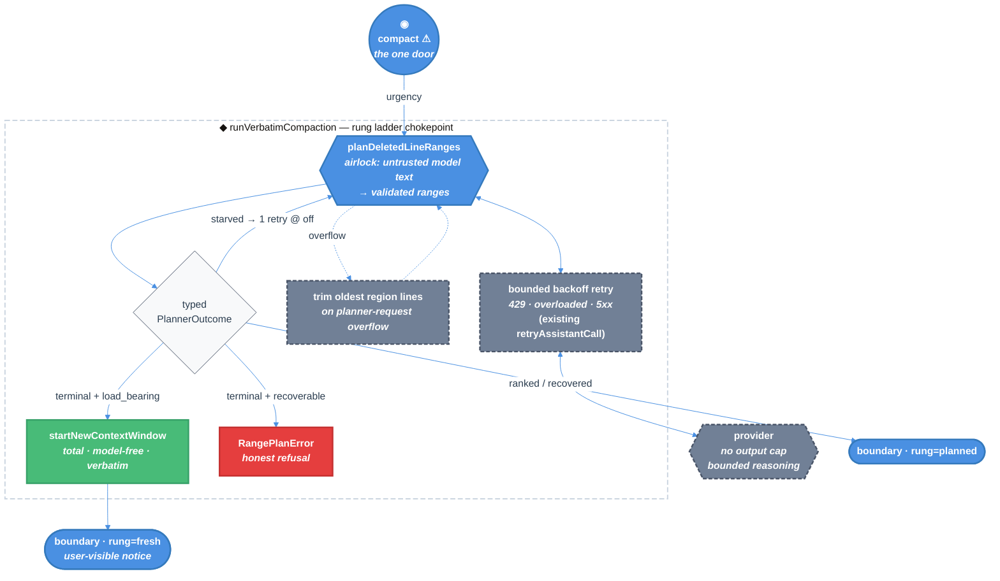

# Compaction Fallback Rungs — Technical Design Document / RFC

| Document Metadata      | Details |
| ---------------------- | ------- |
| Author(s)              | Norin Lavaee |
| Status                 | Draft (WIP) |
| Team / Owner           | `packages/coding-agent` — compaction |
| Created / Last Updated | 2026-07-27 |
| Research               | [`research/2026-07-27-compaction-reasoning-starvation-cross-harness.md`](../research/2026-07-27-compaction-reasoning-starvation-cross-harness.md) |
| Compatibility posture  | One scoped, documented SDK break (`runVerbatimCompaction`). Everything else preserved. See §10. |
| Design north star      | `openai/codex` compaction (`codex-rs/core/src/compact*.rs`), with verbatim line planning substituted for summary generation. |

---

## 1. Executive Summary

Atomic's Verbatim Compaction caps the planner request's output at
`0.8 × reserveTokens` (13,107 tokens) and forwards the live session reasoning level.
On every current reasoning model — `gpt-5.6-sol` and every adaptive-thinking Claude
alike — reasoning is drawn from that same cap, so a high-reasoning session can spend the
whole budget thinking and return no ranges. Compaction then hard-fails, and during a
post-tool preflight it kills the active turn. The same hard failure happens when a rate
limit outlasts the retry budget.

Both the cap and the reasoning inheritance were copied from pi, which has the identical
defect but hides it behind an unvalidated prose summary. `openai/codex` avoids the whole
class: it never sets an output cap, it retries transient failures with backoff, it trims
input rather than constraining output, and it keeps a model-free rung —
`start_new_context_window` — that always completes.

This RFC ports codex's ladder, changing exactly one thing: the model's job is **ranking
lines for verbatim deletion**, not writing a summary. The terminal rung is
`startNewContextWindow`, a total, model-free function that discards compactable
conversation and starts a fresh window — codex's `compact_token_budget` behavior. It is
reachable only when compaction is load-bearing, so a dead turn becomes impossible while
`/compact` keeps failing honestly.

---

## 2. Context and Motivation

### 2.1 Current State

One context-compaction door, `compact`, runs a single whole-region classifier request
through the session model and mechanically reconstructs the retained text. One rung
exists: `details.rung: "planned"`.

**The inherited cap** — `range-planner.ts:147-152`:

```ts
function outputTokenLimit(model: Model<Api>, reserveTokens: number): number {
	return Math.min(Math.floor(0.8 * reserveTokens), model.maxTokens > 0 ? model.maxTokens : Number.POSITIVE_INFINITY);
}
```

`reserveTokens` is an **input-side** reserve (`docs/compaction.md:390`). Reusing it as an
output cap is a conflation inherited verbatim from pi's `compaction.ts:637-639`. It is
not a provider requirement: codex sets no output cap at all (research §5.2).

**The inherited inheritance** — `range-planner.ts:179` forwards `this.thinkingLevel`
straight from live session state.

**Rate limits today.** `retryAssistantCall` already retries `429` / `rate limit` /
`too many requests` / `overloaded` with exponential backoff, and fails fast on
quota/billing exhaustion (`pi-ai/dist/utils/retry.js`). That much matches codex's
`backoff(retries)` loop. What is missing is everything *after* the retry budget is
exhausted: the planner throws, compaction writes nothing, and a mid-turn preflight kills
the turn.

**Leaking doors today:**

- `outputTokenLimit(model, reserveTokens)` is named for its mechanism and promises a
  *token limit* while actually deciding *how much room reasoning may consume*.
- `planDeletedLineRanges` collapses six distinct outcomes — ranked success, partial
  recovery, reasoning starvation, rate limiting, malformed output, provider error — into
  "ranges or throw". Callers cannot tell a throttle from garbage without string-matching
  an error message.
- `runVerbatimCompaction` returns `CompactedTranscript & { rung: "planned" }`. The rung
  is a one-value type, so the ladder it implies does not exist.

### 2.2 The Problem

- **User impact.** A high-reasoning session on a large context hits
  `Compaction range planning produced no usable deleted ranges`. During a post-tool
  preflight (`agent-session-tool-hooks.ts:103`) the active turn stops. Reported against
  an old prerelease; see PR #2048.
- **Rate limits.** A sustained 429 through the retry budget produces the same dead turn,
  at exactly the moment the user is most likely to be mid-task on a long session.
- **Breadth.** Not OpenAI-specific. `claude-opus-5`, `claude-sonnet-5`,
  `claude-fable-5`, `claude-opus-4-6/4-7/4-8` and `claude-sonnet-4-6` all use adaptive
  thinking with categorical effort against one shared `max_tokens` pool and no output
  floor (research §3.2).

### 2.3 What we are explicitly *not* fixing by copying pi

pi never validates its summary and appends a deterministic file manifest, so a total
failure produces a plausible non-empty artifact and destroys context silently (research
§2.1). Atomic's strict validation is why this bug was reportable at all. **This RFC does
not soften that check.**

---

## 3. Goals and Non-Goals

### 3.1 Functional Goals

- [ ] Reasoning tokens can never starve the planner's visible output at any reasoning
      level, on any provider, at any context size.
- [ ] Planner reasoning level is decoupled from session reasoning level.
- [ ] A load-bearing compaction (overflow recovery, post-tool preflight) always
      completes — including when the planner is rate-limited past its retry budget.
- [ ] Rate limiting, quota exhaustion, and reasoning starvation are distinct typed
      outcomes, separable from malformed output in code, diagnostics, and UI.
- [ ] Every retained line stays byte-identical to an input line on every rung.
- [ ] Reaching the terminal rung is visible to the user and recorded durably.

### 3.2 Non-Goals (Out of Scope)

- [ ] We will **NOT** add a second *model* strategy or a semantic retry ladder. The
      ladder is: ranked → fresh window. Two rungs.
- [ ] We will **NOT** add a model-fallback rung. Codex has one
      (`compact_model_fallback.rs`), but it exists to retry compaction on the *current*
      model after the *previous* model failed under `CompactionReason::ModelDownshift`.
      Atomic always compacts with the active session model, so the rung has no analogue
      here. See §6 option E.
- [ ] We will **NOT** introduce a server-side/remote compaction path. Codex's
      `responses/compact` has no Atomic equivalent.
- [ ] We will **NOT** fabricate, rewrite, summarize, or reorder retained text on any
      rung.
- [ ] We will **NOT** relax the zero-usable-ranges rejection.
- [ ] We will **NOT** let manual `/compact` silently degrade.
- [ ] We will **NOT** change `reserveTokens` semantics, defaults, or the threshold.
- [ ] We will **NOT** patch `node_modules` or vendor `@earendil-works/pi-ai`.

---

## 4. Proposed Solution (High-Level Design)

### 4.1 System Architecture Diagram



### 4.2 Architectural Pattern

**Graceful-degradation ladder with a total terminal rung**, ported from codex's
`tasks/compact.rs` dispatch and `compact_token_budget.rs` (research §5.1). Codex reaches
its always-completable rung *first* under a feature flag; Atomic reaches it *last*, only
when failing would be worse than degrading. The terminal rung is a **total function** —
no provider, no credentials, no network, no failure mode — which is what makes
"compaction always completes" a guarantee rather than a hope.

### 4.3 Codex Correspondence

Every element traces to a codex mechanism. The only substitution is the model's job.

| Codex | Atomic | Note |
| --- | --- | --- |
| No `max_output_tokens` in `ResponsesApiRequest` (`codex-api/src/common.rs:252`) | `PlannerBudget.maxTokens = undefined` | pi-ai's context clamp becomes the only bound |
| `backoff(attempt)` retry loop, `stream_max_retries` | existing `retryAssistantCall` + `settings.retry` | already covers 429/overload; quota fails fast |
| `history.remove_first_item()` on `ContextWindowExceeded` | trim oldest region lines, retry | §5.3 |
| `"(no summary available)"` placeholder (`compact.rs:670`) | typed `starved`/`rateLimited` outcomes + explicit marker | Atomic can be stricter: it validates |
| `compact_token_budget` → `start_new_context_window` | **`startNewContextWindow`** | the terminal rung |
| `CodexCompactionEvent` telemetry | existing `0600` diagnostic sidecar + `rung` on `compaction_end` | Atomic's per-failure evidence is finer-grained |
| Local summarization (`SUMMARIZATION_PROMPT`) | **verbatim line planning** | ← the one intentional difference |
| `compact_model_fallback.rs` | *(none)* | no previous/current model split in Atomic; §3.2 |
| `responses/compact` remote endpoint | *(none)* | no Atomic equivalent |

### 4.4 The Door Set at a Glance (Stranger-Across-Time View)

`compact` ⚠ · `planDeletedLineRanges` · `startNewContextWindow` ⚠ · `runVerbatimCompaction` ⚠

Read alone: there is exactly one way to compact context; the model's contribution is
*ranking*, and it arrives through a single airlock; when ranking cannot be obtained the
system can still start a fresh context window without a model, and that is a
deliberately-named irreversible act; one chokepoint decides which happened.

---

## 5. Detailed Design

### 5.1 The Doors (Entrypoint Contracts)

```ts
// ─── Types that make the illegal unrepresentable ──────────────────────────────

/** How much the caller can afford to lose if compaction does not happen. */
type CompactionUrgency =
  | "recoverable"    // manual /compact, threshold auto-compaction — failing is safe
  | "load_bearing";  // overflow recovery, post-tool preflight — failing kills the turn

/** How the deletions on a durable boundary were chosen. */
type CompactionRung = "planned" | "fresh";

/** Every way the ranked planner can end. No stringly-typed failure classification. */
type PlannerOutcome =
  | { kind: "ranked";       ranges: RawLineRange[] }
  | { kind: "recovered";    ranges: RawLineRange[]; recoveredCount: number }
  | { kind: "starved";      usage: Usage; diagnosticPath?: string }
  | { kind: "rateLimited";  exhausted: boolean; message: string; diagnosticPath?: string }
  | { kind: "unusable";     category: DiagnosticFailureCategory; excerpt: string; diagnosticPath?: string }
  | { kind: "overflowed";   diagnosticPath?: string }
  | { kind: "providerError"; message: string; diagnosticPath?: string };
// "cancelled" is NOT a variant: abort throws, as today.
// `rateLimited.exhausted` distinguishes "retry budget spent" (terminal) from
// "non-retryable quota/billing exhaustion" (terminal immediately, no backoff spent).


// ─── Door 1: the ranked planner (the airlock) ─────────────────────────────────

planDeletedLineRanges(
  region: NumberedRegion,
  parameters: VerbatimCompactionParameters,
  model: Model<Api>,
  budget: PlannerBudget,               // ← replaces the raw `thinkingLevel` + `reserveTokens` pair
  targetKeepLines: number,
  options: RangePlannerOptions & { auth: { apiKey?: string; headers?: ProviderHeaders }; signal?: AbortSignal },
): Promise<PlannerOutcome>
// Guarantee: classifies one whole-region planner attempt into exactly one PlannerOutcome.
// Never throws except on cancellation. Never returns unvalidated ranges.
// This is the single place untrusted model text becomes trusted line numbers.


// ─── Door 2: the terminal rung ────────────────────────────────────────────────

startNewContextWindow(
  preparation: VerbatimCompactionPreparation,
): CompactedTranscript
// Guarantee: discards every compactable line and starts a fresh context window.
// TOTAL. No provider, no credentials, no network, no signal, no failure mode,
// no `Promise`. Its type says it cannot fail; that is the point.
// Port of codex `compact_token_budget` → `Session::start_new_context_window`
// (session/mod.rs:3609), which replaces history with regenerated standing context
// and an empty summary message.
// Atomic analogue: the system prompt, context files, and skills are rebuilt per
// request and were never in the transcript, so they survive automatically — they
// ARE Atomic's `build_initial_context_with_world_state`. What this door discards is
// the compactable region and any prior durable summary.


// ─── Door 3: the rung chokepoint ──────────────────────────────────────────────

runVerbatimCompaction(
  preparation: VerbatimCompactionPreparation,
  model: Model<Api>,
  request: {
    auth: { apiKey?: string; headers?: ProviderHeaders };
    signal?: AbortSignal;
    urgency: CompactionUrgency;        // ← required; no default, so every call site states it
  } & CompactionPlanOptions,
): Promise<CompactionRungResult>
// Guarantee: produces one compacted transcript, tagged with the rung that produced it.
// Refusal expressed in the type: `startNewContextWindow` is unreachable unless
// `urgency === "load_bearing"`. A manual /compact literally cannot construct the
// argument that would let it silently degrade.
//
// ⚠ BREAKING — resolved decision (§9.1 Q6). This is a published SDK export
// (`packages/coding-agent/src/index.ts:102`). The old positional signature carried
// `thinkingLevel` at position 5; this design makes that argument meaningless, and an
// accepted-but-ignored parameter is a lie at the boundary (principle 2). It is
// therefore REMOVED, not deprecated in place. `urgency` is required rather than
// defaulted so no existing call site is silently reclassified.


// ─── Supporting value type (not a door — pure) ────────────────────────────────

interface PlannerBudget {
  readonly maxTokens: number | undefined;   // always undefined ⇒ no cap; pi-ai clamps to context
  readonly reasoning: "off" | "minimal" | "low" | "medium" | "high" | undefined;
}

resolvePlannerRequest(
  model: Model<Api>,
  settings: CompactionSettings,
  attempt: "first" | "starvationRetry",
): PlannerBudget
// Guarantee: returns the planner's own budget, derived from model + compaction settings.
// Takes no session ThinkingLevel parameter — the inheritance is removed structurally,
// not by remembering not to pass it.
```

**Per-door audit (rubric):**

| Door | (1) Joint | (2) One sentence, no "and" | (3) Honest name | (5) Every exit | (6) Refusals real | (7) Trust transition | (8) One chokepoint |
| --- | --- | --- | --- | --- | --- | --- | --- |
| `planDeletedLineRanges` | ✅ "plan what to delete" | ✅ "classifies one attempt into one outcome" | ✅ *plans*, does not apply | length→`starved`/`recovered`; 429→`rateLimited`; overflow→`overflowed`; abort→throws | unvalidated ranges unreturnable (type) | ✅ **the** model-text airlock | ✅ sole model call |
| `startNewContextWindow` ⚠ | ✅ codex's own domain verb | ✅ "starts a fresh context window" | ✅ says *fresh*, not *compacted* | no error/timeout/partial exits exist | totality is the type | n/a | ✅ sole model-free producer |
| `runVerbatimCompaction` ⚠ | ✅ "compact this region" | ✅ "produces one transcript tagged with its rung" | ✅ | both rungs tagged; abort propagates | degradation needs `load_bearing` (type) | n/a | ✅ sole rung selector |
| `compact` ⚠ | ✅ existing domain verb | ✅ "replaces active context with a boundary" | ✅ | unchanged | unchanged | n/a | ✅ unchanged |

> Rubric #2 note: `resolvePlannerRequest` returns two fields and so risks reading as
> fused. It stays one door because both answer one question — *what may this request
> spend?* — and splitting them would let a caller set a cap without setting effort,
> recreating the bug. See §9.2 Q3.

### 5.2 Data Model / Schema

`details.rung` already exists (`docs/compaction.md:154`, `compaction-runner.ts:17`) with
the single value `"planned"`. It widens to a sum type:

| `details.rung` | Meaning | Model call | User-visible |
| --- | --- | --- | --- |
| `"planned"` | Model ranked the lines; includes silent partial recovery | yes | no (unchanged) |
| `"fresh"` | Compactable conversation discarded; new context window started | no | **yes** |

No new entry type, no format-version bump. A `"fresh"` boundary is still an ordinary
verbatim boundary: its `summary` is the protected tail plus a single
`(filtered N lines)` marker, all bytes drawn from input lines.

`details.stats` gains no fields; `linesDeleted` / `percentReduction` already describe
both rungs truthfully.

### 5.3 Algorithms and State Management

**The ladder** (inside `runVerbatimCompaction`):

1. `resolvePlannerRequest(model, settings, "first")` → `PlannerBudget`.
2. `planDeletedLineRanges(...)` → `PlannerOutcome`.
   Inside, `retryAssistantCall` already applies `settings.retry` with exponential
   backoff to `429` / `rate limit` / `too many requests` / `overloaded` / `5xx`, and
   returns immediately on quota/billing exhaustion. This is codex's `backoff(attempt)`
   loop; it is reused unchanged.
3. On `ranked` / `recovered` → validate, reconstruct, tag `rung: "planned"`. **Done.**
4. On `starved` **and this is the first attempt** → retry once with
   `resolvePlannerRequest(..., "starvationRetry")` (reasoning `off`). Go to 3.
5. On `overflowed` **and the region has more than one line** → drop the oldest region
   lines and retry, bounded by `settings.retry.maxRetries`. Port of codex's
   `history.remove_first_item()` (research §5.3): degrade the input, never the output.
6. On any terminal outcome (`rateLimited`, `unusable`, `providerError`, second
   `starved`, exhausted trimming):
   - `urgency === "load_bearing"` → `startNewContextWindow(preparation)`, tag
     `rung: "fresh"`, emit the user-visible notice. **Done.**
   - `urgency === "recoverable"` → throw `RangePlanError` exactly as today.

**Budget resolution** (`resolvePlannerRequest`):

- `maxTokens`: always `undefined`. No cap is sent. `buildBaseOptions` in pi-ai already
  clamps every provider to `contextWindow − estimatedInput − 4096`
  (`simple-options.js:10-19`), so the context window remains the real bound — codex's
  posture (research §5.2, §3.3).
- `reasoning`: from `compaction.plannerReasoning` (new setting, default `"low"`), never
  from session state. Forced to `"off"` on `"starvationRetry"`.

**Starvation detection** (inside `planDeletedLineRanges`):

```ts
stopReason === "length" && recoveredRanges.length === 0 && (usage.reasoning ?? 0) > 0
  ⇒ { kind: "starved", usage, diagnosticPath }
```

`Usage.reasoning` is a documented subset of `output` (`pi-ai/dist/types.d.ts:251-264`).
A length stop with usable partial ranges still succeeds silently as today; a length stop
with *no* reasoning tokens is `unusable`, not `starved`, and earns no retry. This is
strictly narrower than PR #2048's trigger.

**Rate-limit classification.** `retryAssistantCall` returns the final error message
after its budget is spent. `planDeletedLineRanges` classifies it with the same patterns
pi-ai uses so the outcome is typed rather than string-matched downstream:

| Condition | Outcome | Backoff spent |
| --- | --- | --- |
| `429` / `rate limit` / `too many requests` / `overloaded` / `5xx`, retries exhausted | `{ kind: "rateLimited", exhausted: true }` | yes |
| `insufficient_quota` / `billing` / `quota exceeded` / `available balance` | `{ kind: "rateLimited", exhausted: false }` | no — non-retryable, fails fast |
| context overflow (`isContextOverflow`) | `{ kind: "overflowed" }` | n/a |
| other provider error | `{ kind: "providerError" }` | per policy |

**The terminal rung** (`startNewContextWindow`): emit the whole compactable region as
one deletion range, then hand it to the unchanged `validateDeletedRanges` →
`reconstructCompactedTranscript` path, which splits it around explicit protected spans
and folds prior markers. The rung adds **no new reconstruction code**, which is what
keeps the verbatim guarantee free.

What survives, and why it is codex-faithful:

| Content | Fate | Codex analogue |
| --- | --- | --- |
| System prompt, context files, skills | untouched — never in the transcript | `build_initial_context_with_world_state` |
| `preserve_recent` protected tail | **kept** | *(divergence — see §9.2 Q9)* |
| Explicit protected spans | kept (hard floor, unchanged) | — |
| Compactable region + prior durable summary | discarded, one marker | `replace_compacted_history(..., message: String::new())` |

**Scope of the guarantee — read this carefully.** `startNewContextWindow` guarantees
that *compaction* completes. It does not guarantee the *turn* succeeds. If the planner
was rate-limited, the follow-up provider request will very likely be rate-limited too.
What the rung buys is that Atomic does not additionally destroy the turn with a
compaction failure, and that the next attempt starts from a small context. Codex has
exactly the same property.

**Urgency assignment at call sites:**

| Call site | Urgency |
| --- | --- |
| `/compact`, `ctx.compact()`, `session.compact()`, RPC `compact` | `recoverable` |
| Threshold auto-compaction | `recoverable` (§9.1 Q2) |
| Overflow recovery | `load_bearing` |
| Post-tool preflight (`_preflightPostToolContext`) | `load_bearing` |

### 5.4 User-Visible Behavior

Unlike partial recovery — silent by design (`docs/compaction.md:117`) — the fresh-window
rung is a large, deliberate loss and must say so. On `rung: "fresh"` the TUI replaces
`✻ Context compacted` with a distinct status naming the cause (rate limited vs planning
unavailable), wording in §9.2 Q5. `compaction_end` carries the rung so attached workflow
stage chat renders the same. Extension `session_compact` observers already receive
`event.result.rung` (`docs/compaction.md:190`) and now observe a second value.

### 5.5 Branch Summarization

`branch-summarization.ts:309` carries the same `16384` default and the same session
reasoning inheritance. It adopts `resolvePlannerRequest` and the cap removal (§9.1 Q8).
It does **not** get a rung ladder: branch summarization is opt-in, off the critical
path, and already documented as intentionally lossy (`docs/compaction.md:204`). Its
failure remains a clean error.

---

## 6. Alternatives Considered

| Option | Pros | Cons | Reason for Rejection |
| --- | --- | --- | --- |
| **A. PR #2048 as written** — cap reasoning at `low`, retry once at `minimal` | Small; already reviewed | `low` is a constant, not a bound; retries on any length stop; leaves the invented cap; still hard-fails mid-turn; no rate-limit path | Treats the symptom. Superseded; its reasoning-cap instinct is adopted in §5.3. |
| **B. Port `adjustMaxTokensForThinking` to all providers** | Mirrors the Anthropic path | The addition is clamped away near the limit; the real protection is a numeric `budget_tokens` floor OpenAI and adaptive Claude cannot express (research §3.1-3.2) | Ports the ineffective half. |
| **C. Fix upstream in pi-ai only** | Fixes pi's silent bug too | pi auto-closes new-contributor issues (#6001 unfixed since 0.79.10); users blocked now | Right thing to *also* do; §9.2 Q7. |
| **D. Unranked deletion rung** — delete every unprotected line as the fallback | Gentler than a fresh window; keeps ranked-ish structure | Diverges from codex for no guarantee gain; outcome is nearly identical to a fresh window anyway; adds a third rung to test | Rejected in favour of codex fidelity. |
| **E. Model-fallback rung** (codex `compact_model_fallback.rs`) | Codex has it | Codex's exists for the previous-vs-current model split under `ModelDownshift`; Atomic always uses the active session model, so there is no second model to fall back to | No analogue; §3.2. |
| **F. Selected: no cap + decoupled reasoning + input trimming + urgency-gated fresh-window rung** | Removes the cause; survives rate limits; codex-faithful; keeps verbatim and honest failure where safe | Two rungs to test; one new setting; one SDK break | **Selected.** |

---

## 7. Cross-Cutting Concerns

### 7.1 Security and Privacy

- **Trust transition is singular.** Untrusted model text becomes trusted line numbers at
  `planDeletedLineRanges` and nowhere else. `startNewContextWindow` consumes no model
  output, so the fallback path has no trust transition to get wrong (rubric #7).
- **Irreversible effects pass one chokepoint.** Both rungs converge on the existing
  `reconstructCompactedTranscript` → `appendCompaction` path. The fallback adds a
  *selector*, not a second writer (rubric #8).
- **Diagnostics.** The existing `0600` sidecar (`range-planner-diagnostics.ts`) gains
  `starved` and `rate_limited` failure categories and records `usage.reasoning`. Its
  exclusions — no API keys, headers, planner prompt, or numbered transcript — are
  unchanged. Raw response text keeps its existing caveat (`docs/compaction.md:129`).
- **No new credential surface.** `startNewContextWindow` takes no auth.

### 7.2 Documentation

`docs/compaction.md:99` currently states: *"There is no semantic retry, critical rung,
deterministic fallback, or deterministic target correction."* Three of four clauses
become false. That paragraph, the `details.rung` example at `:154`, the persistence
section, the failure-behavior section, and the settings table all require amendment in
the same change.

### 7.3 Changelog

`packages/coding-agent/CHANGELOG.md` under `## [Unreleased]`:
`### Breaking Changes` (the `runVerbatimCompaction` signature), `### Fixed` (reasoning
starvation), `### Added` (fresh-window rung, rate-limit survival, `plannerReasoning`).
PR #2048's existing entry is superseded and should be replaced, not appended to.

---

## 8. Test Plan

- **Unit — budget:** `resolvePlannerRequest` never returns a session-derived level;
  returns `undefined` maxTokens; forces `off` on `starvationRetry`. Type-level test that
  it accepts no `ThinkingLevel` parameter.
- **Unit — outcome classification:** every `PlannerOutcome` variant from a synthetic
  response. Specifically: `length` + empty + `usage.reasoning > 0` ⇒ `starved`;
  `length` + empty + `usage.reasoning === 0` ⇒ `unusable` (**no retry**); `length` +
  partial valid records ⇒ `recovered` (**no retry**, silent); a `429` message after
  exhausted retries ⇒ `rateLimited { exhausted: true }`; `insufficient_quota` ⇒
  `rateLimited { exhausted: false }` with **zero** backoff sleeps observed.
- **Unit — totality:** `startNewContextWindow` on empty regions, all-protected regions,
  single-line regions, and non-contiguous protected sets. Property test: every retained
  non-marker line is byte-identical to an input line and in input order; every protected
  line and the whole `preserve_recent` tail survive.
- **Unit — refusal:** a `recoverable` urgency cannot reach the fresh rung. Assert by
  construction plus a runtime test that a manual-path failure still throws.
- **Integration — rate-limit turn survival:** post-tool preflight where the planner
  returns `429` on every attempt through the retry budget ⇒ turn completes, boundary
  written with `rung: "fresh"`, notice shown, exactly one follow-up provider request, no
  `model_fallback_start`, `agent.continue()` not called.
- **Integration — starvation turn survival:** two consecutive starved responses ⇒ same
  as above, and exactly two planner requests with `reasoning` `["low", "off"]`.
- **Integration — overflow trimming:** a planner request that overflows once then
  succeeds ⇒ `rung: "planned"`, oldest region lines dropped, no fresh rung.
- **Integration — manual honesty:** `/compact` with a rate-limited planner ⇒ no
  boundary, `compaction_end` reports failure with a diagnostic path, session usable.
- **Integration — no silent degradation:** `rung: "fresh"` always coincides with the
  notice; `rung: "planned"` never does.
- **Regression — cap removal:** the planner request carries no `maxTokens`; assert
  against a captured `SimpleStreamOptions`.
- **Interactive verification:**
  1. `bun install` in the worktree, then
     `bun run test:unit && bun run test:integration && bun run typecheck && bun run check:file-length` — all pass.
  2. Session on a reasoning model, `/model` to `high`, fill context past threshold, run a
     large tool call to trigger the preflight. **Expect:** the turn completes. Session
     JSONL shows `details.rung` of `"planned"` or `"fresh"`; if `"fresh"`, the notice
     appeared.
  3. Stub `streamFn` to return `stopReason: "error"` with `"429 rate limit exceeded"` on
     every call. **Expect:** manual `/compact` fails with a `rate_limited` diagnostic;
     a preflight under the same stub completes on the fresh rung with the notice.

---

## 9. Decisions and Open Questions

### 9.1 Resolved

- [x] **Q1 — Output cap → no cap.** The planner sends no `maxTokens`; pi-ai's
      `clampMaxTokensToContext` remains the only bound, which is codex's posture
      expressed through pi-ai. Accepted risk: a pathological model could emit one record
      per line (~8 tokens/line) — a cost regression, not a correctness one, boundable
      later without redesigning the ladder.
- [x] **Q2 — Threshold auto-compaction → `recoverable`.** The turn boundary has passed,
      so failure is survivable and the user gets an honest error. Revisit if telemetry
      shows failed threshold compactions leading to overflow on the following turn.
- [x] **Q6 — `runVerbatimCompaction` → options object, documented breaking change.**
      `thinkingLevel` is removed rather than deprecated in place. `urgency` is required
      with no default so no existing call site is silently reclassified. See §10.
- [x] **Q8 — `branch-summarization.ts` → folded in**, for the budget fix only; no rung
      ladder (§5.5).
- [x] **Q10 — Terminal rung → codex's fresh context window**, replacing the earlier
      unranked-deletion design (§6 option D).
- [x] **Q11 — Rate limits → ladder, not a special case.** Existing `retryAssistantCall`
      backoff is codex's `backoff(attempt)` loop and is reused unchanged; exhaustion
      becomes a typed `rateLimited` outcome that enters the same rung ladder as any other
      terminal failure.

### 9.2 Still open

- [ ] **Q3 — Is `PlannerBudget` one joint or two?** Fused prevents setting a cap without
      an effort; splitting reads cleaner. **Recommend fused**, per the §5.1 rubric note.
- [ ] **Q4 — New setting shape.** `compaction.plannerReasoning`, default `"low"`.
      Alternative: hardcode `"low"` with no setting. **Recommend the setting**, since the
      right level is model- and context-size-dependent.
- [ ] **Q5 — Notice wording.** Must name the cause, since rate-limited and
      planning-unavailable are different user situations. Candidates:
      `✻ Context cleared (compaction rate limited)` /
      `✻ Context cleared (planning unavailable)` versus one generic string.
      **Recommend cause-specific.**
- [ ] **Q7 — Upstream.** File the pi-ai provider asymmetry (research §3) upstream with a
      patch, citing #6001's precedent? Independent of shipping this RFC.
- [ ] **Q9 — Does the fresh rung keep the `preserve_recent` tail?** Codex keeps *no*
      conversation. **(A)** Keep the tail — honors a documented user-facing setting, keeps
      the boundary useful mid-turn, and is the one place this design deliberately
      diverges from codex. **(B)** Drop it for exact codex parity — maximum reclaim, but
      silently violates `preserve_recent` and leaves a mid-turn preflight with a boundary
      containing no trace of the tool result that triggered it. **Recommend (A)**; §5.3
      is written for (A).

## 10. Backwards Compatibility

**Posture: one scoped, documented SDK break. Everything else preserved.**

| Surface | Status |
| --- | --- |
| `compaction.*` settings and defaults | **Preserved.** `reserveTokens` keeps its meaning (input-side threshold only) and its `16384` default. One additive optional key, `plannerReasoning` (§9.2 Q4). |
| Persisted `CompactionEntry` shape | **Preserved.** No new fields, no format-version bump. `details.rung` widens from one value to two; readers that only know `"planned"` see an ordinary verbatim boundary, which it is. |
| Existing sessions on resume | **Preserved.** Resume never reruns planning (`docs/compaction.md:162`); no historical entry is reinterpreted. |
| `session_before_compact` / `session_compact` events | **Preserved.** `event.result.rung` gains a second value — additive to an already-published field. |
| Extension `compactedText` override | **Preserved.** Unchanged path; still requires no credentials. |
| `settings.retry` behavior | **Preserved.** Same policy, same backoff, same non-retryable set. |
| `runVerbatimCompaction` (SDK export) | **BREAKING.** Positional `auth`/`signal`/`thinkingLevel`/`options` collapse into one request object; `thinkingLevel` is removed. |
| `planDeletedLineRanges` | Internal — not in the `src/index.ts` export list. Return type changes from `RawLineRange[]` to `PlannerOutcome`. |

**Migration for the one break:**

```ts
// before
await runVerbatimCompaction(prep, model, apiKey, headers, signal, thinkingLevel, options);

// after — thinkingLevel had no effect worth preserving; the planner now chooses
// its own reasoning level (§5.3).
await runVerbatimCompaction(prep, model, {
  auth: { apiKey, headers },
  signal,
  urgency: "recoverable",   // "load_bearing" only for overflow recovery / post-tool preflight
  ...options,
});
```

Changelog entry goes under `### Breaking Changes` alongside the `### Fixed` / `### Added`
entries from §7.3. Because the repository is on a versionless release base, no manifest
version is touched.
