# Compaction Fallback Rungs — Technical Design Document / RFC

| Document Metadata      | Details |
| ---------------------- | ------- |
| Author(s)              | Norin Lavaee |
| Status                 | Draft (WIP) |
| Team / Owner           | `packages/coding-agent` — compaction |
| Created / Last Updated | 2026-07-27 |
| Research               | [`research/2026-07-27-compaction-reasoning-starvation-cross-harness.md`](../research/2026-07-27-compaction-reasoning-starvation-cross-harness.md) |
| Compatibility posture  | **Unconfirmed — blocks approval.** Settings, persisted entry shapes, and extension events are preserved by design. `runVerbatimCompaction` is a published SDK export whose signature this design changes; see §9 Q6. |

---

## 1. Executive Summary

Atomic's Verbatim Compaction asks the session model to rank transcript lines and return
deletion records. It caps that request's output at `0.8 × reserveTokens` (13,107 tokens)
and forwards the live session reasoning level. On every current reasoning model —
`gpt-5.6-sol` and every adaptive-thinking Claude alike — reasoning tokens are drawn from
that same cap, so a high-reasoning session can spend the entire budget thinking and
return no ranges. Compaction then hard-fails, and during a post-tool preflight it kills
the active turn.

Both the cap and the reasoning inheritance were copied from pi, which has the identical
defect but hides it behind an unvalidated prose summary. `openai/codex` avoids the whole
class by never setting an output cap and by keeping a model-free compaction rung that
always completes.

This RFC adopts codex's posture without giving up verbatim compaction. It removes the
invented cap, decouples planner reasoning from session reasoning, and adds a second rung
behind the ranked planner: **`reclaimUnrankedContext`** — a total, model-free function
that deletes every unprotected line. That rung is reachable only when compaction is
load-bearing (overflow recovery, post-tool preflight), so a dead turn becomes impossible
while `/compact` keeps failing honestly.

---

## 2. Context and Motivation

### 2.1 Current State

**Architecture.** One context-compaction door, `compact`, runs a single whole-region
classifier request through the session model and mechanically reconstructs the retained
text. One rung exists: `details.rung: "planned"`.

**The inherited cap** — `range-planner.ts:147-152`:

```ts
function outputTokenLimit(model: Model<Api>, reserveTokens: number): number {
	return Math.min(Math.floor(0.8 * reserveTokens), model.maxTokens > 0 ? model.maxTokens : Number.POSITIVE_INFINITY);
}
```

`reserveTokens` is an **input-side** reserve (it sets the auto-compaction threshold,
`docs/compaction.md:390`). Reusing it as an output cap is a conflation inherited
verbatim from pi's `compaction.ts:637-639`. It is not a provider requirement: codex sets
no output cap at all (research §5.2).

**The inherited inheritance** — `range-planner.ts:179` forwards `this.thinkingLevel`
straight from live session state. Ranking lines against a fixed rubric is a mechanical
sub-task; there is no reason it should run at whatever level the user picked for
conversation.

**Leaking doors today:**

- `outputTokenLimit(model, reserveTokens)` is named for its mechanism and promises a
  *token limit* while actually deciding *how much room reasoning may consume*. Nothing
  in the name warns that raising `reserveTokens` (an input-side knob) tightens the
  planner's thinking budget.
- `planDeletedLineRanges` collapses five distinct outcomes — ranked success, partial
  recovery, reasoning starvation, malformed output, provider error — into "ranges or
  throw". Callers cannot distinguish a recoverable starvation from genuinely unusable
  output without string-matching an error message.
- `runVerbatimCompaction` returns `CompactedTranscript & { rung: "planned" }`. The rung
  is a one-value type, so the ladder it implies does not exist.

### 2.2 The Problem

- **User impact.** A high-reasoning session on a large context hits
  `Compaction range planning produced no usable deleted ranges`. During a post-tool
  preflight (`agent-session-tool-hooks.ts:103`) the active turn stops before its
  follow-up request. Reported against an old prerelease; see PR #2048.
- **Breadth.** Not OpenAI-specific. `claude-opus-5`, `claude-sonnet-5`,
  `claude-fable-5`, `claude-opus-4-6/4-7/4-8` and `claude-sonnet-4-6` all use adaptive
  thinking with categorical effort against one shared `max_tokens` pool and no output
  floor (research §3.2).
- **Technical debt.** Compaction can hard-fail at the exact moment context pressure is
  highest — precisely when it is most needed and least recoverable.

### 2.3 What we are explicitly *not* fixing by copying pi

pi's compaction never validates its summary and appends a deterministic file manifest,
so a total failure produces a plausible non-empty artifact and destroys context silently
(research §2.1). Atomic's strict validation is the reason this bug was reportable at
all. **This RFC does not soften that check.**

---

## 3. Goals and Non-Goals

### 3.1 Functional Goals

- [ ] Reasoning tokens can never starve the planner's visible output at any reasoning
      level, on any provider, at any context size.
- [ ] Planner reasoning level is decoupled from session reasoning level.
- [ ] A load-bearing compaction (overflow recovery, post-tool preflight) always
      completes — it can degrade, but it cannot fail the turn.
- [ ] Reasoning starvation is a distinct, typed outcome, distinguishable from malformed
      output in both code and diagnostics.
- [ ] Every retained line stays byte-identical to an input line on every rung. Verbatim
      remains verbatim.
- [ ] Degradation to the unranked rung is visible to the user and recorded durably.

### 3.2 Non-Goals (Out of Scope)

- [ ] We will **NOT** add a second *model* strategy, a semantic retry ladder, or model
      fallback. The ladder is: ranked → unranked. Two rungs, no more.
- [ ] We will **NOT** introduce a server-side/remote compaction path. Codex's
      `responses/compact` has no Atomic analogue.
- [ ] We will **NOT** fabricate, rewrite, summarize, or reorder retained text on any
      rung, including the fallback.
- [ ] We will **NOT** relax the zero-usable-ranges rejection. Unvalidated model output
      never becomes a compaction boundary.
- [ ] We will **NOT** let manual `/compact` silently degrade. A user who asked for
      compaction gets a real answer or a real error.
- [ ] We will **NOT** change `reserveTokens` semantics, defaults, or the auto-compaction
      threshold.
- [ ] We will **NOT** patch `node_modules` or vendor `@earendil-works/pi-ai`.

---

## 4. Proposed Solution (High-Level Design)

### 4.1 System Architecture Diagram

```mermaid
%%{init: {'theme':'base', 'themeVariables': { 'primaryColor':'#f8f9fa','primaryTextColor':'#2c3e50','primaryBorderColor':'#4a5568','lineColor':'#4a90e2','secondaryColor':'#ffffff','tertiaryColor':'#e9ecef','clusterBkg':'#ffffff','clusterBorder':'#cbd5e0'}}}%%
flowchart TB
    classDef door fill:#4a90e2,stroke:#357abd,stroke-width:2.5px,color:#fff,font-weight:600
    classDef pure fill:#48bb78,stroke:#38a169,stroke-width:2.5px,color:#fff,font-weight:600
    classDef ext fill:#718096,stroke:#4a5568,stroke-width:2.5px,color:#fff,font-weight:600,stroke-dasharray:6 3
    classDef fail fill:#e53e3e,stroke:#c53030,stroke-width:2.5px,color:#fff,font-weight:600

    Caller(("◉<br><b>compact</b> ⚠<br><i>the one door</i>")):::door

    subgraph Ladder["◆ runVerbatimCompaction — rung ladder chokepoint"]
        direction TB
        Plan{{"<b>planDeletedLineRanges</b><br><i>airlock: untrusted model text<br>→ validated ranges</i>"}}:::door
        Outcome{"typed<br>PlannerOutcome"}
        Unranked["<b>reclaimUnrankedContext</b><br><i>total · model-free · verbatim</i>"]:::pure
        Fail["RangePlanError<br><i>honest refusal</i>"]:::fail
    end

    Provider{{"<b>provider</b><br><i>no output cap<br>bounded reasoning</i>"}}:::ext

    Caller -->|"urgency"| Plan
    Plan <-->|"1 request + ≤1 starvation retry"| Provider
    Plan --> Outcome
    Outcome -->|"ranked / recovered"| Done(["boundary · rung=planned"]):::door
    Outcome -->|"starved / unusable<br>+ urgency=load_bearing"| Unranked
    Outcome -->|"starved / unusable<br>+ urgency=recoverable"| Fail
    Unranked --> Done2(["boundary · rung=unranked<br><i>user-visible notice</i>"]):::door
    style Ladder fill:#fff,stroke:#cbd5e0,stroke-width:2px,stroke-dasharray:8 4
```



### 4.2 Architectural Pattern

**Graceful-degradation ladder with a total terminal rung**, borrowed from codex's
`tasks/compact.rs` dispatch (research §5.1). Codex reaches its always-completable rung
*first* under a feature flag; Atomic reaches it *last*, and only when failing would be
worse than degrading. The terminal rung is a **total function** — it takes no provider,
no credentials, no network, and has no failure mode — which is what makes "compaction
always completes" a guarantee rather than a hope.

### 4.3 Key Components

| Component | Responsibility | Justification |
| --- | --- | --- |
| `resolvePlannerRequest` | Decide output cap and reasoning level for the planner, never inheriting session reasoning | Removes links 3+4 of the causal chain (research §1.1) |
| `planDeletedLineRanges` | Airlock: turn untrusted model text into validated ranges or a typed outcome | Trust transition already lives here; make its exits honest |
| `reclaimUnrankedContext` | Delete every unprotected line, deterministically | Total function ⇒ the ladder terminates |
| `runVerbatimCompaction` | Select the rung from outcome + urgency | Single chokepoint for "which rung ran" |
| `CompactionUrgency` | Type-level permission to degrade | Makes silent manual degradation unrepresentable |

### 4.4 The Door Set at a Glance (Stranger-Across-Time View)

`compact` ⚠ · `planDeletedLineRanges` · `reclaimUnrankedContext` ⚠ · `runVerbatimCompaction` ⚠

Read alone: there is exactly one way to compact context; the model's contribution is
*ranking*, and it arrives through a single airlock; when ranking is unavailable the
system can still reclaim context without a model, and that is an irreversible,
deliberately-named act; and one chokepoint decides which of the two happened.

---

## 5. Detailed Design

### 5.1 The Doors (Entrypoint Contracts)

```ts
// ─── Types that make the illegal unrepresentable ──────────────────────────────

/** How much the caller can afford to lose if compaction does not happen. */
type CompactionUrgency =
  | "recoverable"    // manual /compact, threshold auto-compaction — failing is safe
  | "load_bearing";  // overflow recovery, post-tool preflight — failing kills the turn

/** How the deletions on a durable boundary were chosen. */
type CompactionRung = "planned" | "unranked";

/** Every way the ranked planner can end. No stringly-typed failure classification. */
type PlannerOutcome =
  | { kind: "ranked";        ranges: RawLineRange[] }
  | { kind: "recovered";     ranges: RawLineRange[]; recoveredCount: number }
  | { kind: "starved";       usage: Usage; diagnosticPath?: string }
  | { kind: "unusable";      category: DiagnosticFailureCategory; excerpt: string; diagnosticPath?: string }
  | { kind: "providerError"; message: string; overflow: boolean; diagnosticPath?: string };
// "cancelled" is NOT a variant: abort throws, as today.


// ─── Door 1: the ranked planner (the airlock) ─────────────────────────────────

planDeletedLineRanges(
  region: NumberedRegion,
  parameters: VerbatimCompactionParameters,
  model: Model<Api>,
  auth: { apiKey?: string; headers?: ProviderHeaders },
  signal: AbortSignal | undefined,
  budget: PlannerBudget,               // ← replaces the raw `thinkingLevel` + `reserveTokens` pair
  targetKeepLines: number,
  options: RangePlannerOptions,
): Promise<PlannerOutcome>
// Guarantee: classifies one whole-region planner response into exactly one PlannerOutcome.
// Never throws except on cancellation. Never returns unvalidated ranges.
// This is the single place untrusted model text becomes trusted line numbers.


// ─── Door 2: the terminal rung ────────────────────────────────────────────────

reclaimUnrankedContext(
  region: NumberedRegion,
): CompactedTranscript
// Guarantee: returns the transcript with every unprotected line deleted.
// TOTAL. No provider, no credentials, no network, no signal, no failure mode,
// no `Promise`. Its type says it cannot fail; that is the point.
// Protected spans and the preserve_recent tail are outside `region` or explicitly
// protected, so both survive by construction — not by a check.


// ─── Door 3: the rung chokepoint ──────────────────────────────────────────────

runVerbatimCompaction(
  preparation: VerbatimCompactionPreparation,
  model: Model<Api>,
  auth: { apiKey?: string; headers?: ProviderHeaders },
  signal: AbortSignal | undefined,
  urgency: CompactionUrgency,          // ← NEW; replaces the bare `thinkingLevel` argument
  options: CompactionPlanOptions,
): Promise<CompactionRungResult>
// Guarantee: produces one compacted transcript, tagged with the rung that produced it.
// Refusal expressed in the type: `reclaimUnrankedContext` is unreachable unless
// `urgency === "load_bearing"`. A manual /compact literally cannot construct the
// argument that would let it silently degrade.
//
// ⚠ PUBLISHED SDK EXPORT — `packages/coding-agent/src/index.ts:102`.
// Position 5 is currently `thinkingLevel: ThinkingLevel | undefined`, and this design
// makes that argument meaningless. Keeping it as an accepted-but-ignored parameter
// would be a lie at the boundary (principle 2), so the parameter must go. Under a
// no-breaking-changes posture that forces one of the migrations in §9 Q6.


// ─── Supporting value type (not a door — pure) ────────────────────────────────

interface PlannerBudget {
  readonly maxTokens: number | undefined;   // undefined ⇒ no cap; pi-ai clamps to context
  readonly reasoning: "off" | "minimal" | "low" | "medium" | "high" | undefined;
}

resolvePlannerRequest(
  model: Model<Api>,
  settings: CompactionSettings,
  attempt: "first" | "starvationRetry",
): PlannerBudget
// Guarantee: returns the planner's own budget, derived from model + compaction settings.
// Takes no session ThinkingLevel parameter — the inheritance is removed structurally,
// not by remembering not to pass it.
```

**Per-door audit (rubric):**

| Door | (1) Joint | (2) One sentence, no "and" | (3) Honest name | (5) Every exit | (6) Refusals real | (7) Trust transition | (8) One chokepoint |
| --- | --- | --- | --- | --- | --- | --- | --- |
| `planDeletedLineRanges` | ✅ "plan what to delete" | ✅ "classifies one response into one outcome" | ✅ *plans*, does not apply | length→`starved`/`recovered`; error→`providerError`; abort→throws | unvalidated ranges unreturnable (type) | ✅ **the** model-text airlock | ✅ sole model call |
| `reclaimUnrankedContext` ⚠ | ✅ "reclaim context" | ✅ "deletes every unprotected line" | ✅ *unranked* admits the loss | no error/timeout/partial exits exist | totality is the type | n/a | ✅ sole model-free producer |
| `runVerbatimCompaction` ⚠ | ✅ "compact this region" | ✅ "produces one transcript tagged with its rung" | ✅ | both rungs tagged; abort propagates | degradation needs `load_bearing` (type) | n/a | ✅ sole rung selector |
| `compact` ⚠ | ✅ existing domain verb | ✅ "replaces active context with a boundary" | ✅ | unchanged | unchanged | n/a | ✅ unchanged |

> Rubric #2 note: `resolvePlannerRequest` returns two fields and so risks reading as
> fused. It stays one door because both fields answer one question — *what may this
> request spend?* — and splitting them would let a caller set a cap without setting
> effort, recreating the bug. See §9 Q3.

### 5.2 Data Model / Schema

`details.rung` already exists (`docs/compaction.md:154`,
`compaction-runner.ts:17`) with the single value `"planned"`. It widens to a sum type:

| `details.rung` | Meaning | Model call | User-visible |
| --- | --- | --- | --- |
| `"planned"` | Model ranked the lines; includes silent partial recovery | yes | no (unchanged) |
| `"unranked"` | Every unprotected line deleted without ranking | no | **yes** |

No new entry type, no format-version bump. Readers that only understand `"planned"`
treat an `"unranked"` entry as an ordinary verbatim boundary, which it is — the text is
byte-identical retained lines plus `(filtered N lines)` markers, exactly as today.

`details.stats` gains no new fields; `linesDeleted`/`percentReduction` already describe
the outcome truthfully on both rungs.

### 5.3 Algorithms and State Management

**The ladder** (inside `runVerbatimCompaction`):

1. `resolvePlannerRequest(model, settings, "first")` → `PlannerBudget`.
2. `planDeletedLineRanges(...)` → `PlannerOutcome`.
3. On `ranked` / `recovered` → validate, reconstruct, tag `rung: "planned"`. **Done.**
4. On `starved` **and this is the first attempt** → retry once with
   `resolvePlannerRequest(..., "starvationRetry")` (reasoning `off`). Go to 3.
5. On any terminal non-success:
   - `urgency === "load_bearing"` → `reclaimUnrankedContext(region)`, tag
     `rung: "unranked"`, emit the user-visible notice. **Done.**
   - `urgency === "recoverable"` → throw `RangePlanError` exactly as today.

**Budget resolution** (`resolvePlannerRequest`):

- `maxTokens`: `undefined`. No cap is sent. `buildBaseOptions` in pi-ai already clamps
  every provider to `contextWindow − estimatedInput − 4096`
  (`simple-options.js:10-19`), so the context window remains the real bound — the same
  posture codex takes by omitting `max_output_tokens` entirely (research §5.2, §3.3).
  See §9 Q1 for the cost-exposure alternative.
- `reasoning`: from `compaction.plannerReasoning` (new setting, default `"low"`), never
  from session state. On `"starvationRetry"`, forced to `"off"`.

**Starvation detection** (inside `planDeletedLineRanges`):

```ts
stopReason === "length" && recoveredRanges.length === 0 && (usage.reasoning ?? 0) > 0
  ⇒ { kind: "starved", usage, diagnosticPath }
```

`Usage.reasoning` is a documented subset of `output`
(`pi-ai/dist/types.d.ts:251-264`). A length stop with usable partial ranges still
succeeds silently as today; a length stop with *no* reasoning tokens is `unusable`, not
`starved`, and does not earn a retry. This is strictly narrower than PR #2048's trigger,
which retries on any length stop with no usable ranges and therefore pays a second
uncached whole-region request during ordinary truncation.

**Deterministic selection** (`reclaimUnrankedContext`): emit the complement of
`region.protectedLineNumbers` as contiguous ranges — reusing the existing
`contiguousRanges` helper (`range-planner.ts:63-72`) — then hand them to the unchanged
`validateDeletedRanges` → `reconstructCompactedTranscript` path. The rung introduces no
new reconstruction code, which is what keeps the verbatim guarantee free.

**Urgency assignment at call sites:**

| Call site | Urgency |
| --- | --- |
| `/compact`, `ctx.compact()`, `session.compact()`, RPC `compact` | `recoverable` |
| Threshold auto-compaction | `recoverable` (see §9 Q2) |
| Overflow recovery | `load_bearing` |
| Post-tool preflight (`_preflightPostToolContext`) | `load_bearing` |

### 5.4 User-Visible Behavior

Unlike partial recovery — which is silent by design (`docs/compaction.md:117`) — the
unranked rung is a real quality loss and must say so. On `rung: "unranked"` the TUI
shows a distinct status in place of `✻ Context compacted`, wording TBD in §9 Q5, and
`compaction_end` carries the rung so attached workflow stage chat can render the same.

Extension `session_compact` observers already receive `event.result.rung`
(`docs/compaction.md:190`); they now observe a second value.

---

## 6. Alternatives Considered

| Option | Pros | Cons | Reason for Rejection |
| --- | --- | --- | --- |
| **A. PR #2048 as written** — cap reasoning at `low`, retry once at `minimal` | Small; already reviewed | `low` is a constant, not a bound; retries on any length stop (second uncached whole-region request); leaves the invented cap in place; compaction can still hard-fail mid-turn | Treats the symptom. Superseded, but its reasoning-cap instinct is adopted in §5.3. |
| **B. Port `adjustMaxTokensForThinking` to all providers** | Mirrors the Anthropic path | The addition is clamped away near the limit; the real Anthropic protection is a numeric `budget_tokens` floor that OpenAI and adaptive Claude cannot express (research §3.1-3.2) | Ports the ineffective half of the mechanism. |
| **C. Fix upstream in pi-ai only** | Fixes pi's silent bug too | pi auto-closes new-contributor issues (#6001 unfixed since 0.79.10); users are blocked now | Right thing to *also* do; cannot be the plan. See §9 Q7. |
| **D. Codex parity: fresh context window as the fallback** | Simplest terminal rung | Discards the protected tail and protected spans; abandons verbatim guarantees at the worst moment | Rejected: `reclaimUnrankedContext` gets the same completion guarantee while staying verbatim. |
| **E. Deterministic rung on *every* planner failure** | One code path; simplest | Manual `/compact` would silently return a gutted transcript; converts Atomic's honest failure into pi's silent degradation | Rejected: violates §3.2. Urgency gate retained. |
| **F. Selected: no cap + decoupled reasoning + urgency-gated unranked rung** | Removes the cause; guarantees turn survival; keeps verbatim and keeps honest failure where it is safe | Two rungs to test; one new setting | **Selected.** |

---

## 7. Cross-Cutting Concerns

### 7.1 Security and Privacy

- **Trust transition is singular.** Untrusted model text becomes trusted line numbers at
  `planDeletedLineRanges` and nowhere else. `reclaimUnrankedContext` consumes no model
  output at all, so the fallback path has no trust transition to get wrong (rubric #7).
- **Irreversible effects pass one chokepoint.** Both rungs converge on the existing
  `reconstructCompactedTranscript` → `appendCompaction` path. The fallback adds a
  *selector*, not a second writer (rubric #8).
- **Diagnostics.** The existing `0600` sidecar
  (`range-planner-diagnostics.ts`) gains a `starved` failure category and records
  `usage.reasoning`. Its existing exclusions — no API keys, headers, planner prompt, or
  numbered transcript — are unchanged. Raw response text may still echo input and keeps
  its current handling caveat (`docs/compaction.md:129`).
- **No new credential surface.** `reclaimUnrankedContext` takes no auth.

### 7.2 Documentation

`docs/compaction.md:99` currently states: *"There is no semantic retry, critical rung,
deterministic fallback, or deterministic target correction."* Three of those four
clauses become false. That paragraph, the `details.rung` example at `:154`, the
persistence section, and the settings table all require amendment in the same change.

### 7.3 Changelog

User-visible behavior change → `packages/coding-agent/CHANGELOG.md` under
`## [Unreleased]` → `### Fixed` (starvation) and `### Added` (unranked rung, new
setting). PR #2048's existing entry is superseded and should be replaced, not appended
to.

---

## 8. Test Plan

- **Unit — budget:** `resolvePlannerRequest` never returns a session-derived reasoning
  level; returns `undefined` maxTokens; forces `off` on `starvationRetry`. A type-level
  test that it accepts no `ThinkingLevel` parameter.
- **Unit — outcome classification:** each `PlannerOutcome` variant from a synthetic
  response. Specifically: `length` + empty text + `usage.reasoning > 0` ⇒ `starved`;
  `length` + empty text + `usage.reasoning === 0` ⇒ `unusable` (**no retry**);
  `length` + partial valid records ⇒ `recovered` (**no retry**, silent).
- **Unit — totality:** `reclaimUnrankedContext` on empty regions, all-protected regions,
  single-line regions, and regions whose protected set is non-contiguous. Property test:
  for any region, every retained non-marker line is byte-identical to an input line and
  in input order; every protected line survives.
- **Unit — refusal:** a `recoverable` urgency cannot reach the unranked rung. Assert by
  construction (the call is untypable) plus a runtime test that a manual-path failure
  still throws `RangePlanError`.
- **Integration — turn survival:** post-tool preflight where the planner returns two
  consecutive starved responses ⇒ turn completes, boundary written with
  `rung: "unranked"`, exactly one follow-up provider request, no `auto_retry_start`, no
  `model_fallback_start`, `agent.continue()` not called. (Extends the existing
  `post-tool-compaction-preflight.test.ts` shape.)
- **Integration — manual honesty:** `/compact` with a starved planner ⇒ no boundary,
  `compaction_end` reports failure with a diagnostic path, session still usable.
- **Integration — no silent degradation:** assert `rung: "unranked"` always coincides
  with the user-visible notice, and `rung: "planned"` never does.
- **Regression — cap removal:** planner request carries no `maxTokens`; assert against
  a captured `SimpleStreamOptions`, mirroring the existing `plannerRequests` spy.
- **Interactive verification:**
  1. `bun run test:unit && bun run test:integration && bun run typecheck && bun run check:file-length` — all pass.
  2. Start a session on a reasoning model, `/model` to `high`, fill context past
     threshold, run a large tool call to trigger the post-tool preflight. **Expect:** the
     turn completes. Inspect the session JSONL: `details.rung` is `"planned"` or
     `"unranked"`; if `"unranked"`, the notice appeared.
  3. Force starvation with a stub `streamFn` returning `stopReason: "length"`, empty
     text, `usage.reasoning: 12000`. **Expect:** manual `/compact` fails with a
     diagnostic whose category is `starved`; a preflight in the same conditions
     completes on the unranked rung.

---

## 9. Open Questions / Unresolved Issues

- [ ] **Q1 — Output cap.** (A) Send no `maxTokens`, matching codex; pi-ai's context clamp
      is the only bound. Removes the bug at the root; worst-case cost is one record per
      line (~8 tokens/line) on a pathological model. (B) Cap at
      `estimatedRecords × 8 + generousHeadroom`. Bounds cost; reintroduces a number that
      can be wrong. **Recommend (A)** — the region size already bounds useful output, and
      inventing a second number is what caused this.
- [ ] **Q2 — Threshold auto-compaction urgency.** (A) `recoverable` — failing is
      survivable because the turn boundary has passed. (B) `load_bearing` — a failed
      threshold compaction means the next turn starts over-budget and may overflow.
      **Recommend (A)** for the first release, tightening only if overflow follows.
- [ ] **Q3 — Is `PlannerBudget` one joint or two?** Keeping cap and effort fused prevents
      setting one without the other; splitting reads cleaner. **Recommend fused**, per
      the §5.1 rubric note.
- [ ] **Q4 — New setting shape.** `compaction.plannerReasoning: "off" | "minimal" |
      "low" | ...`, default `"low"`. Alternatives: no setting at all (hardcode `"low"`),
      or reuse an existing key. **Recommend the setting**, since the right level is
      model-dependent and users on huge-context models may want more.
- [ ] **Q5 — Notice wording for the unranked rung.** Needs to convey real loss without
      alarm. Candidates: `✻ Context compacted (unranked — planning unavailable)` /
      `✻ Context reclaimed without ranking`. **Recommend the first.**
- [ ] **Q6 — `runVerbatimCompaction` is a published SDK export, so its signature change
      is breaking.** Verified: `packages/coding-agent/src/index.ts:102` re-exports it by
      name; `planDeletedLineRanges` is *not* in that list and is genuinely internal. Its
      current position-5 parameter is `thinkingLevel`, which this design renders
      meaningless. Options:
      **(A)** Replace positions 4-6 with a single options object
      (`{ signal, urgency, ...options }`) and ship it as a documented breaking change to
      one SDK function. Cleanest door; requires the posture to allow it.
      **(B)** Keep the arity, swap `thinkingLevel` → `urgency`, and accept the silent
      type change. Compiles for JS callers, breaks them at runtime. Worst option.
      **(C)** Keep `thinkingLevel` accepted-and-ignored, append optional `urgency`.
      Non-breaking, but leaves a parameter that lies — exactly the flaw §2.1 indicts.
      **(D)** Add `runVerbatimCompactionWithUrgency` and leave the old export as a
      `recoverable`-pinned shim. Non-breaking and honest; costs a duplicate door and
      permanently confusing exports.
      **Recommend (A)** if the posture allows a scoped SDK break, else **(D)**.
      This decision gates §5.1 and must be resolved first.
- [ ] **Q7 — Upstream.** File the pi-ai provider asymmetry (research §3) upstream with a
      patch, citing #6001's precedent? It also fixes pi's silent empty-summary bug.
      Independent of shipping this RFC.
- [ ] **Q8 — `branch-summarization.ts`.** It carries the same `16384` default and the
      same session-reasoning inheritance (`:309`). Its failure is far less severe (a
      lossy summary on branch navigation, already opt-in). Fold into this change, or
      track separately? **Recommend fold in** — the same `resolvePlannerRequest` applies
      and leaving one call site defective invites the bug back.
