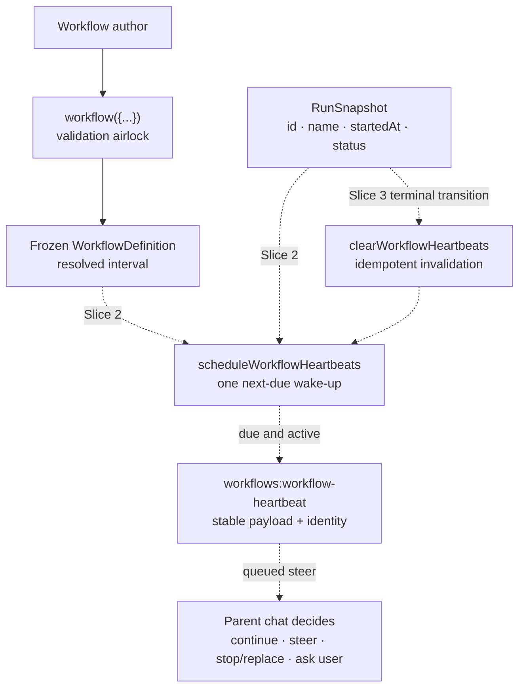

# Workflow Heartbeats — Technical Design Document / RFC

| Document Metadata | Details |
| --- | --- |
| Author(s) | morgan-coded |
| Status | In Review (RFC) — design questions resolved; slice 1 is the current PR scope |
| Team / Owner | `packages/workflows` |
| Created / Last Updated | 2026-08-06 |
| Design authority | [Issue #1975](https://github.com/bastani-inc/atomic/issues/1975), [three-slice contract and answers](https://github.com/bastani-inc/atomic/issues/1975#issuecomment-5182034997), [payload amendment](https://github.com/bastani-inc/atomic/issues/1975#issuecomment-5201461460), [green light](https://github.com/bastani-inc/atomic/issues/1975#issuecomment-5201465620) |
| Compatibility posture | Backwards compatible: existing definitions omit the option and receive the documented default. See §10. |

---

## 1. Executive Summary

Long-running workflows currently report lifecycle transitions but have no periodic way to return control to their parent chat for an alignment check. This RFC adds an opt-out workflow heartbeat, configured in minutes and anchored to the persisted workflow start time. The public `workflow({...})` authoring door validates and freezes the interval. Later slices add one scheduler door that raises deterministic events and one cleanup door that removes or invalidates heartbeat work when a run becomes terminal.

The work lands as three separately reviewed slices. Slice 1 defines only configuration, event payload, stable identity, documentation, and tests. Slice 2 owns scheduling and queued delivery. Slice 3 owns terminal cleanup and recovery. Heartbeats never become user, stage, or follow-up messages, never interrupt an active parent response, and never add behavior outside workflow execution.

## 2. Context and Motivation

### 2.1 Current State

- `workflow({...})` is the public authoring boundary. It validates authored fields and returns a frozen, branded definition ([`workflow-authoring-types.ts`](../packages/workflows/src/shared/workflow-authoring-types.ts), [`workflow.ts`](../packages/workflows/src/authoring/workflow.ts)).
- A `RunSnapshot` already persists the run id, workflow name, inputs, and start timestamp; `workflow.run.start` session entries persist the same run identity and timestamp ([`store-types.ts`](../packages/workflows/src/shared/store-types.ts), [`run.ts`](../packages/workflows/src/engine/run.ts), [`persistence-session-entries.ts`](../packages/workflows/src/shared/persistence-session-entries.ts)).
- Workflow lifecycle notices already use a typed details object and the parent message path with `triggerTurn: true`, `deliverAs: "steer"`, and `persistWhenStreaming: true` ([`lifecycle-notifications.ts`](../packages/workflows/src/extension/lifecycle-notifications.ts)).
- There is no workflow heartbeat configuration, schedule, event, or cleanup path.

### 2.2 The Problem

A workflow may run long enough to drift while its parent chat is busy or waiting. The issue requires a deterministic, configurable signal that returns oversight to the parent without interrupting the active turn. The scheduler must remain cheap, durable, restart-safe, pause-aware, and deduplicated; the parent agent, not the scheduler, decides what response is appropriate.

### 2.3 Contract Amendment

The maintainer removed `originalGoal` from this iteration's payload in [comment 5201461460](https://github.com/bastani-inc/atomic/issues/1975#issuecomment-5201461460). That amendment supersedes the issue body's recovery acceptance criterion and its corresponding “How?” payload paragraph. The payload for this design therefore carries only run identity, workflow name, start time, scheduled time, and interval; no substitute is derived from workflow inputs.

## 3. Goals and Non-Goals

### 3.1 Functional Goals

- [ ] Workflow definitions accept `heartbeatIntervalMinutes`.
- [ ] Omission resolves to `15`; `0` disables; every positive finite number is accepted.
- [ ] Negative, `NaN`, and positive or negative infinity values fail at the authoring door with a clear validation error.
- [ ] The compiled workflow definition always carries the resolved interval so later slices do not repeat defaulting.
- [ ] A distinct `workflows:workflow-heartbeat` event contract carries `runId`, `workflowName`, `startedAt`, `scheduledAt`, and `intervalMinutes`.
- [ ] A heartbeat identity is defined by `runId` plus `scheduledAt`; retries reuse it.
- [ ] Positive intervals are scheduled from `startedAt + n × interval` with at most one pending heartbeat per run.
- [ ] Paused runs emit nothing and receive no backfill; active recovered runs resume at the next future boundary.
- [ ] Due heartbeats enter the parent queue in scheduled-time order, with run id as the stable tie-break.
- [ ] Terminal cleanup is idempotent for completed, failed, blocked, skipped, cancelled, and killed runs.
- [ ] User-facing workflow documentation states the parameter, minute units, default, disable behavior, and an example.

The first six items define slice 1. Scheduling and delivery are slice 2. Cleanup and recovery are slice 3. The schedule, pause, delivery, overhead, and cleanup requirements trace to [comment 5182034997](https://github.com/bastani-inc/atomic/issues/1975#issuecomment-5182034997); the split and permission trace to that comment and [comment 5201465620](https://github.com/bastani-inc/atomic/issues/1975#issuecomment-5201465620).

### 3.2 Non-Goals

- [ ] Slice 1 will not create a timer, durable schedule, queued message, or renderer.
- [ ] Slice 1 will not emit, deliver, steer, deduplicate, pause, resume, recover, or clean up heartbeats.
- [ ] Heartbeats will not target the main chat independently of a workflow parent.
- [ ] Heartbeats will not be user messages, stage messages, or follow-up messages.
- [ ] Scheduling will not poll status, run one recurring process timer per workflow, or make model calls.
- [ ] No input field or other existing value will stand in for the removed payload field.
- [ ] The work will not redesign DBOS or modify unrelated workflow lifecycle notices.

## 4. Proposed Solution

### 4.1 System Architecture Diagram



Solid edges are slice 1. Dotted edges specify the separately reviewed follow-up slices.

### 4.2 Architectural Pattern

Use a persisted cadence with a single next-due scheduler wake-up. The cadence is calculated from the immutable run start timestamp rather than from the previous delivery time, so retries and restarts cannot shift it. The custom event follows the existing lifecycle-notice queued-steer path, but keeps a distinct custom type and payload.

### 4.3 Slice Boundaries

| Slice | Owns | Explicitly excludes |
| --- | --- | --- |
| 1 — config/contract | authoring option, validation/defaulting, resolved definition field, event/payload/identity types, docs, spec, contract tests | timers, schedules, persistence records, delivery, cleanup |
| 2 — scheduler/delivery | cadence calculation, one next-due wake-up, durable schedule, dedupe, pause/restart rules, queued-steer delivery | terminal cleanup implementation beyond pre-enqueue/pre-process guards |
| 3 — terminal cleanup/recovery | idempotent schedule/timer cleanup, queued-event invalidation, all terminal paths, restart/race recovery | new payload fields or delivery modes |

### 4.4 Door Set at a Glance

`workflow` · `scheduleWorkflowHeartbeats` · `enqueueWorkflowHeartbeat` · `clearWorkflowHeartbeats`

No door in this design performs an externally irreversible effect. Queued parent turns and durable schedule writes are controlled internal effects and remain concentrated in the scheduler/delivery and cleanup doors.

## 5. Detailed Design

### 5.1 The Doors

#### `workflow`

```ts
workflow(spec: AuthoredWorkflowSpec & {
  heartbeatIntervalMinutes?: number;
}): AuthoredWorkflowDefinition & {
  readonly heartbeatIntervalMinutes: number;
}
```

Guarantee: returns a frozen workflow definition with one valid resolved heartbeat interval.

Failure: `TypeError("workflow: heartbeatIntervalMinutes must be a non-negative finite number")`.

Refusals:

- Omitted input becomes `15` at the boundary.
- `0` remains `0`; it is not removed or replaced by the default.
- Negative and non-finite values are rejected before branding or freezing.
- The resolved field is a required `number` on `WorkflowDefinition`, so downstream code cannot observe an unresolved optional value.

Rubric result: this is the existing domain authoring joint; validation is at the boundary; every accepted exit carries the invariant; no alternate authoring path can mint a branded definition.

#### `scheduleWorkflowHeartbeats` (slice 2)

```ts
scheduleWorkflowHeartbeats(
  run: Pick<RunSnapshot, "id" | "name" | "startedAt" | "status">,
  intervalMinutes: number,
): Disabled | Scheduled
```

Guarantee: maintains at most one next-due heartbeat schedule for an enabled active workflow.

Refusals: `0` creates no timer or durable schedule; paused and terminal runs create no due event; recovery skips missed boundaries and selects the next future boundary.

Rubric result: one internal door owns schedule creation, cadence anchoring, and the single-wake-up invariant. Slice 2 must reuse the repository's durable scheduling and store-status authorities rather than create parallel truth.

#### `enqueueWorkflowHeartbeat` (slice 2)

```ts
enqueueWorkflowHeartbeat(payload: WorkflowHeartbeatEventDetails): Enqueued | Suppressed
```

Guarantee: queues one due heartbeat for the parent chat without interrupting its active response.

Refusals: terminal runs are suppressed; an already pending identity is not duplicated; the event is never converted to a user, stage, or follow-up message.

Rubric result: this is the sole heartbeat delivery chokepoint. It must use the existing parent-message call shape: trigger a turn, deliver as steer, and persist while streaming. Processing order is `scheduledAt`, then `runId`.

#### `clearWorkflowHeartbeats` (slice 3)

```ts
clearWorkflowHeartbeats(runId: string): Cleared | AlreadyClear
```

Guarantee: leaves no deliverable heartbeat schedule or queued heartbeat for a terminal workflow.

Refusals: repeat cleanup cannot create state or re-enable a schedule. Both enqueue and processing recheck terminal state so cleanup races converge on suppression.

Rubric result: one door owns timer, durable-record, and queued-event invalidation for all terminal statuses recognized by `isTerminalRunStatus`.

### 5.2 Slice-1 Contract Types

```ts
const DEFAULT_WORKFLOW_HEARTBEAT_INTERVAL_MINUTES = 15;
const WORKFLOW_HEARTBEAT_CUSTOM_TYPE = "workflows:workflow-heartbeat";

interface WorkflowHeartbeatIdentity {
  readonly runId: string;
  readonly scheduledAt: number;
}

interface WorkflowHeartbeatEventDetails extends WorkflowHeartbeatIdentity {
  readonly workflowName: string;
  readonly startedAt: number;
  readonly intervalMinutes: number;
}
```

`runId + scheduledAt` is the identity boundary. `intervalMinutes` remains in the payload so a parent can interpret the cadence without reading mutable workflow source. Slice 1 declares no event constructor or sender.

### 5.3 Cadence and State Rules (Slices 2–3)

For interval `I > 0`, boundaries are `startedAt + n × I` for positive integer `n`.

- Normal running: schedule only the next boundary.
- Retry: reuse the same `runId + scheduledAt` identity.
- Busy parent: retain one pending event and process it through queued steer when available.
- Pause: emit nothing and do not backfill elapsed boundaries.
- Resume/restart: select the first future boundary on the original cadence.
- Terminal transition: clear schedule ownership and invalidate any queued identity.
- Race: check terminal state immediately before enqueue and again immediately before processing.
- Multiple due workflows: order by `scheduledAt`, then `runId`.

These rules are the maintainer's answers 1–5 in [comment 5182034997](https://github.com/bastani-inc/atomic/issues/1975#issuecomment-5182034997).

### 5.4 Parent Delivery (Slice 2)

The event uses the same delivery options as lifecycle notices:

```ts
{ triggerTurn: true, deliverAs: "steer", persistWhenStreaming: true }
```

The scheduler raises the event; it does not decide whether the run is aligned and it makes no model call. The parent agent inspects conversation context and workflow status, then decides whether to continue, steer, stop and replace, or delegate the decision to the user when the appropriate question tool is available. The exact model-facing instruction belongs only to slice 2.

### 5.5 Persistence

Slice 1 adds no persisted run field or schedule record. It relies on the existing `RunSnapshot` identity fields and carries the resolved authoring value on `WorkflowDefinition`. Slice 2 must define the durable schedule record and preserve these invariants:

- no record when the resolved interval is `0`;
- no more than one record and one pending event per enabled active run;
- stable identity across retries;
- recovery chooses a future boundary rather than replaying missed boundaries.

Slice 3 owns deletion/invalidation across all terminal paths.

## 6. Alternatives Considered

| Option | Pros | Cons | Decision |
| --- | --- | --- | --- |
| Default disabled | No new background work | Contradicts issue acceptance criteria | Rejected; default is `15` |
| Per-run recurring process timer | Simple local implementation | Violates restart durability and overhead answer | Rejected |
| Deliver as user/stage/follow-up message | Reuses visible message shapes | Contradicts the maintainer's explicit parent-queue contract | Rejected |
| Interrupt the parent | Immediate | Violates busy-parent behavior | Rejected |
| Use workflow inputs as extra context | Already persisted | Invents semantics and contradicts the payload amendment | Rejected |
| Central next-due wake-up plus distinct queued event | Deterministic, bounded, compatible with lifecycle delivery | Requires separate scheduler and cleanup slices | Selected |

## 7. Cross-Cutting Concerns

### 7.1 Performance and Resource Use

- `0` means zero timer and zero durable schedule.
- Scheduling performs no status polling and no model calls.
- At most one durable record and one pending event exist per enabled active workflow.
- Prefer one wake-up for the globally next-due heartbeat rather than one recurring process timer per run.

### 7.2 Reliability

- Cadence derives from persisted `startedAt`, never prior delivery completion.
- Identity survives retries and prevents duplicate pending events.
- Pause/restart recovery never bursts missed heartbeats.
- Terminal checks at enqueue and processing close completion races.
- Cleanup is idempotent.

### 7.3 Security and Privacy

The heartbeat payload contains identifiers and timestamps already present in workflow runtime state. It adds no secret-bearing or free-form user content. The parent consumes it through the existing internal custom-message path.

## 8. Test Plan

### 8.1 Slice 1

- Authoring default: omitted option resolves to `15`.
- Disable boundary: explicit `0` survives on the frozen definition.
- Positive finite values: representative fractional, small, and large finite values survive unchanged.
- Invalid lower boundary: negative values throw the named validation error.
- Invalid numeric values: `NaN`, positive infinity, and negative infinity throw the same error.
- Immutability: the resolved interval cannot be mutated after authoring.
- Event contract: custom type is stable and the payload exposes exactly five keys.
- Identity contract: identity exposes exactly `runId` and `scheduledAt`.

### 8.2 Slice 2

Use a deterministic clock to prove cadence anchoring, recurring delivery, one-pending dedupe, retry identity reuse, busy-parent queuing, scheduled-time ordering, pause suppression, resume without backfill, restart without catch-up bursts, and zero-value absence of timer/schedule work.

### 8.3 Slice 3

Use deterministic race tests for completed, failed, blocked, skipped, cancelled, and killed transitions; repeat cleanup; terminal-before-enqueue; terminal-after-enqueue/before-processing; and recovery with stale durable or queued records.

### 8.4 Interactive Verification

Each PR includes tmux screenshot evidence on its thread, as requested in [comment 5182034997](https://github.com/bastani-inc/atomic/issues/1975#issuecomment-5182034997). Slice 1 evidence shows definition authoring for omitted, disabled, positive, negative, and non-finite values. Later slices show real queued delivery and terminal/restart behavior.

## 9. Open Questions / Unresolved Issues

None. The maintainer resolved cadence/dedupe, pause/restart/busy behavior, delivery, cleanup ownership, overhead, evidence, and the payload amendment in the three design-authority comments linked above.

## 10. Backwards Compatibility

This design preserves existing workflow source compatibility. `heartbeatIntervalMinutes` is optional for authors, so existing `workflow({...})` calls continue to typecheck and resolve to the documented `15` default. The resulting `WorkflowDefinition` field is required only after the authoring boundary, making downstream behavior explicit without requiring source migrations. The event type is additive and distinct from lifecycle notices. No persisted run schema changes in slice 1.

## 11. Implementation Sequence and Acceptance

1. Slice 1 lands the spec, authoring config/default/validation, definition plumbing, event and identity contracts, documentation, and tests.
2. Slice 2 begins only after slice 1 review and lands scheduling plus queued delivery.
3. Slice 3 begins only after slice 2 review and lands terminal cleanup plus recovery.
