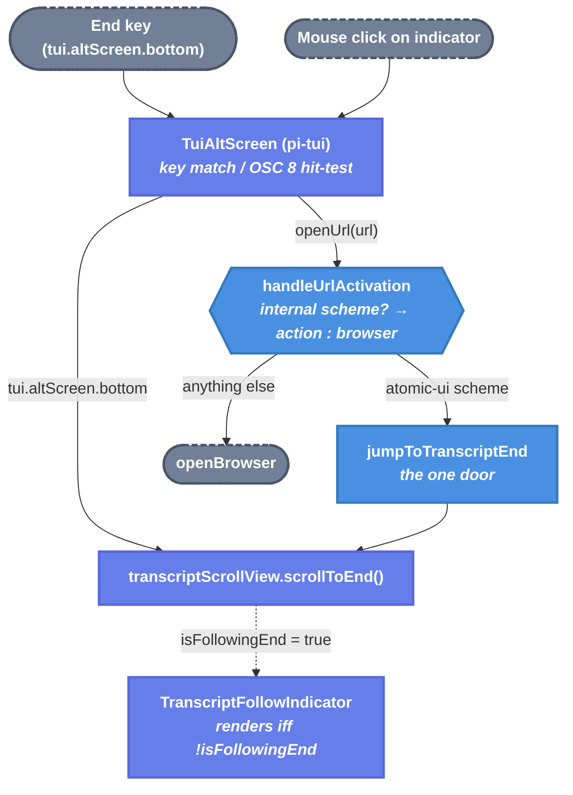

# Jump-to-Bottom Transcript Widget — Technical Design Document

| Document Metadata      | Details                                        |
| ---------------------- | ---------------------------------------------- |
| Author(s)              | Norin Lavaee                                   |
| Status                 | Approved                                       |
| Team / Owner           | Atomic coding-agent TUI                        |
| Created / Last Updated | 2026-08-13                                     |
| Compatibility posture  | No breaking changes (published package; additive feature only) |

## 1. Executive Summary

When a user scrolls the fullscreen transcript up to read history, new output streams in
below their viewport with no visible way back. This spec adds a centered, clickable
"jump to bottom" indicator directly above the input dock, shown only while the
transcript is not following the live end. It introduces one door —
`jumpToTranscriptEnd` — as the single action that resumes following the live
conversation, reachable three ways: the existing `tui.altScreen.bottom` keybinding
(default `End`), a mouse click on the indicator, and programmatic calls. The indicator
displays the currently bound key, so remapping and cross-OS terminal differences are
reflected automatically. Click support reuses pi-tui's existing OSC 8
link-activation primitive; no pi-tui changes are required.

Research: `research/docs/2026-08-13-jump-to-bottom-widget.md`.

## 2. Context and Motivation

### 2.1 Current State

- The fullscreen transcript lives in a pi-tui `ScrollView` created at
  `interactive-startup.ts:137` with `follow: "end"`; it exposes `isFollowingEnd` and
  `scrollToEnd()` (research §1).
- `tui.altScreen.bottom` (default `End`) already scrolls to the bottom, handled inside
  `TuiAltScreen` (research §2) — but nothing on screen tells the user it exists or that
  they are detached from the live end.
- Primary-button clicks on OSC 8 hyperlinks are hit-tested by pi-tui and dispatched to
  Atomic's `openUrl` callback, currently wired directly to `openBrowser`
  (`interactive-tui.ts:329`) (research §3).
- **Leaking door (today):** `openUrl: openBrowser` treats every clicked link as an
  external browser URL. There is no airlock distinguishing application-internal link
  activation from "open a website" — adding internal clickable UI through this path
  without a scheme gate would send `atomic-ui://...` strings to the OS browser.

### 2.2 The Problem

- **User impact:** after scrolling up, users lose the live tail of a streaming reply;
  recovering requires knowing an undiscoverable keybinding or paging down manually.
- **Discoverability:** the `End` binding is invisible; on macOS keyboards End is
  Fn+Right, so many users never find it.

## 3. Goals and Non-Goals

### 3.1 Functional Goals

- [ ] A centered, bordered "Jump to bottom" box appears directly under the
      transcript (above the input dock) exactly when the transcript is not following
      the live end.
- [ ] Clicking the indicator jumps to the bottom and resumes following.
- [ ] The indicator label shows the currently bound key for `tui.altScreen.bottom`
      (live lookup, not hardcoded).
- [ ] The existing keybinding continues to work unchanged.
- [ ] Terminals without mouse/OSC 8 support degrade gracefully: the indicator still
      renders and the displayed key still works.

### 3.2 Non-Goals (Out of Scope)

- [ ] No unread/new-message counter on the indicator.
- [ ] No changes to overlay chat viewports (`ScrollableComponentViewport`); this spec
      covers the main fullscreen transcript only.
- [ ] No new pi-tui primitives; click support uses the existing OSC 8 activation path.
- [ ] No general-purpose internal-link router beyond the single scheme gate this
      feature needs. The gate refuses to grow ad-hoc actions without spec review.
- [ ] No second path that resumes following: every trigger funnels through
      `jumpToTranscriptEnd`.

## 4. Proposed Solution (High-Level Design)

### 4.1 System Architecture Diagram



(The keyboard path reaches `scrollToEnd` inside pi-tui today and stays as-is; the new
door is not inserted into that path. See §9 Q1 for the resolved reasoning.)

### 4.2 Architectural Pattern

Scroll-state-derived conditional rendering (precedent:
`chat-session-host-rendering.ts` branching on `getScrollFromBottom()`), plus a
scheme-gated internal link activation at the existing `openUrl` boundary.

### 4.3 Key Components

| Component                    | Responsibility                                                | Location                                            |
| ---------------------------- | ------------------------------------------------------------- | --------------------------------------------------- |
| `TranscriptFollowIndicator`  | Render centered affordance iff transcript is not following    | new `components/transcript-follow-indicator.ts`     |
| `jumpToTranscriptEnd`        | Resume following the live transcript (single chokepoint)      | `InteractiveModeBase` method                        |
| `handleUrlActivation`        | Airlock: route internal UI links to actions, real URLs to browser | `interactive-tui.ts` (openUrl wiring)           |
| Dock slot                    | First entry of the dock VStack, under the transcript          | `interactive-startup.ts:144`                        |

### 4.4 The Door Set at a Glance (Stranger-Across-Time View)

> `jumpToTranscriptEnd`, `handleUrlActivation`.

Reading these alone: the system can return the user to the live conversation through
exactly one action, and every clicked link passes one gate that decides
"application action" vs "open in browser." No irreversible effects; no ⚠ doors.

## 5. Detailed Design

### 5.1 The Doors (Entrypoint Contracts)

```ts
// — Returning to the live conversation. One door; keyboard, click, and code all use it. —

/** Resume following the live transcript end. Idempotent; safe when already following. */
jumpToTranscriptEnd(): void
// Guarantee: after the call, the transcript viewport follows the live end.
// Failure set: none. No-op when the viewport TUI is absent (guarded fallback path).
// Refusals: takes no target position — this door cannot scroll anywhere but the end.
//   Partial scrolls remain the ScrollView's own concern (scrollBy/pageUp), not this door's.

// — Link activation. The one trust transition for clicked links. —

const TRANSCRIPT_JUMP_TO_END_URL = "atomic-ui://transcript/jump-to-end";

/** Route a clicked link: known internal UI actions run in-app; everything else opens the browser. */
handleUrlActivation(url: string): void
// Guarantee: an internal UI URL never reaches the OS browser; a non-internal URL always does.
// The set of internal URLs is a closed enumeration (today: exactly one constant).
// Refusals: unknown "atomic-ui://" URLs are dropped (not browsed, not executed) —
//   a stale or malicious OSC 8 payload cannot invoke arbitrary behavior.
```

`TranscriptFollowIndicator` is a rendering component, not a door: it holds no state,
receives `isFollowing(): boolean`, `keyLabel(): string`, and renders `[]` or a single
centered highlighted row.

**Per-door audit:**

| Door                  | (1) Joint | (2) One sentence, no "and" | (3) Honest name | (5) Every exit | (6) Refusals real | (7) Trust transition | (8) One chokepoint |
| --------------------- | --------- | -------------------------- | ---------------- | -------------- | ----------------- | -------------------- | ------------------ |
| `jumpToTranscriptEnd` | ✅ "return to live conversation" | ✅ "viewport follows the live end" | ✅ idempotent, end-only | absent TUI → no-op; already at end → no-op | cannot express partial scroll (no params) | n/a | ✅ sole resume-following action in app code; pi-tui's internal key path is upstream and unchanged |
| `handleUrlActivation` | ✅ "activate a clicked link" | ✅ "routes a click to app action or browser" | ✅ | unknown internal scheme → dropped; browser launch failure → best-effort (existing behavior) | closed URL enumeration; no string→action eval | ✅ untrusted screen content becomes an app action only here | ✅ single openUrl wiring point |

Rubric #8 nuance, recorded honestly: the `End` key reaches `scrollToEnd` inside
pi-tui without passing `jumpToTranscriptEnd`. Both converge on
`ScrollView.scrollToEnd`, the effect is idempotent and reversible, and intercepting
the key in Atomic would duplicate upstream logic for zero safety gain. The door is the
single chokepoint *within Atomic's own code*; §9 Q1 records this as accepted.

### 5.2 API Interfaces — The Same Doors on the Wire

Not applicable (no network surface). The "wire" here is the OSC 8 payload: the URL
constant is the transport twin of `jumpToTranscriptEnd`, and
`atomic-ui://transcript/jump-to-end` names the same joint the method names.

### 5.3 Data Model / Schema

None. No settings key (see §9 Q3), no persisted state.

### 5.4 Rendering and State Logic

**Visibility.** `TranscriptFollowIndicator.render(width)`:

1. If `isFollowing()` returns true → return `[]` (zero rows; the dock VStack collapses
   the entry via `shrink: 1, minSize: 0`).
2. Else → return a single centered row whose label sits inside a background highlight:

   ```
    Jump to bottom (End) ↓ 
   ```

   The highlight spans the label plus 1 column of padding on each side, centered with
   left padding computed from `visibleWidth`. When the terminal is narrower, the label
   is truncated with `truncateToWidth` and the padding columns drop below 3 columns.

**Styling.** Muted foreground on the `selectedBg` background, matching the pill styling
used by tab bars and select lists. The whole highlight — padding included — is wrapped
in an OSC 8 hyperlink carrying `TRANSCRIPT_JUMP_TO_END_URL`, so any click on the
highlighted block activates it. `truncateToWidth` emits a full SGR reset around its
ellipsis, so the component reapplies both colors after every reset to keep the
highlight solid.

**Key label.** Reuse the display path behind `getEditorKeyDisplay`
(`interactive-hotkeys-debug.ts:25`) for the `tui.altScreen.bottom` action, resolved at
render time so remaps show immediately. When the action has no bound key, render the
label without a key suffix.

**Dock placement.** New first entry of the dock VStack (`interactive-startup.ts:144`),
above `pendingMessagesContainer`: `{ component: indicator, shrink: 1, minSize: 0 }`.
Not placed in `widgetContainerAbove`, which `renderWidgets()` clears for extension
widgets (research §4).

**Re-render.** Scroll changes always repaint the alt screen, so the indicator's
visibility check runs on every frame that could change it; no listener plumbing.

**Click wiring.** In `createInteractiveTui` (`interactive-tui.ts:316`), replace
`openUrl: openBrowser` with `openUrl: (url) => handleUrlActivation(url)`, where the
handler closes over a callback provided via `InteractiveTuiOptions` (e.g.
`onInternalUiAction`). `InteractiveModeBase` supplies the callback and routes the
jump-to-end action to `jumpToTranscriptEnd()`. Unknown `atomic-ui://` URLs log at
debug level and return.

**`jumpToTranscriptEnd` implementation.**

```ts
jumpToTranscriptEnd(): void {
  this.transcriptScrollView?.scrollToEnd();
  this.ui.requestRender();
}
```

## 6. Alternatives Considered

| Option | Pros | Cons | Reason for Rejection |
| ------ | ---- | ---- | -------------------- |
| A: Overlay pill floating over transcript rows | Looks like web chat UIs | pi-tui has no overlay compositing for arbitrary floats; would need new primitives | Violates "no pi-tui changes"; dock line is 95% of the value |
| B: New SGR mouse hit-testing in `AtomicTuiAltScreen` | Full control of click geometry | Duplicates pi-tui's mouse grammar; fights selection handling; fragile against upstream changes | OSC 8 activation already exists and is upstream-supported |
| C: Extension widget via `widgetContainerAbove` | No core change | Cleared by `renderWidgets()`; extension API has no scroll-state access; core UX shouldn't require an extension | Wrong ownership |
| D (Selected): Dedicated dock component + OSC 8 click + existing keybinding | Smallest diff; every piece is an existing primitive | OSC 8/mouse-less terminals get display-only affordance | Degrades to exactly today's behavior plus a visible hint |

## 7. Cross-Cutting Concerns

### 7.1 Security and Privacy

- **Trust transition is singular:** screen content (which extensions and model output
  can influence via OSC 8 links in the transcript) becomes an application action only
  inside `handleUrlActivation`, and only for a closed enumeration of URLs. Everything
  else keeps today's exact behavior (browser).
- **Refusal:** unknown `atomic-ui://` URLs are dropped. This is deliberate: model
  output could emit an OSC 8 link with an internal scheme; the closed enumeration means
  the worst such a link can do is jump the scroll position — reversible and harmless.
- No data is stored, sent, or logged beyond a debug line.

### 7.2 Compatibility

- Additive only. No public API, settings schema, or keybinding default changes.
  (§9 Q2 resolved: do not add a `ctrl+end` default in Atomic; pi-tui owns defaults and
  users can remap.)
- Guarded main-screen fallback: `transcriptScrollView` is undefined → indicator never
  mounts; `jumpToTranscriptEnd` no-ops.

## 8. Test Plan

Root suites run under vitest with `node:assert/strict` (AGENTS.md).

- **Unit — indicator rendering:** given `isFollowing() === true` → `render(w)` is `[]`;
  given false → exactly three rows (top border, label, bottom border), centered within
  `w`, with the label row containing the OSC 8 URL constant and the key label; border
  rows contain no OSC 8 link; narrow-width truncation keeps every row ≤ `w` visible
  columns; no bound key → no key suffix.
- **Unit — airlock:** `handleUrlActivation(TRANSCRIPT_JUMP_TO_END_URL)` invokes the
  action and never the browser fn; `handleUrlActivation("https://example.com")` invokes
  the browser fn; `handleUrlActivation("atomic-ui://transcript/unknown")` invokes
  neither (the refusal test).
- **Unit — door idempotence:** `jumpToTranscriptEnd` with an undefined
  `transcriptScrollView` does not throw; with a scroll view scrolled up, a fake
  `scrollToEnd` is called.
- **Interactive verification (runnable checklist):**
  1. `npm run build` and launch atomic in a terminal with mouse support.
  2. Produce > 1 screen of transcript, scroll up (wheel or PageUp). Expect the centered
     highlighted `Jump to bottom (End) ↓` row above the input dock.
  3. Press the displayed key. Expect: viewport at live end, indicator gone.
  4. Scroll up again, click the label. Expect the same result.
  5. Remap `tui.altScreen.bottom` in keybindings config, relaunch, scroll up. Expect
     the new key in the label.
  6. Scroll up during an active streaming reply. Expect the indicator; jumping resumes
     live tailing (`follow: "end"` re-engages).

## 9. Open Questions / Unresolved Issues

- [x] **Q1 — Should the `End` key be re-routed through `jumpToTranscriptEnd` so the
      door is the literal sole path?** Resolved: no. Both paths converge on
      `ScrollView.scrollToEnd`; intercepting `tui.altScreen.bottom` in Atomic would
      duplicate pi-tui's handling for no safety gain on a reversible effect. Recorded
      as the rubric #8 nuance in §5.1.
- [x] **Q2 — Add `ctrl+end` as an additional default binding in Atomic?** Resolved
      (user, 2026-08-13): **No.** Keep pi-tui's default (`End`) and the live key
      label. Avoids shadowing the editor's own `ctrl+end` ("move to line end",
      `keybindings.d.ts:94`).
- [x] **Q3 — Settings toggle to hide the indicator?** Resolved (user, 2026-08-13):
      **No setting; always on.** The indicator is invisible whenever the viewport
      follows the end.
- [x] **Q4 — Indicator copy.** Resolved (user, 2026-08-13): `Jump to bottom (End) ↓`,
      muted and centered. Revised (user, 2026-08-13): the label sits in a background
      highlight (`selectedBg`) on one row instead of a drawn border box; the whole
      highlight is clickable.

## Backwards Compatibility

No breaking changes. All additions are internal to the interactive TUI: a new
component, a new method on `InteractiveModeBase`, and a widened `openUrl` wiring that
preserves browser behavior for every non-internal URL. Existing keybindings, settings,
extension widget containers, and the guarded main-screen fallback are untouched.
