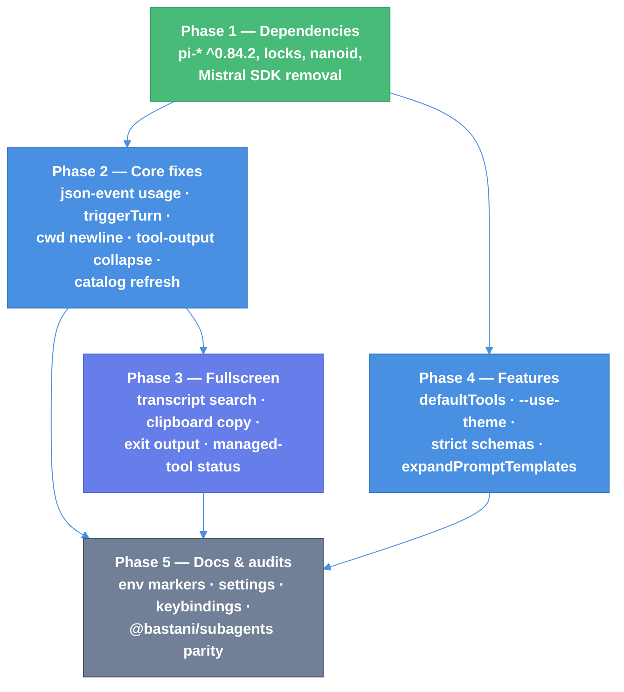

# Pi v0.84.2 Migration — Technical Design Document

| Document Metadata      | Details                          |
| ---------------------- | -------------------------------- |
| Author(s)              | Norin Lavaee                     |
| Status                 | Draft (WIP)                      |
| Team / Owner           | Atomic coding-agent              |
| Created / Last Updated | 2026-08-14 / 2026-08-14          |

## 1. Executive Summary

Atomic resolves `@earendil-works/pi-*` at `^0.84.1`. Upstream `v0.84.2` adds 137 commits:
98 land entirely inside packages Atomic consumes rather than vendors, and 39 touch
`packages/coding-agent`, which Atomic owns as a fork.

This document bumps the six pi dependencies to `^0.84.2` — Atomic changes none of that code,
so those changes are taken whole — and then decides, commit by commit, which of the 39
coding-agent changes Atomic adopts. The governing constraint is that **Atomic runs fullscreen
only**: there is no `tuiMode` setting, no `--tui-mode` flag, and no `/settings` row offering
`regular`. Upstream's fullscreen *behavior* is in scope; upstream's fullscreen *opt-in
machinery* is deliberately not.

The migration opens six new doors: the `fullscreenExitOutput` setting, the `defaultTools`
setting, the `--use-theme` run flag, `sendUserMessage({ expandPromptTemplates })`, the
`message_update.usage` wire field, and the four `tui.altScreen.search*` keybinding actions.
None guards an irreversible effect; one (`defaultTools`) can silently disable every tool a
session has, which is why it ships with its companion fix or not at all.

## 2. Context and Motivation

### 2.1 Current State

- **Dependencies:** `@earendil-works/pi-{agent-core,ai,client,protocol,tui}` at `^0.84.1`
  (`packages/coding-agent/package.json:88-92`); resolved `pi-tui` is `0.84.1`.
- **Renderer:** one `AtomicTuiAltScreen extends TuiAltScreen`
  (`src/modes/interactive/interactive-tui.ts:229`), selected by `shouldUseFullscreenTui()`
  (`:400-404`). `TuiMainScreen` survives only as a non-TTY/harness fallback (`:410-413`).
- **Settings:** `src/core/settings-types.ts:147` carries `fullscreenScrollbar`. There is no
  `tuiMode`. Upstream's `/settings` "TUI mode" row does not exist in Atomic.
- **Keybindings:** Atomic gates fullscreen viewport actions through an explicit allowlist
  (`src/modes/interactive/interactive-mode-base.ts:67-74`), not upstream's open routing.
- **Subagents:** Atomic ships `@bastani/subagents`; upstream's `examples/extensions/subagent`
  is not Atomic's implementation.
- **Sessions:** JSONL (`src/core/session-manager-storage.ts`), not the upstream SQLite
  session backend.

### 2.2 The Problem

Three classes of upstream change are currently unavailable to Atomic users:

1. **Renderer and provider fixes** that arrive free with a dependency bump but are held back
   by the pin (LaTeX line-ending parsing, idle-focus repaint, SGR mouse release, overlay
   wheel routing, Bedrock/DeepSeek/Google/Responses provider correctness).
2. **Fullscreen features Atomic uses every second of every session** — transcript search,
   host-clipboard selection copy, configurable exit output — which upstream shipped behind
   prose that assumes a `regular` mode Atomic does not have.
3. **Core defects Atomic shares byte-for-byte**: `src/modes/json-event.ts` drops cumulative
   usage during streaming; `sendUserMessage` cannot expand prompt templates; `triggerTurn:
   false` still steers an active run; extension tool output never collapses.

Doing nothing widens the fork and makes the next migration more expensive.

## 3. Goals and Non-Goals

### 3.1 Functional Goals

- [ ] All six `@earendil-works/pi-*` dependencies resolve at `^0.84.2` with a regenerated
      `package-lock.json`, `install-lock/package-lock.json`, and `npm-shrinkwrap.json`.
- [ ] Every one of the 137 upstream commits carries an explicit, evidence-backed
      classification (`research/pi-0.84.2-port-matrix.md`).
- [ ] Fullscreen transcript search works in Atomic, with themed match highlighting and
      routed keybindings.
- [ ] Workflow stage chats support the same search, and `Ctrl+Shift+F` in a focused stage
      chat never opens a search over the main transcript behind it.
- [ ] Fullscreen selection copy reaches the real system clipboard and reports honest failure.
- [ ] Exiting Atomic honors a configured exit output.
- [ ] The seven core fixes in §B4 of the matrix are present with named regression tests.
- [ ] The eleven gaps in §5.6 are each closed or explicitly documented as a deliberate omission.
- [ ] No Atomic override silently shadows a pi-tui 0.84.2 fix.
- [ ] `npm run check` and all three vitest projects stay green on Linux, macOS, and Windows —
      run against a real 0.84.2 install, not inferred.

### 3.2 Non-Goals (Out of Scope)

- [ ] We will NOT add the `tuiMode` setting, `--tui-mode`, or a `/settings` TUI-mode row.
      Fullscreen has exactly one state and no door that leaves it.
- [ ] We will NOT copy upstream doc sentences that offer `regular` mode or say a fullscreen
      setting "has no effect in regular TUI mode."
- [ ] We will NOT port upstream's `examples/extensions/subagent` changes into that example;
      the equivalent behavior is audited in `@bastani/subagents` instead.
- [ ] We will NOT adopt the SQLite session backend, upstream release scripting, upstream
      `AGENTS.md`/`SECURITY.md` edits, or upstream contributor-allowlist commits.
- [ ] We will NOT add a second path that mutates saved theme settings; `--use-theme` is
      run-scoped and non-persistent.

## 4. Proposed Solution

### 4.1 Layering



Phase 1 gates everything: fullscreen search and clipboard injection require the pi-tui
0.84.2 option surface, and the strict-schema work requires pi-ai 0.84.2. Phases 2 and 4 are
independent of each other and of Phase 3 once Phase 1 lands.

### 4.2 Selection rule

Every upstream coding-agent commit is decided by three questions, in order:

1. **Does Atomic vendor the changed code?** No → inherited dependency, take it by bumping.
2. **Does the change presuppose a renderer mode Atomic does not have?** Yes → take the
   behavior, drop the mode machinery and its prose.
3. **Does Atomic already solve this differently?** Yes → record equivalence with the Atomic
   file and line; do not port a second mechanism.

### 4.3 Key components touched

| Component | Responsibility | Files |
| --- | --- | --- |
| Renderer host | Fullscreen options injection | `src/modes/interactive/interactive-tui.ts` |
| Keybinding policy | Fullscreen viewport action allowlist | `src/modes/interactive/interactive-mode-base.ts:67-74` |
| Theme | Search-match colors and fallbacks | `src/modes/interactive/theme/{theme.ts,theme-schema.json,dark.json,light.json}` |
| Settings | `fullscreenExitOutput`, `defaultTools` | `src/core/settings-types.ts`, `src/core/settings-manager-ui-accessors.ts` |
| Session | Tool selection, prompt expansion, custom-message delivery | `src/core/sdk.ts`, `src/core/agent-session-prompt.ts`, `src/core/agent-session-custom-message-commit.ts` |
| Wire | JSON/RPC streaming events | `src/modes/json-event.ts` |

### 4.4 The Door Set at a Glance

New or changed doors, names alone:

`fullscreenExitOutput` · `defaultTools` · `--use-theme` ·
`sendUserMessage(content, { expandPromptTemplates })` · `message_update.usage` ·
`tui.altScreen.search` / `searchNext` / `searchPrevious` / `searchClose` ·
`ensureTool(tool, onStatus)` · `copySelection`

Read together: a session can be told which tools it starts with and which theme it wears for
this run only, an extension can send a message that is either literal or expanded, a JSON
consumer can read cumulative usage without waiting for the turn to end, and a fullscreen
reader can find, copy, and leave the transcript. **No door in this set performs an
irreversible effect.**

## 5. Detailed Design

### 5.1 The Doors

```ts
// — Settings —

getFullscreenExitOutput(): "transcript" | "resume-hint"
setFullscreenExitOutput(output: "transcript" | "resume-hint"): void
// Guarantee: reports what the terminal keeps after Atomic exits.
// Refusal: the type admits no third value, so no caller can request a partial print.
// Atomic adaptation: upstream first switches the renderer to `regular` and repaints.
// Atomic has no regular mode; it paints the transcript to the main screen directly,
// or calls ui.stop({ preserveScreen: true }) and prints only the resume hint.

getDefaultTools(): string[] | undefined
// Guarantee: returns the configured initial BUILT-IN tool selection, or undefined.
// Named failure: none — an unreadable value reads as undefined.
// Refusal (critical): this door must NOT narrow extension or custom tools. Upstream
// shipped that bug in 4d9aa837 and fixed it in 541045ae. Taking only the feature commit
// would silently disable workflow, subagent, intercom, mcp, and web_search for any user
// who sets defaultTools. The two commits are one unit.

// — CLI —

--use-theme <name[/name]>
// Guarantee: selects the interactive theme for this run without writing settings.
// Named failure: "--use-theme requires a theme name" when the value is absent or looks
// like a flag; an unknown theme name surfaces through the existing theme error path.
// Refusal: it cannot persist. Only an explicit in-session selection writes settings.

// — Extension API —

sendUserMessage(
  content: string | (TextContent | ImageContent)[],
  options?: { deliverAs?: "steer" | "followUp"; expandPromptTemplates?: boolean },
): void
// Guarantee: delivers a user message and triggers a turn.
// Honesty note: `expandPromptTemplates: true` means the message may DISPATCH an extension
// or skill command rather than being sent literally. Default stays false, so every
// existing caller keeps its current meaning.

// — Wire —

type JsonMessageUpdateEvent = {
  type: "message_update";
  usage: Usage;                       // NEW, additive
  assistantMessageEvent: WithoutPartial<AssistantMessageEvent>;
};
// Guarantee: every streaming update carries cumulative usage.
// Every exit: a non-assistant message on this event is a protocol violation and throws
// rather than emitting a zeroed usage object.

// — Renderer options —

copySelection?: (text: string) => Promise<boolean>
// Guarantee: returns whether the host clipboard actually received the text.
// This is the honesty fix: the old OSC 52 path flashed "Copied!" unconditionally.

ensureTool(tool: "fd" | "rg", onStatus?: (s: ToolStatus) => void): Promise<string | undefined>
// Guarantee: returns the tool path or undefined, reporting progress to the caller.
// Refusal: it can no longer write to the console. In fullscreen a console write lands
// in the alternate screen and corrupts the frame; Atomic's current console.error at
// interactive-startup.ts:233 is exactly that bug.
```

**Per-door audit:**

| Door | Joint, not tool | One sentence | Honest name | Every exit | Refusals real | Chokepoint |
| --- | --- | --- | --- | --- | --- | --- |
| `fullscreenExitOutput` | ✅ | "reports what the terminal keeps after exit" | ✅ | error path passes `"transcript"` explicitly | ✅ two-value union | n/a |
| `defaultTools` | ✅ | "the initial built-in tool selection" | ✅ only after `541045ae` | undefined on absent | ⚠️ enforced by test, not by type | single read in `sdk.ts` |
| `--use-theme` | ✅ | "selects this run's theme" | ✅ | missing value → named diagnostic | ✅ cannot persist | n/a |
| `expandPromptTemplates` | ✅ | "expand and dispatch, or send literally" | ⚠️ needs the dispatch caveat in the doc comment | unknown command falls through to literal send | default `false` | n/a |
| `message_update.usage` | ✅ | "cumulative usage for this turn so far" | ✅ | non-assistant role throws | ✅ | n/a |
| `copySelection` | ✅ | "did the host clipboard receive it" | ✅ | rejection → `false` → "Copy failed" | ✅ boolean, not void | one copy path |

### 5.2 Fullscreen keybinding routing

Upstream documents the new actions and lets pi-tui route them. Atomic gates them:

```ts
// src/modes/interactive/interactive-mode-base.ts:67-74 — extend
"tui.altScreen.lineUp", "tui.altScreen.lineDown",         // from 1279952d
"tui.altScreen.search", "tui.altScreen.searchNext",
"tui.altScreen.searchPrevious", "tui.altScreen.searchClose", // from 00121ed9
```

Omitting this makes `Ctrl+Shift+F` a no-op while the feature looks ported. A routing test
asserting each new action reaches the viewport is mandatory, not optional.

### 5.3 Theme schema compatibility

`searchMatchBg` and `searchMatchText` are **optional** with fallbacks to `selectedBg` and
`text`. Every user-authored Atomic theme keeps validating unchanged. The `Theme` constructor
signature changes to accept partial optional colors — an Atomic public-API change, so it
lands with a changelog entry under `### Changed`.

### 5.4 `defaultTools` and Atomic's builtin extension tools

Atomic's builtin packages contribute `workflow`, `subagent`, `intercom`, `mcp`,
`web_search`, plus first-party `todo`, `ask_user_question`, and `structured-output`. After
`541045ae`, `defaultTools` narrows only `initialActiveToolNames` (built-ins) and leaves
`allowedToolNames` undefined, so extension tools survive. The regression test must set
`defaultTools: ["read"]` and assert a builtin extension tool is still registered and active.

### 5.5 Search inside workflow stage chats

Upstream's transcript search is wrong for Atomic when a workflow overlay is focused.
`TuiAltScreen.handleViewportInput` matches `tui.altScreen.search` **before** its
`shouldDeferViewportInputToOverlay()` guard, so `Ctrl+Shift+F` with a stage chat open would
open a search box over the hidden main transcript underneath — not the chat the user is
reading. Atomic must not inherit that.

**Routing.** No new mechanism is needed. Listing the four `tui.altScreen.search*` actions in
`FULLSCREEN_VIEWPORT_ACTIONS` (`interactive-mode-base.ts:66-75`) makes
`shouldHandleFullscreenViewportInput` return `false` whenever a non-editor component is
focused (`:96-99`). Atomic's `viewportInputGate` runs upstream of pi-tui's own listener
(`interactive-tui.ts:268-273`), so the gate wins:

| Focus | `Ctrl+Shift+F` reaches | Searches |
| --- | --- | --- |
| Main editor | pi-tui `TuiAltScreen` | The session transcript |
| Workflow stage chat overlay | `handleStageChatInput` | That stage's chat |

**Matcher.** pi-tui keeps `findAltScreenSearchMatches`, `getAltScreenSearchMatchKey`, and
`AltScreenSearchComponent` in `packages/tui/src/alt-screen-search.ts` and does **not** export
them from its index at v0.84.2. pi-tui ships no `exports` map, so a deep import into
`dist/alt-screen-search.js` resolves today — and is private API that can vanish in any
upstream refactor with no error at Atomic's boundary. **Decision: Atomic owns a local pure
module**, `src/modes/interactive/components/transcript-search.ts`, exporting
`findSearchMatches(lines, query)` and its match-key helper. The main transcript keeps
pi-tui's copy; Atomic's copy serves stage chats now and the graph view later. No upstream PR
or issue is filed for this.

**Corpus.** `ChatSessionHost` renders through `ScrollableComponentViewport`
(`components/chat-transcript.ts`), which exposes `rowCount(width)` and
`renderRows(width, start, end)`. Stage-chat search therefore covers the **entire** stage
transcript, not only the rows the viewport currently holds — strictly better than the main
transcript search, which sees only the scroll view's content lines.

**Highlighting** reuses the L8 theme colors (`searchMatchBg`, `searchMatchText`) so both
surfaces look identical. Navigation needs an absolute `scrollTo(row)` on
`ScrollableComponentViewport`, which today has only `scrollBy`, `scrollToTop`,
`scrollToBottom`, `getMaxScroll`, and `getScrollFromBottom`.

**Key conflicts.** `Ctrl+F` is already bound in stage chat to submit-as-follow-up
(`stage-chat-view-input.ts:76`); `Ctrl+Shift+F` is distinct and free. `Escape` is contended —
the existing ladder at `:58-70` maps it to interrupt-or-close, so `searchClose` must consume
Escape before that ladder runs, and only while a search is open.

**Non-goal for this migration:** the workflow graph view. Its corpus is node labels and
edges rather than chat rows and deserves its own design pass; it reuses the same Atomic
matcher when it happens.

### 5.6 Carried-forward gaps from pi 0.84.0–0.84.1

Twelve items are open in the tree today. Four are unfinished rows from the 0.84.1 port matrix;
three are v0.84.2 changes whose code arrives with the dependency but whose Atomic-facing
surface does not exist; and two are a category the commit-by-commit pass cannot find at all —
**Atomic overrides that shadow an inherited fix**, discovered by auditing Atomic's own
`AtomicTuiAltScreen` and input-gate code against pi-tui 0.84.2's new behavior; and two are
Atomic documentation defects found by walking all 84 changed upstream files rather than the
137 commits. Each was verified against the current tree rather than trusted from the old
matrix, and each gets its own stack layer.

| # | Gap | Verified evidence | Layer |
| --- | --- | --- | --- |
| 1 | `AssistantMessage.endTurn` never reaches Atomic | `c3e7bc60` adds it to pi-ai types and `packages/server/src/protocol.ts`. Atomic vendors no pi-server; `endTurn` is absent from `packages/coding-agent/src` entirely. Identical bug class to `c93ea6cc` — an upstream field that dies at Atomic's serializer. | L5 |
| 2 | Theme detection probes still serial | `theme-controller.ts:42,54` await sequentially, as does `cli/startup-ui.ts:33`. Upstream `7cb2a51` starts the colour-scheme and background probes concurrently. Costs startup latency on every automatic-theme run. | L12 |
| 3 | `createGatewayBindingFetch()` undiscoverable | `23002907` routes Cloudflare AI Gateway through a Workers AI binding with **no API token**. `docs/providers.md:127` still documents `CLOUDFLARE_API_KEY` as the only path, and Atomic re-exports nothing. | L18 |
| 4 | bunfig autoload flag untested | `--no-compile-autoload-bunfig` is applied at `packages/coding-agent/package.json:73` and `scripts/build-binaries.sh:188,190`, but no test asserts it. A refactor silently reintroduces #7685. | L2 |
| 5 | Tool prompt text duplicated at its definition site | `9ab91fb` hoists each tool's `promptSnippet`/`promptGuidelines` into a module-level `const`. It does **not** touch pi's `index.ts` — verified against `v0.84.2:packages/coding-agent/src/index.ts`. **Decision: module-level only, matching upstream**, so these stay out of Atomic's public surface; and **all nine Atomic tools** get one, not just the seven with an upstream counterpart. | L15 |
| 6 | `cut-release.ts` has no npm registration preflight | Upstream `9b17fd5` (**not** `9b4f6a9`, which is `doc(changelog): Fix link` — corrected in the 0.84.1 matrix) checks every public workspace package before modifying the worktree. `scripts/cut-release.ts` has no such check; `publish.yml:575` runs `npm view` only as an already-published idempotency check, after the build. | L3 |
| 7 | “Never named” and “named then cleared” are indistinguishable | **Correction to an earlier reading:** Atomic already has full session naming — `/name` (`slash-commands.ts:297`), `setSessionName`, `SessionInfoEntry.name`, `SessionInfo.name`, and working clears (`session-manager-entries.ts:203-207`). `7bdb16c2` is a *storage-layer* fix for pi's harness-v3 SQLite backend, whose `facts` join needs `has_session_name` to tell an absent row from an empty one (`storage/sessions.ts:11-12,63-69`). Atomic's JSONL already records the difference — a clear appends `name: ""`, a never-named session has no entry — but both readers collapse it to `undefined`. | L17 |
| 8 | Atomic's viewport gate disagrees with pi-tui's new native one | `2e4d2395` adds `shouldDeferViewportInputToOverlay()` to `TuiAltScreen`, solving the problem Atomic already solved with `viewportInputGate` / `shouldHandleFullscreenViewportInput` (`interactive-mode-base.ts:88-100`). Upstream deliberately exempts a focused search overlay so the transcript can still scroll while the find box is open; **Atomic's gate has no such exemption**, so with search focused Atomic suppresses pi-tui's viewport handling and the transcript freezes. | L6 |
| 9 | Atomic's mouse parser shadows the generic SGR release fix | `83aed2ba` (#7963) makes pi-tui accept `event.release && (button & 3) === 3` as a selection end. Atomic's `isLeftMouseButton` (`interactive-tui.ts:199-205`) requires `(button & 3) === 0`, so it still drops that release — and its comment, *“Legacy X10 release is button 3, which pi-tui cannot identify”*, becomes false at 0.84.2. The patched function is `handleSelectionMouseEvent`, which also drives **OSC 8 link activation** via `pressedUrl`, so Atomic's own internal-UI links (`handleUrlActivation`, `interactive-tui.ts:420-425`, including `TRANSCRIPT_JUMP_TO_END_URL`) can fail to activate on these terminals — not just drag-selection. | L7 |
| 10 | Atomic's `ModelRuntime` catalog API is undocumented | `581d75a8` documents upstream's equivalent. Atomic **already implements** `allowModelNetwork`, `modelRefreshTimeoutMs` (default `15_000`), `modelsStorePath`, `modelsStore`, and `refresh({ allowNetwork, force, signal })` (`core/model-runtime.ts:146-195,656`), but `docs/sdk.md` mentions none of them — a public SDK surface with zero documentation, not a missing doc paragraph. | L19 |
| 14 | Baseten catalog assertion breaks | `test/baseten-qwen-provider.test.ts` asserts an exact Baseten model list; pi-ai 0.84.2's regenerated catalog adds `deepseek-ai/DeepSeek-V4-Pro-0813`. Found by running the suite, not by reading commits. | L4 |
| 11 | `docs/custom-provider.md` reference list is wrong | Lines 380-388 send readers to `dist/providers/` for API reference implementations; those live in `dist/api/`, and `dist/providers/` holds per-vendor configs. Two of the six named files (`openai-completions.d.ts`, `openai-responses.d.ts`) do not exist there. Independent of 0.84.2, but line 199's *“Mistral SDK Conversations/Chat streaming”* also goes stale with `9dd90a49`'s native transport, and `npm-shrinkwrap.json` still carries three `mistralai` entries. | L20 |

Items 4 and 6 share no files with the migration. They sit at the bottom of the stack so they
merge first rather than waiting behind seventeen PRs — a consequence of `gh stack` being
strictly linear.

Items 8 and 9 are a different class from every other row here: nothing in the upstream commit
list points at them, because the defect is in **Atomic's own override**, which only becomes
wrong once the dependency moves. Both must land before L8, or fullscreen search ships with a
frozen transcript and selection stays broken on the terminals #7963 describes. L6 also probes
whether `2a95ef70` (ESC timeout scoped to a lone ESC) and `06ed8716` (split `Alt+Enter` over
SSH) survive Atomic's chunk-splitting replay in `routeViewportInput`; no breakage is confirmed
there, so it is a probe with a recorded outcome rather than a required fix.

**Resolved without a layer.** pi-ai 0.84.2 also normalizes `null` to omitted for optional
non-nullable tool arguments (`utils/validation.ts`, `normalizeOptionalNulls`), on every
provider and independent of the experimental flag. It is **accepted inherited behavior**: the
function skips keys listed in `required`, and every Atomic invalid-argument marker sits on a
required argument (`bash.command`, `bash.ts:45`; `grep.pattern`, `grep.ts:27`), so those
renderers are untouched. The one optional argument that renders, `grep.path` (`grep.ts:28`),
strictly improves — `path: null` previously failed validation and never rendered, and now
displays `"."` for an omitted path.

Item 7 needs no storage migration. The distinction is already durable in existing session
files; only `getLatestSessionName` and the list reducer discard it with `|| undefined`. L15
surfaces it as a name *state* rather than a bare optional string, mirroring pi's
`has_session_name` / `session_name` pair.

### 5.7 L1 is time-gated, and it breaks a contract test

**Release-age gate.** All six `@earendil-works/pi-*@0.84.2` packages were published
**2026-08-14, 10:05:51Z–10:09:28Z**. The committed `.npmrc` sets `min-release-age=2`, so npm
refuses to resolve any of them until **2026-08-16 ~10:09:28Z**, gated by the last one
published (`pi-tui`). Until then `npm install --package-lock-only` cannot produce a lock and
`npm run check`'s shrinkwrap step goes red.

This is the same blocker that stalled the 0.84.1 adoption
(`research/pi-0.84.1-absorption-inventory.md`). Every workaround is forbidden by the layer
contract: `--before`, `min-release-age=0`, `--force`, editing `.npmrc`, and hand-editing
`package-lock.json`. **L1 is held atomic** — manifest ranges are not committed without a
regenerated lock.

**Contract test.** `test/unit/pi-0.82.1-artifacts.test.ts` hardcodes `piVersion = "0.84.1"`
(`:30`), six registry tarball URLs (`:36-71`), and two `"^0.84.1"` range assertions
(`:115,142`). It fails the moment the bump lands and **must be updated inside L1**, not after. Its `assertPiRuntimeAssets` helper (`packages/coding-agent/scripts/assert-pi-runtime-assets.ts:43`) enforces the same version through a parameter and fails with it; the single `piVersion` constant drives both.

Four other files mention `0.84.1` in comments, a `describe` label, or a filename
(`test/unit/llama-extension-parity.test.ts:31`,
`packages/coding-agent/test/remote-catalog-provider.test.ts:200`,
`packages/coding-agent/test/pi-0.84.1-sampling-params.test.ts:69`,
`packages/coding-agent/test/helpers/refresh-context.ts:10`). None asserts a version; they are
historical labels and stay as-is unless renamed for hygiene in L21.

**Superseded: the gate was removed and the migration was measured.** `.npmrc` now sets
`min-release-age=0` (with `.github/dependabot.yml` cooldowns and `AGENTS.md` updated to
match) as a deliberate policy change — Atomic adopts pi releases the same day, which any
nonzero cooldown blocks by construction. The bump was then executed in a throwaway worktree
and the full suite run. Results in §5.8.

### 5.8 Measured results of the bump

Executed in a throwaway git worktree at `HEAD` with all six `pi-*` ranges moved to `^0.84.2`,
`npm ci --ignore-scripts`, then the full toolchain. **This replaces inference with evidence
for everything below.**

| Check | Result |
| --- | --- |
| `tsc --noEmit` | **clean** |
| `tsgo -p tsconfig.build.json --noEmit` (coding-agent) | **clean** |
| `vitest --project unit` | 6305 passed, **2 failed**, 643/644 files |
| `vitest --run` (coding-agent package) | 3671 passed, **5 failed**, 447/450 files |
| `vitest --project integration` | 486 passed, 0 failed |
| `vitest --project ci` | 42 passed, 0 failed |

Both typechecks passing confirms the changelog reading: **0.84.2 carries no breaking API
change for Atomic.** Seven test failures across four files:

| File | Fails | Predicted? |
| --- | ---: | --- |
| `test/unit/pi-0.82.1-artifacts.test.ts` | 2 | **Yes** — §5.6 gap 13. Also revealed a second surface: `packages/coding-agent/scripts/assert-pi-runtime-assets.ts:43` gates on the same version through a parameter, which a `0.84.1` grep cannot find. |
| `test/model-runtime-cloudflare-compat.test.ts` | 2 | **Yes** — upstream `5f7195c5`. `getModel("cloudflare-ai-gateway", "workers-ai/…")` now returns `undefined`; the catalog entry moved. |
| `test/baseten-qwen-provider.test.ts` | 1 | **No** — gap 14. The Baseten catalog gained `deepseek-ai/DeepSeek-V4-Pro-0813`; the test asserts an exact list. Caused by a pi-ai commit this document classified as inherited-with-no-Atomic-work. |
| `test/ask-user-question-transcript-scroll.test.ts` | 2 | **Cause predicted, consequence not** — this is §5.6 gap 8 firing, and it is worse than described. See below. |

#### Gap 8 is a policy conflict, not a reconciliation

`PAGE_UP` with an `ask_user_question` dialog mounted now scrolls the transcript by **0** rows
instead of a page (`test:923`, expected 30, received 0). pi-tui 0.84.2's
`shouldDeferViewportInputToOverlay()` defers `tui.altScreen.pageUp` to the focused overlay,
because upstream #7894 decided focused fullscreen overlays should receive wheel and viewport
keys.

Atomic decided the opposite, and did so days ago: issue #2378 / PR #2381 — the current `HEAD`
of this repository — fixed exactly this so that page and wheel input reach the transcript
*while the dialog keeps its selection keys*. **Upstream #7894 and Atomic #2378 are direct
contradictions.**

So L6 is not "add a search exemption to Atomic's gate." It must resolve which side owns
viewport keys when an overlay is focused, and it inherits `#2378`'s regression test as its
acceptance criterion. The bump re-breaks the most recently merged fix in the repository.

## 6. Alternatives Considered

| Option | Pros | Cons | Verdict |
| --- | --- | --- | --- |
| Dependency bump only | Smallest diff, fastest | Leaves search, clipboard honesty, and five shared core defects unfixed; grows the fork | Rejected |
| Bump + full upstream parity including `tuiMode` | Mechanical, no judgment calls | Reintroduces a mode Atomic deliberately deleted, plus its settings row, docs, and switch path | Rejected — contradicts the product decision |
| Bump + behavior-only fullscreen adoption (**selected**) | Users get every fullscreen improvement; no opt-out machinery returns | Each fullscreen commit needs manual adaptation and its own test | **Selected** |
| Defer features (`defaultTools`, `--use-theme`, strict schemas) to a later issue | Smaller migration | Splits the pi-ai strict-schema work from the bump that enables it; leaves a second migration to schedule | Rejected — §9.4 resolved: all four ship here |
| One large migration PR | One review, one merge | 39 adapted commits across renderer, settings, session, wire, and docs in a single diff; no reviewer can hold it | Rejected — §10 ships a `gh stack` of nine layered PRs |

## 7. Cross-Cutting Concerns

### 7.1 Security and Privacy

- `--use-theme` reads theme files through the existing loader; no new filesystem door.
- `expandPromptTemplates: true` lets an extension-authored message dispatch a command. The
  default stays `false` so no existing extension changes behavior on upgrade; the doc
  comment states the dispatch consequence explicitly.
- `copySelection` moves selected transcript text to the system clipboard through Atomic's
  existing `copyToClipboard`, which already carries the platform fallbacks.
- No credential, network, or filesystem-mutation door is added or widened.

### 7.2 Backwards Compatibility

Breaking changes are **not** allowed. Specifically preserved:

- Every existing setting key and its default.
- Every existing theme file — the two new colors are optional with fallbacks.
- Every existing `sendUserMessage` caller — the new option defaults to today's behavior.
- `message_update` consumers — `usage` is additive.
- `ensureTool`'s second parameter changes type (`boolean` → callback). It is not exported
  from `src/index.ts`, so this is internal; both internal call sites
  (`core/tools/find.ts:645`, `core/tools/grep.ts:338`) update in the same commit.

### 7.3 Documentation

`packages/coding-agent/docs` is user-facing and must be updated in the same phase as the
behavior: `keybindings.md` (search actions), `settings.md` (`fullscreenExitOutput`,
`defaultTools`, Windows path escaping), `themes.md` (search colors, `--use-theme`),
`usage.md` (exit output, `--use-theme`), `environment-variables.md` (`AI_AGENT=atomic`,
`PI_TUI_ESC_TIMEOUT`), `json.md` and `rpc.md` (`usage`), `extensions.md`
(`expandPromptTemplates`), `terminal-setup.md` (terminal-specific mouse behavior).

## 8. Test Plan

- **Unit:** `fullscreenExitOutput` accessor defaults and round-trip; `defaultTools` returns a
  copy; `--use-theme` argument diagnostics; theme fallback resolution when both new colors
  are absent; `toJsonEvent` throws on a non-assistant `message_update`.
- **Regression (named, one per fix):** `7982-json-stream-usage`, `8022-trigger-turn-false`,
  `7979-fallback-tool-output-collapse`, `7887-system-prompt-cwd-newline`,
  `7913-fullscreen-search-actions-routed`, `8110-selection-copy-reports-failure`,
  `stage-chat-search-does-not-reach-transcript`, `end-turn-survives-json-and-rpc`,
  `bunfig-preload-excluded-from-binary`, `cut-release-aborts-on-unregistered-package`,
  `cleared-session-name-differs-from-never-named`, `transcript-scrolls-while-search-focused`,
  `generic-sgr-release-ends-selection`.
- **Integration:** `defaultTools: ["read"]` keeps builtin extension tools active;
  concurrent model-catalog refresh returns one shared in-flight promise; `--use-theme` does
  not write settings while an in-session selection does.
- **Contract:** all six pi packages resolve to the same `0.84.2` minor across the workspace;
  `check:shrinkwrap` green.
- **Interactive verification:**
  1. `atomic` → `Ctrl+Shift+F` → type a token present in the transcript → matches highlight,
     `Enter` advances, `Escape` closes. Pass: highlight uses theme colors and manual scroll
     is not snapped back.
  2. Attach a workflow stage chat, focus it, press `Ctrl+Shift+F`, search a token that
     appears in the stage chat **and** in the main transcript. Pass: the search box belongs
     to the stage chat, counts only stage-chat matches, and the transcript behind it is
     untouched. `Escape` closes search without interrupting the stage or closing the pane.
  3. Drag-select transcript text in macOS Terminal.app (no OSC 52). Pass: system clipboard
     holds the text, or the toast says "Copy failed" — never a false success.
  4. Set `"fullscreenExitOutput": "resume-hint"`, run a turn, exit. Pass: the previous screen
     is restored and only the resume hint prints.
  5. Set `"defaultTools": ["read"]`, start a session, run `/tools`. Pass: `read` is the only
     active built-in and every builtin extension tool is still listed.
  6. `atomic --use-theme light`, change nothing, exit, reopen. Pass: the saved theme is
     unchanged.

## 9. Resolved Decisions

- [x] **9.1 — `fullscreenExitOutput` defaults to `"transcript"`.** Matches today's Atomic
      behavior, so the setting is purely additive and no user sees a change on upgrade.
- [x] **9.2 — `fullscreenExitOutput` gets a `/settings` selector row.** It sits beside the
      existing `fullscreenScrollbar` row: `settings-selector-items.ts`,
      `settings-selector-handlers.ts`, `settings-selector-types.ts`, plus a selector test.
- [x] **9.3 — Strict schemas cover the upstream four plus Atomic-only tools.** `read`,
      `bash`, `edit`, `write`, `find`, `search`, `ls`, `ask_user_question`, `todo`, and
      `create-harness`. **Required extra test:** `structured-output` already constrains its
      own schema; assert the two constraint layers compose rather than double-wrap, and
      that `ask_user_question`'s option arrays still validate under strict mode. All of it
      stays behind `ATOMIC_EXPERIMENTAL=1` / `PI_EXPERIMENTAL=1`.
- [x] **9.4 — All four features ship in this migration.** `defaultTools` (with `541045ae`),
      `--use-theme`, strict schemas, and `expandPromptTemplates`.
- [x] **9.5 — `@bastani/subagents` parity is audited and fixed inside this migration**, in
      its own stack layer (§10, L8). Two behaviors to prove: a spawned subagent inherits the
      parent session's model, thinking level, and tool configuration; and agent frontmatter
      accepts YAML array-form `tools` as well as the comma-separated form.
- [x] **9.6 — Audit all four compaction-doc commits, take only what still applies.**
      Atomic's `docs/compaction.md` documents Verbatim Compaction with a different table
      and different mechanics; three of the four upstream hunks are cosmetic. Record the
      per-commit outcome in the port matrix rather than a blanket skip.

## 10. Delivery — `gh stack` layered PRs

The repository is ready: `gh stack` v0.1.0 is installed, `remote.pushDefault=origin` is set
(this repo has two remotes), and `rerere.enabled=true`.

### 10.1 Layers, bottom to top

```
main (trunk)
 └── pi-0.84.2/deps                      L1   dependency bump — gates everything
  └── pi-0.84.2/build-contract           L2   bunfig autoload test           (gap 4)
   └── pi-0.84.2/release-preflight       L3   cut-release npm check          (gap 6)
    └── pi-0.84.2/core-fixes             L4   shared defects
     └── pi-0.84.2/end-turn              L5   endTurn passthrough            (gap 1)
      └── pi-0.84.2/viewport-gate        L6   gate vs pi-tui native deferral (gap 8)
       └── pi-0.84.2/mouse-release       L7   SGR release + OSC 8 links      (gap 9)
        └── pi-0.84.2/fullscreen-search  L8   theme colors, options, allowlist
         └── pi-0.84.2/stage-chat-search L9   search inside workflow stage chats
          └── pi-0.84.2/fullscreen-shell L10  clipboard, exit output, tool status
           └── pi-0.84.2/default-tools   L11  defaultTools + companion fix
            └── pi-0.84.2/theme-probes   L12  concurrent detection           (gap 2)
             └── pi-0.84.2/run-theme     L13  --use-theme
              └── pi-0.84.2/agent-api    L14  expandPromptTemplates, strict schemas
               └── pi-0.84.2/tool-contributions L15  prompt constants        (gap 5)
                └── pi-0.84.2/subagents  L16  @bastani/subagents parity
                 └── pi-0.84.2/session-naming   L17  never-named vs cleared  (gap 7)
                  └── pi-0.84.2/gateway-binding L18  Workers AI binding path (gap 3)
                   └── pi-0.84.2/sdk-catalog-docs L19  ModelRuntime SDK docs (gap 10)
                    └── pi-0.84.2/provider-doc-fix L20 reference list fix    (gap 11)
                     └── pi-0.84.2/docs  L21  docs, changelog, port-matrix status
```

| Layer | Branch | Contents | Reviewer focus |
| --- | --- | --- | --- |
| L1 | `deps` | `pi-*` → `^0.84.2` across all manifests; `package-lock.json`, `install-lock/package-lock.json`, `npm-shrinkwrap.json`; nanoid 3.3.17; drop `@mistralai/mistralai`; `supportsAdditionalTools` schema field; **update `test/unit/pi-0.82.1-artifacts.test.ts`** (§5.7) | Lock integrity, `check:shrinkwrap`, no version drift. **Blocked until 2026-08-16 ~10:09Z** by `min-release-age=2` |
| L2 | `build-contract` | Build-contract regression: a cwd `bunfig.toml` with `preload` must not reach the compiled binary (§5.6 gap 4) | Asserts the flag, does not restate the build |
| L3 | `release-preflight` | `cut-release.ts` checks the ten-package payload (8 native platform dirs + `@bastani/atomic-natives` + `@bastani/atomic`, per `publish.yml:489`) exists on npm **before** creating or mutating the release worktree, with an explicit `--allow-new` escape for a genuinely first-publish package name (§5.6 gap 6) | An unregistered package aborts before any mutation; a first publish is still possible, but only deliberately |
| L4 | `core-fixes` | `json-event` usage; `triggerTurn !== false` guard; cwd trailing newline; fallback tool-output collapse; shared model-catalog refresh; Cloudflare compat test model; `APP_NAME` audit | Six named regression tests |
| L5 | `end-turn` | Carry `AssistantMessage.endTurn` through Atomic's JSON and RPC serializers (§5.6 gap 1) | Same test shape as `7982-json-stream-usage` |
| L6 | `viewport-gate` | Reconcile Atomic's `viewportInputGate` with pi-tui 0.84.2's native `shouldDeferViewportInputToOverlay`, including the focused-search exemption; probe `2a95ef70` / `06ed8716` against Atomic's replay path (§5.6 gap 8) | The transcript still scrolls while the find box is focused |
| L7 | `mouse-release` | Accept the generic SGR release (`release && (button & 3) === 3`) in `isLeftMouseButton`; delete the now-false comment (§5.6 gap 9) | A drag-selection release ends the selection on a terminal that reports generic SGR |
| L8 | `fullscreen-search` | `searchMatchBg`/`searchMatchText` + schema + fallbacks; `searchMatchStyle`/`searchCurrentMatchStyle`; **six new actions in the allowlist**; `keybindings.md` | Routing test — the feature is inert without it, and the allowlist is what stops L9's misrouting |
| L9 | `stage-chat-search` | Atomic-local `transcript-search.ts` matcher; stage-chat search UI, highlight, navigation; `ScrollableComponentViewport.scrollTo(row)`; Escape precedence (§5.5); the search actions registered in `packages/workflows/src/tui/keybindings-adapter.ts:47`, which today maps only `altScreenBottom` | `Ctrl+Shift+F` in a focused stage chat never touches the main transcript |
| L10 | `fullscreen-shell` | `copySelection`; `fullscreenExitOutput` + `/settings` row; `ensureTool(tool, onStatus)` and removal of the fullscreen `console.error` | Honest copy failure; exit path on both settings |
| L11 | `default-tools` | `defaultTools` setting, accessor, `sdk.ts` selection, **both** upstream commits | Builtin extension tools survive a narrow `defaultTools` |
| L12 | `theme-probes` | Start colour-scheme and background probes concurrently in `theme-controller.ts` and `cli/startup-ui.ts` (§5.6 gap 2) | Both probes start before either settles |
| L13 | `run-theme` | `--use-theme`, `InteractiveThemeController` options-object refactor, arg diagnostics | Non-persistence; rebases cleanly on L12 |
| L14 | `agent-api` | `expandPromptTemplates` through five files; strict schemas behind the experimental flag for all ten tools | Default-`false` preservation; strict/structured-output interaction |
| L15 | `tool-contributions` | Module-level prompt-contribution constants for all nine Atomic tools; definitions read from them (§5.6 gap 5). Not re-exported from `index.ts` or `index-extensions.ts` | Each definition stays aligned with its constant; no new public API |
| L16 | `subagents` | `@bastani/subagents` parity for parent-config inheritance and array-form `tools` | Behavior parity, not upstream file parity |
| L17 | `session-naming` | Distinguish never-named from named-then-cleared at the read surface: `getLatestSessionName` and the `SessionInfo` list reducer stop collapsing both to `undefined` (§5.6 gap 7). Read-side only — no storage change, no migration | An existing session file that was named and then cleared reports cleared, not never-named |
| L18 | `gateway-binding` | Surface and document the Workers AI binding path for Cloudflare AI Gateway (§5.6 gap 3) | A user can discover the no-API-token path from `docs/providers.md` |
| L19 | `sdk-catalog-docs` | Document `ModelRuntime.create({ allowModelNetwork, modelRefreshTimeoutMs, modelsStorePath, modelsStore })`, the models-store location, the four-hour refresh throttle, and `refresh({ allowNetwork, force, signal })` in `docs/sdk.md` (§5.6 gap 10) | Every option named matches the implementation's actual default |
| L20 | `provider-doc-fix` | Correct the `docs/custom-provider.md` reference list to `dist/api/` with names that exist; restate the Mistral transport as native HTTP (§5.6 gap 11) | Every path and filename in the list resolves in `node_modules` |
| L21 | `docs` | `keybindings.md`, `settings.md`, `themes.md`, `usage.md`, `environment-variables.md`, `json.md`, `rpc.md`, `extensions.md`, `terminal-setup.md`, stage-chat search docs, compaction audit, `CHANGELOG.md`, port-matrix status flip | Docs match shipped behavior |

### 10.2 Stack rules for this migration

1. **`CHANGELOG.md` is touched in L21 only.** Every lower layer appending to `[Unreleased]`
   would conflict on every `gh stack rebase`. One layer owns the file; `gh stack merge`
   lands the stack bottom-to-top in one operation, so the changelog never ships late.
2. **Every layer leaves the tree buildable and green.** `npm run check` plus the three
   vitest projects pass at each layer, because each becomes a separately mergeable PR.
3. **Lower-layer changes go in the lower layer.** If L13 needs a theme change, run
   `gh stack down`, commit there, `gh stack rebase --upstack`, then return — never patch a
   lower concern from a higher branch.
4. **Non-interactive invocation only:** `gh stack init` and `add` with explicit branch
   names, `gh stack submit --auto`, `gh stack view --json`.

### 10.3 Command sketch

```bash
gh stack init pi-0.84.2/deps
# … implement L1, git add, git commit …
gh stack add pi-0.84.2/build-contract
# … repeat through L21 …
gh stack submit --auto            # drafts; add --open when ready for review
gh stack view --json
```

### 10.4 Status

All open questions are resolved. The stack is confirmed at **twenty-one layers**: ten for
v0.84.2 itself, and eleven closing the gaps in §5.6. No pi 0.84.2 package changelog declares a
breaking change, so L1 is additive. Implementation starts at
`pi-0.84.2/deps`.
