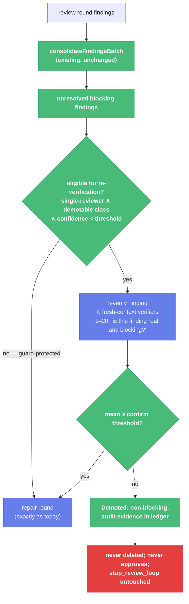

# Goal/Ralph Graded Review Signals (Slices V9–V10) — Child Spec

| Document Metadata      | Details                                                                 |
| ---------------------- | ----------------------------------------------------------------------- |
| Author(s)              | flora131 (with Claude Fable 5)                                          |
| Status                 | In Review (RFC) — all open questions resolved 2026-08-17                |
| Team / Owner           | flora131                                                                |
| Created / Last Updated | 2026-08-17                                                              |
| Parent                 | `specs/2026-08-17-llm-verifier-adoption-program.md` (umbrella)          |
| Depends on             | `specs/2026-08-17-verification-criteria-module.md` (V1 scale/criteria) · `specs/2026-08-17-progress-scoring.md` (V7 `classify_trend`) · `specs/2026-08-17-tournament-soft-selection.md` (V6 `fold_usage`) |
| Issues                 | #2490 (+ #2494's goal/ralph ledger scope, deferred here from V6)        |
| Research               | `research/docs/2026-08-17-llm-verifier-adoption-scan.md` §3, §4         |
| Slices                 | V9 `verifier/goal-reverify` · V10 `verifier/goal-convergence`           |

## 1. Executive Summary

The goal/ralph review loops collect graded signals and then discard them at the decision point: reviewers emit `confidence_score` per finding and `overall_confidence_score` (`goal-schemas.ts:7,71`), but `findingBlocksClosure` (`review-convergence.ts:91-101`) reads only alignment and priority — a finding held at 0.51 confidence blocks a repair round with the same authority as one held at 0.99, and each reviewer evaluates once (K=1) exactly where a single noisy finding costs a full repair round. This spec adds two contained upgrades. **V9 — `reverify_finding`**: before a *low-confidence, single-reviewer, demotable* blocking finding triggers repair, K fresh-context verifiers re-score it on the shared 1–20 scale; the mean confirms or demotes, spending the K-repeat budget only on disputed findings. **V10 — convergence evidence**: per-round scalars (unresolved blocking count, mean finding confidence, fraction proven, verifier usage) recorded in the goal/ralph ledgers, classified by V7's `classify_trend`, feeding `needs_human` escalation *before* turn exhaustion — plus reviewer calibration alignment and audit-only per-criterion scores. The prime directive is inherited unchanged: **`stop_review_loop` stays the sole approval authority; parse failures and `reviewer_error` never approve; nothing here approves or terminates anything.**

## 2. Context and Motivation

### 2.1 Current State (verified gaps, with the guards that must survive)

- **Gap 1 — graded signals discarded:** `findingBlocksClosure` ignores `confidence_score` entirely. The schema collects it (`goal-schemas.ts:7`); no code path reads it.
- **Gap 2 — K=1 everywhere:** one evaluation per reviewer per round; the paper's repeated-evaluation axis (74.7%→77.5%, K=1→16; variance O(1/K)) is unused where a noisy finding is most expensive.
- **Gap 3 — no convergence magnitude:** the loop runs until the boolean flips or `max_turns`/`max_loops` exhausts. A loop re-litigating identical findings for 6 turns and one steadily closing them are indistinguishable until exhaustion.
- **Hard guards that stay (from `ralph-review-gate.ts:3-26` and `review-convergence.ts`):** `stop_review_loop` is authoritative (self-referential acceptance criteria deadlocked runs; that fix is history, not up for renegotiation); parse failures and `reviewer_error` never approve; missing alignment/priority **blocks** (ambiguity never silently approves); `required_by_objective` blocks at ANY priority — "severity labels alone never dismiss work the literal contract requires."

### 2.2 The Problem

Naive fixes would weaken the guards: demoting any low-confidence finding lets re-verification dismiss literal-contract work; skipping re-verification entirely wastes a full repair round on hallucinated nits. The design threads the needle: re-verification applies exactly where the guards permit doubt, and everything else becomes evidence rather than authority.

## 3. Goals and Non-Goals

### 3.1 Functional Goals

- [ ] `reverify_finding`: K fresh-context re-scores of eligible low-confidence blocking findings; mean decides Confirmed | Demoted; demotions carry full audit evidence in the ledger.
- [ ] Eligibility (Q1–Q3 resolved): blocking ∧ single-reviewer ∧ `confidence_score < 0.7`. All alignment classes are demotable, but `required_by_objective` carries a **stricter bar**: demotion requires mean < 6 (clearly refuted) with all K repeats valid; the standard class demotes below mean 10. Corroborated (≥2-reviewer) findings are never eligible.
- [ ] Per-round convergence scalars in the goal ledger and ralph loop state; V7 `classify_trend` over the series; flat/regressing trend cited as evidence in `needs_human` escalation before exhaustion.
- [ ] goal/ralph ledger rounds gain `usage` blocks via V6 `fold_usage` (the #2494 scope deferred here).
- [ ] Reviewer prompts adopt the paper's calibration rules where missing (observed output over narration; agent declarations are zero evidence).
- [ ] Reviewer schema gains optional, audit-only per-criterion graded scores beside the authoritative compound boolean.

### 3.2 Non-Goals (the guards, restated as refusals)

- [ ] `stop_review_loop` semantics unchanged; **all existing gate tests pass unmodified.**
- [ ] Re-verification NEVER approves a round, NEVER touches `stop_review_loop`, NEVER deletes a finding — it demotes blocking→non-blocking with evidence, only within eligibility.
- [ ] The convergence trend NEVER approves and NEVER terminates; it is escalation evidence only (V7 containment inherited).
- [ ] Parse failures anywhere in re-verification are indeterminate re-asks (V2 rule) — a re-verifier that fails to parse contributes nothing and can never demote by default.
- [ ] NO reduction of reviewer count or rounds; K-repeats spend *additional* budget on disputed findings only.

## 4. Proposed Solution (High-Level Design)

### 4.1 The Re-Verification Gate (V9)



If demotion empties the blocking set, the round proceeds exactly as a round that never had blocking findings — **through the existing gate**, which still requires `stop_review_loop` from the reviewers. Re-verification can save a repair round; it cannot mint an approval.

### 4.2 The Door Set at a Glance

> `reverify_finding` · `record_convergence` · (imports: `classify_trend`, `fold_usage`, `VERIFICATION_SCALE`)

Read alone: disputed findings get a second opinion under rules that protect the contract; every round's shape is recorded and classified; and the authorities that already existed are the only authorities that remain.

## 5. Detailed Design

### 5.1 The Doors

```ts
// V9 — packages/workflows/builtin/goal-reverify.ts

reverify_finding(ctx, input: {
  finding: ConsolidatedFinding;           // from consolidateFindingsBatch
  context: { objective: string; candidateRefs: readonly string[] };
  repeats?: number;                       // K, default 3 (Q2 resolved)
}): Promise<ReverifyResult>
// ReverifyResult = { verdict: "confirmed" | "demoted";
//                    meanScore: number;                 // 1–20
//                    perRepeat: (number | null)[];      // null = invalid re-ask exhausted
//                    evidence: readonly string[] }
// Stage question (fresh context, code_location + candidate refs in reads,
// V3 prompt layout): "Assess this specific finding against the code it cites:
// is it a real, objective-relevant, currently-unresolved blocker?" 1–20.
// Guarantee (Q1/Q2 resolved — two-tier demotion):
//   standard classes: "demoted" when mean < 10 over valid repeats AND
//     ≥ ceil(K/2) repeats are valid — borderline-or-above stays blocking;
//   required_by_objective: "demoted" ONLY when mean < 6 (clearly refuted)
//     AND all K repeats are valid — the contract guard bends only to an
//     unanimous-quorum, unambiguous refutation; any invalid repeat confirms.
// Anything less (parse failures, missing quorum) is "confirmed" — doubt
// defaults to blocking, mirroring the gate's ambiguity-never-approves rule.
// Refusal BY CONSTRUCTION: eligibility is checked by the CALLER via
// is_reverifiable before this door is reachable; the door itself re-checks
// and throws on an ineligible finding — belt and suspenders.

is_reverifiable(finding: ConsolidatedFinding, threshold: number): boolean
// Pure. Encodes eligibility (Q1–Q3 resolved): blocking ∧ confidence <
// threshold (0.7) ∧ single-reviewer (corroborated findings never eligible) ∧
// alignment is not beyond/contradicts (those never block anyway). The
// required_by_objective class passes eligibility but is flagged so
// reverify_finding applies the stricter demotion bar.

// V10 — packages/workflows/builtin/goal-convergence.ts

record_convergence(round: {
  unresolvedBlockingCount: number;
  meanFindingConfidence: number | null;   // null when no findings
  fractionProven: number;                 // requirements_traceability proven share
  demotions: number;                      // V9 activity this round
  usage: UsageTotals;                     // V6 fold over the round's stages
}): ConvergenceEntry
// Appended per round to the goal ledger / ralph loop state. Pure shaping —
// the ledger write stays where ledger writes live today.
// classify_trend (V7 import) runs over the unresolvedBlockingCount and
// fractionProven series; a flat/regressing classification is attached to
// needs_human escalation evidence ("3 rounds, same 4 blockers, confidence
// falling") — and to nothing else.
```

**Per-door rubric audit:**

| Door | (1) Joint | (2) One sentence | (3) Honest | (5) Every exit | (6) Refusals |
|---|---|---|---|---|---|
| `reverify_finding` | ✅ "re-verify the finding" | ✅ K re-scores decide confirmed-or-demoted for one disputed finding | ✅ re-verifies; cannot approve, delete, or stop | invalid repeats → confirmed (doubt blocks); quorum miss → confirmed | ineligible finding throws; demotion without evidence unrepresentable (result carries perRepeat + evidence) |
| `record_convergence` | ✅ | ✅ shapes one round's scalars into one ledger entry | ✅ records, never decides | no-findings round → null confidence, defined | no authority to reach: output feeds ledgers and escalation text only |

### 5.2 Calibration + criterion scores (V10)

- **Calibration:** goal/ralph reviewer prompts gain the missing rules — trust observed output over narration; agent declarations ("done", "all tests pass") are zero evidence — phrased locally per prompt (a reviewer sees its prompt, not the paper). No rule that exists today is removed.
- **Criterion scores (audit-only):** `reviewDecisionSchema` gains optional `criterion_scores?: [{criterion_id, score: 1..20}]` beside `overall_correctness`. The compound boolean remains the authoritative signal the gate reads; the graded scores are ledger evidence (and future analysis fodder). Breaking posture covers the schema addition; gate code does not read the new field — enforced by the existing-gate-tests-unmodified goal.

### 5.3 Ralph parity

Ralph's loop state gains the same `ConvergenceEntry` series and the same escalation evidence; `ralph-review-gate.ts` logic is untouched (its file-level contract comment is the spec's non-goal, quoted). Re-verification applies to ralph's consolidated findings through the same `is_reverifiable` door.

## 6. Alternatives Considered

| Option | Pros | Cons | Rejection |
|---|---|---|---|
| Confidence-weighted blocking (a 0.51 finding blocks "half") | no re-verification cost | ambiguity-never-approves guard dies; unauditable fractional authority | guards are non-negotiable |
| Re-verify whole reviews (K× reviewers) | uniform variance reduction | K× cost on every round; #2490 explicitly targets the budget at disputed findings only | issue decision |
| Demote by original reviewer's own confidence alone | zero extra calls | self-reported confidence demoting own finding = the narration bias this program exists to kill | calibration violation |
| Trend auto-stops a non-converging loop | saves turns | violates #2489/#2490 containment; needs_human exists for exactly this | forbidden |

## 7. Cross-Cutting Concerns

- **Trust:** no new approval path exists. The diff's most dangerous line is the one that filters a demoted finding out of the blocking set — it is reachable only through `reverify_finding`'s evidence-carrying result, and the round still faces the unchanged gate.
- **Cost:** re-verification spends `K × (eligible findings)` calls per round — zero when reviewers are confident or corroborated. Convergence recording is free (arithmetic over data already in hand). Usage blocks make both visible (V6).
- **Compatibility:** breaking posture; schema addition + ledger reshape in CHANGELOG. Existing gate tests unmodified is a *hard* acceptance criterion (#2490).

## 8. Test Plan

- **V9** — `review-convergence-closure` suite **unmodified and green** (the guard proof), plus new fixtures: eligibility table (`is_reverifiable` × alignment classes, corroboration, thresholds); demotion path (low mean → demoted, evidence recorded, blocking set shrinks); doubt-defaults-to-blocking (invalid repeats, quorum miss → confirmed); ineligible-finding throw; demotion-empties-set → round still requires `stop_review_loop` (no auto-approve).
- **V10** — goal ledger suite: `ConvergenceEntry` per round; series classified; `needs_human` escalation text cites trend evidence; usage block present; gate reads nothing new (assert `findingBlocksClosure` call sites unchanged).
- **Interactive verification:**
  1. Fixture round with one 0.4-confidence single-reviewer `consistent_with_objective` P2 finding + stubbed re-verifiers scoring 5,6,4 → demoted; ledger shows verdict, scores, evidence; repair round skipped; gate still waits on `stop_review_loop`.
  2. Same finding held by two reviewers → not eligible; repair round proceeds (corroboration guard observable).
  3. Same finding `required_by_objective`, stubbed re-verifiers scoring 5,5,5 → demoted (below 6, all valid); scoring 8,8,8 → confirmed (below-10 would demote a standard finding, but the contract bar holds); scoring 5,5,invalid → confirmed (unanimous-quorum rule observable).
  4. Six-round fixture with identical unresolved counts → trend flat; escalation report cites "6 rounds, no convergence" before `max_turns`.
- `npm run check` green per slice; Evidence protocol per umbrella §5.3.

## 9. Open Questions / Unresolved Issues

All resolved with the owner, 2026-08-17:

- [x] **Q1 — Demotable classes:** all alignments demotable — **owner override of the drafted recommendation** — with a stricter bar for `required_by_objective`: mean < 6 and all K repeats valid (vs mean < 10 with majority quorum for standard classes). Rationale: fabricated contract claims are catchable, and the two-tier bar keeps the guard's spirit — the contract yields only to unanimous, unambiguous refutation.
- [x] **Q2 — Threshold + K:** re-verify below `confidence_score < 0.7`; K=3; standard confirm threshold mean ≥ 10.
- [x] **Q3 — Corroboration:** findings merged from ≥2 reviewers are never eligible; they go straight to repair.
