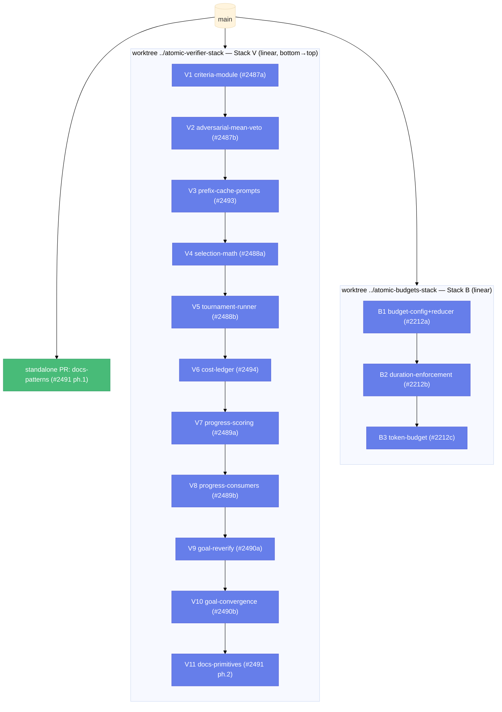

# LLM-as-a-Verifier Adoption Program — Umbrella Spec (Worktrees, Stacks, Slices, Evidence)

| Document Metadata      | Details                                                         |
| ---------------------- | --------------------------------------------------------------- |
| Author(s)              | flora131 (with Claude Fable 5)                                  |
| Status                 | In Review (RFC) — all open questions resolved 2026-08-17        |
| Team / Owner           | flora131                                                        |
| Created / Last Updated | 2026-08-17                                                      |
| Compatibility posture  | **Breaking changes allowed freely** (owner decision; see §7.2)  |
| Research               | `research/docs/2026-08-17-llm-verifier-adoption-scan.md`        |
| Child specs            | §5.4 index (authored per-cluster after this spec is approved)   |

## 1. Executive Summary

Eight issues (#2487–#2491, #2493, #2494, #2212) adopt the LLM-as-a-Verifier verification-scaling results into atomic's workflow builtins: graded per-criterion scoring replaces binary verdicts, Bradley–Terry soft selection replaces knockout brackets, trajectory progress curves replace wall-clock-only stall detection, verifier cost becomes measured, and runs gain enforceable budgets. This umbrella spec defines the **delivery machinery**: two git worktrees, two linear gh-stacks plus standalone PRs, fourteen implementation slices each under 500 changed lines, a per-PR Evidence protocol, and per-slice autonomous implementation via child workflows with deterministic verification gates. The program's door set at a glance: `parse_rubric`, `score_criterion`, `decide_verification`, `select_best`, `score_progress`, `classify_trend`, `reverify_finding`, `fold_usage`, `warm_first_fan_out`, `enforce_budget` ⚠. Two doors guard dangerous effects: `decide_verification` (the only path to an accept) and `enforce_budget` (the only path to `budget_exceeded`).

## 2. Context and Motivation

### 2.1 Current State

See research §4 for exact file:line citations. The leaking doors today:

- **`winner: "first" | "second"`** (`tournament-runner.ts:17-21`) — a binary door that cannot distinguish 51/49 from 99/1; the knockout bracket (103–163) makes one noisy call an irreversible elimination.
- **`INVALID_VERIFIER_REPORT`** (`adversarial-verification-runner.ts`) — a parse failure is silently converted into a substantive fail vote; the unanimity gate then treats it as an objection. A dishonest door: its name says "report," its behavior is "veto."
- **`findingBlocksClosure`** (`review-convergence.ts:91-101`) — reads only `objective_alignment` + `priority`; the `confidence_score` the schema collects is discarded at the decision point.
- **No cost door at all** — verifier spend is unmeasured (`modelAttempts[].usage` exists but is folded nowhere), and no run has a ceiling (`#2212`).

### 2.2 The Problem

The statistical machinery (criteria decomposition, K repeats, soft selection, progress curves) multiplies verifier calls 3–16×. Shipping it without the engineering layer (prefix-cache prompt layout, warm-first scheduling, measured cost, budgets) makes it unaffordable; shipping it as one giant change makes it unreviewable. The delivery constraint is therefore structural: **every reviewable unit < 500 changed lines, every unit carrying its own evidence, every unit leaving the repo green.**

## 3. Goals and Non-Goals

### 3.1 Functional Goals

- [ ] All 8 issues implemented, each acceptance criterion either proven in a PR Evidence section or explicitly amended on the issue first.
- [ ] Two worktrees, two linear stacks (Stack V: verifier cluster; Stack B: budgets), standalone PRs for the independent docs slice.
- [ ] Every PR < 500 changed **source** lines (tests uncapped but reported; docs-only slices exempt — Q3 resolved).
- [ ] Every PR body carries the Evidence protocol (§5.3).
- [ ] Every slice implemented autonomously by a child workflow whose verification gates run the same commands the Evidence section reports.
- [ ] `npm run check` and the affected vitest suites green at every stack layer, not just at the top.

### 3.2 Non-Goals (Out of Scope)

- [ ] NOT porting token-logprob extraction (#2260 closed; K-sample averaging is the accepted operating point).
- [ ] NOT building a select-best-of-n workflow separate from `tournament` (#2488 decision).
- [ ] NOT letting any progress/trend signal terminate a run (#2489 hard constraint) — `classify_trend` refuses to be a kill switch by construction: it returns evidence, never an action.
- [ ] NOT recomputing goal/ralph approval from findings arrays (#2490; `stop_review_loop` remains the sole approval door).
- [ ] NOT multimodal verification inputs, NOT a TurboAgent-style provider proxy (research §3, deliberately deferred/rejected).
- [ ] NOT changing the `WorkflowExitStatus` union (#2212 amendment: `budget_exceeded` is a returned status on the `blocked` rail).
- [ ] NOT adding a build step to `packages/workflows` (raw `.ts` ships; hard repo constraint).

## 4. Proposed Solution (High-Level Design)

### 4.1 Delivery Topology



Rationale for the linearization (decided): gh-stack stacks are strictly linear; the real fork at #2487 is flattened into one stack because a single stack needs zero merge choreography, tells one reviewable story, and works while nothing is merged. The false edges introduced (V3→V4, V6→V7) cost nothing but ordering. Stack B is independent (different files, different concern) and runs concurrently. B3 consumes the usage-fold helper V6 creates — the one cross-stack edge: **B3 waits for V6 to merge to main** (Q2 resolved); B1/B2 proceed immediately in parallel.

### 4.2 Slice Table (the 500-line budgets)

| Slice | Branch | Issue | Content | Budget (src) | Test anchor |
|---|---|---|---|---|---|
| V1 | `verifier/criteria-module` | #2487 | `verification-criteria.ts`: `parse_rubric`, normalizer, `{#id}` slugging/dedup, comment stripping, shared 1–20 scale constants, mean+veto `decide_verification` helpers | ~400 | new `verification-criteria` unit suite |
| V2 | `verifier/adversarial-mean-veto` | #2487 | adversarial-verification: per-criterion verifier calls, mean-vs-threshold gate with unconditional-veto path, parse failure → indeterminate re-ask (deletes `INVALID_VERIFIER_REPORT`) | ~350 | `builtin-workflows-adversarial-generate` |
| V3 | `verifier/prefix-cache-prompts` | #2493 | shared-head/varying-tail prompt builders (candidate bodies inlined, 32 KiB bound + `reads` fallback), warm-first fan-out helper, ordering-invariant test, generate-and-filter judge adopts the builder (rider) | ~350 | new prompt-layout suite |
| V4 | `verifier/selection-math` | #2488 | pure module: seeded PRNG, `ring_cycle`, `bradley_terry`, accumulate w/c, pivot selection, K-repeat slot-swap bookkeeping, `select_best` | ~400 | new deterministic math suite (no model calls) |
| V5 | `verifier/tournament-runner` | #2488 | runner rewrite: graded per-criterion judge schema, PPT rounds via V4, comparisons ledger replaces bracket.json, ranking outputs, `.d.ts` | ~500 ⚠ tight | `builtin-workflows-tournament-loop` |
| V6 | `verifier/cost-ledger` | #2494 | `fold_usage` aggregation helper + usage blocks in comparisons ledger, adversarial report, goal/ralph ledgers | ~250 | new usage-fold suite |
| V7 | `verifier/progress-scoring` | #2489 | `score_progress` (calibration prompt builder, batched multi-checkpoint extraction, K repeats) + `classify_trend` (hysteresis) | ~400 | new progress suite (fixtures, no model calls) |
| V8 | `verifier/progress-consumers` | #2489 | loop-until-done ledger curve + stop-report inclusion; subagent attention input beside wall-clock signals | ~250 | loop suite + subagents attention suite |
| V9 | `verifier/goal-reverify` | #2490 | `reverify_finding`: low-confidence blocking findings re-scored K× fresh-context; mean decides blocking/demoted | ~350 | `review-convergence-closure` + new fixtures |
| V10 | `verifier/goal-convergence` | #2490 | per-round convergence scalars in goal/ralph ledgers, trend → `needs_human` evidence, calibration prompt alignment | ~350 | goal ledger suite |
| V11 | `verifier/docs-primitives` | #2491 | primitive-specific doc updates (workflows.md pattern sections, README table) | docs-only | n/a (docs) |
| B1 | `budgets/config-reducer` | #2212 | `WorkflowBudget { maxDurationMs, maxTokens, maxCost, warnAtPercent }` (all default 0 = unbudgeted), 3-layer later-wins-per-field resolution (run > definition > config), pure budget reducer, `budget_exceeded` in `RETURNED_BLOCKED_STATUSES`, validation (0 valid; negatives/non-finite rejected) | ~400 | new budget-reducer table tests |
| B2 | `budgets/duration-enforcement` | #2212 | checkpoint enforcement (stage/tool boundaries, resume path), one-time wrap-up injection then stop (codex `budget_limit.md` pattern), warn-once notice, status surface, R1–R2/R5–R7/R9–R10/R13–R14 | ~400 | new enforcement suite |
| B3 | `budgets/token-cost-budget` | #2212 | run-tree usage aggregation via `fold_usage` (from V6); `maxTokens` = uncached input + output (codex goal formula); `maxCost` = USD from `usage.cost`; delta accounting w/ double-charge guard (R3–R4, R8, R11–R12) | ~350 | extend enforcement suite |
| D1 | `verifier/docs-patterns` | #2491 | pattern-level guidance in docs/workflows.md + README (no primitive refs) | docs-only | n/a |

### 4.3 Autonomous Execution Model

Each slice runs as **one child implementation workflow** (goal-shaped: implement → fresh-context review → repair loop) launched in the stack worktree with the slice branch checked out, receiving: the child spec section for that slice, the research doc path, the slice's acceptance checklist, and the line budget as a `<keepContext>`-tagged constraint. Deterministic `ctx.tool` gates run: `npm run check`, the slice's test anchor via targeted vitest, and `git diff --stat` against the budget. The workflow stops at implementation acceptance; **PR submission is the separated final action** (Q5 resolved): on evidence-green, `gh stack submit --auto` runs automatically to create/refresh **draft** PRs; marking ready (`--open`) and merging (`gh stack merge … --yes`) remain operator-only. Stack hygiene (rebase-upstack after mid-stack changes) is operator-side, per the gh-stack skill. If V5 exceeds its budget despite the V4 extraction, the pre-authorized V5a/V5b split applies (Q6 resolved): V5a = runner core (PPT orchestration, judge schema), V5b = prompts + comparisons ledger + `.d.ts`.

### 4.4 The Door Set at a Glance (Stranger-Across-Time View)

> `parse_rubric` · `score_criterion` · `decide_verification` ⚠ · `select_best` · `score_progress` · `classify_trend` · `reverify_finding` · `fold_usage` · `warm_first_fan_out` · `enforce_budget` ⚠

Read alone: rubrics are parsed once by one parser; every judgment is per-criterion; acceptance has exactly one door and that door knows the difference between a failing report and an unreadable one; selection ranks rather than eliminates; progress is scored and classified but never acted on autonomously; cost is folded where decisions are audited; fan-out warms its cache first; and exactly one door can stop a run for spending too much — resumably.

## 5. Detailed Design

### 5.1 Program-Level Door Contracts

Full typed contracts live in the child specs; the umbrella fixes the guarantees and refusals that cross slice boundaries:

```
parse_rubric(markdown: string): Result<Criteria, RubricError>
// Guarantee: returns normalized criteria with unique ids or a named parse error.
// Refuses: empty descriptions; duplicate ids (deduped deterministically, recorded).
// RubricError = EmptyCriterion | NoCriteria | MalformedSection

decide_verification(reports: CriterionReport[]): Accept | Repair(findings) | Indeterminate(reask)
// Guarantee: mean-vs-threshold with an unconditional veto path; an unparseable
// report is Indeterminate and can ONLY trigger a re-ask — it is unrepresentable
// as a counted vote (CriterionReport can only be constructed from a schema-valid
// structured output). ⚠ The single door to an accept in adversarial-verification.

select_best(pool: Candidate[], score: DirectedScore, seed: Seed): Ranking
// Guarantee: full mean-preference ranking via ring + pivot rounds; deterministic
// under (pool, seed); no candidate is ever eliminated by a single comparison.
// Refuses: re-scoring an already-scored directed pair (cache identity).

score_progress(prefix: Steps, checkpoints: CheckpointSet, k: Repeats): Curve
classify_trend(curve: Curve): { trend: Rising|Flat|Regressing, evidence: Curve }
// Guarantee: classification with hysteresis; returns evidence only.
// Refusal BY TYPE: no consumer receives an action — there is no "kill" variant
// to construct. Wall-clock signals are supplemented, never removed.

reverify_finding(finding: BlockingFinding, k: Repeats): Confirmed | Demoted
// Guarantee: K fresh-context re-scores; the mean decides. Consumes the K budget
// only for findings below the confidence threshold. Never touches stop_review_loop.

fold_usage(results: WorkflowTaskResult[]): UsageTotals   // absent fields = 0;
// replayed/cached results contribute nothing; derives cache_hit_rate.

warm_first_fan_out(steps: JudgeStep[]): results
// Guarantee: exactly one in-flight call per distinct prompt prefix until that
// prefix has completed once; then unrestricted fan-out.

enforce_budget(run: RunMeters, budget: EffectiveBudget): Continue | Warn | Exhausted ⚠
// EffectiveBudget = per-field later-wins resolution of run > definition > config;
// each of {maxDurationMs, maxTokens (uncached input+output), maxCost (USD)}
// disabled at 0. Guarantee: checked only at stage/tool boundaries; Exhausted
// delivers a one-time wrap-up injection to the frontier stage, then stops with
// returned status `budget_exceeded` (blocked rail, resumable), naming budget/
// reading/ceiling/frontier and carrying the wrap-up summary. Refuses: the status
// is system-owned — no stage, tool, or model output can construct it; resume
// never mints fresh meters; deltas are charged once (serialized accounting).
```

**Per-door rubric audit** is performed in each child spec (§5.1 of each); the two ⚠ doors additionally satisfy rubric #8 here: an accept in adversarial-verification is reachable only through `decide_verification`; `budget_exceeded` is producible only by `enforce_budget`.

### 5.2 Stack Mechanics (operator doors)

- Create: `git worktree add ../atomic-verifier-stack -b verifier/criteria-module main`, then `gh stack init verifier/criteria-module` and `gh stack add <branch>` per slice (always positional args; `git config rerere.enabled true`, `remote.pushDefault origin` — repo has 5 remotes).
- Submit checkpoints: `gh stack submit --auto` (draft PRs), `--open` when a layer's evidence is complete.
- Mid-stack repair: navigate down, commit, `gh stack rebase --upstack`.
- Merge: `gh stack merge <pr> --yes` bottom-up as reviews approve; `gh stack sync --prune` after.

### 5.3 The Evidence Protocol (every PR body)

```markdown
## Evidence
### Acceptance criteria (from #NNNN, this slice's subset)
- [x] criterion … — proven by <test name / command>
### Commands
$ npm run check            → exit 0 (trimmed tail pasted)
$ npx vitest --run --project unit -t "<anchor>"  → N passed (summary pasted)
### Size
$ git diff --stat <base>..HEAD → X files, +A −B (cap: 500 source lines; tests uncapped, reported; docs exempt)
### Spec
specs/2026-08-17-<child>.md §<n>; research: research/docs/2026-08-17-llm-verifier-adoption-scan.md
```

CI green is necessary but not sufficient; the pasted output is the reviewable artifact. A slice whose acceptance criterion is amended (posture change) links the amending issue comment instead.

### 5.4 Child Spec Index (authored next, one per cluster)

| Spec file (planned) | Covers | Slices |
|---|---|---|
| `specs/2026-08-17-verification-criteria-module.md` | #2487 + #2493 | V1–V3 |
| `specs/2026-08-17-tournament-soft-selection.md` | #2488 + #2494 | V4–V6 |
| `specs/2026-08-17-progress-scoring.md` | #2489 | V7–V8 |
| `specs/2026-08-17-goal-graded-signals.md` | #2490 | V9–V10 |
| `specs/2026-08-17-verifier-docs.md` | #2491 | D1, V11 |
| `specs/2026-08-17-run-budgets.md` | #2212 | B1–B3 |

Each child spec is a full create-spec document (doors with typed contracts + rubric audit, data model, test plan, interactive verification) whose §Test Plan commands are byte-identical to the Evidence commands its slices will paste.

## 6. Alternatives Considered

| Option | Pros | Cons | Reason for rejection |
|---|---|---|---|
| Foundation stack (V1–V3) merges first, then parallel stacks for #2488/#2489 | true dependency edges, real parallelism | gated on review/merge latency of foundation; 3 worktrees + merge choreography | Selected topology (one linear stack) trades false edges for zero choreography — decided in Q&A |
| One PR per issue (8 PRs) | fewer PRs | #2488 alone ≫ 500 lines; unreviewable | violates the 500-line constraint |
| #2494 standalone from main | independent landing | edits `bracket.json`/ledgers that V5 rewrites → guaranteed conflict under breaking-allowed | **Rejected (Q1):** placed as V6, after the rewrite it annotates |
| Fully autonomous including merges | max speed | removes the human review gate the stack exists to serve | **Rejected (Q5):** auto-submit drafts; ready + merge stay human |

## 7. Cross-Cutting Concerns

### 7.1 Security and Trust

- The two ⚠ doors are the only trust-bearing chokepoints introduced: `decide_verification` (what gets called verified) and `enforce_budget` (what stops a run). Both make their central refusal unrepresentable (unparseable report ≠ vote; `budget_exceeded` unconstructible by any stage or model output).
- Implementation workflows receive worktree paths and branch names as `<keepContext>`-tagged identifiers so compaction cannot re-target them.

### 7.2 Backwards Compatibility

**Posture: breaking changes allowed freely** (owner decision, this session). Consequences, recorded as current-state documentation rather than constraints: `tournament` outputs (`winner`, `bracket_path`, …) may be reshaped into ranking/ledger outputs; `adversarial-verification`'s report schema may change; `.d.ts` files updated to the new shapes in the same slice. The "output contract preserved" clauses in #2487/#2488 are superseded — **both issues amended by comment before implementation starts** (Q4 resolved). CHANGELOG entries mark every user-visible break under `### Breaking Changes`.

## 8. Test Plan

- **Per-slice**: the slice table's test anchor + `npm run check`, run by the implementation workflow as `ctx.tool` gates AND pasted as Evidence. New suites are deterministic (fixtures, seeded PRNG, no model calls) per the issues' acceptance criteria.
- **Per-layer stack invariant**: after any `rebase --upstack`, re-run the anchors of every layer above the change before re-submitting.
- **Program-level interactive verification** (executable by a human or agent, per child spec): e.g. run the tournament builtin on a 3-candidate fixture pool with a fixed seed twice → identical comparisons ledger; feed an unparseable judge fixture → observe re-ask, not a vote; run a budgeted workflow past its duration ceiling → `budget_exceeded`, resume with raised budget → completion.
- **Suite discipline**: 30 s shared budget, no `--timeout` flags, load-tolerant assertions from named constants (repo policy).

## 9. Open Questions / Unresolved Issues

All resolved with the owner, 2026-08-17:

- [x] **Q1 — #2494 placement:** V6, inside Stack V, sequenced after the tournament-runner rewrite it annotates.
- [x] **Q2 — B3 cross-stack edge:** B3 waits for V6 to merge to main; B1/B2 proceed in parallel immediately.
- [x] **Q3 — 500-line accounting:** cap counts source only; tests uncapped but reported in the Evidence diff stat; docs-only slices (D1, V11) exempt.
- [x] **Q4 — issue amendments:** #2487 and #2488 amended by comment recording the breaking-allowed posture, linking this spec, before implementation starts.
- [x] **Q5 — human gates:** evidence-green slices auto-run `gh stack submit --auto` (draft PRs); marking ready and merging are operator-only.
- [x] **Q6 — V5 overflow:** V5a/V5b split pre-authorized (runner core / prompts+ledger+`.d.ts`); implementing workflow may apply it without a new decision.
- [x] **Q7 — D1 timing:** the pattern-level docs PR lands now, as a standalone PR from main, before Stack V starts.
