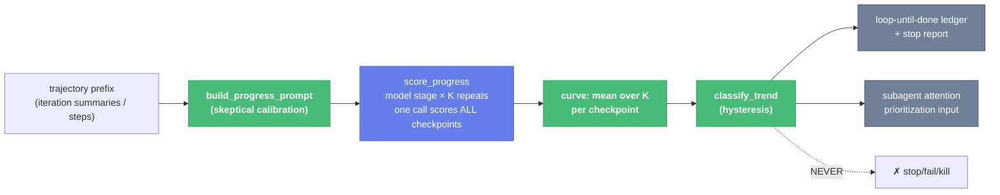

# Trajectory Progress Scoring + Trend Classification (Slices V7–V8) — Child Spec

| Document Metadata      | Details                                                                 |
| ---------------------- | ----------------------------------------------------------------------- |
| Author(s)              | flora131 (with Claude Fable 5)                                          |
| Status                 | In Review (RFC) — all open questions resolved 2026-08-17                |
| Team / Owner           | flora131                                                                |
| Created / Last Updated | 2026-08-17                                                              |
| Parent                 | `specs/2026-08-17-llm-verifier-adoption-program.md` (umbrella)          |
| Depends on             | `specs/2026-08-17-verification-criteria-module.md` (V1 scale)           |
| Issues                 | #2489 (+ its batched-scoring scope comment); #2200 noted as substrate   |
| Research               | `research/docs/2026-08-17-llm-verifier-adoption-scan.md` §3, §4         |
| Slices                 | V7 `verifier/progress-scoring` · V8 `verifier/progress-consumers`       |

## 1. Executive Summary

Stall detection today is wall-clock arithmetic: `loop-until-done` has a `done` boolean and iteration caps; subagent control has `activeNoticeAfterMs`/`needsAttentionAfterMs`. None of them can see the difference between a run grinding toward completion and a run confidently rebuilding the wrong thing at full speed. This spec adds a trajectory progress signal: a cheap model stage scores "would the CURRENT state satisfy the acceptance criteria?" on the shared 1–20 scale under the paper's skeptical calibration (trust observed output, not narration; effort is not progress; declarations are zero evidence; scores may plateau or fall), and a deterministic **`classify_trend`** door turns score series into rising/flat/regressing with hysteresis — *flat is the stall signal* (the paper's failed run is low and flat, not descending). Two doors carry the change: **`score_progress`** (batched: one call scores every checkpoint, so a retrospective curve costs O(K) calls regardless of trajectory length) and **`classify_trend`** (returns evidence only — a kill action is unrepresentable in its type). The measured VOC separation is +0.079: useful for prioritization, nowhere near strong enough to act autonomously, and the design enforces that.

## 2. Context and Motivation

### 2.1 Current State

- `loop-until-done` (builtin, ~36-line definition + runner): iteration ledger records what happened; `done: boolean` is the only progress representation. A loop re-litigating the same failure for 6 iterations and one steadily closing gaps look identical until exhaustion.
- `packages/subagents/src/runs/shared/subagent-control.ts` (223 lines): attention escalation keyed to wall-clock (`activeNoticeAfterMs`, `needsAttentionAfterMs`) and failed-tool counts — proxies that measure *time and motion*, not state quality. #2258's finding stands: wall-clock proxies cannot distinguish productive long runs from stuck ones.
- No calibration discipline anywhere: nothing instructs an evaluator that "all tests pass!" in prose is zero evidence.

### 2.2 The Problem

The signal exists in the paper with known limits (+0.079 VOC separation, plateau-not-descend failure signature). The design problem is entirely about *containment*: exposing a useful monitoring magnitude without ever letting it fail, block, or kill a run — while keeping the cost at O(K) calls per scoring event.

## 3. Goals and Non-Goals

### 3.1 Functional Goals

- [ ] Calibration prompt builder with the paper's skeptical rules, verbatim in spirit (research §3).
- [ ] Batched multi-checkpoint scoring: one model call scores all N checkpoints of a finished prefix (O(K) calls per curve); per-prefix scoring for live monitoring (one call per repeat per event).
- [ ] Deterministic `classify_trend` with hysteresis; named-constant thresholds; fixture-tested.
- [ ] `loop-until-done`: per-iteration progress score in the ledger; stop/exhaustion report includes curve + trend.
- [ ] Subagent attention: trend consumed as a prioritization input **beside** the wall-clock signals (Q3 resolved: pure helper + injected score series; no model calls inside the subagents runtime).
- [ ] Checkpoint default: interior steps `2..T−1` (reference parity; endpoints carry no information).

### 3.2 Non-Goals (Out of Scope — the refusals ARE the design)

- [ ] The score/trend NEVER terminates, fails, or blocks a run — there is no code path from `classify_trend` to any stop door (#2489 hard constraint; enforced by type: the classifier returns `{trend, evidence}` and no consumer accepts an action from it).
- [ ] NO wall-clock heuristic is removed or weakened.
- [ ] NOT goal/ralph round-convergence trends — that is V10's (#2490), which imports `classify_trend` from here.
- [ ] NOT an autonomous resample/abandon mechanism (the reference `ProgressTracker` docstring suggests early abandonment; atomic deliberately does not adopt it).
- [ ] NOT letter scales or logprob expectation (V1 scale, schema-validated integers).

## 4. Proposed Solution (High-Level Design)

### 4.1 Signal Flow



### 4.2 The Door Set at a Glance

> `build_progress_prompt` · `score_progress` · `classify_trend`

Read alone: a calibrated question is built, a state is scored against acceptance criteria, and a series is classified into a trend that is evidence for humans and prioritizers — nothing else. No door in this set can end anything.

## 5. Detailed Design

### 5.1 The Doors (V7 — `packages/workflows/builtin/progress-scoring.ts`)

```ts
build_progress_prompt(input: {
  problem: string;                       // task / acceptance criteria
  steps: readonly string[];              // numbered agent steps (action + observed output)
  checkpoints: readonly number[];        // 1-indexed; default interior 2..T−1
}): string
// Guarantee: a neutral prompt that never reveals eventual success/failure;
// carries the calibration rules verbatim: trust observed output over narration;
// effort/step count is not progress; agent declarations ("done!", "all tests
// pass") are ZERO evidence; scores need not rise — wrong approaches plateau,
// regressions decrease. Scale: VERIFICATION_SCALE 1..20 oriented as
// "1 = certainly would not satisfy the acceptance criteria … 20 = verified
// satisfaction with observed output". Head/tail layout per V3 (steps in the
// shared head; checkpoint list at the tail) so K repeats share a prefix.

score_progress(ctx, input: {
  problem: string; steps: readonly string[];
  checkpoints?: readonly number[];       // default interior
  repeats?: number;                      // K, default 1 (Q1 resolved; hysteresis absorbs single-sample noise)
}): Promise<ProgressCurve>
// ProgressCurve = { checkpoints: number[]; scores: number[];   // mean over K
//                   perRepeat: (number | null)[][] }           // null = invalid
// Guarantee: O(repeats) model calls total — ONE call per repeat scores every
// checkpoint (schema: { scores: [{ checkpoint, score: 1..20 }] }). An invalid
// repeat contributes nothing (never a fabricated midpoint); a checkpoint with
// zero valid repeats is null in the curve, never invented.
// Refuses: checkpoints outside 1..T throw; scoring an empty prefix throws.

classify_trend(series: readonly number[], config?: TrendConfig): TrendResult
// TrendConfig  = { window: number; riseDelta: number; fallDelta: number }
//                (named defaults: window 3, ±1.5 on the 1..20 scale)
// TrendResult  = { trend: "rising" | "flat" | "regressing";
//                  evidence: { series, window, delta } }
// Guarantee: pure and deterministic; hysteresis — the trend changes only when
// the windowed delta crosses riseDelta/fallDelta, so a single noisy score
// cannot flip it. Short series (< window+1) are "flat" by definition.
// Refusal BY TYPE: TrendResult carries no action. There is no "kill",
// "stop", or "escalate" variant to construct; consumers that escalate do so
// under their own authority citing the evidence.
```

**Per-door rubric audit:**

| Door | (1) Joint | (2) One sentence | (3) Honest | (5) Every exit | (6) Refusals |
|---|---|---|---|---|---|
| `build_progress_prompt` | ✅ | ✅ builds the calibrated question | ✅ never scores | n/a (pure) | success/failure of the trajectory unrepresentable in the prompt |
| `score_progress` | ✅ "score the progress" | ✅ scores the current state against acceptance criteria | ✅ scores, never judges done-ness for the loop | invalid repeat → null, never a midpoint | out-of-range checkpoint throws; empty prefix throws |
| `classify_trend` | ✅ | ✅ classifies a series into one trend with evidence | ✅ classifies, never acts | short series → flat, stated | action unrepresentable in the return type |

### 5.2 V8 — Consumers

**loop-until-done:** after each iteration, one `score_progress` call over the **iteration-summary prefix** — the ledger's own per-iteration records (Q2 resolved) — appends `{iteration, score, trend}` to the existing ledger. The loop's stop condition is **unchanged** — `done` and the iteration cap decide, exactly as today. The stop/exhaustion report gains the curve and final trend ("iterations 4–7 flat at ~6/20" is the human-readable stall evidence). Cost: K calls per iteration (default 1), documented.

**Subagent attention (`subagent-control.ts`):** the trend becomes a prioritization input beside `activeNoticeAfterMs`/`needsAttentionAfterMs` — a regressing/flat-low trend can *raise* attention priority; it can never itself mark a run failed or suppress a wall-clock signal. Shape (Q3 resolved): `classify_trend` is duplicated as a tiny pure helper in `packages/subagents` (or the score series arrives via the existing control-config surface); orchestrators that already score pass the series in; the subagents runtime schedules **no model calls** of its own.

### 5.3 Data Model

- Ledger entry (loop): `{ iteration, progress: { score, perRepeat, trend, window } }` — additive to the existing iteration record.
- Stop report: `progress_curve: number[]`, `final_trend`, plus the calibration disclaimer line ("monitoring signal; VOC separation +0.079; never authoritative").

## 6. Alternatives Considered

| Option | Pros | Cons | Rejection |
|---|---|---|---|
| One call per checkpoint | simpler extraction | O(N·K) calls; the scope comment exists precisely because this cost profile kills retrospective scoring | batched is reference parity |
| Score the full transcript | maximum fidelity | token-explosive; loop ledgers already summarize; V3 caching helps but cannot fix O(transcript) growth per iteration | Q2 decides representation |
| Trend gates the loop (auto-stop on regressing) | "smart" loops | violates the #2489 hard constraint; +0.079 separation is prioritization-grade, not decision-grade | forbidden by design |
| EWMA/slope-fitting classifier | statistically fancier | hysteresis-on-windowed-delta is explainable in one sentence and table-testable; fancier stats invite tuning theater | keep it inspectable |

## 7. Cross-Cutting Concerns

- **Containment (trust):** the only door with authority anywhere near this signal is human escalation, and it cites evidence rather than receiving commands. Tests assert no consumer code path mutates run status from a `TrendResult`.
- **Cost:** loop scoring is K calls/iteration; a 10-iteration loop at K=1 adds 10 cheap calls. The prompt reuses V3 layout so repeats share a prefix.
- **Cross-package boundary:** `progress-scoring.ts` lives in `packages/workflows/builtin`; `subagent-control.ts` lives in `packages/subagents`. Resolved (Q3): the classifier is pure and tiny — duplicated helper in subagents, kept honest by mirrored table tests in both packages.

## 8. Test Plan

- **V7** — `npx vitest --run --project unit -t "progress-scoring"`: prompt fixtures (calibration rules present; no success leakage; checkpoint list at tail; head byte-identical across K repeats); extraction fixtures (valid, partial-invalid → nulls, fully-invalid repeat dropped); `classify_trend` table tests (rising/flat/regressing boundaries at named constants, hysteresis under alternating noise, short-series flat, the paper's low-and-flat failure signature classified flat not regressing).
- **V8** — loop suite: stubbed scorer → ledger entries present, stop report carries curve + trend, `done`/cap behavior byte-identical with scoring disabled vs enabled (proving non-interference); subagents attention suite: trend input raises priority, never sets failure, wall-clock signals unaffected.
- **Interactive verification:**
  1. Feed the two bundled-style trajectories (success/failure fixtures) through `score_progress` with a stub returning the paper's curves → success classifies rising, failure classifies flat — not regressing.
  2. Run loop-until-done on a fixture task with scoring enabled and disabled → identical stop decisions; enabled run's report shows the curve.
  3. Grep the diff for any call path from `TrendResult` into `ctx.exit`/status mutation → none (the refusal, made executable).
- `npm run check` green per slice; Evidence protocol per umbrella §5.3.

## 9. Open Questions / Unresolved Issues

All resolved with the owner, 2026-08-17:

- [x] **Q1 — Default K:** 1; configurable per loop; hysteresis absorbs single-sample noise.
- [x] **Q2 — Representation:** iteration-summary prefix (the ledger's own records; bounded growth, observation-grounded).
- [x] **Q3 — Subagent shape:** minimal — pure `classify_trend` helper duplicated in `packages/subagents` (mirrored table tests keep the two honest), score series injected via the existing control-config surface; no model calls inside the subagents runtime.
