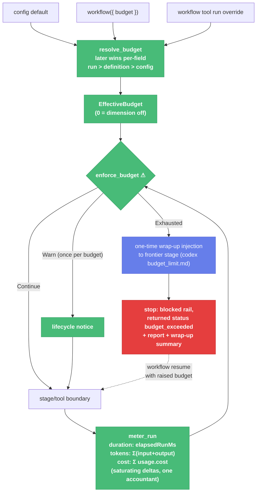

# Per-Run Budgets with Resumable `budget_exceeded` (Slices B1–B3) — Child Spec

| Document Metadata      | Details                                                                 |
| ---------------------- | ----------------------------------------------------------------------- |
| Author(s)              | flora131 (with Claude Fable 5)                                          |
| Status                 | In Review (RFC) — all open questions resolved 2026-08-17                |
| Team / Owner           | flora131                                                                |
| Created / Last Updated | 2026-08-17                                                              |
| Parent                 | `specs/2026-08-17-llm-verifier-adoption-program.md` (umbrella; Stack B, independent track) |
| Depends on             | V6 `fold_usage` merged to main (B3 only; B1–B2 independent)             |
| Issues                 | #2212 (body is authoritative for requirements R1–R14)                   |
| Research               | `research/docs/2026-08-17-llm-verifier-adoption-scan.md` §2 (decisions 6, 9), §4; prior art: openai/codex `ext/goal/accounting.rs`, `core/rollout_budget.rs`, `budget_limit.md` |
| Slices                 | B1 `budgets/config-reducer` · B2 `budgets/duration-enforcement` · B3 `budgets/token-cost-budget` |

## 1. Executive Summary

Workflow runs have no ceiling: a loop with a bad stop condition burns hours and dollars until a human notices. This spec implements #2212 as three slices on an independent stack. **B1** builds the pure core: `WorkflowBudget { maxDurationMs, maxTokens, maxCost, warnAtPercent }` (every field `0` = unbudgeted), three-layer later-wins-per-field resolution (run override > definition > config default), the budget reducer, `budget_exceeded` joining `RETURNED_BLOCKED_STATUSES` beside `auth_blocked` — resumable by construction, `WorkflowExitStatus` untouched. **B2** wires enforcement at stage/tool boundaries (never mid-stream) with the codex soft landing: one wrap-up injection to the frontier stage, then stop with the full report (budget, reading, ceiling, frontier, wrap-up summary). **B3** adds the token meter (codex's goal formula: uncached input + output — cache-heavy spend is `maxCost`'s job at true price) and the cost meter, folded across the whole run tree via V6's `fold_usage`, with monotone saturating deltas and a single-accountant guard. One dangerous door: **`enforce_budget`** ⚠ — the only producer of `budget_exceeded`, system-owned, unconstructible by any stage or model output.

## 2. Context and Motivation

Condensed from #2212 (the issue body carries the full argument): the duration meter already exists and is correct (`elapsedRunMs`: pauses excluded, `accumulatedDurationMs` carried); the `blocked` exit rail and the resumable-returned-status distinction already exist (`returned-run-status.ts:5` — `auth_blocked` is the precedent); usage telemetry is populated since #2197; `maxDepth` is the config-plumbing template. What is missing is purely the budget layer itself — and the honest outcome shape, decided in the issue amendments: not `failed` (nothing went wrong), not plain `blocked` (nothing needs diagnosing), but `budget_exceeded` (one known decision: raise and resume, or accept).

## 3. Goals and Non-Goals

### 3.1 Functional Goals

Requirements R1–R14 in #2212 are the authoritative list; this spec maps them to slices: B1 owns R1, R8, R13 (+ status vocabulary); B2 owns R2, R5, R6, R7, R9, R10, R14 (duration meter, checkpoints, soft landing, warn-once, no-budget-no-change); B3 owns R3, R4, R11, R12 (token/cost aggregation, resume carry, independence, status surface completion — duration state surfaces in B2, meters complete in B3).

### 3.2 Non-Goals

- [ ] NOT a new `WorkflowExitStatus` member (issue amendment; blocked rail + returned status).
- [ ] NOT mid-stream abortion of model calls (R5; boundaries only — spent work is banked).
- [ ] NOT counting cache reads/writes in `maxTokens` (codex formula; `maxCost` governs them at true price — issue OQ3 resolved).
- [ ] NOT settable/clearable by any stage, tool, or model output (R6; codex `update_goal` refusal, made structural).
- [ ] NOT a `maxStages`/`maxToolCalls` budget unless Q3 says otherwise (issue OQ4).
- [ ] NOT weakening any existing stop mechanism (`max_turns`, `max_loops`, iteration caps all stay).

## 4. Proposed Solution (High-Level Design)

### 4.1 Enforcement Flow



### 4.2 The Door Set at a Glance

> `resolve_budget` · `meter_run` · `enforce_budget` ⚠

Read alone: three declarations become one effective budget by a rule a reader can hold in one sentence; the run's spend is metered once, tree-wide, without double-charging; and exactly one door can stop a run for spending too much — after letting it say goodbye, and never for good.

## 5. Detailed Design

### 5.1 The Doors

```ts
// B1 — pure core (packages/workflows/src/shared/budget.ts or sibling)

interface WorkflowBudget {
  readonly maxDurationMs?: number;   // integer ms; 0 = off (default)
  readonly maxTokens?: number;       // integer; uncached input + output; 0 = off
  readonly maxCost?: number;         // USD; 0 = off
  readonly warnAtPercent?: number;   // default 80
}

resolve_budget(layers: { config?: WorkflowBudget; definition?: WorkflowBudget;
                          run?: WorkflowBudget }): EffectiveBudget
// Guarantee: later wins PER FIELD (run > definition > config); unset fields
// fall through; every field defaults to 0 = unbudgeted. An operator override
// may widen, narrow, or disable any dimension (R8).
// Validation (R13, maxDepth pattern): negative, non-finite, or (ms/tokens)
// non-integer values are config errors; 0 is valid-and-off.
// Refusal BY TYPE: EffectiveBudget is the only currency enforce_budget
// accepts, and resolve_budget is its only constructor — there is no way to
// smuggle an unresolved or unvalidated budget to the enforcement door.

meter_run(tree: RunUsageTree, now: number): RunMeters
// RunMeters = { durationMs, tokens, cost, perCounter: {input, output,
//               cacheRead, cacheWrite} }   // all four REPORTED; two charged
// Guarantee (R2–R4): duration = elapsedRunMs semantics (pauses out,
// accumulated in); tokens = Σ (usage.input + usage.output) and cost =
// Σ usage.cost over every WorkflowModelAttempt in the run tree, nested
// ctx.workflow children and retries included, via fold_usage (V6).
// Mechanics (R14, codex parity): monotone saturating deltas against a
// persisted baseline; a single-accountant guard so concurrent stage
// completions cannot double-charge; baselines survive durable resume (R3 —
// a resumed run never gets fresh meters).

// B2 — enforcement (foreground executor boundary hooks)

enforce_budget(meters: RunMeters, budget: EffectiveBudget): Continue | Warn | Exhausted ⚠
// Guarantee (R5–R7, R9): evaluated ONLY at deterministic checkpoints —
// before stage dispatch, before a ctx.tool node, after either completes, and
// on the durable-resume path. Warn fires once per run per budget dimension
// (lifecycle notice machinery). Exhausted triggers, in order:
//   1. one-time wrap-up injection to the frontier stage — codex
//      budget_limit.md shape: budget exhausted; stop substantive work;
//      summarize progress, remaining work, blockers; leave a next step.
//      Delivered at most once per run per budget (R14). Wrap-up scope (Q2
//      resolved): the frontier stage finishes its CURRENT turn with the
//      injection appended — one turn, no new stages; spend recorded as
//      wrapUpUsage in the exhaustion report.
//   2. stop on the blocked exit rail with returned status budget_exceeded
//      (resumable: `workflow resume` with a raised budget continues from the
//      frontier), reporting {dimension, reading, ceiling, frontier stage,
//      wrap-up summary} (R7).
// Refusals: the status is SYSTEM-OWNED — no stage/tool/model output path can
// construct, set, or clear it (R6); a no-budget run takes a zero-cost early
// return (R10, behavior identical to today); concurrent top-level runs meter
// independently (R11).
```

**Per-door rubric audit:**

| Door | (1) Joint | (2) One sentence | (3) Honest | (5) Every exit | (6) Refusals | (8) Chokepoint |
|---|---|---|---|---|---|---|
| `resolve_budget` | ✅ | ✅ three layers → one effective budget, later wins per field | ✅ resolves, never enforces | invalid values → config error at load, not at exhaustion | unvalidated budget unreachable by type | sole `EffectiveBudget` constructor |
| `meter_run` | ✅ | ✅ one tree-wide reading per boundary | ✅ meters, never judges | absent usage → zeros; replayed checkpoints → no delta | double-charge structurally excluded (baseline + single accountant) | n/a |
| `enforce_budget` ⚠ | ✅ "enforce the budget" | ✅ maps meters × budget to continue, warn-once, or soft-landed stop | ✅ the stop is named for exactly what happened | resume → carried baselines; repeat exhaustion → no second wrap-up | status unconstructible elsewhere; stream abortion impossible (no mid-stream call site) | ✅ sole producer of `budget_exceeded` |

### 5.2 Config & tool plumbing (B1/B2)

- `workflows.budget` default: `WORKFLOW_CONFIG_DEFAULTS` → validation in `extension/config-file-loader.ts` → `WorkflowEffectiveConfig` (the `maxDepth` route, exactly).
- Definition: `workflow({ budget: {...} })` — authoring-contract field, validated at discovery.
- Run override: `budget` parameter on the workflow tool's `run` action; schema mirrors `WorkflowBudget`; documented in the tool description and `docs/workflows.md`.
- `workflow status` surfaces per-dimension readings/ceilings/percent (R12), in summary verbosity (#2195 alignment).


### 5.2b Child-scoped budgets (Q1 resolved: children may narrow)

A nested `ctx.workflow(...)` invocation MAY declare its own `budget`. Semantics:

- **Additional constraint, not a fork of authority.** The child's meters cover only its subtree; the parent's tree-wide meters are unaffected and still include all child spend. A child ceiling wider than the parent's remaining budget is legal and simply never trips first — widening is meaningless by construction, so no cross-layer validation is needed.
- **Child exhaustion soft-lands the subtree only:** the child's frontier stage gets the one-turn wrap-up, the child run ends with returned status `budget_exceeded`, and the **parent continues**, receiving that result at the child boundary to handle like any other child outcome (repair, skip, escalate, or stop by its own logic).
- **Which trips first:** every boundary checks child scope and root scope; when both exhaust at the same boundary, the **root wins** (subtree wrap-up is subsumed by the run's).
- **Resolution within the child:** the child's declared budget is layer-resolved like any definition budget (a run-level override does not reach into child declarations).
- Meter mechanics: per-scope baselines in `meter_run` (a scope is the root or a child-subtree boundary node); the single-accountant guard covers all scopes.
### 5.3 Slice mapping

| Slice | Contents | Budget (src) |
|---|---|---|
| B1 | types, `resolve_budget`, validation, `budget_exceeded` in `RETURNED_BLOCKED_STATUSES`, config/definition/tool plumbing | ~400 |
| B2 | boundary hooks, duration metering, warn-once notices, wrap-up injection (current-turn bound), stop + report, status surface, resume carry for duration, child-scope enforcement + subtree soft-landing | ~450 |
| B3 | `meter_run` token/cost via `fold_usage`, per-scope baselines + single accountant, resume carry for tokens/cost, R11 independence tests, child-subtree metering | ~400 |

## 6. Alternatives Considered

Consolidated in #2212's resolved open questions (1: status shape; 3: token counting) and the umbrella's Q&A; not restated. One addition:

| Option | Pros | Cons | Rejection |
|---|---|---|---|
| Enforce inside stages (inject "stop now" mid-turn) | tighter ceilings | aborts paid-for work; violates R5; codex rollout budget aborts at turn boundaries for the same reason | boundaries only |
| Skip the wrap-up (hard stop) | zero spend past ceiling | the raise-or-accept decision loses its context; codex measured this trade and kept the soft landing | owner decision, session record |

## 7. Cross-Cutting Concerns

- **Honesty at the ceiling:** the wrap-up turn itself spends tokens after exhaustion. Bounded by Q2's answer, reported in the exhaustion record (`wrapUpUsage`), and never repeated (R14).
- **Cross-stack dependency:** B3 imports `fold_usage` from V6 (merged to main first — umbrella Q2). B1/B2 have no Stack V dependency.
- **Docs:** tool description + `docs/workflows.md` budget section + CHANGELOG (`### Added`) ride each slice.

## 8. Test Plan

- **B1** — budget-reducer table tests: per-field later-wins across all 8 layer-presence combinations; 0-disables; validation matrix (negative/non-finite/non-integer rejected, 0 accepted); status vocabulary (`budget_exceeded` ∈ `RETURNED_BLOCKED_STATUSES`, `isReturnedResumableBlockedWorkflowStatus("budget_exceeded") === true`).
- **B2** — enforcement suite (stub clock): no-budget run → zero enforcement calls observable (R10); warn fires exactly once per dimension under repeated boundaries (R9); exhaustion at a boundary → wrap-up delivered once → stop with full report (R6/R7/R14); paused time never charges (R2); resume carries elapsed (R3-duration); repeat exhaustion after resume without raise → immediate stop, **no second wrap-up**.
- **B3** — metering suite: tree aggregation fixtures (nested children, retries) charging input+output only, all four counters reported (R4); cost summation; delta monotonicity under out-of-order completions; single-accountant under simulated concurrency (R14); two concurrent runs meter independently (R11); resume carries token/cost baselines (R3).
- **Interactive verification:**
  1. Run a fixture workflow with `budget: { maxDurationMs: 1 }` → run stops `budget_exceeded`; report names duration, reading, ceiling, frontier; wrap-up summary present.
  2. `workflow resume` with a raised run-override budget → run completes; total elapsed reflects both sessions.
  3. Same workflow, no budget anywhere → byte-identical behavior to pre-B1 (R10, observable).
  4. `workflow status` during a budgeted run → per-dimension readings and percent.
- `npm run check` green per slice; Evidence protocol per umbrella §5.3.

## 9. Open Questions / Unresolved Issues

All resolved with the owner, 2026-08-17:

- [x] **Q1 — Child budgets:** children may declare their own budget — **owner override of the drafted recommendation** — as an additional subtree-scoped constraint (§5.2b): parent meters unaffected, child exhaustion soft-lands only the subtree and surfaces as the child's `budget_exceeded` result, root wins simultaneous exhaustion. B2/B3 budgets raised to ~450/~400 for the scope work. Resolves #2212 OQ2.
- [x] **Q2 — Wrap-up bound:** current turn only; no new stages; `wrapUpUsage` recorded in the exhaustion report.
- [x] **Q3 — Third dimension:** out of scope for v1; revisit `maxStages`/`maxToolCalls` with a motivating incident. Resolves #2212 OQ4.
