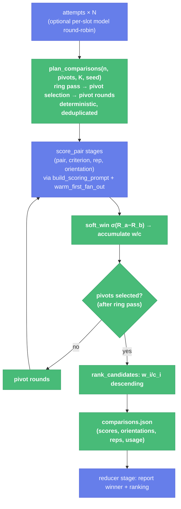

# Tournament Soft-Scored Selection + Cost Ledger (Slices V4–V6) — Child Spec

| Document Metadata      | Details                                                                 |
| ---------------------- | ----------------------------------------------------------------------- |
| Author(s)              | flora131 (with Claude Fable 5)                                          |
| Status                 | In Review (RFC) — all open questions resolved 2026-08-17                |
| Team / Owner           | flora131                                                                |
| Created / Last Updated | 2026-08-17                                                              |
| Parent                 | `specs/2026-08-17-llm-verifier-adoption-program.md` (umbrella; posture: breaking allowed) |
| Depends on             | `specs/2026-08-17-verification-criteria-module.md` (V1 scale/criteria, V3 prompt builder + warm-first) |
| Issues                 | #2488 (soft-scored tournament), #2494 (verifier cost ledger)            |
| Research               | `research/docs/2026-08-17-llm-verifier-adoption-scan.md` §3, §4         |
| Slices                 | V4 `verifier/selection-math` · V5 `verifier/tournament-runner` (V5a/V5b split pre-authorized) · V6 `verifier/cost-ledger` |

## 1. Executive Summary

The tournament builtin currently eliminates a candidate forever on one binary judge call (`winner: "first"|"second"`, knockout bracket). This spec replaces it with the Probabilistic Pivot Tournament: judges emit graded per-criterion scores for both slots, each directed comparison repeats K times with A/B slot swap, scores become soft wins via Bradley–Terry, and the full pool is ranked by count-normalized mean preference — no elimination, `N + k(N−k) + C(k,2)` comparisons instead of a bracket. Three slices: **V4** is pure deterministic math (`plan_comparisons`, `soft_win`, `rank_candidates` — table-tested, seeded, no model calls); **V5** rewrites the runner on top of V4 + the V1 scale + the V3 prompt builder and warm-first scheduler, replacing `bracket.json` with a comparisons ledger; **V6** adds `fold_usage` so every verification ledger reports measured calls, tokens, and cache-hit rate — the proof mechanism for V3's optimization and the shared reducer #2212's token budget will import. Dangerous doors: none new — selection ranks; it never destroys.

## 2. Context and Motivation

### 2.1 Current State (leaking doors)

- `tournament-runner.ts:17-21` — `judgeDecisionSchema` is binary; 51/49 and 99/1 are indistinguishable; discrete judges tie on 26.7% of comparisons at K=1 (paper).
- `tournament-runner.ts:103-163` — single-elimination loop: `next.push(winner)` drops the loser permanently on one call; a bye (105) advances unjudged.
- `tournament-runner.ts:111,137` — one orientation per match with a parity trick (`(round+index)%2`): positional bias cancels only *across* matches on average, never *within* a pair.
- `tournament-runner.ts:166-167` — `bracket.json` records matches, not evidence: no scores, no orientations, no repeats, no cost.
- No usage measurement anywhere: `modelAttempts[].usage` (populated since #2197) is folded by nobody (#2494).

### 2.2 The Problem

Selection quality is capped by judgment noise that the architecture amplifies (knockout) instead of averaging (soft wins). Fixing it multiplies judge calls by `criteria × K`, which is affordable only on top of V3's cache layout — and honest only if V6 measures what it actually cost.

## 3. Goals and Non-Goals

### 3.1 Functional Goals

- [ ] Deterministic selection math: identical `(n, pivots, K, seed)` → identical comparison schedule, orientations, and ranking math, on every platform.
- [ ] Judges score both slots per criterion on the shared 1–20 scale; a parse failure is an indeterminate re-ask, never a counted comparison (V2 rule), and never durably persisted as a score.
- [ ] No knockout: every candidate is ranked; a single noisy judgment shifts a mean, never eliminates.
- [ ] Slot swap *within* each directed comparison (odd repeats swap A/B; scores recorded back in candidate order).
- [ ] Comparisons ledger replaces `bracket.json`: every score, orientation, repeat, criterion, soft win, plus per-phase usage (V6).
- [ ] `fold_usage` helper importable by #2212 (B3) and consumed by tournament + adversarial ledgers.
- [ ] Heterogeneous candidate pools via an optional ordered model list (round-robin across attempt slots), assignment recorded in the ledger, honest caveat documented (Q3 resolved: ships in V5b).

### 3.2 Non-Goals (Out of Scope)

- [ ] NOT a new workflow: this is the in-place upgrade of `tournament` (#2488 decision).
- [ ] NOT logprob rewards (#2260 closed): K-sample averaging is the operating point.
- [ ] NOT re-scoring already-scored directed pairs: within a run, the schedule is deduplicated; across resume, durable stage replay returns checkpointed results.
- [ ] NOT enforcement of any budget (V6 measures; #2212 enforces).
- [ ] NOT goal/ralph ledger usage blocks (Q4 resolved: they land in V10, where those ledgers are already reshaped).

## 4. Proposed Solution (High-Level Design)

### 4.1 Selection Flow



Two model touchpoints (judges, reducer); everything between is pure TypeScript.

### 4.2 The Door Set at a Glance

> `plan_comparisons` · `score_pair` · `soft_win` · `rank_candidates` · `fold_usage`

Read alone: the schedule is planned once, deterministically; judging scores pairs; scores become soft wins; ranking is arithmetic over accumulated preference; and cost is folded where the decision is audited. Nothing eliminates, so nothing is irreversible.

## 5. Detailed Design

### 5.1 The Doors (V4 — `packages/workflows/builtin/selection-math.ts`)

```ts
// — Pure, dependency-free, seeded. Reference parity: llm_verifier/pivot_tournament.py —

seeded_rng(seed: number): () => number
// Guarantee: deterministic float sequence in [0,1) (mulberry32-class); identical
// across platforms/runtimes. The ONLY randomness source in selection.

plan_comparisons(input: { n: number; pivots: number; repeats: number; seed: number }):
  ComparisonPlan
// ComparisonPlan = {
//   ring: DirectedPair[];              // N adjacent pairs of a seeded Hamiltonian
//                                      // cycle — every candidate once per slot
//   pivotRounds: (pivots: number[]) => DirectedPair[];  // non-pivot×pivot + pivot×pivot,
//                                      // minus pairs already in the ring (dedup)
//   jobs: (pairs) => ScoringJob[];     // × criteria × repeats; odd rep swaps slots
// }
// ScoringJob = { a, b, criterionId, rep, swapped }   // prefix key = (a-slot, b-slot)
// Guarantee: identical input → identical plan; total directed pairs ≤
// N + k(N−k) + C(k,2); no pair scheduled twice.
// Refuses: n < 2; pivots < 1; repeats < 1 (constructor-validated).

soft_win(scoreA: number, scoreB: number): number
// Guarantee: p(a≻b) = σ(normalize(scoreA) − normalize(scoreB)) where
// normalize maps VERIFICATION_SCALE 1..20 → [0,1] (reference operates on [0,1]
// rewards; raw 1–20 differences would saturate the sigmoid).

accumulate(prefs: { a, b, p }[], w: number[], c: number[]): void
// w[a]+=p, c[a]+=1, w[b]+=1−p, c[b]+=1 — reference accumulate() parity.

select_pivots(w: number[], c: number[], k: number): number[]
// Top-k by mean preference w_i/c_i; ties broken by lower index (deterministic).

rank_candidates(w: number[], c: number[]): Ranking
// Guarantee: full ordering by w_i/c_i descending, ties by index; exposes the
// per-candidate mean preference. No candidate is absent from the ranking.
```

**Per-door rubric audit:**

| Door | (1) Joint | (2) One sentence | (3) Honest | (5) Every exit | (6) Refusals |
|---|---|---|---|---|---|
| `plan_comparisons` | ✅ "plan the comparisons" | ✅ one deterministic schedule per input | ✅ plans, never scores | invalid n/k/K throw at construction | double-scheduling a pair unrepresentable (dedup by key) |
| `soft_win` | ✅ | ✅ maps two scores to one preference | ✅ never returns a verdict | equal scores → exactly 0.5 | out-of-scale scores impossible (CriterionScore schema, V1) |
| `rank_candidates` | ✅ | ✅ orders all candidates by mean preference | ✅ ranks, never eliminates | c_i = 0 → defined (0 preference, last) | dropping a candidate unrepresentable (output length = n) |

### 5.2 V5 — tournament runner rewrite

**Inputs** (existing + new; `.d.ts` updated): `prompt`, `num_attempts` (2–8, default 4), `max_concurrency` (unchanged) + `n_evaluations` (K, default **2**), `pivots` (default **1** — the bo3 preset; 2 documented as the accuracy upgrade), `seed` (optional, default **0**), `criteria` (V1 record/markdown; default: the 3 judge criteria decomposed from the current rubric), `models` (optional ordered list, round-robin across attempt slots; ships in V5b). (Q1–Q3 resolved.)

**Judge stage (`score_pair`):** one stage per `ScoringJob` — one criterion, both slots, schema `{ criterion_id, score_a: 1..20, score_b: 1..20, evidence[] }` (V1 scale schema). Prompt via V3 `build_scoring_prompt`: head = task + both candidate bodies in slot order + scale; tail = criterion. `swapped` jobs present candidates in reversed slots; scores are recorded back in candidate order. Scheduled via `warm_first_fan_out` (a swapped orientation is a distinct prefix — both get warmed). Parse failure → one re-ask; still invalid → the job is recorded `{invalid: true}` and **excluded** (its rep contributes nothing; `directed_reward` averages over valid entries; a fully-invalid pair defaults both rewards to 0.5 — reference parity — and is flagged in the ledger).

**Rounds:** ring jobs first → `accumulate` → `select_pivots` → pivot-round jobs → `accumulate` into the same w/c → `rank_candidates`. Byes no longer exist (no bracket).

**Ledger** (`comparisons.json`, replaces `bracket.json`): `{ task, seed, params {n, pivots, K, criteria}, comparisons: [{a, b, criterion_id, rep, swapped, score_a, score_b, p_ab, invalid?}], w[], c[], ranking: [{label, meanPreference}], budget: {planned, executed}, usage (V6, per phase: attempts/ring/pivots/reducer), model_assignment? }`.

**Outputs** (breaking allowed; names kept where they cost nothing): `result`, `winner` (= ranking[0]), `winner_artifact_path`, `result_path`, `attempt_artifact_paths`, `artifact_dir` retained; `judge_artifact_paths` → per-job artifacts; `bracket_path` → `comparisons_path`; new `ranking` (labels + mean preferences), `seed`. Reducer stage reports winner + full ranking + notable disagreements from the ledger.

**V5a/V5b split (pre-authorized):** V5a = runner core (plan execution, accumulation, ranking, ledger); V5b = judge prompts, `.d.ts`, reducer report, `models` round-robin.

### 5.3 V6 — `fold_usage` and ledger usage blocks (#2494)

```ts
fold_usage(results: readonly WorkflowTaskResult[]): UsageTotals
// UsageTotals = { calls, input, output, cacheRead, cacheWrite, cost, turns,
//                 cacheHitRate }   // cacheRead / (input + cacheRead); absent fields = 0
// Guarantee: pure fold over modelAttempts[].usage including retried attempts;
// results without usage contribute zeros. Deterministic, fixture-tested.
```

- Home: `packages/workflows/builtin/verification-usage.ts` — importable later by #2212 B3 (run-tree meter) without pulling tournament code.
- Consumers in this slice: tournament ledger (per phase + total) and adversarial-verification round summaries (`verification-summary-<round>.json` gains `usage`). goal/ralph ledger blocks land in V10 (Q4 resolved).
- Durable-replay honesty: ledger writes happen once per phase in run code; a durable-resumed run replays the checkpointed write rather than re-folding, so replayed rounds add nothing (umbrella/reference parity: "comparisons served from cache add nothing").

### 5.4 Cost at defaults (stated, not hidden)

Per round with N=4: directed pairs = `4 + k(4−k) + C(k,2)`; judge calls = pairs × criteria × K. The Q1 decision fixes the default point; the ledger's `budget` block records planned vs executed for every run.

## 6. Alternatives Considered

| Option | Pros | Cons | Rejection |
|---|---|---|---|
| Keep knockout, add graded scores | smaller diff | one noisy call still eliminates permanently — the core defect | defeats #2488 |
| Full round-robin O(N²) | max information | cost quadratic; PPT reaches comparable selection at O(Nk) | reference result |
| Global usage counter (reference `USAGE` style) | matches reference | process-global state in a workflow runtime with concurrent runs; atomic already has per-result usage | fold per result-set instead |
| Raw 1–20 differences into sigmoid | no normalize step | σ(19) ≈ 1.0 — saturates; soft wins collapse to hard wins | normalize to [0,1] first |

## 7. Cross-Cutting Concerns

- **Determinism & resume:** the schedule is a pure function of `(n, pivots, K, seed)`; stage names derive from `ScoringJob` identity (`judge-<a>-<b>-<criterion>-r<rep>`), so durable replay reattaches checkpointed results to identical jobs and call order is stable.
- **Compatibility:** breaking posture; `bracket_path` removal and ledger reshape recorded in CHANGELOG `### Breaking Changes`; retained output names documented as unchanged.
- **Trust:** no new irreversible doors. The winner is arithmetic over the ledger; anyone can recompute the ranking from `comparisons.json` alone.

## 8. Test Plan

- **V4** — `npx vitest --run --project unit -t "selection-math"`: seeded RNG cross-platform vectors; ring cycle = valid Hamiltonian adjacency (every candidate once per slot); plan determinism (same input twice → deep-equal plans); dedup (ring ∩ pivot pairs never double-scheduled); swap bookkeeping (odd reps swapped, recorded in candidate order); BT accumulation w/c invariants (Σc = 2 × comparisons); pivot tie-break by index; ranking length = n always; budget formula `N + k(N−k) + C(k,2)` upper bound.
- **V5** — `builtin-workflows-tournament-loop` updated: stubbed judges → ledger complete (every job present or `invalid`-flagged); invalid job excluded from means and never persisted as a score; fully-invalid pair → 0.5/0.5 flagged; ranking recomputable from ledger (test recomputes and compares); retained outputs present; fixed seed twice → identical ledgers.
- **V6** — new usage-fold suite: fixtures for absent usage → zeros, retries summed, hit-rate derivation, empty set → all-zero totals.
- **Interactive verification:**
  1. Run tournament on a 3-candidate fixture with `seed: 7` twice → byte-identical `comparisons.json` (modulo usage/timing fields).
  2. Recompute `w/c` from the ledger by hand for one candidate → matches `ranking` entry.
  3. Corrupt one judge fixture → ledger shows `invalid: true` for that job, rep count for that pair reduced by one, no score fabricated.
  4. Inspect `usage.cacheHitRate` across ring phase with V3 active vs a control with shuffled prompt order → the V3 claim is now a measured number.
- `npm run check` green per slice; Evidence protocol per umbrella §5.3.

## 9. Open Questions / Unresolved Issues

All resolved with the owner, 2026-08-17:

- [x] **Q1 — Operating point:** defaults `pivots=1, n_evaluations=2, C=3` (the measured bo3 preset; 42 judge calls/round at N=4). `pivots=2` documented as the accuracy upgrade; the ledger's `budget` block records planned vs executed either way.
- [x] **Q2 — Seed:** optional input, default `0`; schedules fully reproducible across runs.
- [x] **Q3 — Heterogeneous pool:** ships in V5b — ordered `models` list, round-robin per attempt slot, assignment in the ledger, caveat documented (diversity is a bet on the selector).
- [x] **Q4 — goal/ralph usage blocks:** deferred to V10; V6 touches only tournament + adversarial. #2494 completes across V6+V10, noted on the issue when V6 lands.
