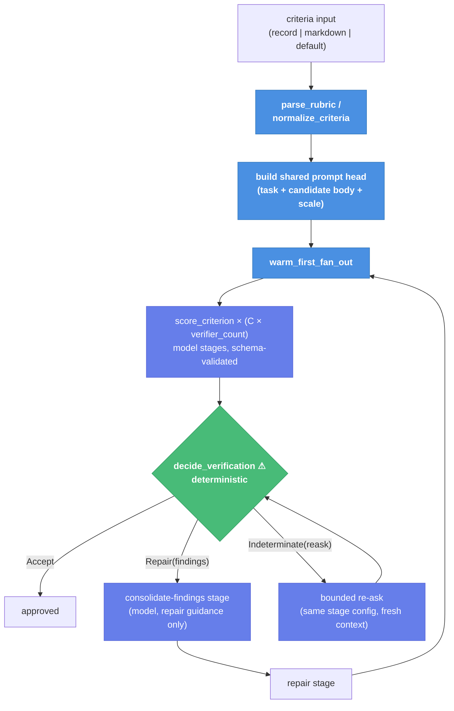

# Verification Criteria Module + Prefix-Cache Prompts (Slices V1–V3) — Child Spec

| Document Metadata      | Details                                                                 |
| ---------------------- | ----------------------------------------------------------------------- |
| Author(s)              | flora131 (with Claude Fable 5)                                          |
| Status                 | In Review (RFC) — all open questions resolved 2026-08-17                |
| Team / Owner           | flora131                                                                |
| Created / Last Updated | 2026-08-17                                                              |
| Parent                 | `specs/2026-08-17-llm-verifier-adoption-program.md` (umbrella; posture: breaking allowed) |
| Issues                 | #2487 (criteria + aggregation), #2493 (prefix-cache prompts)            |
| Research               | `research/docs/2026-08-17-llm-verifier-adoption-scan.md` §3, §4         |
| Slices                 | V1 `verifier/criteria-module` · V2 `verifier/adversarial-mean-veto` · V3 `verifier/prefix-cache-prompts` |

## 1. Executive Summary

This spec defines the foundation of Stack V: one shared rubric primitive (`packages/workflows/builtin/verification-criteria.ts`) that every verification builtin consumes, the rewiring of `adversarial-verification` from a binary unanimity gate to per-criterion graded scoring with mean+veto aggregation, and the prompt/scheduling layer that makes the multiplied verifier calls affordable. Three doors carry the change: **`parse_rubric`** (one canonical `criteria.md` parser, mirroring the reference implementation), **`decide_verification`** ⚠ (the single deterministic door to an accept — an unparseable verifier report is *unrepresentable* as a vote, killing the inherited #2255 bug at the type level), and **`warm_first_fan_out`** (one warm call per distinct prompt prefix before fanning out, paired with shared-head/varying-tail prompt layout; reference-measured 5.2%→78.4% cache-hit improvement). Everything is deterministic and unit-testable without model calls except the verifier stages themselves.

## 2. Context and Motivation

### 2.1 Current State (leaking doors)

- `adversarial-verification-runner.ts:8-12` — `verifierSchema` collapses a verifier's judgment to binary `pass|fail`. §4.3 of the paper: compound binary rubrics latch onto the most salient factor.
- `adversarial-verification-runner.ts:45-49,74,77-78` — **the inherited bug**: an unparseable report is replaced by `INVALID_VERIFIER_REPORT` (a substantive fail vote written to the artifact), and `allVerifiersPassed` requires `validReports.length === verifier_count`, so a parse failure blocks acceptance exactly like a real objection. The door named "report" behaves as "veto."
- `adversarial-verification-runner.ts:54` — the rubric is a hardcoded 5-bullet list written to `rubric.md`; no caller can supply criteria.
- `adversarial-verification-runner.ts:89-94` — unanimity AND: false-accept protection degrades as `(1−p)^K` but false-*reject* grows as `1−(1−p)^K` (#2255 derivation); the reducer's accept is overridden by one noisy fail.
- `tournament-prompts.ts:37-42` + `adversarial-verification-prompts.ts` `renderVerifierPrompt` — pair/candidate-specific content leads every prompt; criterion/rubric text sits mid-prompt; candidate bodies arrive via `reads` (after the prompt). No two sibling verifier calls share a usable prompt prefix.

### 2.2 The Problem

Per-criterion scoring multiplies verifier invocations by criteria count, and #2488/#2490 add K repeats on top. The statistical upgrade is unaffordable without the prompt-layout and scheduling changes, and unsound without the aggregation fix — so V1–V3 ship as one dependency chain: types and parser first, the consumer rewire second, the cost layer third.

## 3. Goals and Non-Goals

### 3.1 Functional Goals

- [ ] One canonical `criteria.md` parser + normalizer with reference-parity semantics (`{#id}` anchors, slugging, dedup, comment stripping, empty-description rejection).
- [ ] Shared anchored 1–20 scale constants used by every downstream slice (V4–V10).
- [ ] `adversarial-verification` accepts caller-supplied criteria, scores each criterion in a separate verifier invocation, and gates on mean-vs-threshold with an unconditional veto path.
- [ ] Parse failures become bounded re-asks; they can never be counted as votes and are never durably persisted as scores.
- [ ] Scoring prompt builders emit byte-identical shared heads across sibling calls, varying only at the tail; fan-outs warm one call per distinct prefix first.
- [ ] Cost knob documented: `criteria.length × verifier_count` invocations per round.

### 3.2 Non-Goals (Out of Scope)

- [ ] NOT porting the letter-scale/logprob machinery (A–T letters exist for logprob extraction; atomic uses schema-validated integers 1–20).
- [ ] NOT changing tournament or goal/ralph consumers here (V5, V9–V10 consume this module).
- [ ] NOT preserving the existing `adversarial-verification` output contract (umbrella posture: breaking allowed; `.d.ts` updated in V2).
- [ ] NOT promising a cache-hit rate: the prompt layout creates the *conditions* for provider prefix caching; the measurement lands with V6 (`fold_usage` cache-read evidence).
- [ ] NOT adding a build step to `packages/workflows`.

## 4. Proposed Solution (High-Level Design)

### 4.1 Architecture



The **acceptance decision moves out of the model reducer into deterministic code** (Q1 resolved). The old reducer stage survives with a smaller, honest job: consolidating confirmed findings into repair guidance.

### 4.2 The Door Set at a Glance

> `parse_rubric` · `normalize_criteria` · `select_criteria` · `score_criterion` · `decide_verification` ⚠ · `build_scoring_prompt` · `warm_first_fan_out`

Read alone: rubrics have one parser and one normal form; every score is one criterion in one call; acceptance has exactly one deterministic door; prompts are built for cache sharing; fan-out warms before it floods.

## 5. Detailed Design

### 5.1 The Doors (V1 — `packages/workflows/builtin/verification-criteria.ts`)

```ts
// — Types. A Criterion is the unit of judgment; a CriterionScore can only —
// — be constructed from a schema-valid structured output.                 —

interface Criterion { readonly id: string; readonly name: string; readonly description: string }
interface Criteria { readonly groundTruthNote: string; readonly criteria: readonly Criterion[] }

parse_rubric(markdown: string): Criteria                                   // throws RubricError
// Guarantee: returns normalized criteria with unique ids in file order.
// Semantics (reference parity, llm_verifier/prompts.py):
//   `# title` ignored · `## Ground Truth Note` optional, first wins ·
//   `## Criteria` section owns `### Name {#id}` headings · HTML comments
//   stripped before parsing (author notes never reach a verifier) ·
//   id slug: lowercase, alnum→underscore, ≤40 chars, fallback "criterion" ·
//   duplicate ids deduped _2, _3, … in encounter order.
// RubricError (named): NoCriteria | EmptyCriterion(ids)
// Refuses: a criterion without a body (empty description is an error, not a
// silent skip) — a rubric line a verifier cannot score with is a lie.

normalize_criteria(input: Record<string,string> | readonly string[] | readonly CriterionInput[]): readonly Criterion[]
// Guarantee: one canonical {id,name,description}[] from any accepted shape;
// same slug/dedup rules; empty description throws. (Reference parity.)

select_criteria(criteria: readonly Criterion[], ids?: readonly string[]): readonly Criterion[]
// Guarantee: subset+order by ids; unknown id throws (never silently drops).

// — The scale. One definition, shared by V4–V10. —
VERIFICATION_SCALE: {
  readonly min: 1; readonly max: 20;
  readonly anchors: string;   // "1 = certainly fails … 10 = borderline … 20 = verified correct"
  readonly schema: TSchema;   // Type.Integer({ minimum: 1, maximum: 20 })
}

// — Scoring artifact. The only way to mint one is a schema-valid report. —
interface CriterionScore {
  readonly criterionId: string;
  readonly score: number;                     // 1..20, schema-enforced
  readonly evidence: readonly string[];
  readonly findings: readonly Finding[];
}
interface Finding { readonly finding: string; readonly severity: "veto" | "blocking" | "note" }

// — The chokepoint. —
decide_verification(
  round: { scores: readonly CriterionScore[]; invalidCount: number; expectedCount: number },
  policy: { acceptMean: number; quorumFraction: number },
): Accept | Repair | Indeterminate
// Accept        = { kind: "accept"; mean: number }
// Repair        = { kind: "repair"; mean: number; findings: Finding[] }   // confirmed findings only
// Indeterminate = { kind: "indeterminate"; missing: number }              // re-ask, never a vote
// Guarantee: Accept iff quorum holds AND mean(scores) ≥ acceptMean AND no
// severity:"veto" finding exists; any veto finding forces Repair regardless
// of mean; a round below quorum (valid < ceil(expected × quorumFraction))
// is Indeterminate. ⚠ The single door to an accept; pure and table-testable.
// Refusal BY TYPE: `invalidCount` is metadata — there is no constructor that
// turns an unparseable report into a CriterionScore, so a parse failure
// cannot lower (or raise) the mean. The #2255 bug is unrepresentable.
```

**Per-door rubric audit:**

| Door | (1) Joint | (2) One sentence | (3) Honest name | (5) Every exit | (6) Refusals real | (8) Chokepoint |
|---|---|---|---|---|---|---|
| `parse_rubric` | ✅ "parse the rubric" | ✅ returns normalized criteria or a named error | ✅ parses, never invents | empty body → `EmptyCriterion`, not a skip | unparseable rubric cannot produce criteria | n/a |
| `decide_verification` ⚠ | ✅ "decide the verification" | ✅ "maps one round of scores to exactly one of accept/repair/indeterminate" | ✅ decides, never re-scores | below quorum → Indeterminate; veto → Repair even at mean 20 | invalid report unconstructible as a score | ✅ sole accept path in V2 |
| `warm_first_fan_out` | ✅ scheduling joint | ✅ "runs one call per distinct prefix to completion before releasing the rest" | ✅ | a warm-phase failure still releases its group (no deadlock) | grouping key is caller-supplied, not inferred | n/a |

### 5.2 V2 — adversarial-verification rewire

**Inputs** (breaking, `.d.ts` updated): `task`, `verifier_count`, `max_repairs` (unchanged) + new optional `criteria` (record `{name: description}` or `criteria.md` markdown string; default: 3 criteria decomposed from the existing rubric — `task_fit`, `evidence`, `completeness`) + `accept_mean` (default **14**; 10 = borderline on the shared scale) + `reask_limit` (default 1). (Q2 resolved.)

**Fan-out shape:** per round, `criteria.length × verifier_count` stages, each scoring **one criterion** with schema = `{ criterion_id, score (VERIFICATION_SCALE.schema), evidence, findings[{finding, severity}] }`, `context: "fresh"`, `failFast: false`. Reports persist per stage as today (schema-shaped JSON artifacts) — but an invalid report persists as `{ "invalid": true, "stage": … }`, never as a substitute verdict, and is **never durably recorded as a score** (umbrella decision; reference `on_error="tie"` parity).

**Round logic:**
1. Collect valid `CriterionScore`s; invalid/missing → one bounded re-ask wave (`reask_limit`, same stage config, fresh context).
2. `decide_verification(round, policy)`:
   - **Accept** → done; `approved: true`.
   - **Repair** → consolidate-findings stage (the old reducer, renamed job: merge confirmed findings into actionable repair guidance; it CANNOT flip the decision) → repair stage → next round. `max_repairs` bound unchanged; exhaustion → not approved, remaining work preserved verbatim.
   - **Indeterminate** (still below quorum after re-asks) → the round repeats once; a second Indeterminate ends the run not-approved with the quorum failure as evidence (never silent acceptance, never a fabricated fail vote).
3. Outputs: `approved`, `mean_score`, per-criterion score table path, `repairs_completed`, `candidate_path`, `review_report_path`, `remaining_work` — reshaped freely under the breaking posture.

### 5.3 V3 — prefix-cache prompt layout + warm-first scheduling

**Layout invariant** (documented in the module, reference-docstring parity): a scoring-family prompt is `SHARED HEAD ‖ VARYING TAIL`.
- **Head** (byte-identical across the family): task statement, ground-truth note, candidate body/bodies **inlined** (bound: **32 KiB per candidate**, a named tested constant; any oversized candidate flips the whole family to `reads` so sibling heads stay byte-identical — Q3 resolved), scale anchors.
- **Tail** (only per-call variation): criterion name+description, output-format instruction.
- `build_scoring_prompt(head: SharedHead, criterion: Criterion): string` — the only prompt constructor V2 (and later V5) may use; a unit test asserts two sibling prompts share a byte-identical head and differ only after it.
- **Rider (Q4 resolved):** the `generate-and-filter` judge prompt adopts `build_scoring_prompt` in this slice (~50 src lines) — the third consumer proves the builder API before V5 lands on it.

**`warm_first_fan_out(ctx, steps, prefixKeyOf, options)`:** partition steps by prefix key; phase 1 runs one step per distinct key (bounded concurrency); phase 2 releases the rest at full concurrency. A phase-1 failure releases its group anyway (`failFast: false` families) — warming is an optimization, never a gate. Slot-swapped orientations (V5) are distinct keys by construction.

### 5.4 Data Model

- `criteria.md` format: as §5.1 semantics; `criteria/TEMPLATE.md`-style docs land in D1/V11, not here.
- Score artifact (per stage): `verification-<round>-<criterion>-<k>.json` = the `CriterionScore` or `{invalid: true}` marker.
- Round summary: `verification-summary-<round>.json` = `{ scores[], mean, invalidCount, decision }` — the auditable input to `decide_verification`, plus (from V6) a usage block.

## 6. Alternatives Considered

| Option | Pros | Cons | Rejection |
|---|---|---|---|
| Keep model reducer as decision-maker, show mean as evidence | no behavior change to reducer | acceptance stays non-deterministic; the chokepoint has two doors | fails rubric #8; Q1 confirms the split |
| One verifier call scores all criteria at once | C× fewer calls | recreates the compound-rubric failure (§4.3: salient-factor latch) — the exact thing #2487 removes | defeats the purpose |
| Letters A–T like the reference | prompt parity | letters exist only for logprob extraction; atomic has schemas and no logprobs | integers 1–20, schema-enforced |
| Count invalid reports as fail votes (status quo) | "safe" bias | provably wrong: converts infrastructure noise into substantive objections; degrades as verifier_count grows | the bug this spec deletes |

## 7. Cross-Cutting Concerns

- **Trust:** `decide_verification` is pure TypeScript — the accept path is auditable from the round summary alone. No model output can mint a `CriterionScore` without passing the schema.
- **Compatibility:** breaking allowed (umbrella §7.2); V2 updates `adversarial-verification.d.ts` and `packages/workflows/CHANGELOG.md` (`### Breaking Changes`) in-slice.
- **Cost:** stated in docs + `.d.ts` comments: default criteria triple per-round calls; `reask_limit` adds at most `invalid × reask_limit` calls; V3 exists to make the multiplied input tokens mostly cache reads.

## 8. Test Plan

Commands are the Evidence commands (umbrella §5.3):

- **V1** — `npx vitest --run --project unit -t "verification-criteria"`: table tests for parser (section layout, `{#id}`, slug/dedup incl. 40-char truncation, comment stripping, empty-description rejection, no-criteria rejection), normalizer (record/array/dict shapes, error cases), `select_criteria` unknown-id throw, and `decide_verification` (mean threshold boundary, veto overrides mean=20, quorum boundary at `ceil(expected × fraction)`, invalidCount never shifts mean).
- **V2** — existing `builtin-workflows-adversarial-generate` suite updated: fixture run with stubbed stages → per-criterion artifacts, re-ask on invalid fixture (never a vote), repair on veto finding, quorum-failure ends not-approved.
- **V3** — new prompt-layout suite: byte-identical-head assertion; warm/rest partition determinism; warm-failure releases group.
- **Interactive verification** (human or agent):
  1. `printf '## Criteria\n### Correct {#c}\nIs it correct?\n' | <preview helper>` → 1 criterion, id `c` (parser door observable at the boundary).
  2. Run adversarial-verification on a trivial fixture task with `verifier_count: 2`, default criteria → round summary shows `C×2` scores, a mean, and a deterministic decision.
  3. Corrupt one verifier fixture to emit prose instead of structured output → artifact shows `{invalid: true}`, summary `invalidCount: 1`, decision unchanged in kind (re-ask happened, no fail vote).
  4. Inject a `severity: "veto"` finding with all scores 20 → decision is Repair, not Accept.
- Per-slice: `npm run check` green; suite discipline per umbrella §8.

## 9. Open Questions / Unresolved Issues

All resolved with the owner, 2026-08-17:

- [x] **Q1 — Accept owner:** `decide_verification` decides deterministically; the reducer stage is demoted to findings-consolidator for repair prompts and cannot flip the decision.
- [x] **Q2 — Defaults:** 3 criteria (`task_fit`, `evidence`, `completeness`) decomposed from the current rubric; `accept_mean: 14`.
- [x] **Q3 — Inline bound:** 32 KiB per candidate body, named constant; oversized flips the whole family to `reads` to keep heads identical.
- [x] **Q4 — generate-and-filter judge:** rider in V3 (~50 src lines) adopting `build_scoring_prompt`.
