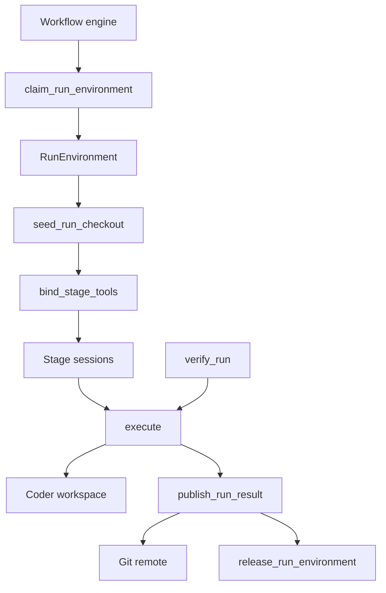

# Per-run Coder Execution Environments

## 1. Summary

Atomic workflows parallelise twice: several runs execute concurrently, and each run fans out into concurrent stages and subagents. Every one of them builds, installs, and tests on one machine.

This proposes giving **each workflow run its own Coder workspace**, and routing **every tool call belonging to that run** into it. The engine, stage sessions, durable store, TUI, intercom, and model credentials stay on one control machine. Only command execution leaves.

Two doors carry the design. `claim_run_environment` ⚠ is the only way to obtain a `RunEnvironment`, and `RunEnvironment.execute` ⚠ is the single chokepoint through which any code runs on a remote machine. Because a `RunEnvironment` has no other constructor, there is no second path to audit.

`atomic cloud` is the entry point: it puts the session itself on a workspace.

## 2. Problem

Isolation today is a Git worktree, and `docs/workflows.md:380` is explicit that this "is not an operating-system sandbox".

```text
control machine (one)
├── run A ──┬── stage a1 ─┐
│           ├── stage a2  ─┼─→ worktrees, one checkout, ONE CPU/disk budget
│           └── stage a3 ─┘
└── run B ──┬── stage b1 ─┐
            └── stage b2 ─┴─→ the same budget
```

Contention is not merely slow — it corrupts evidence. This repository's own rules say vitest runs test files in parallel with no worker cap, that a test passing only on an idle machine is a bug, and `scripts/run-flaky-test-suite.ts` fails a step at 70 % of a test's timeout. Under N×M concurrency the gates report starvation as failure.

**What actually consumes resources is the commands, not the agents.** A stage session is mostly idle, waiting on a model. So the commands move and the sessions stay.

## 3. Goals, non-goals, invariants

### 3.1 Goals

- Each top-level run may execute all its tool calls in a dedicated workspace.
- Every stage, task, and subagent of run R reaches exactly one environment: R's.
- Engine, durable store, stage chat, HIL prompts, intercom, and provider credentials stay on the control machine, unchanged.
- One tool call becomes at most one remote command.
- Deterministic gates (`ctx.tool`) run in the run's environment, never on model initiative.
- Work leaves an environment only as a pushed Git ref.
- An environment is destroyed only through an explicit release decision.

### 3.2 Non-goals

- NOT running the engine, store, or stage sessions in a run environment. The control plane does not move.
- NOT sharing a filesystem between control machine and environment, or between two environments. No NFS for source trees.
- NOT placing provider API keys or database credentials in a run environment.
- NOT giving the model a tool that claims, releases, or selects an environment.
- NOT exposing a second remote-execution path.
- NOT changing default local behaviour. Absent configuration, workflows execute as they do today.
- NOT naming a cloud provider or database vendor anywhere in shipped code.
- NOT provisioning or configuring a Coder deployment. That is a one-time admin act, situation-specific, and already covered by Coder's own quickstart and the `coder/skills` setup skill. Atomic verifies what an operator owns and controls workspaces only (§9.5).

### 3.3 Provider neutrality (invariant)

**Atomic talks to Coder. Coder talks to infrastructure. Atomic never crosses that line.**

A template is Terraform, so the machine behind a workspace is whatever its author chose — Azure, AWS, GCP, Kubernetes, Docker. Atomic's calls are identical regardless. Shipped code contains no cloud SDK, no provider hostname, and no provider-conditional branch.

"Inherit the user's Coder config" and "work on any cloud" are the same requirement stated twice.

### 3.4 Database neutrality (invariant)

**Atomic requires a PostgreSQL URL that passes the five checks in §9.4. It requires nothing else and must know nothing else.**

No vendor is privileged. Shipped code contains no vendor SDK, hostname pattern, connection-string dialect, or provisioning call.

**A prompted recommendation is not a code path.** Onboarding may suggest a provider; that suggestion is a table of text. A vendor-conditional branch is a dependency wearing a recommendation's clothes.

## 4. Design

### 4.1 Shape

The airlock is `claim_run_environment`: untrusted run inputs become a capability at exactly one place.



### 4.2 Pattern

**Capability-gated remote execution behind an operations seam.** Atomic's builtin tools are factories over an I/O interface whose default is the local disk and shell. Supplying an interface backed by one environment leaves the tool's name, schema, and description unchanged, so the model's view does not change and no prompt work is required.

### 4.3 The template contract

Provider neutrality forbids naming a cloud. Switching clouds *easily* is stronger and needs a stated contract, because a binding that depends on a template's shape is not portable however clean the code is.

**Required of any bindable template — the whole list:**

1. A `coder_agent` that reaches `ready`.
2. `git` and `rg` on `PATH`.
3. A writable working directory.
4. `data "coder_external_auth"` for the Git host (§7).

**The operating system is detected, never configured.** The agent reports `operating_system` and `architecture`, so the operations layer selects argv per OS — a Windows workspace is a bound template like any other. This is an OS dimension, not a provider one: `RemoteCommand` already carries argv rather than a shell string, so nothing in §5.1 changes, and §3.3 is untouched because an OS is not a cloud.

**Never required:** a machine size, image, region, disk layout, network topology, cloud, or any parameter the template did not declare. Each is the template author's decision.

Switching provider is switching template, and nothing else changes:

```text
atomic cloud setup --template azure-linux
atomic cloud setup --template aws-linux      # rebind; no other state changes
```

The binding is re-selectable and stores identifiers only. A run may override it through `environmentFromInputs`. The workflow database is orthogonal, so moving clouds does not move history.

### 4.4 Components

| Component | Responsibility | Notes |
| --- | --- | --- |
| Environment registry | `RunId` → `RunEnvironment`, one claim per run | mirrors `createGitWorktreeSetupCacheOwner` |
| Coder client | claim, seed, wait-ready, release | `POST /api/v2/users/{user}/workspaces`, builds, `agent-connection-watch` |
| Exec transport | one command to the workspace | multiplexed; see §5.2 |
| Remote operations | the six `*Operations` backends | one remote command per tool call |
| Gate adapter | the repository's own check command | via `ctx.tool`, not model-visible |

| Path | Action | Owns |
| --- | --- | --- |
| `packages/workflows/src/runs/shared/run-environment.ts` | add | claim, release, run-scoped owner |
| `packages/workflows/src/runs/shared/run-environment-coder.ts` | add | Coder API client |
| `packages/workflows/src/runs/shared/run-environment-exec.ts` | add | `execute` and its transport |
| `packages/workflows/src/runs/shared/run-environment-checkout.ts` | add | seed, publish, diff |
| `packages/workflows/src/runs/shared/run-environment-tools.ts` | add | `bind_stage_tools`, remote operations |
| `packages/workflows/src/engine/run.ts` | change | claim before `def.run(ctx)`, release in the existing `finally` |
| `packages/workflows/src/runs/foreground/executor-inputs.ts` | change | resolve `environmentFromInputs` |
| `packages/workflows/src/authoring/workflow.ts` | change | freeze the binding into `inputBindings.environment` |
| `packages/workflows/src/extension/config-loader.ts` | change | `environment` config block |
| `packages/coding-agent/src/cli/cloud-*.ts` | add | `atomic cloud` surface |

### 4.5 The door set (stranger-across-time view)

`claim_run_environment` ⚠, `seed_run_checkout`, `bind_stage_tools`, `execute` ⚠, `verify_run`, `collect_run_diff`, `publish_run_result` ⚠, `release_run_environment` ⚠, `restore_run_environment`

Entry point: `bind_cloud_deployment`, `open_cloud_session` ⚠, `inspect_cloud_readiness`

Read alone: a run claims one isolated machine, source enters once, a stage's hands are bound to it, all remote code passes one chokepoint, evidence comes from a gate rather than assertion, the change set is always collected, work becomes durable only as a pushed ref, and the machine dies only by a written decision.

## 5. Detailed design

### 5.1 The doors

```ts
type RunId = Branded<string, "RunId">;
type GitRef = Branded<string, "GitRef">;

claim_run_environment(run: RunId, binding: EnvironmentBinding, signal: AbortSignal)
  : Promise<Result<RunEnvironment, ClaimError>>
// Guarantee: returns a ready, agent-connected workspace dedicated to this run.
// ClaimError = NoCapacity | TemplateUnavailable | AgentStartTimeout | Unauthorized | Cancelled
// Refusal: RunEnvironment has no public constructor, so nothing executes remotely
//   without passing here. A second claim for one RunId returns the first environment.

seed_run_checkout(env: RunEnvironment, repo: RepoOrigin, base: GitRef, branch: GitRef)
  : Promise<Result<SeededCheckout, SeedError>>
// Guarantee: the environment holds a checkout of `repo` at `base`, on `branch`.
// SeedError = CloneFailed | RefNotFound | AlreadySeeded
// Refusal: SeededCheckout is the only proof source exists, and bind_stage_tools and
//   verify_run demand one. Running tools against an empty machine is unrepresentable.

env.execute(command: RemoteCommand, sink: OutputSink, signal: AbortSignal)
  : Promise<ExecOutcome>
// Guarantee: runs one command in this environment and reports one outcome.
// ExecOutcome = Exited{code} | TimedOut{seconds} | Aborted | TransportLost{detail}
//   — a sum type, never an exit code plus a separate error flag.
// ⚠ The single chokepoint for remote code execution. Every tool, gate, and user
//   `!` command reaches a remote machine here or not at all.

bind_stage_tools(checkout: SeededCheckout): readonly ToolDefinition[]
// Guarantee: tool definitions whose filesystem and shell operations resolve in that checkout.
// Refusal: takes a SeededCheckout, so a stage cannot bind to a machine with no source.

verify_run(checkout: SeededCheckout, job: GateJob): Promise<VerificationOutcome>
// Guarantee: gate evidence from an executed command, not from a model's report.
// VerificationOutcome = Passed{evidence} | Failed{evidence} | Inconclusive{reason}
// Refusal: invoked only from ctx.tool, never registered as a model-visible tool.

collect_run_diff(checkout: SeededCheckout): Promise<DiffArtifact>
// Guarantee: the environment's current change set, as a patch on the control machine.
// Safe: reads only. Emits the existing WorkflowArtifact shape (kind "diff", path, branch,
//   diffStat, filesChanged, insertions, deletions), so every existing consumer renders it.

publish_run_result(checkout: SeededCheckout, branch: GitRef)
  : Promise<Result<PublishReceipt, PublishError>>
// Guarantee: the named branch exists on the remote at the checkout's current commit.
// PublishError = NothingToPublish | RemoteRejected | AuthFailed
// ⚠ The only way work becomes durable outside an environment.

release_run_environment(env: RunEnvironment, decision: ReleaseDecision)
  : Promise<DiffArtifact>
// decision = Published(PublishReceipt) | Retain{reason} | Discard{reason}
// Guarantee: collects the change set, then stops the workspace and hands it to retention.
//   Published / Retain -> stop, delete when the window expires.
//   Discard            -> ⚠ delete now; the written reason is the price.
// Refusal 1: Published cannot be constructed without a PublishReceipt, which only
//   publish_run_result mints. Every other exit must name itself Retain or Discard.
// Refusal 2: no release path destroys a machine before taking its picture.
// Refusal 3: the engine's automatic release on failure passes Retain, never Discard —
//   a failed run is retryable and a retry needs somewhere to land.

restore_run_environment(owner: EnvironmentOwner, signal: AbortSignal)
  : Promise<Result<SeededCheckout, RestoreError>>
// Guarantee: the owner's environment is running again with its checkout current.
// RestoreError = Expired | ClaimFailed | Cancelled
// Inside the retention window: start the stopped workspace, fetch, re-checkout.
// After it: Expired, and the caller falls back to claim + seed. Resume degrades in
//   cost, never in availability.
```

**Per-door audit**

| Door | Joint | One sentence | Honest name | Every exit | Refusals real | Chokepoint |
| --- | --- | --- | --- | --- | --- | --- |
| `claim_run_environment` ⚠ | ✅ | "a ready workspace for this run" | ✅ idempotent | timeout, cancel named | no public constructor | ✅ sole claim |
| `seed_run_checkout` | ✅ | "the environment holds this ref" | ✅ | `AlreadySeeded` | `SeededCheckout` unforgeable | ✅ sole source entry |
| `bind_stage_tools` | ✅ | "these tools resolve there" | ✅ pure | n/a | demands `SeededCheckout` | ✅ sole binding |
| `execute` ⚠ | ✅ | "one command, one outcome" | ✅ | sum type covers all | argv, not a shell string | ✅ sole remote execution |
| `verify_run` | ✅ | "produces gate evidence" | ✅ | `Inconclusive` explicit | not model-visible | ✅ sole gate |
| `collect_run_diff` | ✅ | "the current change set" | ✅ safe | read-only | — | ✅ sole diff |
| `publish_run_result` ⚠ | ✅ | "the branch exists remotely" | ✅ | `NothingToPublish` distinct | receipt unforgeable | ✅ sole exit for work |
| `release_run_environment` ⚠ | ✅ | "the workspace is stopped" | ✅ names irreversibility | Retain vs Discard | needs a receipt | ✅ sole teardown |

### 5.2 Transport

A fresh `coder ssh <ws> -- <cmd>` measures 2–5 s per invocation (coder/coder#22581): each call resolves the workspace, dials the tailnet, and negotiates WireGuard. A fork per tool call is not viable.

The environment holds **one** connection and multiplexes.

*Phase 1 — SSH multiplexing.* `coder config-ssh`, then one control master; each `execute` reuses it and costs milliseconds.

*Phase 3 — an exec server.* `openai/codex` solves the identical problem with `codex-exec-server`, a process-RPC service that decouples agent logic from the environment and selects local or remote by URL. Same shape, same reason: no `ssh` fork per call, native streaming with channel labels, real cancellation, and one interface under which local and remote are indistinguishable — which is what makes `execute` a chokepoint rather than a convention. The door does not change.

### 5.3 One tool call, one remote command

The Gondolin example walks the guest filesystem from the host for `find` and `search` — correct over a bind mount, fatal over a network.

```text
read    -> cat <path>
write   -> a single here-doc write
edit    -> read + patch locally + write        (two commands, never per-line)
find    -> rg --files <filters>
search  -> rg <pattern>                        (NOT the per-file GrepOperations seam)
ls      -> one listing command
bash    -> the command itself
```

`createSearchTool` does accept an operations seam, but it is `GrepOperations { isDirectory, readFile }` — per-file, so one round trip per candidate — and it is not exported from the package root. Remote `search` therefore overrides `execute` wholesale.

**Backend error conventions are fixed by the builtin bash tool:** throw `Error("aborted")` on abort and `Error("timeout:<seconds>")` on timeout, so the tool renders "Command aborted" and "Command timed out after N seconds" exactly as locally.

### 5.4 Lifecycle

```text
run(def, inputs, opts)
  resolve inputs
  resolve environmentFromInputs -> binding
  owner = createRunEnvironmentOwner(binding)
  try
    def.run(ctx)
  finally
    finalize durable terminal status
    owner.release(...)        # success, failure, cancel, exit, budget stop, graceful quit
```

Not a new pattern: `createGitWorktreeSetupCacheOwner` sits at `engine/run.ts:328` and releases at `:842`, inside the `finally` every terminal path passes through. The environment owner takes the same two positions.

One asymmetry: a graceful quit returns `paused`, and a paused run keeps its environment. A worktree survives on disk; an environment does not.

**Stage binding.** Per-stage `customTools` already survive both option-strip functions and reach `createAgentSession` unmodified, and a registered tool replaces a same-named builtin. So `bind_stage_tools(checkout)` feeds `ctx.stage(name, { customTools })` with no engine change. `user_bash` accepts `{ operations }`, so a stage's `!` commands follow its file tools.

### 5.5 Retention

A release never destroys immediately unless a caller writes `Discard`. `Published` and `Retain` stop the workspace; a reaper deletes it when `WORKFLOW_ENVIRONMENT_RETENTION_MS` expires — **12 hours**, from Codex Cloud's container-cache TTL.

**Two windows, one rule.** Exemptions are shared with the artifact policy: running, paused, quit, blocked, and awaiting-input owners are exempt indefinitely, and a failed run is terminal but retryable. Durations differ on purpose:

| Object | Window | Why |
| --- | --- | --- |
| Artifacts and diffs | 30 days (`WORKFLOW_ARTIFACT_RETENTION_MS`) | a patch costs bytes |
| Environments | 12 hours | a machine costs money every hour |

A single window prices one of them wrong. This is also why `collect_run_diff` runs before teardown: the machine lives 12 hours and the diff lives 30 days, so the diff is the bridge.

## 6. Alternatives and prior art

| Option | Rejected because |
| --- | --- |
| Run the whole workflow in the VM | Store, DBOS, HIL, stage chat, intercom, transcripts all move; every control verb becomes a proxy; keys enter every VM. Buys isolation by rewriting the control plane |
| One VM per stage | VM count multiplies by fan-out; a run's stages lose a shared checkout and build cache |
| Shared NFS source tree | `npm ci` and `cargo build` issue enormous metadata traffic; contention returns as server IOPS and lock contention |
| `coder ssh` forked per call | 2–5 s per invocation |
| Route only `bash`, keep files local | File tools and commands would see different disks; every gate would test stale code |
| A DevPod-style second provider | Doubles the surface — two credential stories, two lifecycles, two failure sets — and §7's best property exists only on the Coder path |
| **Per-run environment, multiplexed transport** | **Selected** |

An alternative door set was considered: a single `run_in_environment(runId, command)` helper with no capability type. Rejected — with no unforgeable `RunEnvironment`, any caller could execute remotely by passing a string, and the chokepoint would be a convention.

**Prior art in this repository.** `examples/extensions/ssh.ts` (220 lines) already routes `read`, `write`, `edit`, and `bash` to a remote host through the operations seam, handles `user_bash`, rewrites the system prompt's cwd, and honours the `aborted` / `timeout:<n>` conventions. It is Phase 1's starting point with four defects repaired: a multiplexed transport instead of a fork per call, a real path map instead of `p.replace(localCwd, remoteCwd)`, all seven tools instead of four, and a run-scoped lease instead of a session global. `gondolin/index.ts` is the same seam against a local VM; `sandbox/index.ts` supplies the policy vocabulary to reuse (`network.allowedDomains`, `filesystem.denyRead`); `tool-override.ts` documents this exact use case.

**Outside.** `coder/coder` does not bake its agent into images — `coder_agent`'s `init_script` downloads it at workspace start. `openai/codex` decouples execution behind `codex-exec-server`, scopes cloud environments per task, caches container state for 12 hours, and returns results as a unified diff.

## 7. Security

- **The trust transition is singular.** Run inputs become a validated `EnvironmentBinding` only inside `claim_run_environment`.
- **Authority carried by type.** `RunEnvironment` and `SeededCheckout` have no public constructors, so a permission check cannot be forgotten at a call site that lacks the capability.
- **Irreversible effects pass one chokepoint each.** Execution → `execute`. Publication → `publish_run_result`. Destruction → `release_run_environment`.
- **Model credentials** stay on the control machine. An environment receives an environment-variable allowlist only, and `RemoteCommand` carries argv rather than a shell string, so construction cannot interpolate a secret.
- **Git credentials: Atomic holds none.** Coder already solves this. The deployment configures a provider through `CODER_EXTERNAL_AUTH_0_*`, backed by a GitHub App with fine-grained repository access. A template declaring `data "coder_external_auth"` blocks workspace start until the user authenticates. Inside the workspace the agent configures `GIT_ASKPASS` and injects the token for HTTPS operations. Therefore **`seed_run_checkout` and `publish_run_result` use HTTPS remotes** (SSH takes the separate `coder gitssh` path), and **no door mints, stores, or forwards a Git credential**. This also survives an organisation that disables deploy keys, which is a common hardening choice.
- **Network policy: full during setup, proxy-only during the agent phase**, following Codex Cloud. "Restricted" means proxy-only, not isolated: setup fetches with full access and warms caches; the agent phase reaches package registries and the Git remote through a proxy while arbitrary egress is refused. The allowlist is per template, and a refusal must name the host.
- **Threat model.** The primary risk is a leaked Coder session token, which grants workspace creation and therefore spend. Remediation: a scoped token with a bounded lifetime plus an environment budget cap.

## 8. Test plan

Vertical red-green-refactor slices, one per door.

| # | Red |
| --- | --- |
| 1 | Claiming with an agent that never reports ready returns `AgentStartTimeout` within the bound, not a hang |
| 2 | Two claims for one `RunId` return the same workspace and issue one create call |
| 3 | Release fires once on success, throw, cancel, budget stop, and exit; `paused` stops without deleting |
| 4 | `execute` yields `TimedOut` / `Aborted` / `TransportLost`, surfacing as `timeout:<n>` and `aborted`; a dropped master never becomes exit code 0 |
| 5 | A `search` across a fixture tree issues exactly one remote command — assert the count, not the timing |
| 6 | Type-level: `bind_stage_tools` cannot accept a `RunEnvironment` |
| 7 | Type-level: `ReleaseDecision::Published` cannot be constructed without a `PublishReceipt` |
| 7b | A failed run and a `Discard` each still yield a diff artifact after the workspace is gone |
| 8 | `verify_run` never appears in a stage session's tool registry |
| 8b | No cloud SDK, database vendor SDK, provider hostname, or vendor-conditional branch in shipped code; a suggestion table is exempt as data |
| 8c | No door returns, stores, or forwards a Git token; both remotes are HTTPS |
| 8d | With `CODER_URL`, an authenticated CLI session, and a prior binding, readiness returns `ready` with zero prompts and zero writes |
| 8e | The full matrix passes unchanged against a cloud VM template and a local Docker template |
| 9 | Readiness returns every unmet requirement at once, not the first |
| 10 | A blocked readiness check installs nothing, writes no credential, creates no workspace |
| 11 | `atomic cloud` under `--mode rpc` exits with the machine-readable unmet list, never a prompt |
| 12 | An unreachable database surfaces as `workflow_db_unreachable` at onboarding, password redacted |
| 13 | A connect-only role fails validation as `ReadOnly` at onboarding |
| 14 | A database URL pointing at an ephemeral in-sandbox server fails as `IsEphemeral` |
| 15 | With no valid database, `bind_cloud_deployment` writes no binding and `open_cloud_session` makes zero Coder API calls |
| 16 | A run recorded by session A has its stage transcript readable from session B on another machine |

**Interactive verification.** Claim against a real template; assert `ready`; seed at a known ref; run `search` and assert one remote command; run the repository's check through `verify_run` and assert `Passed` with evidence; publish; release with `Published`; assert the workspace is gone and the branch exists.

## 9. `atomic cloud`

### 9.1 Surface

`atomic cloud` starts a **session**, not a task, so it mirrors Atomic's own session verbs rather than importing task verbs from elsewhere:

```text
atomic cloud                 → new cloud session on the default template
atomic cloud --template <name> → same, on another bound template
atomic cloud --continue      → reattach to the most recent
atomic cloud --resume [id]   → pick from a list
atomic cloud ls [--json]     → sessions, sandboxes, ages, cost
atomic cloud rm <id>         → release a sandbox early
atomic cloud doctor          → readiness; exit non-zero when blocked
atomic cloud setup           → verify and bind; creates nothing (§9.6)
```

`--continue`, `--resume`, and `--fork` already exist in `cli/args.ts`, so a user who knows `atomic` knows `atomic cloud`, and the bare command does the obvious thing: a new session gets a new node.

**One owner, one environment.** An environment is owned by an id, and there are exactly two kinds:

```ts
type EnvironmentOwner =
  | { kind: "session"; id: SessionId }   // registered by `atomic cloud`
  | { kind: "run";     id: RunId };      // registered when a run starts
```

`open_cloud_session` is idempotent per binding and returns `AlreadyInside` when invoked from within a workspace of the same deployment, so nesting is unrepresentable.

**The flag would have promised two things.** "It runs your session on a remote machine **and** makes every workflow claim its own machine" needs an "and", so it is two doors. Session placement is the subcommand's job; per-run environments come from workflow configuration the control machine already holds, which the user can read and change.

### 9.2 Readiness

Onboarding is a **preflight, not a wizard**: it reports every unmet requirement at once, each with its own remedy, and changes nothing. This mirrors `cli/auth-check.ts:9-21`, where readiness is a sum type with a named reason.

```ts
inspect_cloud_readiness(): Promise<CloudReadiness>
// Read-only. Installs nothing, authenticates nothing, creates nothing, spends nothing.

type CloudReadiness =
  | { status: "ready";   deployment: CoderDeploymentUrl; user: string; template: TemplateRef }
  | { status: "blocked"; unmet: readonly CloudRequirement[] }

type CloudRequirement =
  | { kind: "cli_missing";             remedy: InstallRemedy }
  | { kind: "cli_too_old";             found: string; minimum: string }
  | { kind: "not_authenticated";       deployment?: CoderDeploymentUrl }
  | { kind: "no_deployment_bound" }
  | { kind: "no_template_access";      deployment: CoderDeploymentUrl }
  | { kind: "no_template_chosen";      choices: readonly TemplateRef[] }
  | { kind: "git_auth_unconfigured";   host: string; deployment: CoderDeploymentUrl }
  | { kind: "workflow_db_unreachable"; url: RedactedUrl; detail: string }
```

**Three refusals.** It never installs anything without explicit confirmation; it never stores a credential itself, delegating to `coder login`; and it never prompts in non-interactive mode, where a blocked result is returned as data.

**Requirement kinds are role-shaped.** A developer can fix `not_authenticated`; only an operator can fix `git_auth_unconfigured` or a missing template. In an enterprise the person reading the message is often not the person who can act, so each requirement names the action and its audience.

**Two populations, one flow.** Detection is passive — `CODER_URL`, an authenticated CLI session, or a prior binding. A fully configured machine reports nothing unmet and attaches. The fast track is not a separate path; it is this flow with nothing missing.

### 9.3 What onboarding looks like

Four values, and only the ones missing are asked for.

**First run, nothing configured.**

```console
$ atomic cloud

  Atomic Cloud — setup

  Checking…
    ✗ deployment         not configured
    ✗ authentication     — needs a deployment first
    ✗ template           — needs authentication first
    ✗ workflow database  not configured

  4 to set up. Nothing changed yet.  Continue? [Y/n]

  [1/4] Coder deployment URL
  ›  https://coder.example.com
    ✓ reachable — Coder v2.36.3

  [2/4] Sign in
    (running: coder login https://coder.example.com)
    ✓ signed in as norin

  [3/4] Templates — select any you want available (space to toggle)
    [x] 1. dev-large     linux   · preset "standard" · prebuilds: 3 warm
    [ ] 2. dev-standard  linux   · no prebuilds
    [x] 3. dev-windows   windows · preset "standard"
  ›  default? [1] dev-large
    ✓ bound — dev-large (default), dev-windows

  [4/4] Workflow database  (required)
    Cloud sessions are disposable; your run history is not.

  ›  postgres://atomic@db.example.com:5432/atomic_workflows_norin
    ✓ reachable   ✓ authenticated   ✓ PostgreSQL 16.4   ✓ can create tables   ✓ not ephemeral
    ✓ stored as a credential

  ✓ Ready.

  Starting session…
    claiming a workspace…   ✓ prebuild claimed (4s)
    waiting for agent…      ✓ ready
    attaching…

  Workspace: norin-atomic-7f3a  ·  dev-large  ·  idle stop: 4h

  Later: `atomic cloud --template dev-windows` for the other one.
```

Every gap is listed before anything happens, so the cost of "yes" is known up front. The prebuild count appears next to each template because it is the largest factor in how the product feels afterwards. All five database checks are shown, not summarised, and a failure names which one.

**Blocked on something only an admin can fix.**

```console
$ atomic cloud

  ✗ Cannot start a cloud session.

    git authentication is not configured on this deployment
      host:       github.com
      deployment: https://coder.example.com

    This is a deployment setting, not yours. Ask whoever administers Coder to
    configure CODER_EXTERNAL_AUTH_0_* for github.com, then run this again.
    → https://coder.com/docs/admin/external-auth
```

Requirement kinds are role-shaped: a developer can fix `not_authenticated`; only an admin can fix `git_auth_unconfigured`, a missing template, or a template that does not meet the §4.3 contract. The message names the action *and* its audience, because in an enterprise the person reading it usually cannot perform it.

**No deployment at all** — out of scope, so it stops rather than improvising:

```console
    no Coder deployment configured

    Atomic provisions workspaces from a deployment you run. Setting one up is a
    one-time admin task and depends on your infrastructure.
    → https://coder.com/docs/tutorials/quickstart
    → the `coder/skills` setup skill, if you want an agent to walk you through it
```

**Later runs.**

```console
$ atomic cloud
  ✓ ready — new session on norin-atomic-91b2
```

Only connect and authenticate re-run. A database that vanished overnight is caught here, before a workspace is claimed and billed.

**Non-interactive** — returns data, never a prompt:

```console
$ atomic cloud --mode rpc
{"type":"error","code":"cloud_not_ready","unmet":[
  {"kind":"git_auth_unconfigured","host":"github.com","deployment":"https://coder.example.com"}
]}
$ echo $?
1
```

**Fully configured machines see none of this.** With `CODER_URL`, an authenticated CLI session, and a prior binding, readiness reports nothing unmet and attaches immediately. The fast track is not a separate path; it is this flow with nothing missing.

### 9.4 The workflow database

Cloud sessions are disposable; run history is not. An embedded database inside a disposable sandbox is a history that deletes itself, so **a Postgres that outlives sessions is a requirement of cloud mode**. `DBOS_SYSTEM_DATABASE_URL` is already first in the resolve order (`durable/dbos-local-postgres.ts:8`), so no new mechanism is needed.

`validate_workflow_database(url)` proves five things and names which failed:

```text
1. connect within a timeout
2. authenticate as the given role
3. server major version >= 16          # the Docker fallback runs pg16; embedded runs 18
4. create, write, read, and drop a scratch table   # DBOS creates its own schema
5. confirm it is not an ephemeral in-sandbox instance
-> Valid | Unreachable | AuthFailed | VersionTooOld | ReadOnly | IsEphemeral
```

Step 4 matters because a role that can connect but not create passes a naive ping and fails at the first workflow. Step 5 rejects a URL that satisfies the letter of the requirement and none of its purpose.

**The gate fails closed.** `atomic cloud doctor` exits non-zero; `bind_cloud_deployment` writes no binding; `open_cloud_session` creates no workspace and bills nothing. There is no bypass flag, because the mode it would unlock is a cloud session that forgets everything. Local Atomic is unaffected: the embedded server remains the default there.

The full probe runs at onboarding; each later launch re-runs connect and authenticate only.

### 9.5 Sessions and artifacts

Postgres carries the run records. Transcripts and artifacts are files, and they must follow the user without rewriting the session format — a session is a JSONL file of tree-structured entries, and `SessionManager.open`, `isReopenableSessionTranscript`, and the documented "search the transcript with `rg`" all depend on it being a file.

So store the file as content, keyed by id, and materialise on read:

```text
on session write       (unchanged)  append to the local .jsonl
on session checkpoint  (periodic, and at session end)
                       upsert the compressed file into session_blobs, keyed by session id
on open elsewhere      fetch the blob, materialise to a temp path,
                       hand that path to the existing code
```

Nothing downstream changes: `sessionFile` stays a path, one Atomic can reconstruct on any machine. Artifacts and diffs get the same treatment keyed by run id. A blob is a checkpoint rather than a live tail, which is exactly right for a finished run read from a later session.

### 9.6 Scope: Atomic controls workspaces, not the deployment

**The deployment layer is out of scope.** Standing up `coder server` is a one-time admin act whose every step depends on the situation: which database, which region, which identity model, which access URL, which TLS story, which quota. A production-shaped deployment was stood up by hand while writing this spec and produced eight failures in about two hours — a region restriction invisible until attempted, a first boot `SIGKILL`ed mid-migration by systemd's 90 s timeout, a keyring write that failed *after* creating the first user, client/server version skew, a starter template that creates its own resource group. None was about Atomic, and none generalises: the next deployment fails differently.

Automating that would mean owning a second product's installation across every infrastructure it supports. **Coder already does this better**, and does it as agent skills: `coder/skills`'s `setup` skill walks a coding agent through installing a container runtime, installing Coder, creating a template, and launching a workspace, and `coder/registry`'s `coder-templates` skill covers template authoring with its own best practices.

So the boundary is:

| Layer | Owner |
| --- | --- |
| Deployment, database, templates, presets, prebuild pools, external auth, VM allocation | admin, once, guided by Coder's own docs and skills |
| Workspaces — claim, seed, execute, verify, publish, release, retention | **Atomic** |
| Sessions — create, attach, list, release | **Atomic** |

### 9.7 `atomic cloud setup` — verify and bind

What remains is small, and creates nothing:

```text
atomic cloud setup
  deployment reachable   -> verify, bind
  template available     -> verify it meets the §4.3 contract, bind
  workflow database URL  -> run the five checks, bind
  anything missing       -> name it, with the exact operator action, and point at
                            Coder's quickstart or the coder/skills setup skill
```

Two of the eight traps survive into this scope because they are workspace-level rather than deployment-level, and both are handled rather than reported:

- `coder create --yes` blocks on an interactive picker for module-supplied parameters, so Atomic always passes parameters explicitly and never lets a non-interactive path reach a prompt.
- A build with no warm pool pays a cold start, so the template contract (§4.3) treats a `coder_workspace_preset` with `prebuilds {}` as the recommended shape and readiness reports its absence as a latency warning rather than an error.

The rest become documentation aimed at whoever runs the deployment — useful, but not product behaviour.

**Template authoring ships as a vendored skill.** Coder's `coder-templates` skill covers scaffolding, parameters, presets, prebuilds, testing, and final checks — including the two features §4.3 depends on. It is Apache-2.0 and vendored at `packages/workflows/skills/coder-templates/`, matching the `show-me` precedent: unmodified body, `LICENSE.txt`, attribution frontmatter.

Note for readers: upstream targets contributions to `coder/registry`, so its namespace and `registry/<namespace>/templates/<name>/` path steps do not apply to a private template. Everything else does.

### 9.8 What the user configures

The admin configures the deployment. Atomic needs four values from it, and derives everything else.

**Supplied — two in config, two as credentials:**

```jsonc
{
  "environment": {
    "deployment": "https://coder.example.com",   // 1. the control plane
    "organization": "default",                   // optional; defaults to the user's first

    "templates": {                               // 2. keyed by the Coder template name
      "dev-large":   { "preset": "standard" },
      "dev-windows": { "preset": "standard",
                       "parameters": { "instance_type": "Standard_D4s_v5" } }
    },
    "defaultTemplate": "dev-large",

    "idleMinutes": 240,
    "retentionHours": 12
  }
}
```

A bare `"template": "dev-large"` remains valid shorthand for a single binding.

**Keys are the deployment's own template names, not aliases.** Each entry still carries its own preset and parameters, because a Windows workspace rarely wants the same instance type as a Linux one — but the key is what `coder templates list` prints and what an admin says out loud. An alias would add a second name for one thing and a mapping to keep in your head, and would drift the first time a template is renamed.

Selection, in precedence order:

| Level | How |
| --- | --- |
| Per run | `environmentFromInputs` — a workflow input names a bound template |
| Per session | `atomic cloud --template dev-windows` |
| Default | `defaultTemplate` |

```sh
CODER_SESSION_TOKEN=...        # 3. from `coder tokens create`, never in config
DBOS_SYSTEM_DATABASE_URL=...   # 4. this user's workflow database (§9.9)
```

**Derived — never asked for:**

| Value | Source |
| --- | --- |
| Organization id | `GET /api/v2/users/me` → `organization_ids[0]` |
| Active template version | `GET /api/v2/organizations/{org}/templates/{name}` → `active_version_id` |
| Rich parameter values | `GET /api/v2/templateversions/{id}/rich-parameters`, defaults unless overridden |
| Preset id | `GET /api/v2/templateversions/{id}/presets`, matched by name |
| Workspace name | derived from the owner id — a run id or a session id |

Parameters are always sent explicitly, never left to a prompt: `coder create --yes` blocks on a picker for module-supplied parameters, which is a hang in any non-interactive path.

**What Atomic never needs:** cloud credentials, Terraform, or anything about the machine. The provisioner holds those, and the template decides the rest.

**What the admin must have done**, beyond a working deployment: published a template meeting the §4.3 contract, and configured `CODER_EXTERNAL_AUTH_0_*` so Git credentials reach workspaces (§7). Readiness reports either as a named unmet requirement.

### 9.9 Tenancy

| Tier | Scope | Owner | Count |
| --- | --- | --- | --- |
| Deployment, templates, presets, prebuild pools, VM allocation | team | admin | one |
| Coder's own database | team | admin | one |
| Workflow database | one user | admin provisions, user consumes | **one per user** |
| Session sandboxes and run environments | one session, one run | Atomic | many |

**Per-user is forced, not preferred.** The durable record carries no owner field, so a shared workflow database would give every developer one undifferentiated run list, with paths resolving only on a colleague's machine. Per-user separation makes that unrepresentable rather than filtered. It also preserves §9.4's purpose: a user's own sessions, across machines and time, share one history. Isolation is between people, never between a person's own sessions.

**One server, one database and role per user.** Separate servers multiply what the admin operates for no isolation gain. `atomic_workflows_<user>` with a role owning exactly that database gives database-level isolation with one instance to run.

**Derive the URL, do not hand it out** — handing URLs to developers does not survive the third hire:

```tf
data "coder_workspace_owner" "me" {}
env = {
  DBOS_SYSTEM_DATABASE_URL =
    "postgres://${local.user_role}:${local.user_secret}@${var.pg_host}/atomic_workflows_${data.coder_workspace_owner.me.name}"
}
```

Two constraints: the URL belongs to the **session sandbox, never a run environment** — run VMs execute commands and must never hold a database credential; and a user's credential must reach **only** their own database, or the boundary is decorative.

**Coder's own database** is separate always, and on a serverless provider it needs separate compute: Coder's provisioner polls once per second by default, so its endpoint never idles, and a shared endpoint would hand that always-on cost to a workflow database that is genuinely idle between runs.

## 10. Decisions

| Decision | Resolution |
| --- | --- |
| Release and retention | Stop, retain 12 h, then delete. Only an explicit `Discard` destroys immediately |
| Paused runs | Stop, never delete; a paused run keeps its environment |
| Stacked slices | A new environment per slice, seeded from the previous verified branch |
| Unclaimable environment | Fail the run. No silent local fallback |
| Environment scope | One per owner id — session or run |
| Idle policy | Configurable, default 4 h, and a live run holds a lease the timer may not override |
| Diff return | Always, before teardown; a separate safe door |
| Diff size | Full patch, no cap. Generated without `--binary`, so a binary costs one line; size is recorded and warned above a threshold |
| Subagent scope | The parent stage's environment |
| Stage binding | `customTools` only; no new public authoring surface |
| Budget | Charge the claim; exhaustion stops and retains, never deletes |
| Reuse | Never reuse a used environment; prebuilds give warm starts that are still clean |
| Exec agent delivery | Pushed at claim time, cached by version — as `coder_agent` does |
| Network policy | Full during setup, proxy-only during the agent phase |
| Git credentials | Inherited from Coder external auth; Atomic holds none |
| Postgres onboarding | Name a managed provider matched to the deployment's cloud; keep a self-host snippet documented |
| Workflow database | Required for cloud mode; one per user |

## 11. Open questions

None. Implementation will surface its own details — the proxy allowlist format, the exec-agent wire protocol, and the blob checkpoint interval are the likely three — but none is an open design decision.
